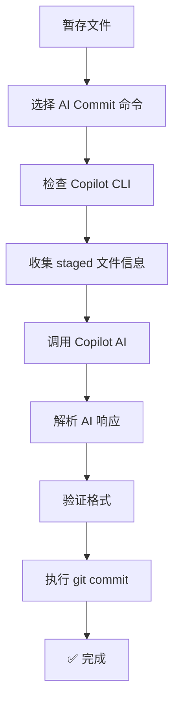

# Fork AI Commit 插件

## 概述

Fork AI Commit 是一个集成在 Fork Git Client 中的自定义命令，通过 GitHub Copilot AI 自动生成规范的 commit message 并完成提交。

## 核心功能

- 🤖 **AI 智能生成**：基于实际代码变更，自动生成符合规范的 commit message
- 🚀 **一键提交**：自动执行 `git commit`，无需手动输入
- 📋 **格式规范**：遵循 `<type>: <summary>\n\nwhat: ...\n\nwhy: ...` 格式
- 🌍 **跨平台**：支持 Windows、macOS、Linux

## 快速开始

### 1. 安装依赖

```bash
# 安装 GitHub Copilot CLI
npm install -g @githubnext/github-copilot-cli

# 首次登录
copilot -p "test"
```

**注意**：需要 GitHub Copilot 订阅（约 $10/月）

### 2. 使用方法

**在 Fork Git Client 中**：

1. 暂存你的修改（勾选要提交的文件）
2. 右键点击仓库
3. 选择 **"🤖 AI Commit Message (Copilot)"**
4. 点击 **"生成"** 按钮
5. ✅ AI 自动生成并提交

**在命令行中**：

```bash
# 暂存文件
git add .

# 运行脚本
bash .fork/generate-commit-msg.sh
```

## 文件说明

| 文件 | 说明 |
|------|------|
| `custom-commands.json` | Fork 自定义命令配置（定义 AI Commit 命令） |
| `generate-commit-msg.sh` | AI Commit 核心脚本（调用 Copilot 生成并提交） |
| `AI-Commit.md` | 详细使用文档（包含故障排除和最佳实践） |
| `.gitattributes` | 确保 shell 脚本使用 LF 行尾 |

## Commit 格式

生成的 commit message 格式：

```
<type>: <summary>

what: <what was changed>

why: <why it was changed>
```

**Type 类型**：`feat`、`fix`、`refactor`、`chore`、`perf`、`style`、`docs`、`test`

## 工作原理



## 常见问题

### Q: 没有 Copilot 订阅可以用吗？
**A**: 不可以。本工具依赖 GitHub Copilot AI，需要有效的订阅。

### Q: AI 生成需要多久？
**A**: 通常 5-15 秒，取决于网络和文件变更量。

### Q: 可以自定义 commit 格式吗？
**A**: 可以！编辑 `generate-commit-msg.sh` 中的 `PROMPT` 变量。

### Q: 生成失败怎么办？
**A**: 检查：
1. Copilot CLI 是否已安装和登录
2. 是否有暂存的文件
3. 网络连接是否正常
4. Copilot 订阅是否有效

详细故障排除请参考 `AI-Commit.md`。

## 最佳实践

1. **保持提交聚焦**：一次只提交相关的改动
2. **清晰的代码**：清晰的命名和逻辑让 AI 更好理解
3. **验证消息**：生成后检查 commit message 质量
4. **分步提交**：大功能拆分成多个小 commit

## 详细文档

完整的使用指南、示例和故障排除，请参考：
- **AI-Commit.md** - 详细使用文档

## 技术栈

- **GitHub Copilot CLI** - AI 引擎
- **Bash Shell** - 脚本执行环境
- **Fork Git Client** - Git 客户端
- **Git** - 版本控制

## 许可证

本工具基于 MIT License 开源。

---

**Happy Committing with AI! 🤖✨**

Made with ❤️ for productivity | Powered by GitHub Copilot
