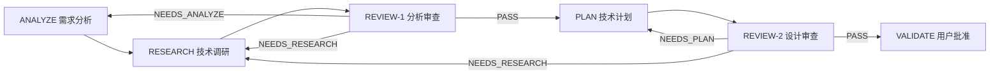
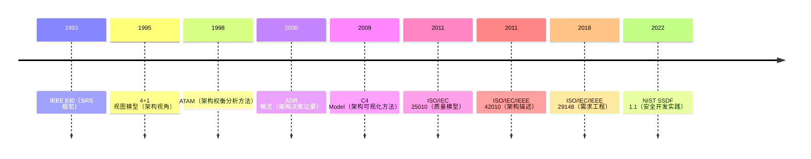
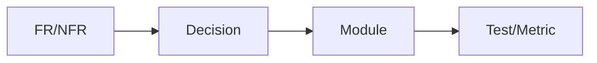
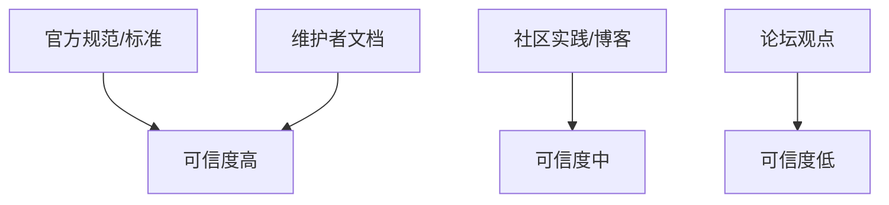

# workflow-plan 调研报告（ANALYZE / RESEARCH / PLAN 最佳实践）

> **日期**: 2026-01-14
> **范围**: 需求分析、技术调研、技术计划（模板与规范完善）

---

## 1. 整体概览

本调研聚焦 workflow-plan 的三大产出阶段（ANALYZE / RESEARCH / PLAN），目标是建立可追溯、可验证、可审查的工程化模板与规范。核心原则：**需求可验证、调研可证据化、计划可落地**。

**架构可视化**（阶段与审查回路）：



---

## 2. 技术发展时间线



---

## 3. 现有方案汇总

**资源清单**（与 workflow-plan 阶段映射）：
- **ISO/IEC/IEEE 29148**: 需求工程规范（ANALYZE）
- **ISO/IEC 25010**: 质量属性模型（ANALYZE / PLAN）
- **ISO/IEC/IEEE 42010**: 架构描述标准（PLAN）
- **ATAM**: 架构权衡分析方法（RESEARCH / PLAN / REVIEW）
- **ADR**: 架构决策记录实践（PLAN）
- **C4 Model / 4+1**: 架构视角与可视化（PLAN）
- **BABOK**: 业务分析知识体系（ANALYZE）
- **NIST SSDF / OWASP ASVS**: 安全与合规基线（PLAN）

**对比表格**（摘要）：

| 方案/标准 | 关注点 | 适用阶段 | 优势 | 局限 |
|---|---|---|---|---|
| ISO 29148 | 需求完整性与可验证性 | ANALYZE | 需求质量指标清晰 | 标准偏重文档，较严谨 | 
| ISO 25010 | 质量属性分类 | ANALYZE/PLAN | 统一 NFR 分类 | 需要场景化落地 | 
| ISO 42010 | 架构描述结构 | PLAN | 视角/关注点清晰 | 实施成本偏高 | 
| ATAM | 方案权衡 | RESEARCH/PLAN | 决策过程透明 | 需要成熟输入 | 
| ADR | 决策记录 | PLAN | 轻量、可追溯 | 需持续维护 | 
| C4 / 4+1 | 架构可视化 | PLAN | 易沟通、分层清晰 | 视图范围需裁剪 |

---

## 4. 方案详细分析

### 4.1 ISO/IEC/IEEE 29148（需求工程）
- **自述优势**: 需求特性明确（完整、可验证、一致、无歧义）
- **客观提炼**: 适合作为 ANALYZE 的质量门槛与校验规则
- **适用场景**: 多需求来源、跨团队协作、审计合规
- **局限性**: 需要简化落地到模板与清单

### 4.2 ISO/IEC 25010（质量模型）
- **自述优势**: 统一 NFR 分类（性能、可靠性、安全性等）
- **客观提炼**: 可将 NFR 结构化为“属性 + 量化指标”
- **适用场景**: 需要量化 SLA/SLO 的系统
- **局限性**: 需配合质量场景描述

### 4.3 ISO/IEC/IEEE 42010（架构描述）
- **自述优势**: 视角/关注点/利益相关方清晰
- **客观提炼**: PLAN 阶段可用作“架构视图结构”框架
- **适用场景**: 大型系统、跨域集成
- **局限性**: 文档结构偏重，需裁剪

### 4.4 ATAM（权衡分析）
- **自述优势**: 把质量属性驱动转化为权衡分析
- **客观提炼**: 可转化为“决策矩阵 + 关键质量场景”
- **适用场景**: 方案对比、风险控制
- **局限性**: 需要较完整的调研输入

### 4.5 ADR（架构决策记录）
- **自述优势**: 轻量化记录决策
- **客观提炼**: 适合 PLAN 模板中的“决策记录”段落
- **适用场景**: 所有重要技术决策
- **局限性**: 需要持续维护一致性

### 4.6 C4 / 4+1（架构视图）
- **自述优势**: 视图分层清晰，易于沟通
- **客观提炼**: 可作为 plan.md 的“多视角架构图”要求
- **适用场景**: 架构沟通、文档化
- **局限性**: 视图过多会增加成本

---

## 5. 核心子特性深入

### 5.1 需求质量与可追溯（ISO 29148）

**概括**: 需求要“清晰、可验证、可追溯”，否则无法可靠进入设计阶段。

**可视化**（需求到设计追踪）：



**详细要点**:
- 每条 FR/NFR 都应标注来源与验收方式
- 通过“覆盖度”指标强制完整性（≥95%）
- 将 NFR 以“质量属性 + 量化指标”形式固化

### 5.2 证据化调研（Evidence-Based Research）

**概括**: 结论要有“来源类型 + 证据强度 + 适用范围”。

**可视化**（证据层级示意）：



**详细要点**:
- 每个调研主题必须记录证据来源与日期
- 对结论给出置信度（High/Med/Low）
- 关键决策必须基于高可信来源

### 5.3 架构权衡与决策可追溯（ATAM + ADR）

**概括**: 方案对比要“显式化”，决策要“可回溯”。

**可视化**（权衡决策闭环）：


**详细要点**:
- 调研阶段建立权衡准则（性能/成本/维护）
- 计划阶段将结论固化到 ADR
- ADR 与 FR/NFR 双向关联

---

## 6. 技术实现细节

**(1) 覆盖度校验伪代码**

```python
coverage = analyzed_frs / spec_frs
if coverage < 0.95:
    verdict = "NEEDS_ANALYZE"
```

**(2) 决策矩阵评分**

```python
score = sum(weight[i] * rating[i] for i in criteria)
select = max(candidates, key=lambda c: c.score)
```

**(3) 证据质量评分**

```python
score = source_type_weight + recency_weight + relevance_weight
confidence = "High" if score >= 8 else "Med" if score >=5 else "Low"
```

**(4) 模板完整性检查**

```python
required_sections = ["需求摘要", "技术约束", "调研结论", "技术选型", "风险评估"]
missing = [s for s in required_sections if s not in doc]
```

**(5) 决策矩阵示例（具体实现）**

| 准则 | 权重 | 方案 A | 方案 B | 说明 |
|---|---|---|---|---|
| 性能 | 0.4 | 4 | 3 | 响应时间/吞吐 |
| 维护成本 | 0.3 | 3 | 4 | 团队熟悉度 |
| 生态成熟度 | 0.3 | 4 | 2 | 社区活跃度 |

**(6) 证据等级示例（具体实现）**

| 来源类型 | 等级 | 说明 |
|---|---|---|
| 标准/官方规范 | A | 可信度高，优先采用 |
| 维护者文档 | B | 可信度中高 |
| 社区实践 | C | 需交叉验证 |
| 论坛观点 | D | 仅作参考 |

---

## 7. 渲染专项分析（如适用）

不适用。本次调研为通用工程实践，不涉及渲染/图形专项。

---

## 8. 最佳实践与建议

### 8.1 ANALYZE（需求分析）
- 采用 **ISO 29148** 要求作为质量门槛：完整、清晰、可验证
- 用 **ISO 25010** 分类 NFR（性能/安全/可靠性等）并量化指标
- 增加“来源/验收方式/风险与假设”字段，确保可追溯
- 将“技术约束/依赖/范围与非目标”显式化，减少返工

**模板建议**（analysis-template）：
- FR/NFR 表格新增列：来源、验收方式、优先级
- 增加“范围/非范围”“假设与风险”章节

### 8.2 RESEARCH（技术调研）
- 采用“**研究问题 → 评价准则 → 证据 → 结论**”链条
- 引入“证据等级/可信度”字段，降低主观结论风险
- 关键方案需提供对比矩阵与权衡结论（ATAM 思路）

**模板建议**（research-template）：
- 每个主题增加“评价准则/证据等级/置信度”字段
- 增加“权衡决策矩阵（权重 + 评分）”章节
- 增加“实验/POC 结果（可选）”章节

### 8.3 PLAN（技术计划）
- 采用 **ISO 42010** 框架组织架构视图（至少 2 个视角）
- 用 **C4/4+1** 补充架构可视化层级
- 强制 ADR 关联需求（FR/NFR）与调研结论
- 纳入“安全/可观测/上线回滚”设计，提升落地性

**模板建议**（plan-template）：
- 增加“架构视角说明（上下文/容器/组件/部署）”小节
- 增加“安全与合规考虑”“可观测性与运维”小节
- 增加“上线/迁移/回滚策略”小节

---

## 9. 总结与展望

本调研建议将 ISO 29148、ISO 25010、ISO 42010、ATAM、ADR、C4 等实践映射到 workflow-plan 模板和规范中，以“可追溯 + 可证据化 + 可审查”为核心目标。下一步建议在 `phase-details.md` 中新增“标准映射与检查点”说明，并将模板字段与 REVIEW 清单形成闭环，确保 ANALYZE/RESEARCH/PLAN 三阶段产出可验证且可复用。
