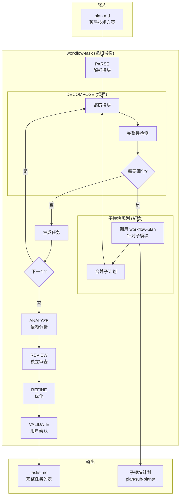
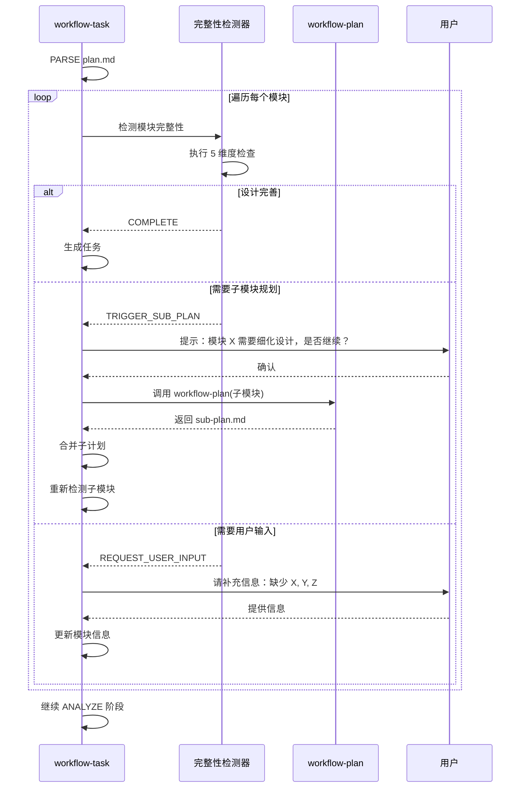
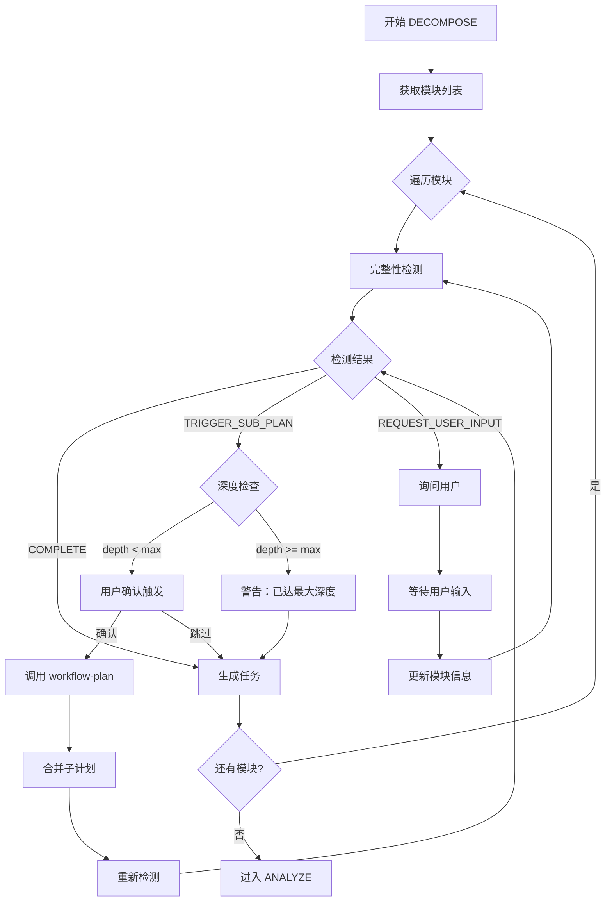

# 技术计划: Plan-Task 递归整合

> **状态**: draft
> **Spec 版本**: 1.0.0
> **创建日期**: 2026-01-15

---

## 1. 概述

实现 workflow-plan 和 workflow-task 的递归整合，当 workflow-task 在分解任务时发现子模块设计不完善，能够自动触发针对该子模块的 workflow-plan，获得详细设计后再继续任务分解。

**核心价值**：
- 确保每个模块都有足够详细的设计才进行任务分解
- 自动化处理设计深度不足的问题
- 保持设计和任务的一致性

---

## 2. 架构设计

### 2.1 架构视角说明

- **上下文（Context）**: workflow-task 作为协调者，按需调用 workflow-plan 进行子模块细化
- **容器（Container）**: 增强后的 workflow-task SKILL.md + 新增 sub-plan 机制
- **组件（Component）**: 完整性检测器 + 递归协调器 + 子计划合并器
- **部署（Deployment）**: 更新 `skills/workflow-task/SKILL.md`

### 2.2 系统架构图



### 2.3 模块说明

| 模块 | 职责 | 依赖 | 关联需求 |
|------|------|------|----------|
| 完整性检测器 | 判断模块设计是否完善 | PARSE 输出 | FR-1, FR-2 |
| 递归协调器 | 控制递归深度，触发子模块 plan | 完整性检测器 | FR-3, FR-4 |
| 子计划生成器 | 调用 workflow-plan 生成子模块计划 | workflow-plan skill | FR-5 |
| 子计划合并器 | 将子计划整合到主计划 | 子计划生成器 | FR-6 |
| 深度限制器 | 防止无限递归 | 递归协调器 | FR-7 |

---

## 3. 核心流程设计

### 3.1 完整性检测算法

```python
def check_module_completeness(module, depth):
    """
    检测模块设计是否完善

    Args:
        module: 模块对象
        depth: 当前递归深度

    Returns:
        (is_complete, missing_aspects, action)
    """
    # 深度限制保护
    if depth >= MAX_DEPTH:
        return (True, [], "DEPTH_LIMIT_REACHED")

    missing = []

    # 1. 职责清晰度检查
    if len(module.responsibility) < 20:
        missing.append("UNCLEAR_RESPONSIBILITY")
    if len(module.responsibility) > 200:
        missing.append("TOO_BROAD_NEEDS_SPLIT")

    # 2. 接口定义检查
    if not module.has_input_interface:
        missing.append("MISSING_INPUT_INTERFACE")
    if not module.has_output_interface:
        missing.append("MISSING_OUTPUT_INTERFACE")

    # 3. 技术选型检查
    if not module.tech_choice:
        missing.append("MISSING_TECH_CHOICE")

    # 4. 实现方案检查
    if not module.implementation_approach:
        missing.append("MISSING_IMPLEMENTATION")

    # 5. 粒度检查
    estimated_time = estimate_task_time(module)
    if estimated_time > 8 * 60:  # > 8 小时
        missing.append("TOO_LARGE_NEEDS_DECOMPOSITION")

    # 6. 子模块检查（复合模块）
    if module.has_submodules and not module.submodules_detailed:
        missing.append("SUBMODULES_NOT_DETAILED")

    # 判定动作
    if len(missing) == 0:
        return (True, [], "COMPLETE")
    elif "TOO_LARGE_NEEDS_DECOMPOSITION" in missing or \
         "TOO_BROAD_NEEDS_SPLIT" in missing or \
         "SUBMODULES_NOT_DETAILED" in missing:
        return (False, missing, "TRIGGER_SUB_PLAN")
    else:
        return (False, missing, "REQUEST_USER_INPUT")
```

### 3.2 递归触发流程



### 3.3 子计划生成与合并

**子计划目录结构**：

```
.workflow/{feature}/
├── plan/
│   ├── plan.md                    # 主计划
│   └── sub-plans/                 # 子模块计划目录（归属 plan）
│       ├── {module-A}/
│       │   ├── plan.md            # 模块 A 的详细计划
│       │   └── .state.yaml        # 子模块规划状态
│       └── {module-B}/
│           ├── plan.md            # 模块 B 的详细计划
│           └── .state.yaml
├── task/
│   ├── tasks.md                   # 最终任务列表
│   └── .state.yaml
```

**设计理由**：子计划本质上是"计划的细化"，应归属于 plan 目录，保持语义一致性。

**合并策略**：

```python
def merge_sub_plan(main_plan, sub_plan, module_id):
    """
    将子计划合并到主计划

    策略：
    1. 子计划的模块列表追加到主计划
    2. 子计划的技术选型合并到主计划
    3. 子计划的风险评估合并到主计划
    4. 保持模块层级关系（parent-child）
    """
    # 1. 更新模块表
    main_plan.modules[module_id].submodules = sub_plan.modules
    main_plan.modules[module_id].is_refined = True

    # 2. 合并技术选型
    for tech in sub_plan.tech_choices:
        if tech not in main_plan.tech_choices:
            main_plan.tech_choices.append(tech)

    # 3. 合并风险
    for risk in sub_plan.risks:
        risk.source_module = module_id
        main_plan.risks.append(risk)

    # 4. 更新依赖图
    for dep in sub_plan.dependencies:
        dep.parent_module = module_id
        main_plan.dependencies.append(dep)

    return main_plan
```

---

## 4. 技术选型

| 领域   | 选型                            | 理由           |
| ---- | ----------------------------- | ------------ |
| 递归调用 | Task 工具 + workflow-plan skill | 复用现有能力，保持一致性 |
| 状态管理 | YAML (.state.yaml)            | 与现有机制一致      |
| 深度控制 | 硬性限制 + 粒度触发                   | 混合策略最佳平衡     |
| 用户交互 | AskUserQuestion               | 关键节点人工确认     |

---

## 5. 配置参数

```yaml
# workflow-task 递归配置
recursion:
  max_depth: 3                    # 最大递归深度
  auto_trigger: true              # 自动触发子模块规划
  user_confirm: true              # 触发前需要用户确认

completeness_check:
  min_responsibility_length: 20   # 职责描述最小字数
  max_responsibility_length: 200  # 职责描述最大字数
  require_interface: true         # 必须有接口定义
  require_tech_choice: true       # 必须有技术选型
  max_task_hours: 8              # 单任务最大小时数

sub_plan:
  output_dir: "plan/sub-plans"    # 子计划输出目录（在 plan 目录下）
  inherit_context: true           # 继承主计划上下文
  merge_on_complete: true         # 完成后自动合并
```

---

## 6. 增强后的 DECOMPOSE 阶段

### 6.1 阶段流程



### 6.2 子模块 plan 调用规范

**调用 workflow-plan 时传递的上下文**：

```markdown
# 子模块规划请求

## 上下文
- 主功能: {parent_feature}
- 父模块: {parent_module_id}
- 递归深度: {current_depth}

## 子模块信息
- 模块 ID: {module_id}
- 模块名称: {module_name}
- 当前职责描述: {responsibility}
- 关联需求: {related_requirements}

## 约束
- 必须与主计划技术栈兼容: {main_tech_stack}
- 必须定义清晰的接口与父模块交互
- 粒度目标: 分解为 2-5 个子模块，每个子模块可在 2-8 小时内完成

## 期望输出
完整的 sub-plan.md，包含：
1. 子模块的架构设计
2. 具体的技术选型
3. 与父模块的接口定义
4. 风险评估
```

---

## 7. 状态管理增强

### 7.1 .state.yaml 增强格式

```yaml
feature: {feature-id}
version: 2.1.0  # 升级版本支持递归
phase: decompose
status: in_progress

# 递归状态追踪 (新增)
recursion:
  current_depth: 1
  max_depth: 3
  sub_plans:
    - module_id: "auth"
      depth: 1
      status: completed
      plan_path: "../plan/sub-plans/auth/plan.md"  # 相对于 task 目录
      triggered_at: "2026-01-15T10:00:00Z"
      completed_at: "2026-01-15T10:15:00Z"
    - module_id: "auth.jwt"
      depth: 2
      status: in_progress
      plan_path: "../plan/sub-plans/auth/jwt/plan.md"
      triggered_at: "2026-01-15T10:20:00Z"

# 模块完整性状态 (新增)
module_status:
  auth:
    completeness: 0.6
    missing: ["SUBMODULES_NOT_DETAILED"]
    action: "TRIGGER_SUB_PLAN"
    refined: true
  database:
    completeness: 1.0
    missing: []
    action: "COMPLETE"
    refined: false

# 现有字段保持不变
completed_phases:
  parse:
    completed_at: "2026-01-15T09:00:00Z"
    output: "parse/parse-result.md"
```

### 7.2 断点恢复增强

**恢复时的处理逻辑**：

```python
def resume_with_recursion(state):
    """
    支持递归的断点恢复
    """
    # 1. 检查是否有进行中的子计划
    for sub_plan in state.recursion.sub_plans:
        if sub_plan.status == "in_progress":
            # 恢复子计划执行
            resume_sub_plan(sub_plan)
            return

    # 2. 检查是否有未检测的模块
    for module_id, status in state.module_status.items():
        if status.action == "TRIGGER_SUB_PLAN" and not status.refined:
            # 继续触发子模块规划
            trigger_sub_plan(module_id)
            return

    # 3. 正常继续当前阶段
    continue_phase(state.phase)
```

---

## 8. 风险评估

| 风险 | 可能性 | 影响 | 缓解策略 |
|------|--------|------|----------|
| R1: 递归过深导致超时 | 中 | 高 | 硬性深度限制 (3 层) |
| R2: 子计划与主计划不一致 | 中 | 高 | 合并时校验技术栈兼容性 |
| R3: 用户中途放弃导致状态混乱 | 低 | 中 | 完善的断点恢复机制 |
| R4: 循环依赖（A 需要 B，B 需要 A） | 低 | 高 | 检测模块间循环并报错 |
| R5: 上下文丢失导致子计划偏离 | 中 | 中 | 传递完整上下文给子计划 |

---

## 9. 架构决策记录 (ADR)

### ADR-001: 采用按需递归而非全递归

- **状态**: 已采纳
- **上下文**: 需要决定递归策略：全递归（所有模块都细化）vs 按需递归（仅不完善的模块）
- **决策**: 采用按需递归，仅在完整性检测不通过时触发子模块规划
- **后果**:
  - 效率更高，避免不必要的递归
  - 需要准确的完整性检测算法
  - 用户可选择跳过递归

### ADR-002: 子计划独立存储在 plan 目录，完成后合并

- **状态**: 已采纳
- **上下文**: 需要决定子计划的存储方式
- **决策**: 子计划存储在 `plan/sub-plans/{module-id}/plan.md`，归属于 plan 目录而非 task 目录
- **理由**: 子计划本质上是"计划的细化"，语义上应归属于计划阶段
- **后果**:
  - 支持并行处理多个子模块
  - 保持清晰的层级结构和语义一致性
  - 合并时需要处理冲突
  - workflow-task 读取子计划时需跨目录访问

### ADR-003: 用户确认后再触发递归

- **状态**: 已采纳
- **上下文**: 自动触发可能导致长时间阻塞，影响用户体验
- **决策**: 检测到需要子模块规划时，先询问用户确认
- **后果**:
  - 用户保持控制权
  - 可以选择跳过某些模块的细化
  - 增加交互步骤

### ADR-004: 最大递归深度设为 3 层

- **状态**: 已采纳
- **上下文**: 需要平衡设计完善性和执行效率
- **决策**: 最大递归深度 3 层（主计划 → 子模块 → 子子模块 → 任务）
- **后果**:
  - 对于大多数项目足够
  - 超大型项目可能需要手动分期
  - 防止无限递归

---

## 10. 交付物清单

| 文件 | 路径 | 说明 |
|------|------|------|
| SKILL.md (增强) | `skills/workflow-task/SKILL.md` | 增加递归整合章节 |
| 完整性检测指南 | `skills/workflow-task/references/completeness-check.md` | 5 维度检测说明 |
| 子计划模板 | `skills/workflow-plan/assets/sub-plan-template.md` | 子模块规划模板（归属 plan） |
| 合并策略说明 | `skills/workflow-task/references/merge-strategy.md` | 子计划合并规则 |

---

## 11. 实施计划

### 阶段 1: 基础框架 (P0)

- [ ] 增强 DECOMPOSE 阶段，添加完整性检测
- [ ] 实现递归深度控制
- [ ] 添加用户确认交互

### 阶段 2: 子计划机制 (P0)

- [ ] 实现子模块 workflow-plan 调用
- [ ] 实现子计划合并逻辑
- [ ] 增强状态管理支持递归追踪

### 阶段 3: 完善与优化 (P1)

- [ ] 添加并行子模块处理支持
- [ ] 优化完整性检测算法
- [ ] 完善断点恢复机制

---

## 12. 需求追溯性

| 需求 | 对应模块/ADR | 验收方式 |
|------|--------------|----------|
| 子模块识别 | 完整性检测器 | 能识别出设计不完善的模块 |
| 自动触发 plan | 递归协调器, ADR-001 | 用户确认后触发 |
| 递归深度控制 | 深度限制器, ADR-004 | 超过 3 层停止 |
| 子计划合并 | 子计划合并器, ADR-002 | 技术栈一致性验证 |
| 断点恢复 | 状态管理增强 | 中断后可继续 |

---

*Generated by workflow-plan | 2026-01-15*
