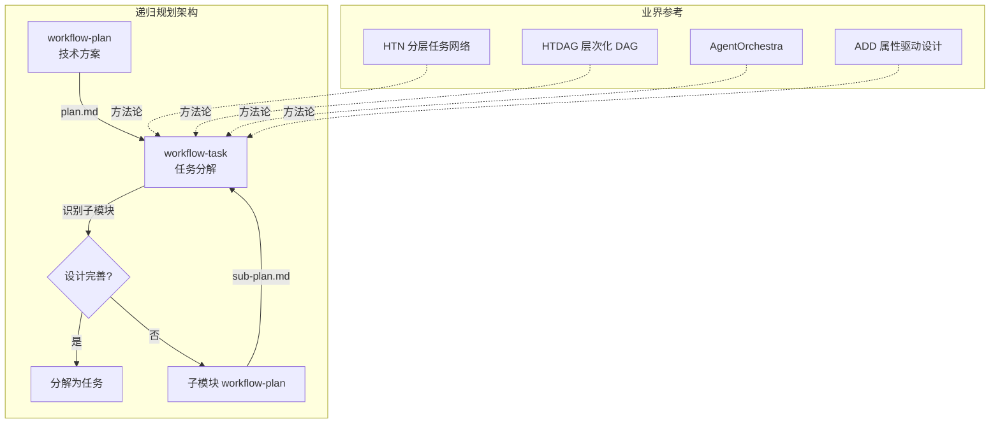
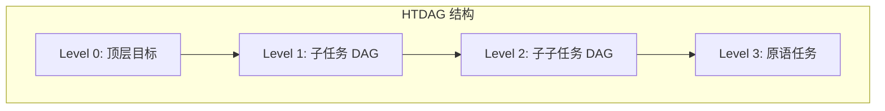
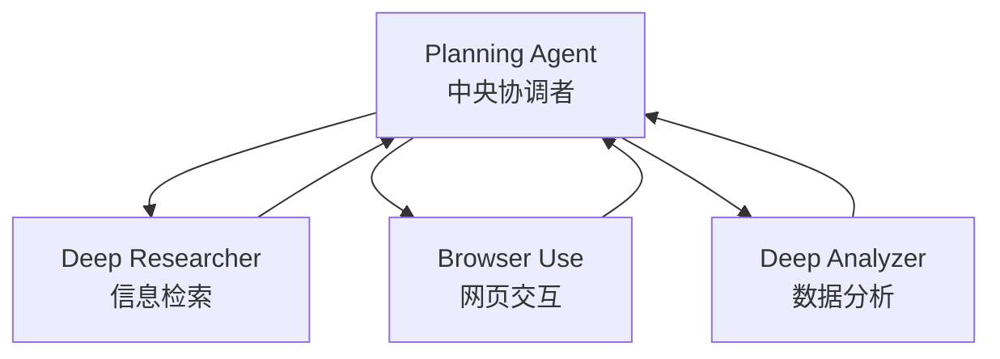
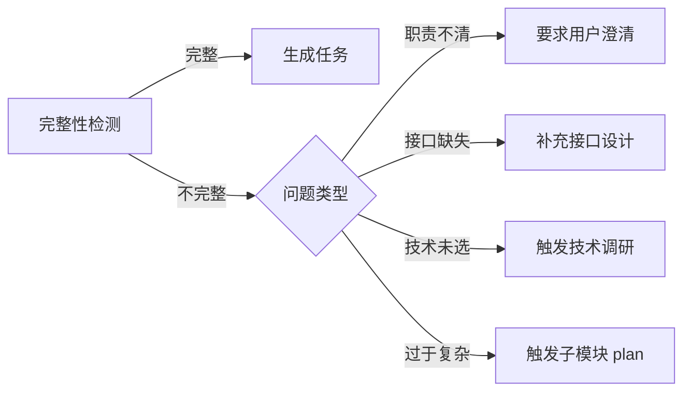
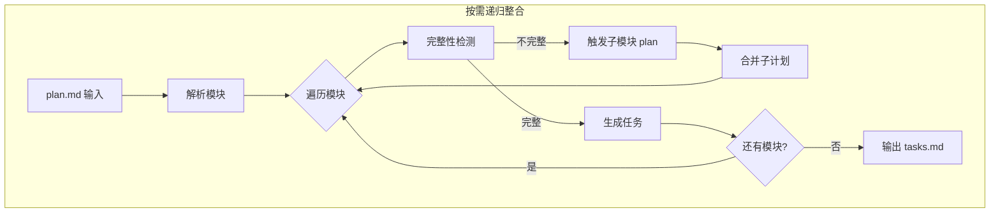

# 技术调研报告: Plan-Task 递归整合

> **调研日期**: 2026-01-15
> **调研范围**: 分层任务分解、递归规划、AI 代理架构

---

## 1. 整体概览

### 1.1 调研背景

当前 workflow 系统中，workflow-plan 生成的技术方案可能只包含顶层架构，子模块的详细设计可能不足。需要设计一个递归机制，让 workflow-task 在分解任务时能够：
1. 识别设计不完善的子模块
2. 触发针对该子模块的 workflow-plan
3. 获得详细设计后再继续任务分解

### 1.2 技术全景图



### 1.3 调研主题

| 主题 | 优先级 | 状态 |
|------|--------|------|
| 分层任务网络 (HTN) | P0 | 已完成 |
| 递归分解深度控制 | P0 | 已完成 |
| 子模块完整性检测 | P0 | 已完成 |
| 动态计划更新策略 | P1 | 已完成 |
| 属性驱动设计 (ADD) | P2 | 已完成 |

---

## 2. 分层任务网络 (HTN)

### 2.1 核心概念

来源：[Wikipedia](https://en.wikipedia.org/wiki/Hierarchical_task_network)、[GeeksforGeeks](https://www.geeksforgeeks.org/hierarchical-task-network-htn-planning-in-ai/)

HTN 规划将任务分为两类：

| 任务类型 | 定义 | 对应 workflow |
|----------|------|---------------|
| **原语任务** | 可直接执行的动作 | tasks.md 中的具体任务 |
| **复合任务** | 需要分解的抽象任务 | plan.md 中的模块 |

**分解过程**：
```
复合任务 → 方法选择 → 子任务序列 → (递归) → 原语任务序列
```

### 2.2 LLM-HTN 集成模式

来源：[ChatHTN](https://arxiv.org/abs/2511.12901)、[GPT-HTN-Planner](https://github.com/DaemonIB/GPT-HTN-Planner)

**ChatHTN 方法**：
- LLM 生成任务分解
- 符号规划器验证可行性
- 遇到死端时请求 LLM 提供替代方案

**对 workflow 的启示**：
- workflow-task 作为"方法选择器"
- workflow-plan 作为"分解方法生成器"
- 独立审查作为"符号验证器"

### 2.3 HTN 优势

- **可扩展性**：通过层次结构处理大型复杂域
- **类人规划**：模拟人类解决问题的方式
- **灵活性**：多种分解方法适应不同情况

### 2.4 HTN 挑战

- **方法选择**：选择正确的分解方法困难
- **计算开销**：递归分解可能指数级增长
- **领域依赖**：需要手工构建领域知识

---

## 3. 层次化任务 DAG (HTDAG)

### 3.1 Deep Agent 架构

来源：[Deep Agent](https://arxiv.org/html/2502.07056v1)



**核心特性**：
- **递归表示**：子任务及其依赖跨多层 DAG
- **动态分解**：仅在需要时创建下一层子任务 DAG
- **延迟细化**：避免过早承诺过于详细的计划

### 3.2 对 workflow 整合的启示

| HTDAG 特性 | workflow 映射 |
|------------|---------------|
| Level 0 | spec.md 顶层需求 |
| Level 1 | plan.md 架构模块 |
| Level 2 | 子模块 sub-plan.md |
| Level 3 | tasks.md 具体任务 |

**动态分解原则**：
> "规划器仅在必要时基于当前上下文和需求创建下一级子任务 DAG。这种动态分解防止系统过早承诺过于详细的计划，使其能够有效处理复杂场景，同时保持 LLM 聚焦于当前相关任务。"

---

## 4. AgentOrchestra 分层框架

### 4.1 双层架构

来源：[AgentOrchestra](https://arxiv.org/html/2506.12508v1)



### 4.2 关键机制

**任务分解与分配**：
- Planning Agent 分解复杂任务
- 基于专业匹配分配给子代理
- 动态追踪执行状态

**闭环协调**：
- 聚合子代理反馈
- 监控整体目标进展
- 实时动态更新计划

### 4.3 对 workflow 整合的启示

| AgentOrchestra | workflow 映射 |
|----------------|---------------|
| Planning Agent | workflow-task (协调) |
| Sub-Agent | workflow-plan (专业设计) |
| 反馈聚合 | sub-plan.md 合并到 plan.md |
| 动态更新 | 触发子模块重新规划 |

---

## 5. 属性驱动设计 (ADD)

### 5.1 SEI ADD 方法

来源：[SEI ADD](https://resources.sei.cmu.edu/library/asset-view.cfm?assetid=484077)

**递归分解过程**：
1. 确认有足够的需求信息
2. 选择要分解的系统元素
3. 识别候选架构驱动因素
4. 选择满足驱动因素的设计概念
5. 递归应用到子元素

### 5.2 对 workflow 整合的启示

**设计完善性检查清单**：

| 检查项 | 通过条件 | 失败动作 |
|--------|----------|----------|
| 需求信息充分 | 关联 FR/NFR 明确 | 回到 specify |
| 架构驱动因素已识别 | 技术约束清晰 | 补充 plan |
| 设计概念已选择 | 有具体实现方案 | 触发子模块 plan |
| 接口已定义 | 模块边界清晰 | 补充接口设计 |

---

## 6. 递归分解深度控制

### 6.1 深度限制策略

来源：调研综合分析

| 策略 | 描述 | 适用场景 |
|------|------|----------|
| **固定深度** | 预设最大递归层级 | 简单项目 |
| **粒度触发** | 达到目标粒度时停止 | 任务估时 30min-8h |
| **复杂度阈值** | 模块复杂度降到阈值以下 | 复杂项目 |
| **用户干预** | 人工决定是否继续递归 | 关键节点 |

### 6.2 推荐策略

**混合策略（粒度触发 + 固定深度保护）**：

```python
def should_recurse(module, current_depth):
    # 硬性限制：最大深度 3 层
    if current_depth >= 3:
        return False, "DEPTH_LIMIT"

    # 粒度检查：任务估时在合理范围内
    if 30min <= estimate_time(module) <= 8h:
        return False, "GRANULARITY_OK"

    # 复杂度检查：模块职责描述过长
    if len(module.responsibility) > 100:
        return True, "NEEDS_REFINEMENT"

    # 依赖检查：依赖项过多
    if len(module.dependencies) > 5:
        return True, "NEEDS_REFINEMENT"

    return False, "OK"
```

---

## 7. 子模块完整性检测

### 7.1 设计完善性指标

| 指标 | 检测方法 | 阈值 |
|------|----------|------|
| **职责清晰度** | 职责描述字数 | < 100 字 |
| **接口明确度** | 输入输出是否定义 | 100% |
| **依赖可控性** | 依赖项数量 | ≤ 5 |
| **技术选型** | 是否有具体方案 | 必须有 |
| **风险识别** | 是否评估风险 | 至少 1 项 |

### 7.2 完整性检测算法

```python
def check_module_completeness(module):
    """
    检测模块设计是否完善
    返回: (is_complete, missing_aspects)
    """
    missing = []

    # 1. 职责检查
    if not module.responsibility or len(module.responsibility) < 20:
        missing.append("UNCLEAR_RESPONSIBILITY")

    # 2. 接口检查
    if not module.interfaces or not module.interfaces.inputs:
        missing.append("MISSING_INPUT_INTERFACE")
    if not module.interfaces or not module.interfaces.outputs:
        missing.append("MISSING_OUTPUT_INTERFACE")

    # 3. 技术选型检查
    if not module.tech_stack:
        missing.append("MISSING_TECH_CHOICE")

    # 4. 实现方案检查
    if not module.implementation_approach:
        missing.append("MISSING_IMPLEMENTATION")

    # 5. 复杂度检查（过高表示需要进一步分解）
    if estimate_complexity(module) > COMPLEXITY_THRESHOLD:
        missing.append("TOO_COMPLEX_NEEDS_DECOMPOSITION")

    return (len(missing) == 0, missing)
```

### 7.3 不完整时的处理策略



---

## 8. 技术方案对比

### 8.1 整合策略对比

| 策略 | 优点 | 缺点 | 适用场景 |
|------|------|------|----------|
| **串行整合** | 简单直观 | 效率低 | 小型项目 |
| **按需递归** | 平衡效率和质量 | 实现复杂 | 中型项目 |
| **全递归** | 设计最完善 | 时间长 | 大型关键项目 |
| **并行递归** | 效率高 | 协调复杂 | 团队协作 |

### 8.2 推荐方案：按需递归整合



**核心优势**：
- 仅在必要时触发递归
- 控制递归深度（最大 3 层）
- 支持增量细化
- 保持全局一致性

---

## 9. 最佳实践总结

### 9.1 递归整合核心原则

| 原则 | 说明 | 实现方式 |
|------|------|----------|
| **延迟细化** | 仅在需要时展开详细设计 | 按需触发子模块 plan |
| **深度限制** | 避免无限递归 | 最大 3 层 |
| **粒度约束** | 任务粒度可执行 | 30min-8h 范围 |
| **完整性验证** | 每次递归前检查 | 5 维度检测 |
| **全局一致** | 子计划与主计划一致 | 合并校验 |

### 9.2 关键成功因素

1. **明确的完整性标准**：定义什么是"设计完善"
2. **清晰的触发条件**：何时触发子模块规划
3. **有效的深度控制**：防止过度递归
4. **一致的合并策略**：子计划如何整合回主计划

### 9.3 风险与缓解

| 风险 | 缓解策略 |
|------|----------|
| 递归过深 | 硬性深度限制（3 层） |
| 循环依赖 | DAG 验证 |
| 上下文丢失 | 保持模块溯源链 |
| 效率低下 | 并行处理独立子模块 |

---

## 10. 调研来源

### 主要来源

1. [AgentOrchestra: A Hierarchical Multi-Agent Framework](https://arxiv.org/html/2506.12508v1) - 分层多代理框架设计
2. [Deep Agent - HTDAG](https://arxiv.org/html/2502.07056v1) - 层次化任务 DAG
3. [HTN Planning - Wikipedia](https://en.wikipedia.org/wiki/Hierarchical_task_network) - HTN 基础概念
4. [ChatHTN](https://arxiv.org/abs/2511.12901) - LLM-HTN 集成
5. [SEI ADD Method](https://resources.sei.cmu.edu/library/asset-view.cfm?assetid=484077) - 属性驱动设计
6. [NASA Logical Decomposition](https://www.nasa.gov/seh/4-3-logical-decomposition) - 系统分解方法
7. [LLM Agent Task Decomposition Strategies](https://apxml.com/courses/agentic-llm-memory-architectures/chapter-4-complex-planning-tool-integration/task-decomposition-strategies) - 任务分解策略

### 补充来源

8. [GPT-HTN-Planner](https://github.com/DaemonIB/GPT-HTN-Planner) - GPT-HTN 实现
9. [DeepResearchAgent](https://github.com/SkyworkAI/DeepResearchAgent) - 分层多代理系统
10. [Module Decomposition - GeeksforGeeks](https://www.geeksforgeeks.org/system-design/module-decomposition-system-design/) - 模块分解概念

---

*Generated by workflow-plan RESEARCH phase | 2026-01-15*
