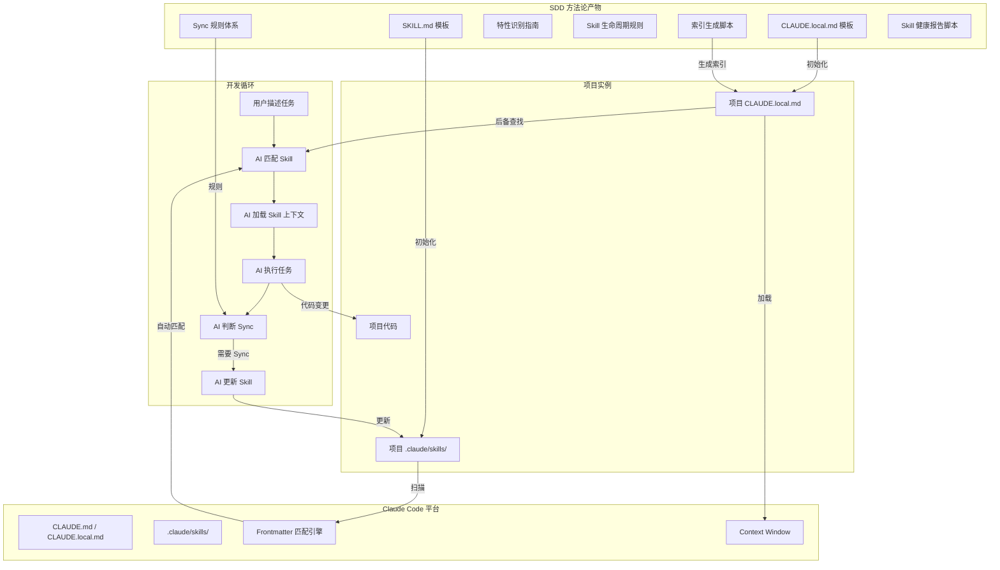

# 技术计划: Skill 驱动开发模式（Skill-Driven Development）

> **状态**: approved
> **Spec 版本**: 0.2 (approved)
> **创建日期**: 2026-02-09

> **职责说明**: 本文档专注于架构设计和技术决策，不包含具体的实施步骤、测试计划或上线流程。这些内容由 workflow-task 阶段负责。

---

## 1. 概述

建立标准化的 Skill 驱动开发方法论，产出一套可复用的模板、指南和辅助工具。核心产物为：CLAUDE.local.md 模板、SKILL.md 模板、特性识别指南、Skill 生命周期规则、Sync 规则体系和可选的索引生成脚本。

**技术目标**:
- 标准化现有 render-pipeline 项目的 Skill 体系为通用方法论
- 设计技术栈无关的模板体系
- 解决 Skill 发现困难（混合发现策略）
- 解决 Sync 遗漏（嵌入式 Sync 规则）
- 降低新项目接入成本（模板 + 指南 + 脚本）

---

## 2. 架构设计

### 2.1 架构视角说明

- **上下文（Context）**: Skill 驱动开发方法论嵌入在 Claude Code 的 Skills 生态中，与 Claude Code 的 `.claude/` 目录结构、SKILL.md frontmatter 格式、CLAUDE.md/CLAUDE.local.md 加载机制深度集成
- **容器（Container）**: 本方案无运行时服务，产物为静态文件（模板、指南、脚本），嵌入到各项目的 `.claude/` 目录中
- **组件（Component）**: 7 个核心组件（见下方）
- **部署（Deployment）**: 模板和指南通过 Git 仓库分发，各项目按需引入

### 2.2 系统架构图



### 2.3 模块说明

| 模块 | 职责 | 依赖 | 关联需求 |
|------|------|------|----------|
| M1: CLAUDE.local.md 模板 | 定义项目总纲的标准结构，含 Skill 驱动流程、Sync 规则、Skill 目录指引 | Claude Code 平台 | FR-1, FR-5, FR-6 |
| M2: SKILL.md 模板 | 定义 Skill 文档的标准格式，含必选/可选章节、frontmatter 规范 | Claude Code 平台 | FR-3, FR-7 |
| M3: 特性识别指南 | 帮助用户判断如何拆分 Skill，提供判断清单和示例 | M2 | FR-7 |
| M4: Skill 生命周期规则 | 定义 Skill 创建/废弃/合并/审计流程 | M2 | FR-8 |
| M5: Sync 规则体系 | 定义变更分类清单和 Sync 判断逻辑 | M1 | FR-5 |
| M6: 索引生成脚本 | 自动扫描 .claude/skills/ 生成 Skill 索引 | M1, M2 | FR-2 |
| M7: Skill 健康报告 | 生成 Skill 健康状态报告，含更新频率、使用统计、改进建议 | M2, M4 | FR-4, US-5 |

---

## 3. 技术选型

| 领域 | 选型 | 理由 | 备选方案 |
|------|------|------|----------|
| Skill 发现策略 | 混合方案（frontmatter + CLAUDE.md 行为指令） | 调研结论：双重保障，自动匹配+主动查找；render-pipeline 实践验证有效 [调研1] | 纯 frontmatter（不够可靠）、完整索引表（维护成本高） |
| 索引生成脚本语言 | Python 3（标准库） | 调研结论：跨平台一致、UTF-8 中文处理可靠、无外部依赖、50-80 行 [调研2] | Bash（Windows 兼容差）、Node.js（需额外运行时） |
| 索引注入机制 | HTML 注释标记法 | `<!-- SKILL-INDEX-START/END -->`，幂等替换，不破坏其他内容 [调研2] | 全文替换（风险高）、独立文件（分散管理） |
| 模板格式 | Markdown + YAML frontmatter | 兼容 Claude Code 原生格式，所有 SKILL.md 已使用此格式 [约束] | 纯 Markdown（失去 frontmatter 匹配能力） |
| 自迭代机制 | 保持现有 .evolution/ 结构 | render-pipeline 已验证有效，变更成本低 | 简化（失去趋势分析能力）、增强（过度复杂） |

---

## 4. 依赖分析

### 4.1 内部依赖

```
M1 (CLAUDE.local.md 模板) ← M5 (Sync 规则 - 嵌入其中)
M1 ← M6 (索引脚本 - 生成内容注入其中)
M3 (特性识别指南) ← M2 (SKILL.md 模板 - 引用格式)
M4 (生命周期规则) ← M2 (引用 Skill 结构)
```

### 4.2 外部依赖

| 依赖 | 版本 | 用途 | 状态 |
|------|------|------|------|
| Claude Code | ≥ 2.1 | Skills 机制、CLAUDE.md 加载 | 活跃 |
| Python 3 | ≥ 3.6 | 索引生成脚本、健康报告脚本（标准库 os/re/glob） | 稳定 |
| Git | 任意 | 版本控制、可选 pre-commit hook | 稳定 |

---

## 5. 风险评估

| 风险 | 可能性 | 影响 | 缓解策略 |
|------|--------|------|----------|
| R1: Skill 数量增长超出 description 字符预算 | 低 | 中 | Opus 4.6 的 1M context 下预算 20K chars，可容纳 40+ Skills；若接近上限，标记低频 Skill 为 `disable-model-invocation: true` |
| R2: 团队觉得 Sync 流程增加负担导致抵触 | 中 | 高 | Sync 规则默认宽松（仅外部接口变化触发）；AI 自动完成 Sync，用户仅需确认 |
| R3: 不同技术栈项目的 Skill 结构差异过大 | 中 | 中 | SKILL.md 模板设计为通用框架，技术栈特定内容在 Core Rules 和 Reference Files 等章节中体现 |
| R4: 索引生成脚本在不同 OS 上行为不一致 | 低 | 低 | 使用 Python 标准库，避免 OS 特定 API；测试 Windows/macOS/Linux |
| R5: 新团队不理解 Skill 驱动理念导致形式化 | 中 | 高 | 提供 Quick Start 指南，从最小集（总纲+1 Skill）开始；用实际收益（减少重复犯错）驱动采纳 |
| R6: Claude Code 平台 Skills 机制变更导致不兼容 | 中 | 高 | 关注 Claude Code 更新日志；平台特定格式集中在 frontmatter 和目录约定中，便于批量更新 |

---

## 6. 安全与合规考虑

- **知识产权**: Skill 文件中可能包含公司内部架构知识和技术 know-how，确保 `.claude/skills/` 目录的 Git 权限控制与项目其他代码一致
- **敏感信息**: SKILL.md 模板应提醒不在 Skill 文件中硬编码密钥、密码、内部 URL 等敏感信息
- **数据保护**: Skill 文件通过 Claude Code 发送到 Anthropic API，需遵循公司的 AI 使用政策

---

## 7. 可观测性策略

> **注意**: 此章节仅定义架构层面的策略，具体实施由 workflow-task 负责。

- **Skill 使用指标**: `.evolution/changelog.md` 记录每次使用和更新历史（AC-5.1）
- **健康检测**: `.evolution/config.yaml` 定义触发阈值（连续失败次数、同类错误模式）
- **健康报告**: M7 模块生成 Skill 健康报告，覆盖更新频率、使用统计、可操作改进建议（AC-5.2, AC-5.3）；新建 Skill 无历史数据时标注"数据不足"（AC-5.4）
- **审计机制**: 定期（大版本发布前）运行 Skill 全量审计，检查时效性
- **质量信号**: Skill 被手动纠正匹配的频率（AC-1.4 记录）、Sync 被用户拒绝的频率（AC-2.4 记录）

---

## 8. 架构决策记录 (ADR)

### ADR-001: 采用混合发现策略而非纯索引

- **状态**: 已采纳
- **上下文**: Claude Code 没有内置索引/检索机制，Skill 匹配完全依赖 description 语义匹配。当 Skill 数量多或领域重叠时，纯 description 匹配可能不够可靠。
- **决策**: 采用混合方案 — 高质量 frontmatter description 作为主匹配通道 + CLAUDE.local.md 中的"Skill 驱动开发"行为指令作为后备通道。不维护完整索引表。
- **后果**:
  - 优点：双重保障，低维护成本，与 Claude Code 原生机制完全兼容
  - 代价：CLAUDE.local.md 中的行为指令消耗少量 context；首次主动查找比自动匹配略慢
- **关联需求**: FR-1, FR-2, US-1
- **调研依据**: [skill-discovery-mechanism/research.md] — 方案 C 对比分析

### ADR-002: Skill 索引脚本使用 Python 而非 Bash

- **状态**: 已采纳
- **上下文**: 需要一个脚本自动扫描 .claude/skills/ 生成索引。团队使用 Windows 开发环境。
- **决策**: 使用 Python 3 标准库实现索引生成脚本。
- **后果**:
  - 优点：跨平台一致、UTF-8 中文处理可靠、可读性好
  - 代价：需要 Python 3 环境（现代 OS 通常预装）
- **关联需求**: FR-2
- **调研依据**: [skill-index-autogen/research.md] — Bash vs Python 对比评分 6 vs 9

### ADR-003: Sync 规则嵌入 CLAUDE.local.md 而非独立管理

- **状态**: 已采纳
- **上下文**: Sync 规则需要 AI 在每次代码修改后参考。如果放在独立文件中，AI 需要额外读取步骤。
- **决策**: Sync 规则直接嵌入 CLAUDE.local.md 模板的"Skill 驱动开发"章节中。
- **后果**:
  - 优点：AI 在会话启动时自动加载，零额外查找成本；满足 NFR-1 的 ≤10 秒要求
  - 代价：CLAUDE.local.md 内容较长（嵌入 Sync 规则约增加 800 字符，总体积约 2000 字符，占 1M context 的 0.2%，可接受）
- **关联需求**: FR-5, NFR-1

### ADR-004: 保持现有 .evolution/ 目录结构不做简化

- **状态**: 已采纳
- **上下文**: render-pipeline 项目的 .evolution/ 结构（config.yaml + changelog.md + 4 子目录）已在实际使用中验证。是否简化以降低初始化成本？
- **决策**: 保持完整结构作为标准，但将除 changelog.md 和 config.yaml 外的子目录设为可选。
- **后果**:
  - 优点：保留完整的自迭代能力，向后兼容现有项目
  - 代价：初始化时需创建较多目录（可通过 skill-generator 自动完成）
- **关联需求**: FR-4, NFR-3, NFR-5

### ADR-005: SKILL.md 模板采用必选+可选章节设计

- **状态**: 已采纳
- **上下文**: 不同复杂度的 Skill 需要不同详细程度的文档。过度要求会增加初始化成本（违反 NFR-3），过度简化会丧失指导价值。
- **决策**: SKILL.md 模板分为必选章节（Overview, Core Rules, Reference Files）和可选章节（Workflow, Best Practices, Common Issues, Advanced Topics, Related Systems）。
- **后果**:
  - 优点：最小集仅需 3 个章节，快速创建；可逐步完善
  - 代价：可选章节缺失时，AI 获得的上下文不够完整
- **关联需求**: FR-3, FR-7, NFR-3

---

## 9. 详细设计

### 9.1 M1: CLAUDE.local.md 模板设计

**标准结构**:

```
# CLAUDE.local.md（模板）

## 项目概述
- 项目名称、技术栈、核心模块

## Skill 驱动开发（强制）
### 开发流程
  1. 定位 Skill → 2. 阅读上下文 → 3. 执行任务 → 4. 智能 Sync
### Skill 目录
  路径: .claude/skills/
### 智能 Sync 规则
  必须同步 vs 可跳过 的变更类型表
### 无对应 Skill 时
  执行 /skill-generator 或归入框架 Skill

## 全局约束
- 项目特定的代码规范、Git 规范等

## [可选] Skill 索引
  <!-- SKILL-INDEX-START -->
  自动生成的索引表（供人类快速浏览）
  <!-- SKILL-INDEX-END -->
```

**设计原则**:
- Skill 驱动开发章节是核心，不可删减
- Sync 规则嵌入其中（ADR-003）
- Skill 索引为可选（通过脚本自动生成）
- 不依赖具体技术栈（通用）

### 9.2 M2: SKILL.md 模板设计

**Frontmatter 规范**:

```yaml
---
name: {kebab-case-name}
description: >
  {一句话概述}。
  Use when the user asks to "{动作1}", "{动作2}",
  mentions "{术语1}", "{术语2}",
  or needs help with {领域描述}.
  Also responds to "{中文触发词1}", "{中文触发词2}".
related-skills: [{skill-a}, {skill-b}]  # 可选，声明关联 Skill（AC-1.6）
deprecated: false  # 可选，废弃标记（AC-4.5）
superseded-by: ""  # 可选，废弃后的替代 Skill
---
```

**章节结构**:

| 章节 | 必选 | 说明 |
|------|------|------|
| `# Title` | 必选 | 与 name 对应的标题 |
| `## Overview` | 必选 | 系统概述、核心能力、核心职责 |
| `## Workflow` | 可选 | 问题诊断/开发/优化的标准流程 |
| `## Core Rules` | 必选 | 开发中必须遵守的规则（避坑指南） |
| `## Best Practices` | 可选 | 推荐的最佳实践 |
| `## Common Issues` | 可选 | 常见问题及诊断步骤 |
| `## Advanced Topics` | 可选 | 高级主题和扩展开发 |
| `## Related Systems` | 可选 | 与其他 Skill/系统的关联关系（配合 frontmatter `related-skills` 字段） |
| `## Reference Files` | 必选 | 核心文件路径列表 |
| `## Output Requirements` | 可选 | AI 输出的格式规范 |

**Description 编写规范**（基于调研结论）:
1. 包含用户自然语言的动作短语（引号包裹）
2. 覆盖调试/配置/优化/分析等多种意图动词
3. 包含领域术语和代码实体名
4. 双语支持（英+中文触发词）
5. 单个 description 200-500 字符

### 9.3 M3: 特性识别指南

**拆分判断清单**:

| 信号 | 建议 |
|------|------|
| 有独立的文件目录 | 拆分为独立 Skill |
| 有独立的 API/接口 | 拆分为独立 Skill |
| 有独立的配置参数 | 拆分为独立 Skill |
| 需要专属的调试知识 | 拆分为独立 Skill |
| 仅是某系统的子模块 | 合并到父系统 Skill |
| 代码量 <500 行 | 考虑合并到框架 Skill |

**粒度原则**: 一个 Skill 对应一个开发者可能说"我要修/改/优化 XXX"的 XXX。

**渐进式拆分策略**: 先从 1 个框架级 Skill 开始，积累经验后再拆分为细粒度 Skill。

### 9.4 M5: Sync 规则体系

**变更分类**:

| 变更类型 | Sync | 说明 |
|----------|------|------|
| API 签名变化（方法名/参数/返回值） | 必须 | 影响使用方式 |
| 新增公开参数/属性 | 必须 | 新增可配置项 |
| 删除/重命名功能 | 必须 | 影响使用方式 |
| 默认值修改 | 必须 | 影响默认行为 |
| Shader/配置关键字变化 | 必须 | 影响配置方式 |
| Bug 修复（内部逻辑） | 跳过 | 不影响外部接口 |
| 性能优化（无 API 变化） | 跳过 | 不影响使用方式 |
| 注释/格式调整 | 跳过 | 无功能变化 |
| 不确定 | 询问 | 列出变更摘要请用户决策 |

**Sync 时更新内容**: 修改 SKILL.md 相关章节 + 追加 `.evolution/changelog.md` 记录

**Sync 冲突处理**（AC-2.6）:
- 冲突检测：依赖 Git 原生合并冲突机制（SKILL.md 是 Git 管理的文本文件）
- 冲突提示：当 AI 尝试写入 SKILL.md 发现 Git 冲突标记时，提示用户"Skill 文件存在冲突，请先解决 Git 冲突后再执行 Sync"
- 合并策略：以最新代码变更对应的 Sync 内容为准；如内容矛盾，提示人工裁决

### 9.5 M6: 索引生成脚本设计

**输入**: `.claude/skills/*/SKILL.md`
**输出**: Markdown 表格注入 CLAUDE.local.md

**索引格式**:
```markdown
| Skill | 功能域 | 触发场景 |
|-------|--------|----------|
| gi-expert | 全局光照系统 | GI 调试/优化/配置 |
| fog-expert | 雾效系统 | 体积雾/VBuffer/光线步进雾 |
```

**提取字段**:
- `name` → Skill 列
- 正文 `## Overview` 首句 → 功能域
- `description` 中的关键动词 → 触发场景

**注入策略**: HTML 注释标记 `<!-- SKILL-INDEX-START -->` / `<!-- SKILL-INDEX-END -->`

### 9.6 M4: Skill 生命周期规则

**创建标准**:
- 存在独立的功能域（参见特性识别指南）
- 预计会被多次修改（一次性功能不需要 Skill）
- 有足够的领域知识值得沉淀（简单 CRUD 不需要 Skill）

**废弃流程**:
1. 在 SKILL.md frontmatter 添加 `deprecated: true` + `superseded-by: {new-skill}`
2. 更新 CLAUDE.local.md 中的引用
3. 保留文件至少一个版本周期后归档

**废弃引用检测**（AC-4.5）:
- CLAUDE.local.md 的 Skill 驱动开发流程中增加规则："当 AI 加载标记 `deprecated: true` 的 Skill 时，应提示'此 Skill 已废弃'并指向 `superseded-by` 中的替代 Skill"
- 索引生成脚本在生成索引时标注废弃 Skill

**合并规则**:
- 触发条件：两个 Skill 的 Reference Files 重叠 >50%
- 合并方式：保留更完善的 Skill，将另一个的独有内容迁入
- 合并后废弃被合并的 Skill

**合并冲突处理**（AC-4.6）:
- 合并前生成内容差异对比报告，标记冲突点（如两个 Skill 对同一 API 描述不一致）
- 冲突点由人工审批确认最终内容
- 合并结果更新到 `.evolution/changelog.md` 中记录合并来源

**审计时机**: 大版本发布前 / 每季度

### 9.7 M7: Skill 健康报告设计

**目标**: 满足 US-5（Skill 质量可观测）的全部验收标准。

**数据源**:
- `.evolution/changelog.md` → 最后更新时间、更新频率（AC-5.1）
- `.evolution/failures/` → 失败记录和模式
- SKILL.md 的 Git 提交历史 → 变更关联次数

**报告格式**:
```markdown
# Skill 健康报告 - {date}

## 概览
| Skill | 最后更新 | 更新频率 | 状态 |
|-------|---------|---------|------|
| gi-expert | 2026-01-15 | 2 次/月 | 健康 |
| fog-expert | 2025-10-01 | 0 次/月 | ⚠️ 需关注 |
| new-skill | - | - | 📊 数据不足 |

## 需关注的 Skill
- **fog-expert**: 超过 30 天未更新（AC-5.2）
  - 建议：检查相关代码是否有未同步的变更（AC-5.3）

## 数据不足
- **new-skill**: 创建不足 14 天，暂无法评估（AC-5.4）
```

**触发方式**: 手动运行脚本 / 大版本审计时自动调用

**阈值配置**（可在 `.evolution/config.yaml` 中自定义）:
- 未更新告警: 默认 30 天
- 低频告警: 低于平均值 50%
- 数据不足阈值: 创建 <14 天

### 9.8 多技术栈适配策略

**通用部分**（技术栈无关）:
- CLAUDE.local.md 模板结构
- Skill 驱动开发流程
- Sync 规则体系（变更分类）
- Skill 生命周期规则
- .evolution/ 目录结构

**技术栈特定部分**（仅在各 Skill 内容中体现）:
- `## Core Rules`: 技术栈特定的开发规则
- `## Reference Files`: 技术栈特定的文件路径
- `## Common Issues`: 技术栈特定的常见问题
- Description 中的术语/触发词

**示例目录组织**:
```
templates/
├── CLAUDE.local.template.md      # 通用模板
├── SKILL.template.md             # 通用 Skill 模板
└── examples/
    ├── unity-csharp/             # Unity/C# 示例
    │   ├── CLAUDE.local.md
    │   └── sample-skill/SKILL.md
    ├── nodejs/                   # Node.js 示例
    │   ├── CLAUDE.local.md
    │   └── sample-skill/SKILL.md
    └── python/                   # Python 示例
        ├── CLAUDE.local.md
        └── sample-skill/SKILL.md
```

### 9.9 初始化容错设计

**模板初始化失败处理**（AC-3.6）:
- 脚本执行失败时输出明确错误信息（如 "Python 3 not found"、"目标目录不存在"）
- 提供手动操作指南：列出需要手动创建的目录和文件清单
- 所有模板文件随方法论仓库分发，支持手动复制

**目录结构预检**（AC-3.7）:
- 脚本启动时检查目标项目是否已有 `.claude/` 目录
- 如项目无明确模块边界，指南中提供"渐进式拆分"策略：先创建 1 个框架级 Skill，后续按需拆分

---

*Generated by workflow-plan | 2026-02-09*
