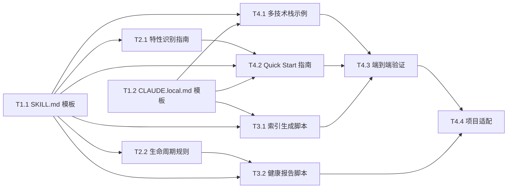

# 任务列表: Skill 驱动开发模式

## 1. 任务总览

| 指标 | 值 |
|------|-----|
| 总任务数 | 10 |
| 关键路径长度 | 4 |
| 可并行任务组数 | 4 |
| 预估总时长 | ~16h（考虑并行后 ~10h） |

### 依赖关系图



---

## 2. 任务清单

### 阶段 1: 核心模板

| ID | 任务 | 优先级 | 估时 | 依赖 | 标记 | 模块 | 状态 |
|----|------|--------|------|------|------|------|------|
| T1.1 | 编写 SKILL.md 标准模板 | P0 | 2h | - | [P][R] | M2 | [ ] |
| T1.2 | 编写 CLAUDE.local.md 标准模板（含 Sync 规则） | P0 | 2h | - | [P][R] | M1+M5 | [ ] |

### 阶段 2: 指南与规则

| ID | 任务 | 优先级 | 估时 | 依赖 | 标记 | 模块 | 状态 |
|----|------|--------|------|------|------|------|------|
| T2.1 | 编写特性识别与 Skill 拆分指南 | P1 | 1.5h | T1.1 | [P] | M3 | [ ] |
| T2.2 | 编写 Skill 生命周期管理规则 | P1 | 1.5h | T1.1 | [P] | M4 | [ ] |

### 阶段 3: 辅助脚本

| ID | 任务 | 优先级 | 估时 | 依赖 | 标记 | 模块 | 状态 |
|----|------|--------|------|------|------|------|------|
| T3.1 | 实现 Skill 索引自动生成脚本 | P1 | 2h | T1.1, T1.2 | [P] | M6 | [ ] |
| T3.2 | 实现 Skill 健康报告脚本 | P2 | 2h | T1.1, T2.2 | [P] | M7 | [ ] |

### 阶段 4: 示例、指南与集成

| ID | 任务 | 优先级 | 估时 | 依赖 | 标记 | 模块 | 状态 |
|----|------|--------|------|------|------|------|------|
| T4.1 | 编写多技术栈适配示例 | P2 | 2h | T1.1, T1.2 | [P] | M1+M2 | [ ] |
| T4.2 | 编写 Quick Start 快速接入指南 | P1 | 1.5h | T1.1, T1.2, T2.1 | [R] | M1+M2+M3 | [ ] |
| T4.3 | 端到端验证（render-pipeline 回归） | P1 | 1.5h | T3.1, T4.1, T4.2 | [R] | 全量 | [ ] |
| T4.4 | 现有项目适配（更新 render-pipeline CLAUDE.local.md） | P2 | 1h | T4.3, T3.2 | [R] | 全量 | [ ] |

---

## 3. 任务详情

### T1.1: 编写 SKILL.md 标准模板

- **模块**: M2
- **优先级**: P0
- **估时**: 2h
- **依赖**: 无
- **标记**: [P][R]

**描述**:
基于 plan.md 9.2 节设计和现有 render-pipeline 项目的 SKILL.md 格式，创建标准化 SKILL.md 模板文件。包含：
1. Frontmatter 规范（name, description, related-skills, deprecated, superseded-by）
2. 必选章节模板（Overview, Core Rules, Reference Files）
3. 可选章节模板（Workflow, Best Practices, Common Issues, Advanced Topics, Related Systems, Output Requirements）
4. Description 编写规范和示例
5. 各章节的填写指导注释

**验收标准**:
1. 模板文件位于 `templates/SKILL.template.md`
2. Frontmatter 包含 plan.md 9.2 节定义的所有字段
3. 必选章节有 `<!-- 必选 -->` 标记，可选章节有 `<!-- 可选 -->` 标记
4. Description 编写规范以注释形式嵌入模板
5. 用现有 gi-expert Skill 作为参照，验证模板可产出同等质量文档

**关联需求**: FR-3, FR-7, AC-1.6, AC-3.3

---

### T1.2: 编写 CLAUDE.local.md 标准模板（含 Sync 规则）

- **模块**: M1 + M5
- **优先级**: P0
- **估时**: 2h
- **依赖**: 无
- **标记**: [P][R]

**描述**:
基于 plan.md 9.1 和 9.4 节设计，创建标准化 CLAUDE.local.md 模板。包含：
1. 项目概述占位区
2. Skill 驱动开发流程（定位→阅读→执行→Sync 四步流程）
3. 智能 Sync 规则表（必须同步/可跳过/询问 的变更分类）
4. Sync 冲突处理指引（AC-2.6）
5. 废弃 Skill 引用检测规则（AC-4.5）
6. 无对应 Skill 时的处理流程
7. Skill 索引占位区（HTML 注释标记）
8. 全局约束占位区

**验收标准**:
1. 模板文件位于 `templates/CLAUDE.local.template.md`
2. 包含 plan.md 9.1 节定义的所有标准章节
3. Sync 规则表包含 plan.md 9.4 节的全部 9 种变更类型
4. 包含 `<!-- SKILL-INDEX-START -->` / `<!-- SKILL-INDEX-END -->` 标记
5. 用现有 render-pipeline CLAUDE.local.md 作为参照，验证模板覆盖其全部要素
6. 总体积 ≤ 2500 字符（ADR-003 约束）

**关联需求**: FR-1, FR-5, FR-6, AC-2.1~2.6, AC-4.5

---

### T2.1: 编写特性识别与 Skill 拆分指南

- **模块**: M3
- **优先级**: P1
- **估时**: 1.5h
- **依赖**: T1.1
- **标记**: [P]

**描述**:
基于 plan.md 9.3 节设计，创建帮助用户判断如何拆分 Skill 的指南。包含：
1. 拆分判断清单（6 个信号）
2. 粒度原则说明
3. 渐进式拆分策略
4. 不同项目规模的推荐 Skill 数量范围
5. 示例：从一个 monolithic 项目拆分 Skill 的过程

**验收标准**:
1. 文件位于 `guides/feature-identification.md`
2. 包含 plan.md 9.3 节的拆分判断清单
3. 包含至少 1 个完整示例（非渲染管线领域，如 Web 后端）
4. 用语通俗，非渲染管线背景的开发者能理解

**关联需求**: FR-7, AC-3.2, AC-3.7

---

### T2.2: 编写 Skill 生命周期管理规则

- **模块**: M4
- **优先级**: P1
- **估时**: 1.5h
- **依赖**: T1.1
- **标记**: [P]

**描述**:
基于 plan.md 9.6 节设计，创建 Skill 生命周期管理规则文档。包含：
1. Skill 创建标准和判断流程
2. 废弃流程（含 frontmatter 标记、引用更新、归档）
3. 废弃引用检测规则（AC-4.5）
4. 合并规则（触发条件、合并方式、冲突处理）
5. 合并冲突裁决流程（AC-4.6）
6. 定期审计清单

**验收标准**:
1. 文件位于 `guides/skill-lifecycle.md`
2. 包含 plan.md 9.6 节的全部规则
3. 每个流程都有清晰的步骤说明
4. 废弃和合并流程包含 frontmatter 字段变更示例

**关联需求**: FR-8, AC-4.1~4.6

---

### T3.1: 实现 Skill 索引自动生成脚本

- **模块**: M6
- **优先级**: P1
- **估时**: 2h
- **依赖**: T1.1, T1.2
- **标记**: [P]

**描述**:
基于 plan.md 9.5 节和调研 2 结论，实现 Python 3 脚本：
1. 扫描 `.claude/skills/*/SKILL.md`
2. 提取 frontmatter（name, description, deprecated）和正文 Overview 首句
3. 生成 Markdown 三列索引表
4. 通过 HTML 注释标记注入 CLAUDE.local.md（幂等替换）
5. 废弃 Skill 在索引中标注 `[废弃]`
6. 错误处理：缺少 frontmatter 时输出警告并跳过

**验收标准**:
1. 脚本位于 `scripts/generate-skill-index.py`
2. 仅使用 Python 标准库（os, re, glob, pathlib）
3. 在 render-pipeline 项目上运行成功，生成正确的 17 行索引表
4. 幂等：多次运行结果一致
5. 跨平台：Windows 和 Linux/macOS 上均可运行
6. 代码 ≤ 100 行

**关联需求**: FR-2, AC-3.1

---

### T3.2: 实现 Skill 健康报告脚本

- **模块**: M7
- **优先级**: P2
- **估时**: 2h
- **依赖**: T1.1, T2.2
- **标记**: [P]

**描述**:
基于 plan.md 9.7 节设计，实现 Python 3 脚本：
1. 扫描 `.claude/skills/*/`
2. 解析 `.evolution/changelog.md` 获取最后更新时间和更新频率
3. 检测 `.evolution/failures/` 中的失败记录
4. 生成 Markdown 健康报告
5. 未更新告警（默认 30 天）、低频告警（低于平均 50%）
6. 新建 Skill（<14 天）标注"数据不足"

**验收标准**:
1. 脚本位于 `scripts/generate-health-report.py`
2. 仅使用 Python 标准库
3. 在 render-pipeline 项目上运行成功
4. 输出格式与 plan.md 9.7 节报告格式一致
5. 阈值可通过 `.evolution/config.yaml` 配置（如存在）
6. 代码 ≤ 150 行

**关联需求**: FR-4, AC-5.1~5.4

---

### T4.1: 编写多技术栈适配示例

- **模块**: M1+M2
- **优先级**: P2
- **估时**: 2h
- **依赖**: T1.1, T1.2
- **标记**: [P]

**描述**:
基于 plan.md 9.8 节，为 3 种技术栈创建示例：
1. Unity/C# 示例（基于现有 render-pipeline 提炼）
2. Node.js 示例（Express 后端项目）
3. Python 示例（Flask/FastAPI 项目）
每个示例包含：示例 CLAUDE.local.md + 1 个示例 SKILL.md

**验收标准**:
1. 文件位于 `templates/examples/{tech-stack}/`
2. 每个示例的 CLAUDE.local.md 基于通用模板填充
3. 每个示例的 SKILL.md 基于通用模板填充
4. 三个示例展示了技术栈无关性（通用部分一致，特定部分差异明确）

**关联需求**: AC-3.5, NFR-2

---

### T4.2: 编写 Quick Start 快速接入指南

- **模块**: M1+M2+M3
- **优先级**: P1
- **估时**: 1.5h
- **依赖**: T1.1, T1.2, T2.1
- **标记**: [R]

**描述**:
为新项目创建从零搭建 Skill 体系的 Quick Start 指南。包含：
1. 前置条件（Claude Code 已安装、Python 3 可用）
2. 步骤 1: 复制 CLAUDE.local.md 模板
3. 步骤 2: 识别第一个特性（链接特性识别指南）
4. 步骤 3: 创建第一个 Skill（使用 SKILL.md 模板）
5. 步骤 4: 测试 Skill 发现是否生效
6. 步骤 5: [可选] 运行索引生成脚本
7. 常见问题排查

**验收标准**:
1. 文件位于 `guides/quick-start.md`
2. 非渲染管线背景的开发者跟随指南可在 1 小时内完成首个 Skill 搭建
3. 包含初始化失败时的手动操作指南（AC-3.6）
4. 包含渐进式拆分策略说明（AC-3.7）

**关联需求**: FR-6, FR-7, AC-3.1~3.7

---

### T4.3: 端到端验证

- **模块**: 全量
- **优先级**: P1
- **估时**: 1.5h
- **依赖**: T3.1, T4.1, T4.2
- **标记**: [R]

**描述**:
对所有产出物进行端到端验证：
1. 在 render-pipeline 项目上运行索引生成脚本，验证输出正确
2. 检查模板与现有 Skill 的兼容性（NFR-5 向后兼容）
3. 验证 Quick Start 指南的完整性和可操作性
4. 检查多技术栈示例的一致性
5. 验证最小集可用性（仅 CLAUDE.local.md + 1 Skill，NFR-3）
6. 验证 Skill 发现流程（AC-1.1~1.5）
7. 验证 Sync 行为规则（AC-2.1~2.5）
8. 验证平台兼容性（NFR-4）

**验收标准**:
1. 索引脚本在 render-pipeline 上输出 17 行正确索引
2. 现有 15+ 个 SKILL.md 无需修改即兼容新模板格式
3. Quick Start 指南中的所有步骤可执行
4. 最小集（总纲+1 Skill）端到端可用
5. 在 Claude Code 中验证 SKILL.md frontmatter 匹配可正确触发 Skill（NFR-4）
6. Sync 规则嵌入 CLAUDE.local.md 后，AI 的 Sync 判断响应自然且符合规则表（NFR-1）
7. 模拟新项目搭建，验证 Quick Start 可在合理时间内完成（AC-3.4）
8. 所有产出文件符合 .claude/ 目录结构约束，可纳入 Git 版本控制

**关联需求**: NFR-1, NFR-2, NFR-3, NFR-4, NFR-5, AC-1.1~1.5, AC-2.1~2.5, AC-3.4

---

### T4.4: 现有项目适配

- **模块**: 全量
- **优先级**: P2
- **估时**: 1h
- **依赖**: T4.3, T3.2
- **标记**: [R]

**描述**:
将标准化方法论回写到 render-pipeline 项目：
1. 更新 CLAUDE.local.md 以符合新模板标准
2. 为现有 Skill 补充 `related-skills` frontmatter 字段
3. 运行索引生成脚本注入 Skill 索引
4. 运行健康报告脚本验证输出

**验收标准**:
1. render-pipeline 的 CLAUDE.local.md 包含标准化的所有章节
2. 至少 5 个核心 Skill 补充了 `related-skills` 字段
3. 索引和健康报告均正常生成
4. 现有 Skill 驱动开发流程不中断

**关联需求**: 约束条件"render-pipeline 作为基准参考"

---

## 4. 关键路径

```
max(T1.1, T1.2) → T2.1 → T4.2 → T4.3 → T4.4
```

**关键路径说明**:
- T1.1 和 T1.2 并行执行，取较长者为起点
- T2.1 (特性识别指南) 是 Quick Start 的前置
- T4.2 (Quick Start) 是最终验证的关键输入
- T4.3 (端到端验证) 是质量关口

---

## 5. 并行任务组

| 组 ID | 任务 | 前置依赖 | 说明 |
|-------|------|----------|------|
| G1 | T1.1, T1.2 | - | 两个核心模板可并行编写 |
| G2 | T2.1, T2.2 | T1.1 | 指南和规则可并行编写 |
| G3 | T3.1, T3.2, T4.1 | T1.1+T1.2 / T2.2 | 脚本和示例可并行开发 |
| G4 | T4.3 | T3.1, T4.1, T4.2 | 验证需等所有前置完成 |

---

## 6. 粒度警告

| 任务 | 问题 | 建议 |
|------|------|------|
| 无 | 所有任务估时在 1-2h 范围内 | 粒度合理 |

---

## 7. 任务标记说明

| 标记 | 含义 | 执行策略 |
|------|------|----------|
| `[P]` | 可并行 | 可与同组 [P] 任务并行执行 |
| `[R]` | 需审查 | 完成后需要人工审查 |

---

## 8. 优先级说明

| 优先级 | 含义 | 分配条件 |
|--------|------|----------|
| P0 | 最高优先级 | 关键路径上的基础模板 |
| P1 | 高优先级 | 核心指南和验证任务 |
| P2 | 中优先级 | 辅助脚本和示例 |

---

*Generated by workflow-task | 2026-02-09*
