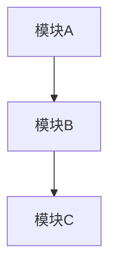

# 需求规范: workflow-plan 阶段设计

> **Feature ID**: workflow-plan
> **版本**: 1.0.0
> **状态**: draft
> **创建日期**: 2026-01-14
> **模式**: standard

---

## 1. 概述

### 1.1 背景

workflow-plan 是 AI 工作流系统的第二个阶段，承接 workflow-specify 输出的 spec.md，生成详细的技术计划 plan.md。该阶段的核心职责是将"做什么"转化为"怎么做"。

### 1.2 目标

设计并完善 workflow-plan skill，使其能够：
- 读取并理解已批准的需求规范
- 生成结构化的技术计划
- 记录架构决策和风险评估
- 为下游 workflow-task 提供可解析的输入

### 1.3 术语表

| 术语 | 定义 |
|------|------|
| **spec.md** | 需求规范文档，workflow-specify 的输出 |
| **plan.md** | 技术计划文档，workflow-plan 的输出 |
| **ADR** | Architecture Decision Record，架构决策记录 |
| **FR** | Functional Requirement，功能需求 |
| **NFR** | Non-Functional Requirement，非功能需求 |

---

## 2. 利益相关者

| 角色 | 关注点 |
|------|--------|
| **开发者** | 清晰的技术方案指导实现 |
| **AI Agent** | 可解析的结构化输入 |
| **审查者** | 可追溯的架构决策 |
| **项目经理** | 风险评估和依赖分析 |

---

## 3. 用户故事

### US-01: 读取需求规范

**作为** AI 工作流用户，
**我想要** workflow-plan 能够读取并解析 spec.md，
**以便** 基于已批准的需求生成技术计划。

**验收标准**:
1. [正向] 当存在有效的 spec.md 时，系统能够成功解析所有章节
2. [正向] 系统能够提取 FR 和 NFR 列表
3. [负向] 当 spec.md 不存在时，系统显示包含错误原因和建议操作的错误信息（如"spec.md 不存在，请先运行 workflow-specify"）
4. [负向] 当 spec.md 状态不是 "approved" 时，系统警告用户
5. [边界] 当 spec.md 包含未知章节格式时，系统跳过并记录警告

---

### US-02: 生成架构设计

**作为** AI 工作流用户，
**我想要** workflow-plan 能够生成系统架构设计，
**以便** 理解系统的整体结构和模块划分。

**验收标准**:
1. [正向] 系统生成 Mermaid 格式的架构图
2. [正向] 架构图包含所有主要模块和它们的关系
3. [正向] 每个模块有职责描述（不超过 50 字，包含主要功能）
4. [负向] 当需求过于模糊时，系统标记为"待澄清"而非猜测
5. [边界] 对于简单功能，架构图可以只有 2-3 个模块

---

### US-03: 输出技术选型

**作为** AI 工作流用户，
**我想要** workflow-plan 能够输出技术选型及理由，
**以便** 理解为什么选择特定的技术方案。

**验收标准**:
1. [正向] 每个技术选型都有理由说明（包含至少 1 个技术论据）
2. [正向] 技术选型与项目约束（constitution.md）一致
3. [正向] 系统提供备选方案供参考
4. [负向] 当技术选型与项目约束冲突时，系统标记并解释
5. [边界] 对于通用选型（如语言选择），可以简化理由

---

### US-04: 分析依赖关系

**作为** AI 工作流用户，
**我想要** workflow-plan 能够分析内部和外部依赖，
**以便** 了解实现所需的依赖项。

**验收标准**:
1. [正向] 系统识别并列出所有内部模块依赖
2. [正向] 系统识别并列出所有外部包/服务依赖
3. [正向] 依赖项包含版本要求（如适用）
4. [负向] 当依赖存在已知安全问题时，系统发出警告
5. [边界] 对于无外部依赖的项目，该章节可为空

---

### US-05: 评估风险

**作为** AI 工作流用户，
**我想要** workflow-plan 能够评估技术风险并制定缓解策略，
**以便** 提前识别和处理潜在问题。

**验收标准**:
1. [正向] 系统识别 3-5 个关键技术风险
2. [正向] 每个风险有可能性和影响评估
3. [正向] 每个风险有对应的缓解策略
4. [负向] 当无法评估风险时，系统标记为"待评估"
5. [边界] 对于低复杂度功能（FR 数量 < 5 或涉及模块 < 3 个），风险可以只有 1-2 个

---

### US-06: 记录架构决策

**作为** AI 工作流用户，
**我想要** workflow-plan 能够记录架构决策（ADR），
**以便** 追溯技术决策的背景和理由。

**验收标准**:
1. [正向] 每个关键架构决策（影响多个模块、涉及技术选型、或有不可逆影响）生成一条 ADR
2. [正向] ADR 包含状态、上下文、决策、后果
3. [正向] ADR 关联到相关的 FR/NFR ID
4. [负向] 当决策被推翻时，ADR 状态更新为"已废弃"
5. [边界] 对于简单功能，ADR 可以只有 1-2 条

---

### US-07: 多阶段流程执行

**作为** AI 工作流用户，
**我想要** workflow-plan 采用 ANALYZE → DESIGN → REVIEW → VALIDATE 4 阶段流程，
**以便** 确保计划的质量和完整性。

**验收标准**:
1. [正向] 系统按顺序执行 4 个阶段
2. [正向] 每个阶段完成后保存中间状态到 .state.yaml
3. [正向] 支持 `--resume` 参数从中断处继续
4. [负向] 当前置阶段未完成时，不允许跳过
5. [边界] 支持单独执行某个阶段（如 `workflow-plan review`）

---

### US-08: 独立审查机制

**作为** AI 工作流用户，
**我想要** workflow-plan 包含独立审查机制，
**以便** 验证设计方案的质量。

**验收标准**:
1. [正向] REVIEW 阶段使用 Task 工具启动独立 Agent
2. [正向] 审查 Agent 检查设计完整性（覆盖 ≥ 95% spec 需求）
3. [正向] 审查结果包含 PASS/NEEDS_IMPROVEMENT/REJECTED 判定
4. [负向] 当审查失败时，返回 DESIGN 阶段修复
5. [边界] 最大审查轮次为 3 轮

---

### US-09: 需求可追溯性

**作为** AI 工作流用户，
**我想要** plan.md 中的设计决策能够追溯到 spec.md 中的需求，
**以便** 确保所有需求都被设计覆盖。

**验收标准**:
1. [正向] 模块说明表包含"关联需求"列
2. [正向] ADR 包含"关联需求"字段
3. [正向] REVIEW 阶段检查追溯完整性
4. [负向] 当存在未被覆盖的需求时，审查失败
5. [边界] 非功能需求可以在风险评估中间接覆盖

---

## 4. 功能需求 (FR)

| ID | 需求 | 优先级 | 关联 US |
|----|------|--------|---------|
| FR-01 | 读取并解析 spec.md | P0 | US-01 |
| FR-02 | 生成系统架构设计 | P0 | US-02 |
| FR-03 | 输出技术选型及理由 | P0 | US-03 |
| FR-04 | 分析内部和外部依赖 | P1 | US-04 |
| FR-05 | 评估技术风险并制定缓解策略 | P1 | US-05 |
| FR-06 | 记录架构决策（ADR） | P1 | US-06 |
| FR-07 | 生成 Mermaid 架构图 | P2 | US-02 |
| FR-08 | 采用 4 阶段流程（ANALYZE→DESIGN→REVIEW→VALIDATE） | P0 | US-07 |
| FR-09 | 支持独立审查机制 | P2 | US-08 |
| FR-10 | 支持需求可追溯性 | P1 | US-09 |
| FR-11 | 支持恢复执行（--resume） | P2 | US-07 |
| FR-12 | 支持单阶段执行 | P2 | US-07 |

---

## 5. 非功能需求 (NFR)

| ID | 需求 | 可量化指标 | 优先级 |
|----|------|-----------|--------|
| NFR-01 | plan.md 必须结构化可解析 | 所有章节有固定标题格式 | P0 |
| NFR-02 | 生成时间 | < 60 秒（标准复杂度） | P1 |
| NFR-03 | 设计完整性 | 覆盖 ≥ 95% 的 spec 需求 | P0 |
| NFR-04 | 与 spec.md 需求可追溯 | 100% 决策关联 FR/NFR ID | P1 |
| NFR-05 | 中文输出 | 所有输出使用中文 | P0 |

---

## 6. 约束条件

| ID | 约束 | 说明 |
|----|------|------|
| C-01 | 输入必须是已批准的 spec.md | 状态为 "approved" |
| C-02 | 输出路径固定 | `.workflow/{feature}/plan/` |
| C-03 | 架构图语法 | 必须使用 Mermaid 语法 |
| C-04 | 单一模板 | 不支持 mini/full 模式 |
| C-05 | 审查 Agent 独立 | 使用 Task 工具启动，信息隔离 |

---

## 7. 范围外 (Out of Scope)

以下内容不在本次实现范围内：

- [ ] 自动代码生成（属于 workflow-implement）
- [ ] 任务分解（属于 workflow-task）
- [ ] 多模板模式（mini/standard/full）
- [ ] 多语言输出支持
- [ ] 与外部项目管理工具集成
- [ ] 版本控制/历史版本对比

---

## 8. 技术约束

### 8.1 输入输出格式

**输入**:
```
.workflow/{feature}/specify/spec.md (approved)
```

**输出**:
```
.workflow/{feature}/plan/
├── analyze/
│   └── analysis.md
├── reviews/
│   └── round-{N}/
│       ├── review-prompt.md
│       └── review-response.md
├── plan.md
└── .state.yaml
```

### 8.2 状态文件格式

```yaml
# .state.yaml
feature: {feature-id}
phase: analyze | design | review | validate
status: in_progress | completed | failed
completed_phases:
  - analyze
  - design
current_round: 1  # for review phase
outputs:
  analysis: analyze/analysis.md
  plan: plan.md
```

---

## 9. 验收清单

- [ ] FR-01: 能够读取并解析 spec.md
- [ ] FR-02: 能够生成系统架构设计
- [ ] FR-03: 能够输出技术选型及理由
- [ ] FR-04: 能够分析内部和外部依赖
- [ ] FR-05: 能够评估技术风险
- [ ] FR-06: 能够记录架构决策（ADR）
- [ ] FR-07: 能够生成 Mermaid 架构图
- [ ] FR-08: 采用 4 阶段流程
- [ ] FR-09: 支持独立审查机制
- [ ] FR-10: 支持需求可追溯性
- [ ] NFR-01: plan.md 结构化可解析
- [ ] NFR-03: 设计完整性 ≥ 95%
- [ ] NFR-05: 中文输出

---

## 附录 A: plan.md 模板

```markdown
# 技术计划: {feature}

> **状态**: draft | reviewed | approved
> **Spec 版本**: {spec-version}
> **创建日期**: {date}

## 1. 概述
{项目背景和技术目标}

## 2. 架构设计

### 2.1 系统架构图


### 2.2 模块说明
| 模块 | 职责 | 依赖 | 关联需求 |
|------|------|------|----------|
| A | ... | - | FR-01 |
| B | ... | A | FR-02 |

## 3. 技术选型

| 领域 | 选型 | 理由 | 备选方案 |
|------|------|------|----------|
| 语言 | TypeScript | 类型安全 | JavaScript |

## 4. 依赖分析

### 4.1 内部依赖
- 模块 A → 模块 B

### 4.2 外部依赖
| 包名 | 版本 | 用途 |
|------|------|------|

## 5. 风险评估

| 风险 | 可能性 | 影响 | 缓解策略 |
|------|--------|------|----------|
| R1 | 中 | 高 | ... |

## 6. 架构决策记录 (ADR)

### ADR-001: {决策标题}
- **状态**: 已采纳
- **上下文**: {背景}
- **决策**: {决策内容}
- **后果**: {影响}
- **关联需求**: FR-XX, NFR-XX
```

---

## 附录 B: 审查清单

### 设计审查清单

- [ ] 架构是否覆盖所有功能需求？
- [ ] 技术选型是否有合理理由？
- [ ] 依赖分析是否完整？
- [ ] 风险评估是否全面？
- [ ] ADR 是否完整记录关键决策？
- [ ] 是否存在可扩展性问题？
- [ ] 是否存在安全风险？
- [ ] 模块职责是否清晰、无重叠？

### 判定规则

| 判定 | 条件 |
|------|------|
| **PASS** | 无 MAJOR/CRITICAL 问题，覆盖度 ≥ 95% |
| **NEEDS_IMPROVEMENT** | 有 MAJOR 问题但无 CRITICAL，覆盖度 < 95% |
| **REJECTED** | 有 CRITICAL 问题或结构严重缺失 |

---

## 附录 C: 与其他 workflow 的集成

### 上游: workflow-specify

```
workflow-specify
    │
    ▼ (输出)
.workflow/{feature}/specify/spec.md (approved)
    │
    ▼ (输入)
workflow-plan
```

### 下游: workflow-task

```
workflow-plan
    │
    ▼ (输出)
.workflow/{feature}/plan/plan.md (approved)
    │
    ▼ (输入)
workflow-task
```

---

*Generated by workflow-specify | 2026-01-14*
