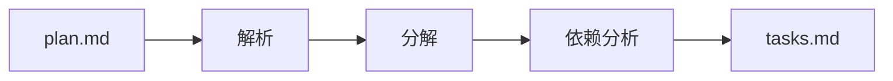
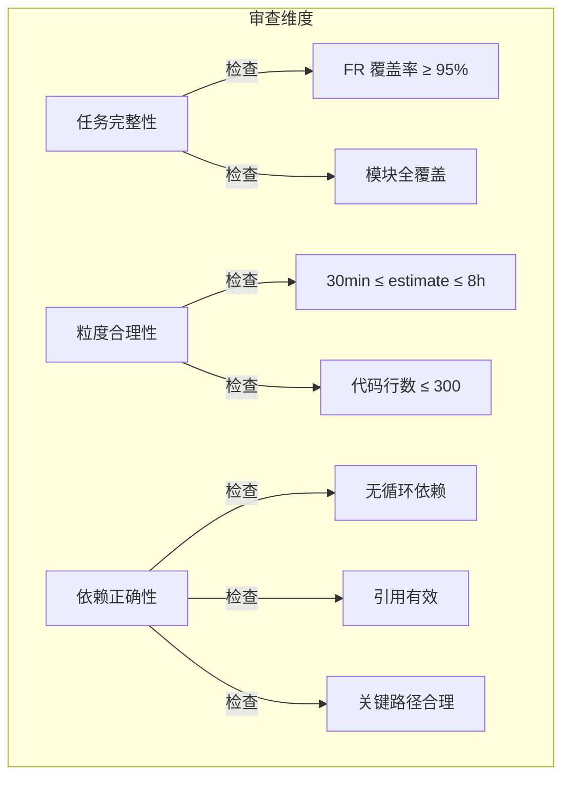
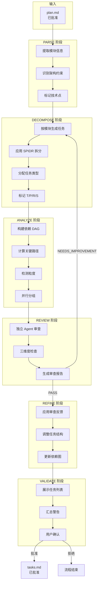
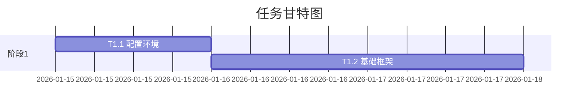
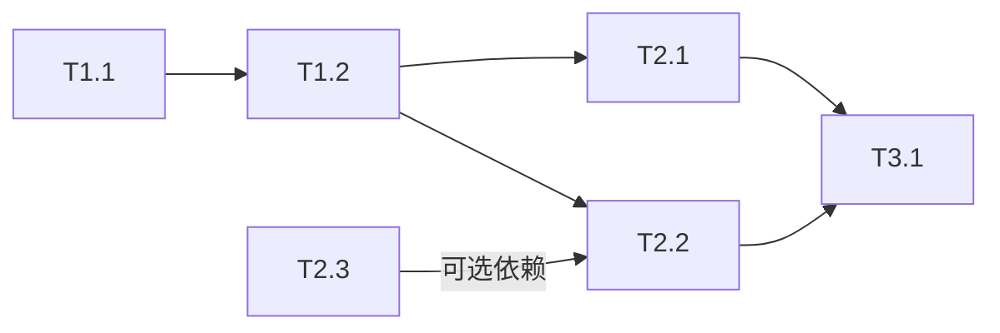

# workflow-task 优化分析

> **分析日期**: 2026-01-15
> **基于调研**: task-best-practices-research.md

---

## 1. 现状分析

### 1.1 当前实现（v1.0）



**现有功能**:
- 基本任务分解
- 依赖 DAG 生成
- [T][P][R] 标记
- 粒度范围建议 (30min-8h)

**缺失能力**:
- 独立审查机制
- 任务类型分类
- SPIDR 拆分指导
- 错误追踪与恢复
- 并行执行控制

### 1.2 与业界最佳实践差距

| 领域 | 业界最佳实践 | 当前实现 | 差距 |
|------|--------------|----------|------|
| 任务分类 | Type 1/2/3 三级模型 | 无 | 高 |
| 拆分方法 | SPIDR 五种技术 | 仅按模块拆分 | 中 |
| 审查机制 | 独立 Agent 审查 | 无审查 | 高 |
| 粒度检测 | 自动检测 + 警告 | 仅文档说明 | 中 |
| 依赖管理 | DAG + 关键路径 + 并行限制 | DAG + 关键路径 | 低 |
| 错误追踪 | 持久化 + 重试策略 | 无 | 中 |

---

## 2. 优化方向

### 2.1 增强任务分类系统

**新增任务类型标记**:

| 标记 | 类型 | 含义 | 执行策略 |
|------|------|------|----------|
| `[T1]` | Narrow | 狭窄明确任务 | AI 独立完成 |
| `[T2]` | Context | 需上下文任务 | AI 辅助 + 人工指导 |
| `[T3]` | Complex | 复杂开放任务 | 需进一步分解 |
| `[S]` | Spike | 调研任务 | 先调研后实现 |

**与现有标记兼容**:
- `[T]` — TDD 标记（保留）
- `[P]` — 并行标记（保留）
- `[R]` — 审查标记（保留）

### 2.2 引入 SPIDR 拆分指导

**DECOMPOSE 阶段增加拆分提示**:

```markdown
## 任务拆分指南（SPIDR）

当任务过大（>8h）时，考虑以下拆分方式：

1. **Spike (调研)**: 不确定的技术点先调研
2. **Paths (路径)**: 按不同执行路径拆分
3. **Interfaces (接口)**: 按不同平台/设备拆分
4. **Data (数据)**: 按数据类型/复杂度拆分
5. **Rules (规则)**: 按业务规则拆分
```

### 2.3 强化审查机制

**REVIEW 阶段三维度检查**:



### 2.4 并行执行控制

**新增配置项**:

```yaml
# .state.yaml 或 tasks.md frontmatter
parallel_config:
  max_concurrent: 5       # 最大并行任务数
  prefer_critical_path: true  # 优先关键路径任务
  auto_schedule: true     # 自动调度
```

### 2.5 错误追踪与恢复

**增加 attempts 记录**:

```yaml
# .state.yaml
task_attempts:
  T2.1:
    attempts: 2
    last_error: "类型错误: undefined is not a function"
    last_attempt: "2026-01-15T10:30:00Z"
    status: "retry_pending"
```

---

## 3. 优化后流程设计

### 3.1 完整 6 阶段流程



### 3.2 各阶段增强点

| 阶段 | 现有 | 增强 |
|------|------|------|
| PARSE | 提取模块 | + 识别技术不确定点（Spike 候选）|
| DECOMPOSE | 按模块分解 | + SPIDR 拆分指导 + 任务类型分类 |
| ANALYZE | DAG + 关键路径 | + 并行分组 + 粒度自动检测 |
| REVIEW | 无 | 新增：独立 Agent 三维度审查 |
| REFINE | 无 | 新增：根据审查反馈优化 |
| VALIDATE | 简单输出 | + 警告汇总 + 用户交互确认 |

---

## 4. 输出格式增强

### 4.1 tasks.md 新格式

```markdown
---
name: {feature}
status: draft | reviewed | approved
version: 1.0.0
created_date: 2026-01-15
spec_version: 1.1.0
parallel_config:
  max_concurrent: 5
  prefer_critical_path: true
---

# 任务列表: {feature}

## 任务总览

- 总任务数: 12
- 关键路径长度: 5
- 可并行任务数: 4
- 预估总时长: 18h



## 任务清单

### 阶段 1: 基础设施

| ID | 任务 | 类型 | 优先级 | 估时 | 依赖 | 标记 | 状态 |
|----|------|------|--------|------|------|------|------|
| T1.1 | 配置开发环境 | T1 | P0 | 1h | - | [P] | [ ] |
| T1.2 | 搭建测试框架 | T1 | P0 | 2h | T1.1 | [T][P] | [ ] |

### 阶段 2: 核心功能

| ID | 任务 | 类型 | 优先级 | 估时 | 依赖 | 标记 | 状态 |
|----|------|------|--------|------|------|------|------|
| T2.1 | 实现认证模块 | T2 | P0 | 4h | T1.2 | [T] | [ ] |
| T2.2 | 实现数据存储 | T2 | P1 | 3h | T1.2 | [T][P] | [ ] |
| T2.3 | 研究缓存策略 | S | P1 | 2h | - | [S][P] | [ ] |

## 任务详情

### T2.1: 实现认证模块

- **类型**: T2 (需上下文)
- **模块**: auth
- **描述**: 基于 JWT 实现用户认证，包括登录、登出、token 刷新
- **验收标准**:
  1. 登录接口返回有效 JWT
  2. Token 过期后自动刷新
  3. 单元测试覆盖率 > 80%
- **关联需求**: FR-1, US-1

## 依赖关系图



## 关键路径

T1.1 → T1.2 → T2.1 → T3.1

## 并行任务组

| 组 | 任务 | 前置依赖 |
|-----|------|----------|
| G1 | T1.1 | - |
| G2 | T2.1, T2.2, T2.3 | T1.2 |
| G3 | T3.1 | T2.1, T2.2 |

## 粒度警告

| 任务 | 问题 | 建议 |
|------|------|------|
| T2.1 | 估时 4h 接近上限 | 考虑拆分为登录/登出/刷新 |

## 任务标记说明

| 标记 | 含义 |
|------|------|
| `[T]` | 测试先行：先写测试再实现 |
| `[P]` | 可并行：可与同组 [P] 任务并行 |
| `[R]` | 需审查：完成后需要人工审查 |
| `[S]` | Spike：调研任务，完成后生成结论 |
| `T1` | 狭窄任务：AI 可独立完成 |
| `T2` | 上下文任务：需要额外上下文 |
| `T3` | 复杂任务：需进一步分解 |
```

---

## 5. 资源文件规划

### 5.1 assets/tasks-template.md

完整的 tasks.md 模板，包含：
- frontmatter 结构
- 各章节示例
- 标记说明

### 5.2 references/phase-details.md

各阶段详细说明，包含：
- 阶段输入输出
- 子任务列表
- 判定规则
- 示例

### 5.3 references/spidr-guide.md (新增)

SPIDR 拆分指南，包含：
- 五种技术详细说明
- 适用场景判断
- 拆分示例

### 5.4 scripts/validate-tasks.sh

验证脚本，检查：
- 任务 ID 格式
- 依赖引用有效性
- 循环依赖检测
- 粒度范围检查

---

## 6. 实施优先级

| 优先级 | 改进项 | 工作量 | 收益 |
|--------|--------|--------|------|
| P0 | 完善 6 阶段流程 | 高 | 高 |
| P0 | 独立 Agent 审查 | 中 | 高 |
| P1 | 任务类型分类 | 低 | 中 |
| P1 | 并行执行控制 | 中 | 中 |
| P2 | SPIDR 拆分指南 | 低 | 中 |
| P2 | 错误追踪机制 | 中 | 中 |
| P3 | 垂直切片检查 | 低 | 低 |

---

## 7. 与上下游集成

### 7.1 与 workflow-plan 集成

**输入格式兼容性**:
- plan.md frontmatter 必须包含 `status: approved`
- 模块定义必须清晰
- 依赖关系在 plan.md 中预定义

### 7.2 与 workflow-implement 集成

**输出格式兼容性**:
- 保持核心表格格式不变
- 新增字段放在任务详情区
- 并行配置通过 frontmatter 传递

---

*Generated by workflow-plan ANALYZE phase | 2026-01-15*
