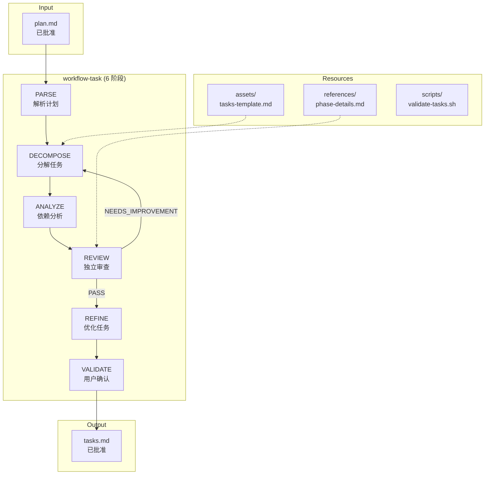
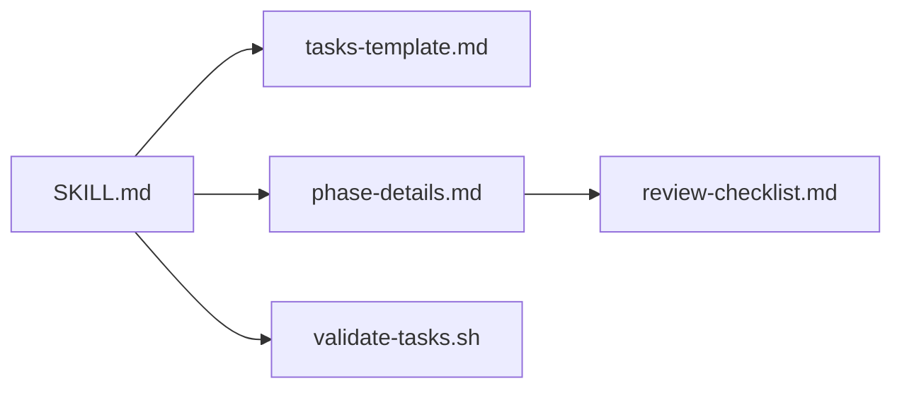

# 技术计划: workflow-task-enhancement

> **状态**: approved
> **Spec 版本**: 1.1.0
> **创建日期**: 2026-01-15
> **批准日期**: 2026-01-15

---

## 1. 概述

将 `workflow-task` skill 从当前的简单版本（146 行）重构为完整的 6 阶段工作流程，使其与 `workflow-plan` 保持一致的完整度和风格。核心目标是实现 plan.md → tasks.md 的高质量转换，支持任务粒度检测、依赖分析、独立审查和断点恢复。

---

## 2. 架构设计

### 2.1 架构视角说明

- **上下文（Context）**: workflow-task 作为 workflow 流程链中的中间环节，接收 workflow-plan 的输出（plan.md），生成供 workflow-implement 消费的 tasks.md
- **容器（Container）**: 单一 Markdown skill 文件 + 资源文件（assets/, references/, scripts/）
- **组件（Component）**: 6 个阶段模块 + 状态管理 + 命令接口
- **部署（Deployment）**: 部署到 `skills/workflow-task/` 目录

### 2.2 系统架构图

### 2.3 模块说明

| 模块 | 职责 | 依赖 | 关联需求 |
|------|------|------|----------|
| PARSE | 解析 plan.md，提取模块和架构信息 | - | FR-1, US-1 |
| DECOMPOSE | 将模块分解为任务，生成 tasks.md 草稿，标记 [T][P][R] | PARSE | FR-1, FR-2, FR-7, US-1, US-4 |
| ANALYZE | 分析任务依赖，生成 DAG 图，计算关键路径，检测粒度 | DECOMPOSE | FR-1, FR-5, FR-6, US-2, US-3 |
| REVIEW | 使用独立 Agent 审查任务分解质量 | ANALYZE | FR-1, FR-8, US-5 |
| REFINE | 根据审查反馈优化任务列表 | REVIEW | FR-1, US-5 |
| VALIDATE | 展示任务列表，获取用户确认，更新状态 | REFINE | FR-1, FR-9, FR-10, US-6, US-7 |

---

## 3. 技术选型

| 领域 | 选型 | 理由 | 备选方案 |
|------|------|------|----------|
| 文档格式 | Markdown | 项目标准，与其他 workflow-* 一致 | - |
| 图表工具 | Mermaid | 项目标准，支持 DAG 和 Gantt 图 | PlantUML |
| 状态管理 | YAML (.state.yaml) | 与 workflow-plan 一致，易于解析 | JSON |
| 审查机制 | Task 工具调用独立 Agent | 保证审查独立性 | 直接审查 |

---

## 4. 依赖分析

### 4.1 内部依赖

### 4.2 外部依赖

| 依赖 | 版本 | 用途 | 维护状态 |
|------|------|------|----------|
| workflow-plan (plan.md 格式) | 1.0+ | 输入格式规范 | 活跃 |
| workflow-implement (tasks.md 消费) | 1.0+ | 输出格式兼容 | 待完善 |
| Mermaid 语法 | - | 图表渲染 | 稳定 |

---

## 5. 风险评估

| 风险 | 可能性 | 影响 | 缓解策略 |
|------|--------|------|----------|
| R1: plan.md 格式不一致导致解析失败 | 中 | 高 | PARSE 阶段添加格式验证，兼容多种格式 |
| R2: 任务粒度估算不准确导致警告误报 | 中 | 低 | 允许用户在 VALIDATE 阶段覆盖 |
| R3: 审查循环过多导致流程卡住 | 低 | 中 | 限制最多 3 轮，超限提示用户 |
| R4: workflow-implement 兼容性问题 | 中 | 中 | 保持现有 tasks.md 核心格式不变 |
| R5: 循环依赖检测遗漏 | 低 | 高 | 使用标准 DFS 算法检测后向边 |

---

## 6. 安全与合规考虑

- **身份与访问控制**: 不适用（本地 skill 文件）
- **数据保护**: 不涉及敏感数据
- **合规要求**: 无特殊要求

---

## 7. 可观测性与运维

- **状态追踪**: `.state.yaml` 记录当前阶段和历史
- **日志**: 审查报告保存到 `reviews/round-{N}/`
- **告警**: 粒度警告在 VALIDATE 阶段汇总展示

---

## 8. 上线/迁移/回滚策略

- **上线步骤**: 
  1. 替换 `skills/workflow-task/SKILL.md`
  2. 创建资源文件目录和文件
  3. 验证命令接口可用
- **迁移方案**: 无需数据迁移，新格式向后兼容
- **回滚策略**: 保留旧版 SKILL.md 备份，如有问题直接恢复

---

## 9. 架构决策记录 (ADR)

### ADR-001: 采用 6 阶段单审查流程

- **状态**: 已采纳
- **上下文**: 需要确定 workflow-task 的工作流程结构
- **决策**: 采用 PARSE→DECOMPOSE→ANALYZE→REVIEW→REFINE→VALIDATE 6 阶段流程，包含 1 次审查（不同于 workflow-plan 的双审查）
- **后果**: 
  - 简化流程，适合任务分解场景
  - 审查聚焦于任务质量而非分析质量
  - 与 workflow-plan 阶段数一致但名称不同
- **关联需求**: FR-1, US-5

### ADR-002: 任务粒度检测作为警告而非阻塞

- **状态**: 已采纳
- **上下文**: 需要决定任务粒度不合理时的处理策略
- **决策**: 粒度超出范围（<30min 或 >8h）时发出警告，但不阻塞流程
- **后果**: 
  - 用户有最终决定权
  - 避免误报导致流程中断
  - 警告在 VALIDATE 阶段汇总展示
- **关联需求**: FR-5, US-2, NFR-4

### ADR-003: 保持 tasks.md 核心格式向后兼容

- **状态**: 已采纳
- **上下文**: 需要确保生成的 tasks.md 能被 workflow-implement 正确消费
- **决策**: 保持现有表格格式（ID, 任务, 优先级, 依赖, 标记, 状态），新增字段放在任务详情区
- **后果**: 
  - 现有 workflow-implement 无需修改
  - 新字段（estimate, module）不影响主表格解析
  - 向后兼容优先于功能完整
- **关联需求**: NFR-3, FR-2

### ADR-004: 使用 YAML 格式进行状态管理

- **状态**: 已采纳
- **上下文**: 需要选择状态文件格式以支持断点恢复
- **决策**: 采用 YAML 格式（.state.yaml），与 workflow-plan 一致
- **后果**: 
  - 易于人工阅读和编辑
  - 支持复杂嵌套结构
  - 与 workflow-plan 状态管理一致
- **关联需求**: FR-10, US-7

---

## 10. 交付物清单

| 文件 | 路径 | 说明 | 关联需求 |
|------|------|------|----------|
| SKILL.md | `skills/workflow-task/SKILL.md` | 主文档，完整 6 阶段说明 | 全部 |
| tasks-template.md | `skills/workflow-task/assets/tasks-template.md` | 任务模板 | FR-2, FR-3 |
| phase-details.md | `skills/workflow-task/references/phase-details.md` | 阶段详情和审查清单 | FR-3, FR-8 |
| validate-tasks.sh | `skills/workflow-task/scripts/validate-tasks.sh` | 格式验证脚本 | FR-3 |

---

## 11. 需求追溯性

| 需求 ID | 对应模块/ADR | 验收方式 |
|---------|--------------|----------|
| FR-1 | 全部 6 阶段 | 流程完整性测试 |
| FR-2 | DECOMPOSE, tasks-template.md | 格式验证 |
| FR-3 | assets/, references/, scripts/ | 文件存在性检查 |
| FR-4 | SKILL.md 命令章节 | 命令文档审查 |
| FR-5 | ANALYZE 阶段 | 粒度边界值测试 |
| FR-6 | ANALYZE 阶段 | DAG 正确性验证 |
| FR-7 | DECOMPOSE 阶段 | 标记一致性检查 |
| FR-8 | REVIEW 阶段, phase-details.md | 审查报告格式验证 |
| FR-9 | VALIDATE 阶段 | 交互流程测试 |
| FR-10 | .state.yaml, SKILL.md | 恢复正确性测试 |
| NFR-1 | SKILL.md 结构 | 与 workflow-plan 对比 |
| NFR-2 | 目录结构 | 模块独立性检查 |
| NFR-3 | tasks.md 格式 | 集成测试 |
| NFR-4 | DECOMPOSE 阶段 | 优先级规则验证 |

---

*Generated by workflow-plan | 2026-01-15*
