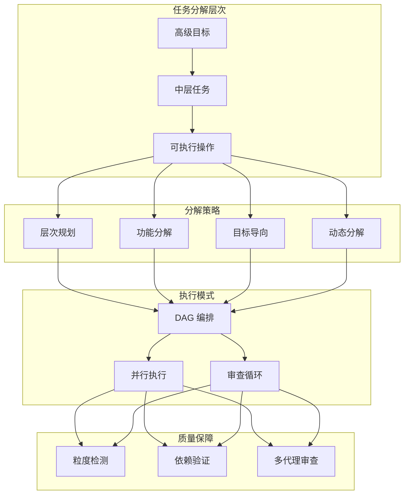
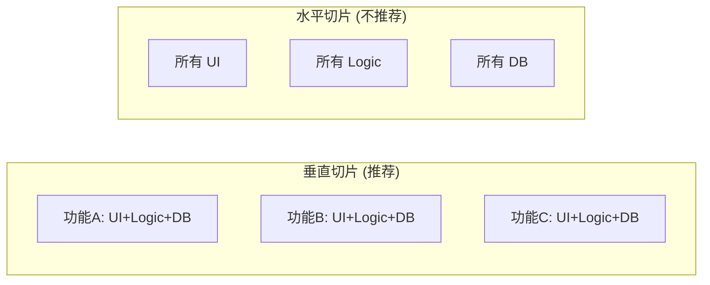
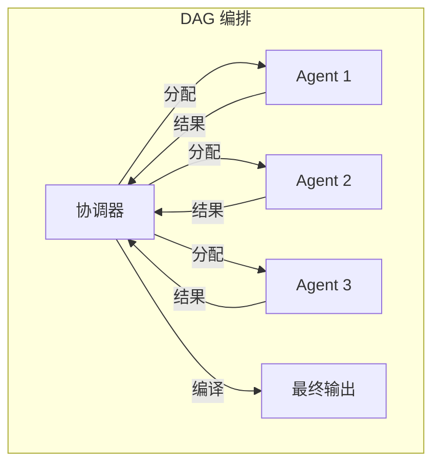
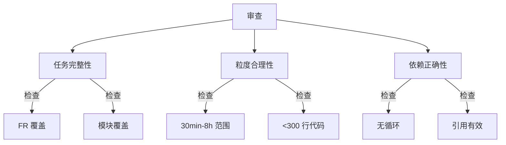

# Task 阶段最佳实践调研报告

> **调研日期**: 2026-01-15
> **调研范围**: AI Coding Agent 任务分解、Agile 故事拆分、DAG 编排模式

---

## 1. 整体概览

### 1.1 调研背景

workflow-task 阶段负责将技术计划（plan.md）转化为可执行的任务列表（tasks.md）。为了优化该阶段的设计，需要调研业界在以下方面的最佳实践：
- AI 编码助手的任务分解策略
- 敏捷开发中的故事拆分模式
- 多代理系统的 DAG 编排架构

### 1.2 技术全景图



---

## 2. AI Coding Agent 任务分解

### 2.1 核心原则（来源：Continue.dev、AI Dev Tasks）

#### 任务分类（三类模型）

| 类型 | 特征 | AI 处理能力 | 示例 |
|------|------|-------------|------|
| **Type 1** | 狭窄、明确 | 高 | 移除特性标志、写单元测试、生成样板代码 |
| **Type 2** | 需要上下文 | 中 | 调试特定错误、重构函数、优化查询 |
| **Type 3** | 开放、复杂 | 低 | "实现用户认证"、"添加照片上传" |

**关键洞察**: Type 3 任务必须先分解为 Type 1 和 Type 2 任务，再交给 AI 执行。

#### AI Dev Tasks 三层框架

```
PRD（产品需求）
    ↓
任务分解（粒度化、顺序化）
    ↓
迭代实现（每步前获批准）
```

**核心价值**:
- 分解工作防止风险堆积
- 检查点确保安全
- 清晰需求改善 AI 理解

### 2.2 分解粒度权衡

来源：atoms.dev 技术分析

| 粒度 | 问题 | 影响 |
|------|------|------|
| **过粗** | 缺乏灵活性 | AI 难以处理，容易遗漏细节 |
| **过细** | 上下文过载 | 增加管理开销，丢失全局视角 |

**推荐标准**:
- 最小粒度：30 分钟
- 最大粒度：8 小时
- 单任务代码修改：不超过 300 行

### 2.3 依赖管理挑战

> "代理通常缺乏显式机制来追踪依赖性，难以追踪失败原因或理解变更影响。"

**解决方案**:
- 使用 DAG 表示任务依赖
- 显式标记并行任务
- 支持动态调整基于前序任务状态

---

## 3. Agile 故事拆分模式

### 3.1 INVEST 原则

| 原则 | 含义 | 对 Task 阶段的启示 |
|------|------|---------------------|
| **I**ndependent | 独立 | 任务应可独立实现和测试 |
| **N**egotiable | 可协商 | 留有调整空间 |
| **V**aluable | 有价值 | 每个任务交付可验证的价值 |
| **E**stimable | 可估算 | 任务粒度支持时间估算 |
| **S**mall | 足够小 | 6-10 个任务/迭代 |
| **T**estable | 可测试 | 明确的验收标准 |

### 3.2 SPIDR 五种拆分技术

来源：Mountain Goat Software

| 技术 | 方法 | 适用场景 |
|------|------|----------|
| **S**pike | 研究型活动 | 技术不确定时先调研 |
| **P**aths | 按路径拆分 | 多条执行路径 |
| **I**nterfaces | 按接口拆分 | 多设备/多平台 |
| **D**ata | 按数据类型拆分 | 处理多种数据格式 |
| **R**ules | 按业务规则拆分 | 复杂业务逻辑 |

### 3.3 垂直切片 vs 水平切片

来源：Humanizing Work



**垂直切片优势**:
- 端到端价值交付
- 更早获得反馈
- 降低集成风险

### 3.4 九种拆分模式

| 模式       | 说明           | workflow-task 应用 |
| -------- | ------------ | ---------------- |
| 工作流步骤    | 按用户操作顺序      | 按阶段组织任务          |
| CRUD 操作  | 按创建/读取/更新/删除 | 拆分"管理X"类任务       |
| 业务规则变体   | 按不同决策分支      | 分离核心逻辑与边缘情况      |
| 数据变体     | 按数据复杂度       | 先简单数据后复杂数据       |
| 数据入口     | 按输入方式        | 先基础 UI 后高级界面     |
| 主要工作量    | 延迟耗时增强       | 识别 [P3] 优化任务     |
| 简单/复杂    | 提取最简版本       | MVP 任务优先         |
| 延迟性能     | 先功能后优化       | [P3] 标记优化任务      |
| Spike 调研 | 先研究后实现       | 增加 [S] spike 标记  |
|          |              |                  |

---

## 4. DAG 编排模式

### 4.1 核心概念（来源：Agentic Workflow Patterns）



**关键特性**:
- **节点**：代表个别任务
- **边**：表示依赖关系
- **无环**：确保工作流终止

### 4.2 并行执行策略

| 策略 | 描述 | 实现方式 |
|------|------|----------|
| **同级并行** | 无依赖任务并发 | [P] 标记 + 限制并发数 |
| **依赖等待** | 等待前置任务完成 | DAG 拓扑排序 |
| **动态调度** | 运行时决定执行顺序 | 状态驱动调度器 |

### 4.3 Planner-Worker 架构

来源：Weaviate 博客

```
Planner LLM (规划)
    ↓
任务列表 (DAG)
    ↓
Worker Agents (并行执行)
    ↓
Orchestrator (合成结果)
    ↓
(可选) 重规划
```

**workflow-task 映射**:
- PARSE/DECOMPOSE → Planner
- ANALYZE → DAG 生成
- workflow-implement → Worker Agents

### 4.4 静态 vs 动态分解

| 方式 | 定义时机 | 适用场景 | 配置方式 |
|------|----------|----------|----------|
| **静态** | 实现时 | 可预测工作流 | YAML/代码 |
| **动态** | 运行时 | 开放性问题 | LLM 推理 |

**workflow-task 策略**: 采用**静态分解**为主，支持用户在 VALIDATE 阶段手动调整。

---

## 5. 审查与验证机制

### 5.1 多代理协作验证

来源：atoms.dev

| 审查类型 | 机制 | 优势 |
|----------|------|------|
| **自我反思** | 单 Agent 迭代修正 | 低成本 |
| **独立审查** | 专门 Review Agent | 客观性高 |
| **层级协调** | 上级介入决策 | 处理僵局 |

**推荐**: workflow-task 采用**独立审查**（通过 Task 工具）

### 5.2 审查维度（三维度模型）



### 5.3 判定规则

| 判定 | 条件 | 动作 |
|------|------|------|
| **PASS** | 三维度均合格 | 进入 REFINE |
| **NEEDS_IMPROVEMENT** | 部分问题 | 返回修改（最多 3 轮）|
| **REJECTED** | 严重问题 | 停止流程 |

---

## 6. Planning with Files 模式

### 6.1 核心理念（来源：GitHub planning-with-files）

> "Context Window = RAM (易失、有限) | Filesystem = Disk (持久、无限)"

**三文件模式**:
- `task_plan.md` — 阶段和进度追踪
- `findings.md` — 研究和发现存储
- `progress.md` — 会话日志和测试结果

### 6.2 关键规则

1. **先创建计划** — 不创建 task_plan.md 不开始
2. **2-Action 规则** — 每 2 次操作后保存发现
3. **记录所有错误** — 用于模式识别
4. **不重复失败** — 追踪尝试，变换方法

### 6.3 对 workflow-task 的启示

| 规则 | workflow-task 应用 |
|------|---------------------|
| 先创建计划 | tasks.md 草稿先于执行 |
| 进度追踪 | .state.yaml 记录阶段状态 |
| 错误记录 | 审查报告保存到 reviews/ |
| 检查点 | 每阶段完成后更新状态 |

---

## 7. 最佳实践总结

### 7.1 任务分解原则

| 原则 | 说明 | 实现方式 |
|------|------|----------|
| **垂直切片** | 端到端价值交付 | 按功能而非层次拆分 |
| **适度粒度** | 30min-8h 范围 | 粒度检测 + 警告 |
| **显式依赖** | DAG 可视化 | Mermaid 图 + 关键路径 |
| **类型分类** | Type 1/2/3 模型 | 标记 [T][P][R] |
| **检查点** | 每步验证 | 6 阶段 + 状态管理 |

### 7.2 推荐改进项

基于调研，建议对 workflow-task 进行以下增强：

| 改进项 | 优先级 | 来源 | 收益 |
|--------|--------|------|------|
| 任务类型标记 | P1 | Continue.dev | 指导 AI 执行策略 |
| SPIDR 拆分指南 | P2 | Mountain Goat | 系统化拆分方法 |
| 并行限制配置 | P1 | DAG 模式 | 控制资源使用 |
| Spike 标记 [S] | P2 | SPIDR | 识别调研任务 |
| 垂直切片检查 | P3 | Humanizing Work | 验证任务价值完整性 |
| 错误追踪 | P2 | planning-with-files | 支持重试和恢复 |

### 7.3 性能收益预期

来源：atoms.dev 研究

> "采用结构化分解的自主编码代理完成复杂任务速度快 58%，bug 修复提升 47%"

---

## 8. 调研来源

### 主要来源

1. [Task Decomposition for Coding Agents](https://atoms.dev/insights/task-decomposition-for-coding-agents-architectures-advancements-and-future-directions/) - AI 编码代理任务分解深度分析
2. [AI Dev Tasks Framework](https://johnoct.github.io/blog/2025/07/24/ai-dev-tasks-framework/) - AI 辅助开发三层框架
3. [Stop Asking AI to Build the Whole Feature](https://blog.continue.dev/task-decomposition/) - 任务分解核心原则
4. [SPIDR: Five Ways to Split User Stories](https://www.mountaingoatsoftware.com/blog/five-simple-but-powerful-ways-to-split-user-stories) - 敏捷故事拆分技术
5. [Humanizing Work Guide to Splitting User Stories](https://www.humanizingwork.com/the-humanizing-work-guide-to-splitting-user-stories/) - INVEST 原则和九种拆分模式
6. [DAG Orchestration Pattern](https://deepwiki.com/arunpshankar/Agentic-Workflow-Patterns/3.1-dag-orchestration-pattern) - DAG 编排详细实现
7. [Planning with Files](https://github.com/OthmanAdi/planning-with-files) - 持久化规划模式
8. [Agentic Workflow Patterns](https://github.com/arunpshankar/Agentic-Workflow-Patterns) - 代理工作流模式库

### 补充来源

9. [Best Practices for AI-Assisted Coding](https://engineering.axur.com/2025/05/09/best-practices-for-ai-assisted-coding.html)
10. [Common Workflows - Claude Code Docs](https://code.claude.com/docs/en/common-workflows)
11. [20 Agentic AI Workflow Patterns](https://skywork.ai/blog/agentic-ai-examples-workflow-patterns-2025/)
12. [9 Techniques for Splitting User Stories](https://storiesonboard.com/blog/9-techniques-for-splitting-user-stories)

---

*Generated by workflow-plan RESEARCH phase | 2026-01-15*
