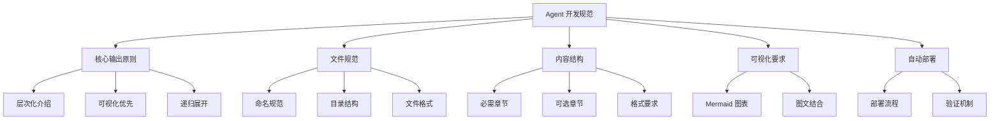
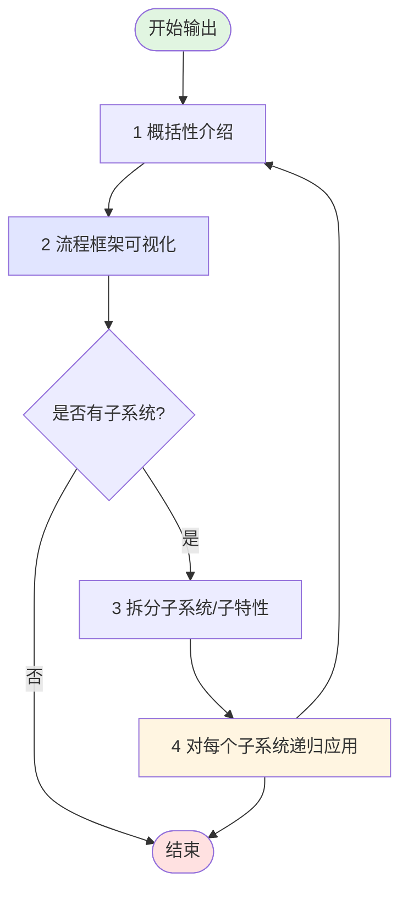
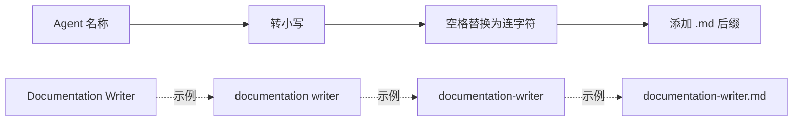
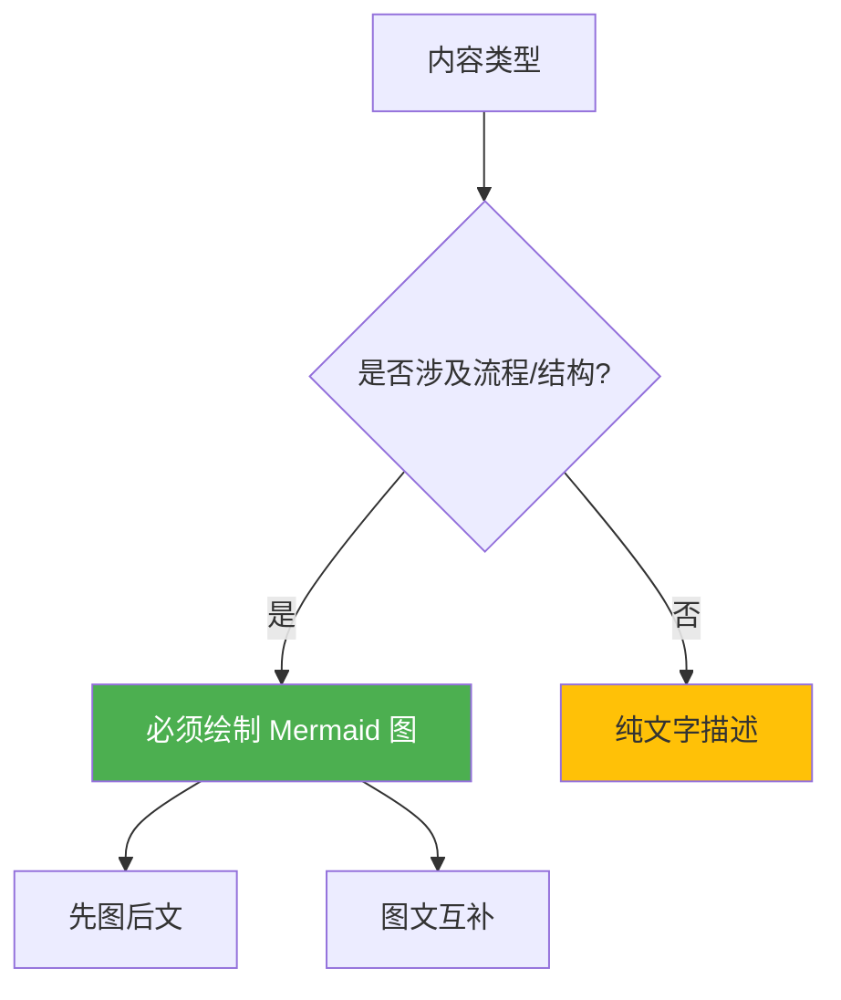
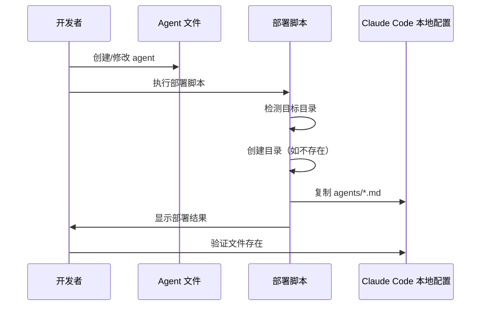
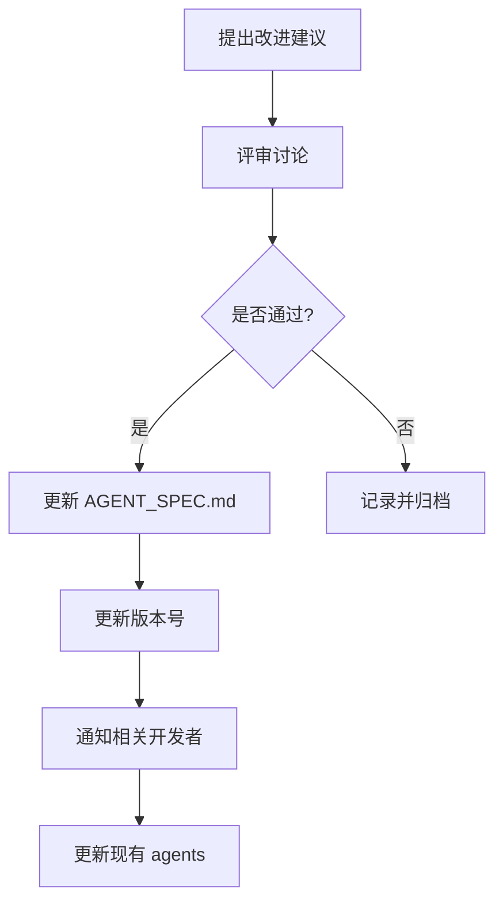

# Agent 开发规范

## 概述

本规范定义了 Claude Code agents 的创建、编写和部署标准，确保所有 agent 输出一致、高质量、易于维护。

## 规范架构



---

## 1. 核心输出原则

### 1.1 原则概述

**所有 agent 在输出介绍类信息时，必须遵循"自顶向下、层次递归、可视化优先"的方法论。**

### 1.2 输出流程



### 1.3 四步法则

#### 步骤 1：概括性介绍
- **是什么**：用 1-2 句话说明对象的本质
- **做什么**：核心功能和价值
- **为什么**：解决什么问题

**示例**：
> 文档助手是一个专注于技术文档编写的 AI agent，通过结构化方法生成高质量的 README、API 文档和技术规范，解决文档不完整、不一致的问题。

#### 步骤 2：流程框架可视化
- **优先使用** Mermaid 图表（流程图、架构图、序列图、思维导图）
- **再配文字**描述关键节点和数据流
- **图表类型选择**：
  - 流程/步骤 → Flowchart
  - 系统架构 → Graph/架构图
  - 时序交互 → Sequence Diagram
  - 概念分解 → Mindmap

**示例**：


#### 步骤 3：拆分子系统/子特性
- 识别核心组成部分（模块、功能、阶段）
- 每个部分独立成章节
- 保持同级别项目的并列关系

**示例**：
```
文档助手系统
├── 需求分析模块
├── 结构设计模块
├── 内容生成模块
└── 质量检查模块
```

#### 步骤 4：递归展开每个子系统
对每个子系统重复步骤 1-3：
1. 概括介绍这个子系统
2. 绘制子系统的流程图/架构图
3. 如果还能拆分，继续递归

**深度控制**：通常 2-3 层即可，避免过度细化。

---

## 2. 文件规范

### 2.1 命名规范



**规则**：
- **格式**：全小写，单词用连字符 `-` 分隔
- **后缀**：`.md`
- **字符**：仅允许小写字母、数字、连字符
- **避免**：特殊字符、空格、中文

**示例**：
| Agent 名称 | 文件名 |
|-----------|--------|
| Documentation Writer | `doc-writer.md` |
| Frontend Developer | `frontend-dev.md` |
| Tech Researcher | `tech-researcher.md` |
| Bug Analyzer | `bug-analyzer.md` |

### 2.2 目录结构

```
agents/                      # 项目根目录
├── README.md               # 项目描述文档
├── AGENT_SPEC.md          # 本规范文档
├── agents/                # Agent 文件目录
│   ├── README.md          # 目录说明
│   ├── doc-writer.md      # 文档助手
│   ├── frontend-dev.md    # 前端开发助手
│   └── ...                # 其他 agents
└── devops/                # DevOps 工具目录
    ├── deploy-windows.bat # Windows 部署脚本
    └── deploy-macos.sh    # macOS 部署脚本
```

### 2.3 文件格式

- **编码**：UTF-8（无 BOM）
- **换行符**：LF（`\n`）或 CRLF（`\r\n`）
- **Markdown 风格**：GitHub Flavored Markdown (GFM)

### 2.4 Frontmatter 要求（强制）

**⚠️ 重要**：所有 agent 文件**必须**在文件顶部包含 YAML frontmatter，否则 Claude Code 将无法识别该 agent。

#### 格式要求

```markdown
---
name: [agent-name]
description: [简短描述]
model: [claude-model-name]
---

[Markdown 内容开始...]
```

#### 必需字段

| 字段 | 说明 | 示例 |
|------|------|------|
| **name** | Agent 名称（英文，对应文件名，不含 .md 后缀） | `agent-generator` |
| **description** | Agent 简短描述（1-2 句话，说明核心功能） | `根据用户需求自动生成符合规范的 Claude Code agents` |
| **model** | 使用的 Claude 模型名称 | `sonnet`, `opus`, `haiku` |

#### Frontmatter 规则

- ✅ **必须位于文件第一行**（前面不能有任何内容）
- ✅ **使用标准 YAML 格式**（`key: value`）
- ✅ **上下用 `---` 包裹**（各占一行）
- ✅ **字段值不需要引号**（除非包含特殊字符）
- ❌ **不要遗漏任何必需字段**

#### 完整示例

```markdown
---
name: doc-writer
description: 专注于技术文档编写的 AI agent，自动生成 README、API 文档和架构说明
model: sonnet
---

# 文档助手

## 概述
...
```

#### 验证方法

使用以下命令验证 frontmatter 格式：

**Windows**:
```batch
findstr /B /C:"---" agents\*.md
```

**macOS/Linux**:
```bash
head -5 agents/*.md | grep -E "^---$"
```

---

## 3. 内容结构模板

### 3.1 标准模板

每个 agent 文件应包含以下章节：

```markdown
---
name: [agent-name]
description: [Agent 的简短描述]
model: sonnet
---

# [Agent 名称]

## 概述
[概括性介绍：是什么、做什么、为什么]

## 核心能力架构
[Mermaid 图表展示能力地图]

## 工作流程
[详细流程图 + 文字说明]

### 子流程 1
[递归应用：概括 → 可视化 → 详细]

### 子流程 2
[递归应用：概括 → 可视化 → 详细]

## 输出格式
[标准输出模板和示例]

## 使用场景
[典型使用案例]

## 注意事项
[限制和最佳实践]
```

### 3.2 必需章节

| 章节 | 说明 | 要求 |
|------|------|------|
| **概述** | Agent 的定位和价值 | 必需，包含概括性介绍 |
| **核心能力架构** | 能力全景图 | 必需，优先 Mermaid 图 |
| **工作流程** | 详细工作步骤 | 必需，流程图 + 文字 |
| **输出格式** | 标准化输出模板 | 必需，提供示例 |

### 3.3 可选章节

| 章节 | 说明 |
|------|------|
| **使用场景** | 典型应用案例 |
| **注意事项** | 限制、约束、最佳实践 |
| **示例** | 完整的输入输出示例 |
| **FAQ** | 常见问题解答 |

### 3.4 完整示例

参考：`agents/template-example.md`（模板示例文件）

---

## 4. 可视化要求

### 4.1 优先级原则



### 4.2 Mermaid 图表类型

| 内容类型 | 推荐图表 | Mermaid 类型 |
|---------|---------|-------------|
| 工作流程/步骤 | 流程图 | `flowchart` / `graph` |
| 系统架构/模块 | 架构图 | `graph TB` / `graph LR` |
| 时序交互 | 序列图 | `sequenceDiagram` |
| 概念层次 | 思维导图 | `mindmap` |
| 状态转换 | 状态图 | `stateDiagram-v2` |
| 时间线 | 甘特图 | `gantt` |

### 4.3 图表质量标准

- **清晰性**：节点和连线命名明确
- **完整性**：覆盖所有关键环节
- **简洁性**：避免过度复杂，单图不超过 15 个节点
- **一致性**：同类图表风格统一

### 4.4 示例对比

❌ **不符合规范**（纯文字）：
> 文档助手的工作流程包括：需求分析、结构设计、内容生成、质量检查。

✅ **符合规范**（可视化优先）：
> 文档助手采用四阶段工作流程：


> 1. **需求分析**：理解文档目标和受众
> 2. **结构设计**：规划章节和层次
> 3. **内容生成**：填充具体内容
> 4. **质量检查**：确保完整性和一致性

---

## 5. 自动部署规范

### 5.1 部署流程



### 5.2 部署路径

| 操作系统 | 目标路径 |
|---------|---------|
| **Windows** | `%USERPROFILE%\.claude\agents\` |
| **macOS/Linux** | `~/.claude/agents/` |

### 5.3 部署脚本规范

#### Windows (`devops/deploy-windows.bat`)
```batch
@echo off
REM 检测目录
if not exist "%USERPROFILE%\.claude\agents" mkdir "%USERPROFILE%\.claude\agents"

REM 复制文件
copy /Y agents\*.md "%USERPROFILE%\.claude\agents\"

REM 显示结果
echo [SUCCESS] Agents deployed to: %USERPROFILE%\.claude\agents
dir "%USERPROFILE%\.claude\agents\*.md"
```

#### macOS/Linux (`devops/deploy-macos.sh`)
```bash
#!/bin/bash

# 检测目录
AGENT_DIR="$HOME/.claude/agents"
mkdir -p "$AGENT_DIR"

# 复制文件
cp -f agents/*.md "$AGENT_DIR/"

# 显示结果
echo "[SUCCESS] Agents deployed to: $AGENT_DIR"
ls -lh "$AGENT_DIR"/*.md
```

### 5.4 生成后自动部署

**规则**：生成 agent 文件后，必须自动执行部署脚本。

**实现方式**：
1. Agent 生成完成后，自动调用对应平台的部署脚本
2. 显示部署日志和文件列表
3. 提示用户重启 Claude Code 以加载新 agent

---

## 6. 质量标准

### 6.1 内容质量

- ✅ **角色定位清晰**：明确 agent 的专业领域
- ✅ **流程可视化**：关键流程必须有图表
- ✅ **层次递归**：复杂概念按层次展开
- ✅ **实用性**：提供可操作的模板和示例
- ✅ **一致性**：所有 agent 遵循统一格式

### 6.2 技术质量

- ✅ **Markdown 语法正确**：无格式错误
- ✅ **Mermaid 图表可渲染**：在 GitHub/VS Code 中正常显示
- ✅ **文件编码正确**：UTF-8 无 BOM
- ✅ **无拼写错误**：使用拼写检查工具

### 6.3 检查清单

在提交 agent 文件前，确认：

- [ ] 文件名符合命名规范
- [ ] **包含 YAML frontmatter**（name, description, model 字段）
- [ ] **frontmatter 位于文件第一行**
- [ ] 包含所有必需章节
- [ ] 概述部分简洁明了（1-2 段）
- [ ] 至少包含 1 个 Mermaid 流程图或架构图
- [ ] 复杂概念已按层次递归展开
- [ ] 提供了输出格式模板或示例
- [ ] Mermaid 图表可正常渲染
- [ ] 已执行部署脚本并验证

---

## 7. 版本与维护

### 7.1 版本管理

- **规范版本**：本规范遵循语义化版本 `MAJOR.MINOR.PATCH`
- **当前版本**：v1.0.0
- **变更记录**：重大修改需更新版本号并记录

### 7.2 规范更新流程



---

## 8. 常见问题

### Q1: 如何决定是否需要可视化？
**A**: 如果涉及流程、架构、层次关系、数据流，必须可视化。纯概念定义可纯文字。

### Q2: Mermaid 图表渲染失败怎么办？
**A**:
1. 检查语法是否正确（使用在线编辑器测试）
2. 避免特殊字符和中文标签
3. 简化图表复杂度

### Q3: 递归展开到几层合适？
**A**: 通常 2-3 层。第 1 层：整体概览；第 2 层：主要模块；第 3 层：关键细节。

### Q4: 如何处理多平台部署？
**A**: 提供 Windows 和 macOS 两个脚本，用户根据操作系统选择执行。

---

## 附录

### 附录 A：模板文件

参考 `agents/template-example.md`（待创建）

### 附录 B：Mermaid 语法速查

- [官方文档](https://mermaid.js.org/)
- [在线编辑器](https://mermaid.live/)

### 附录 C：相关资源

- [Claude Code 官方文档](https://docs.anthropic.com/claude/docs)
- [GitHub Flavored Markdown 规范](https://github.github.com/gfm/)

---

**规范维护者**: Claude Code Agents Project
**最后更新**: 2025-11-12
**版本**: v1.0.0
