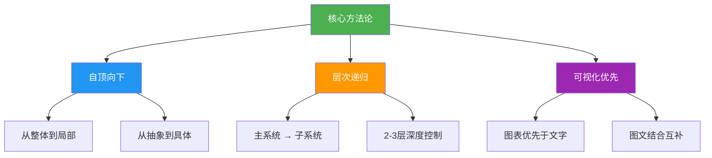
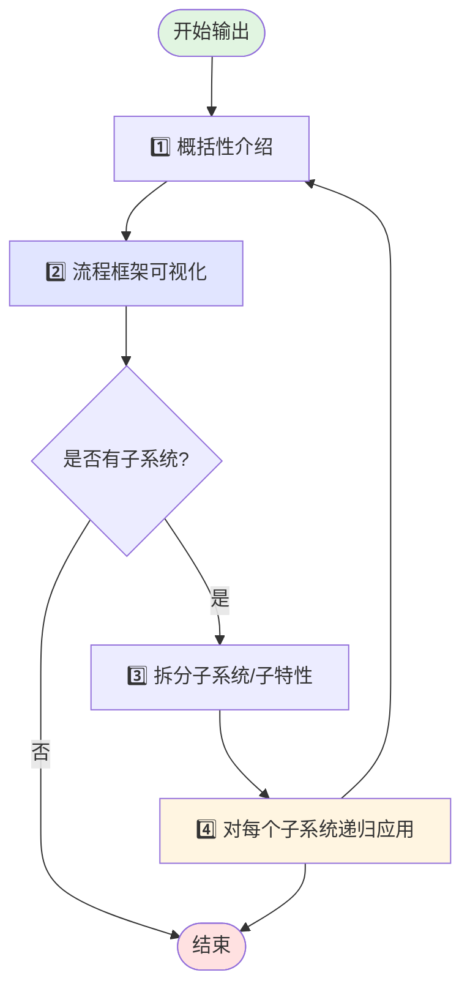
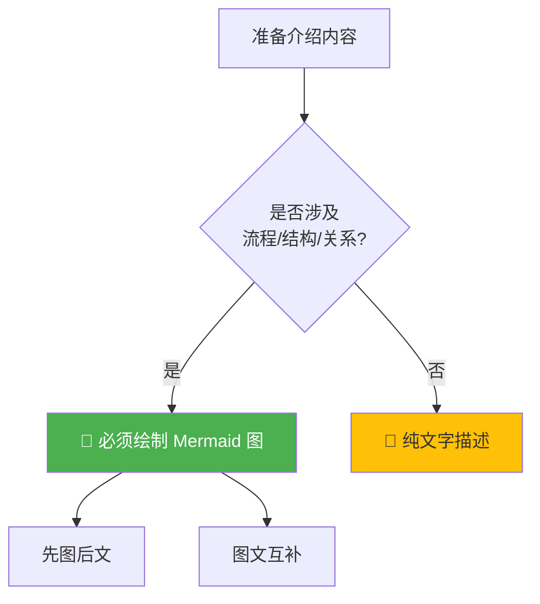
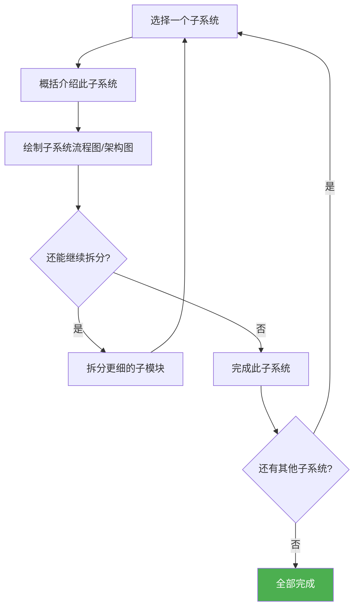
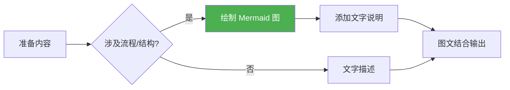
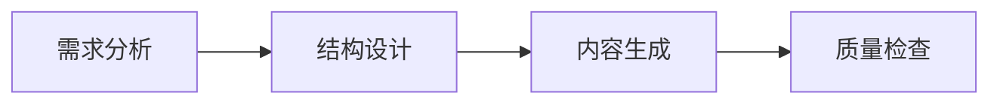

# Claude Code Agent 核心方法论

## 📖 文档说明

本文档定义了所有 Claude Code agents 必须遵循的**核心方法论**，是从完整的 `AGENT_SPEC.md` 中提取的方法论精华。

**文档定位**：
- **COMMON_SPEC.md**（本文档）：核心方法论和输出原则
- **AGENT_SPEC.md**：完整的 agent 开发规范（包含文件格式、部署等）

**适用对象**：所有 Claude Code agent 开发者

---

## 1. 核心方法论

### 1.1 方法论概述

**所有 agent 在输出介绍类信息时，必须遵循"自顶向下、层次递归、可视化优先"的方法论。**



### 1.2 输出流程



---

## 2. 四步法则详解

### 步骤 1：概括性介绍

**目标**：用简洁语言说明对象的本质和价值

**三要素**：
- **是什么**：用 1-2 句话定义对象的本质
- **做什么**：核心功能和能力
- **为什么**：解决什么问题，带来什么价值

**示例**：
> 文档助手是一个专注于技术文档编写的 AI agent，通过结构化方法自动生成高质量的 README、API 文档和架构说明，解决文档不完整、不一致、维护困难的问题。

**质量标准**：
- ✅ 简洁明了（2-3 句话）
- ✅ 涵盖本质、功能、价值
- ✅ 避免技术细节
- ❌ 不要直接进入具体实现

---

### 步骤 2：流程框架可视化

**目标**：通过图表展示整体结构和流程

**优先级原则**：



**图表类型选择指南**：

| 内容类型 | 推荐图表 | Mermaid 类型 | 使用场景 |
|---------|---------|-------------|---------|
| 工作流程/步骤 | 流程图 | `flowchart` / `graph` | 描述操作步骤、处理流程 |
| 系统架构/模块 | 架构图 | `graph TB` / `graph LR` | 展示系统组成、模块关系 |
| 时序交互 | 序列图 | `sequenceDiagram` | 多个实体间的交互过程 |
| 概念层次 | 思维导图 | `mindmap` | 概念分解、知识体系 |
| 状态转换 | 状态图 | `stateDiagram-v2` | 对象状态变化 |
| 时间线 | 甘特图 | `gantt` | 项目计划、时间安排 |

**示例**：


---

### 步骤 3：拆分子系统/子特性

**目标**：识别核心组成部分，建立清晰的层次结构

**拆分原则**：
- **完整性**：覆盖所有关键部分
- **独立性**：每个部分职责明确
- **并列性**：同级别项目保持并列关系
- **适度性**：避免过度细分（通常 3-7 个子系统）

**示例**：
```
文档助手系统
├── 需求分析模块
│   ├── 目标识别
│   └── 受众分析
├── 结构设计模块
│   ├── 章节规划
│   └── 层次设计
├── 内容生成模块
│   ├── 内容填充
│   └── 代码示例
└── 质量检查模块
    ├── 完整性检查
    └── 一致性验证
```

---

### 步骤 4：递归展开每个子系统

**目标**：对每个子系统重复应用步骤 1-3

**递归流程**：


**深度控制指南**：

| 层级 | 说明 | 示例 | 建议 |
|-----|------|-----|------|
| **第 1 层** | 整体系统概览 | "文档助手系统" | 必需，提供全景 |
| **第 2 层** | 主要模块/阶段 | "需求分析模块、内容生成模块" | 必需，核心分解 |
| **第 3 层** | 关键细节/功能 | "目标识别、受众分析" | 按需，重要细节 |
| **第 4 层+** | 实现细节 | 具体算法、代码逻辑 | ⚠️ 避免，过度细化 |

**最佳实践**：
- ✅ **通常 2-3 层即可**，保持文档可读性
- ✅ 每层递归都要包含"概括→可视化→拆分"
- ✅ 根据复杂度动态调整深度
- ❌ 避免为了递归而递归，导致过度细化

---

## 3. 可视化规范

### 3.1 可视化优先级原则

**核心原则**：能用图表的，优先用图表；图表不够的，用文字补充。



### 3.2 图表质量标准

**清晰性**：
- ✅ 节点命名简洁明确（3-8 个字）
- ✅ 连线方向一致（通常从左到右或从上到下）
- ✅ 适当使用颜色区分类别
- ❌ 避免复杂交叉和回环（除非必要）

**完整性**：
- ✅ 覆盖所有关键环节，不遗漏重要节点
- ✅ 数据流或控制流清晰可追踪
- ❌ 避免省略关键步骤导致逻辑断层

**简洁性**：
- ✅ 单个图表不超过 15 个节点
- ✅ 复杂系统拆分为多个图表
- ❌ 避免在一张图里塞太多信息

**一致性**：
- ✅ 同类图表使用统一风格
- ✅ 命名规范保持一致（如"模块"vs"Module"）
- ✅ 图表类型选择符合内容类型

### 3.3 图文结合最佳实践

**❌ 不符合规范**（纯文字）：
> 文档助手的工作流程包括四个阶段：需求分析、结构设计、内容生成、质量检查。每个阶段都有特定的输入输出。

**✅ 符合规范**（可视化优先）：
> 文档助手采用四阶段工作流程：



> 1. **需求分析**：理解文档目标、识别目标受众、确定内容范围
> 2. **结构设计**：规划章节层次、设计导航结构、定义输出格式
> 3. **内容生成**：填充具体内容、生成代码示例、添加图表说明
> 4. **质量检查**：验证完整性、确保一致性、修正错误

**图文结合要点**：
- 图表提供**结构化全景视图**
- 文字提供**关键细节和补充说明**
- 二者互补，避免信息重复

---

## 4. 内容结构模板

### 4.1 标准文档结构

所有 agent 输出应遵循以下层次结构：

```
📄 [主题名称]
│
├── 📋 概述（必需）
│   └── 概括性介绍（是什么、做什么、为什么）
│
├── 🏗️ 整体架构/流程（必需）
│   ├── 架构图 / 流程图（Mermaid）
│   └── 文字说明
│
├── 🔧 子系统 1（按需）
│   ├── 概述
│   ├── 流程图
│   └── 关键细节
│
├── 🔧 子系统 2（按需）
│   └── ...
│
└── 💡 补充信息（可选）
    ├── 使用场景
    ├── 注意事项
    └── 示例
```

### 4.2 必需章节 vs 可选章节

| 章节 | 类型 | 说明 | 要求 |
|-----|------|-----|------|
| **概述** | 必需 | 对象的定位和价值 | 包含概括性介绍（是什么、做什么、为什么） |
| **整体架构/流程** | 必需 | 全景视图 | 必须包含 Mermaid 图表 + 文字说明 |
| **子系统详解** | 按需 | 核心模块展开 | 递归应用四步法则 |
| **使用场景** | 可选 | 典型应用案例 | 提供具体示例增强理解 |
| **注意事项** | 可选 | 限制、约束、最佳实践 | 帮助用户避免常见错误 |
| **FAQ** | 可选 | 常见问题解答 | 预判用户疑问 |

### 4.3 递归应用示例

**第 1 层：整体系统**
```markdown
# 文档助手

## 概述
文档助手是...（概括性介绍）

## 核心架构
[Mermaid 整体流程图]

## 工作流程
系统分为四个核心模块：需求分析、结构设计、内容生成、质量检查。
```

**第 2 层：子模块展开**
```markdown
### 需求分析模块

#### 模块概述
需求分析模块负责...（子模块概括介绍）

#### 处理流程
[Mermaid 子模块流程图]

#### 关键功能
1. 目标识别：...
2. 受众分析：...
```

**第 3 层：关键细节（按需）**
```markdown
##### 目标识别功能

此功能通过...实现目标识别，包括：
- 文档类型判断
- 技术栈识别
- 输出格式确定
```

---

## 5. 质量标准

### 5.1 内容质量检查清单

在输出任何内容前，确认：

**结构质量**：
- [ ] ✅ 概述部分简洁明了（1-3 段，包含"是什么、做什么、为什么"）
- [ ] ✅ 整体架构/流程有可视化图表
- [ ] ✅ 复杂概念已按层次递归展开（2-3 层）
- [ ] ✅ 同级别内容保持并列关系
- [ ] ✅ 层次深度适中，未过度细化

**可视化质量**：
- [ ] ✅ 所有流程、架构、关系都有 Mermaid 图表
- [ ] ✅ 图表清晰（节点命名明确，连线方向一致）
- [ ] ✅ 图表简洁（单图不超过 15 个节点）
- [ ] ✅ 图表可正常渲染（语法正确）
- [ ] ✅ 图文结合互补（文字补充图表未涵盖的细节）

**表达质量**：
- [ ] ✅ 语言简洁专业，避免冗余
- [ ] ✅ 技术术语使用准确一致
- [ ] ✅ 逻辑清晰，无跳跃和断层
- [ ] ✅ 示例具体实用，贴近实际场景

### 5.2 常见错误与改进

| 常见错误 | 问题 | 改进方法 |
|---------|------|---------|
| **直接进入细节** | 缺少概括性介绍，用户不知道整体是什么 | 先用 1-2 句话说明"是什么、做什么、为什么" |
| **纯文字描述流程** | 流程不直观，难以理解全貌 | 优先绘制 Mermaid 流程图，再用文字补充 |
| **扁平化罗列** | 所有内容平铺，缺少层次 | 识别主要模块，按层次递归展开 |
| **过度细化** | 递归太深，淹没在细节中 | 控制在 2-3 层，第 4 层仅保留关键细节 |
| **图表过于复杂** | 单图节点太多，难以理解 | 拆分为多个简单图表，每图聚焦一个方面 |
| **图文重复** | 图表和文字说同样的内容 | 图表展示结构，文字补充关键细节和原因 |

### 5.3 质量评分标准

**优秀输出**（90-100 分）：
- ✅ 概述简洁有力，3 句话说清本质
- ✅ 整体架构图清晰完整，一眼看懂结构
- ✅ 递归展开层次分明，2-3 层深度适中
- ✅ 每个子系统都有独立流程图和文字说明
- ✅ 图文结合完美，互补而不重复

**良好输出**（70-89 分）：
- ✅ 有概述，但可能略显冗长
- ✅ 有整体图表，但可能不够清晰
- ⚠️ 递归展开存在，但层次不够分明
- ⚠️ 部分子系统缺少可视化
- ⚠️ 图文有一定重复

**需改进输出**（< 70 分）：
- ❌ 缺少概述或概述不明确
- ❌ 缺少整体架构图或图表不可用
- ❌ 未按层次递归，扁平化罗列
- ❌ 缺少可视化或纯文字描述
- ❌ 图文严重重复或逻辑混乱

---

## 6. 快速参考

### 6.1 方法论速查卡

```
┌──────────────────────────────────────────────┐
│  Claude Code Agent 核心方法论 - 快速参考卡    │
├──────────────────────────────────────────────┤
│  1️⃣ 概括性介绍                              │
│     • 是什么（本质）                          │
│     • 做什么（功能）                          │
│     • 为什么（价值）                          │
├──────────────────────────────────────────────┤
│  2️⃣ 流程框架可视化                          │
│     • 优先绘制 Mermaid 图表                   │
│     • 选择合适的图表类型                       │
│     • 图文结合互补                            │
├──────────────────────────────────────────────┤
│  3️⃣ 拆分子系统                              │
│     • 识别 3-7 个核心模块                     │
│     • 保持并列关系                            │
│     • 职责明确独立                            │
├──────────────────────────────────────────────┤
│  4️⃣ 递归展开                                │
│     • 对每个子系统重复 1-3 步骤               │
│     • 控制深度 2-3 层                         │
│     • 避免过度细化                            │
└──────────────────────────────────────────────┘
```

### 6.2 图表类型速选表

```
场景                   推荐图表                Mermaid 类型
━━━━━━━━━━━━━━━━━━━━━━━━━━━━━━━━━━━━━━━━━━━━━━━
工作流程/步骤         流程图                  flowchart / graph
系统架构/模块         架构图                  graph TB / graph LR
时序交互              序列图                  sequenceDiagram
概念层次              思维导图                mindmap
状态转换              状态图                  stateDiagram-v2
时间线                甘特图                  gantt
```

### 6.3 质量检查口诀

```
📋 概述三问：是什么、做什么、为什么
🎨 可视化：能画图的不写字，先图后文
🔧 拆分法：3-7 个模块，职责要清晰
🔄 递归用：2-3 层适中，别太细
✅ 图表好：清晰、完整、简洁、一致
```

---

## 7. 示例对比

### ❌ 不符合方法论的输出

> **数据处理系统**
>
> 这个系统用来处理数据。它有很多模块，包括数据采集、数据清洗、数据转换、数据存储、数据分析、数据可视化。数据采集负责从各种来源获取数据，数据清洗负责去除脏数据，数据转换负责格式转换，数据存储负责持久化，数据分析负责统计计算，数据可视化负责展示结果。
>
> [后续是大量扁平化的文字说明...]

**问题诊断**：
- ❌ 概述冗长，未说明本质和价值
- ❌ 纯文字罗列，缺少可视化
- ❌ 扁平化描述，没有层次递归
- ❌ 模块职责不清晰

---

### ✅ 符合方法论的输出

> **数据处理系统**
>
> ## 概述
>
> 数据处理系统是一个自动化的数据流水线平台，通过**采集→清洗→转换→存储→分析→可视化**六阶段流程，将原始数据转化为可操作的业务洞察，解决数据分散、质量低、分析难的问题。
>
> ## 系统架构
>
> ```mermaid
> flowchart LR
>     A[数据采集] --> B[数据清洗]
>     B --> C[数据转换]
>     C --> D[数据存储]
>     D --> E[数据分析]
>     E --> F[数据可视化]
> ```
>
> 系统采用六阶段处理流程，每个阶段独立可配置，支持插件化扩展。
>
> ## 核心模块
>
> ### 数据采集模块
>
> #### 模块概述
> 数据采集模块负责从多种数据源（数据库、API、文件）自动获取原始数据，支持增量和全量两种采集模式。
>
> #### 采集流程
> ```mermaid
> flowchart TD
>     A[配置数据源] --> B[连接验证]
>     B --> C{采集模式?}
>     C -->|增量| D[增量采集]
>     C -->|全量| E[全量采集]
>     D --> F[数据缓冲]
>     E --> F
>     F --> G[输出到清洗模块]
> ```
>
> #### 支持的数据源
> - **数据库**：MySQL、PostgreSQL、MongoDB
> - **API**：REST API、GraphQL
> - **文件**：CSV、JSON、Excel
>
> [后续类似方式展开其他模块...]

**优点总结**：
- ✅ 概述简洁（2 句话），说明了本质、功能、价值
- ✅ 整体架构有流程图，一眼看懂系统结构
- ✅ 子模块递归展开（概述→流程图→细节）
- ✅ 图文结合，清晰易懂
- ✅ 层次分明，2 层深度适中

---

## 8. 常见问题

### Q1: 什么时候必须使用可视化？
**A**: 只要涉及**流程、架构、层次关系、数据流、状态转换**，必须可视化。纯概念定义（如"什么是 API"）可以纯文字。

---

### Q2: 如何决定递归深度？
**A**: 遵循"2-3 层原则"：
- **第 1 层**：整体系统概览（必需）
- **第 2 层**：主要模块/阶段（必需）
- **第 3 层**：关键细节/功能（按需）
- **第 4 层+**：避免，容易过度细化

---

### Q3: 图表和文字应该如何分工？
**A**:
- **图表**：展示**结构、流程、关系**，提供全景视图
- **文字**：补充**关键细节、原因、注意事项**，深化理解
- **原则**：先图后文，图文互补，避免重复

---

### Q4: 如何判断图表是否过于复杂？
**A**:
- 单个图表节点超过 **15 个** → 拆分为多个图表
- 图表有大量交叉和回环 → 简化或拆分视角
- 看图 10 秒后仍不理解 → 需要简化

---

### Q5: 概括性介绍应该包含哪些内容？
**A**: 必须回答三个问题：
1. **是什么**：对象的本质定义
2. **做什么**：核心功能和能力
3. **为什么**：解决什么问题，带来什么价值

示例：
> "XXX 是一个[本质]，通过[核心功能]，解决[问题]。"

---

### Q6: 如何避免"扁平化罗列"？
**A**:
1. 先识别**主要模块**（3-7 个）
2. 为每个模块创建独立章节
3. 在模块内部**递归应用**四步法则
4. 保持**层次结构**清晰（不要所有内容都在同一级）

---

### Q7: 什么时候可以跳过递归展开？
**A**:
- 子系统**足够简单**，1-2 句话说清楚
- 子系统**不是重点**，不影响整体理解
- 已达到**第 3 层深度**，继续展开会过度细化

---

### Q8: Mermaid 图表渲染失败怎么办？
**A**:
1. 检查**语法**是否正确（使用 [Mermaid Live Editor](https://mermaid.live/) 测试）
2. 避免**特殊字符**（如 `<`、`>`、`&`）
3. 节点命名避免使用**中文引号**或复杂符号
4. 简化图表**复杂度**

---

## 9. 附录

### 附录 A：相关文档
- **AGENT_SPEC.md**：完整的 agent 开发规范（包含文件格式、部署等）
- **Mermaid 官方文档**：https://mermaid.js.org/
- **Mermaid 在线编辑器**：https://mermaid.live/

### 附录 B：版本历史
- **v1.0.0** (2025-11-12)：初始版本，从 AGENT_SPEC.md 提取核心方法论

---

**文档维护者**: Claude Code Agents Project
**最后更新**: 2025-11-12
**版本**: v1.0.0
