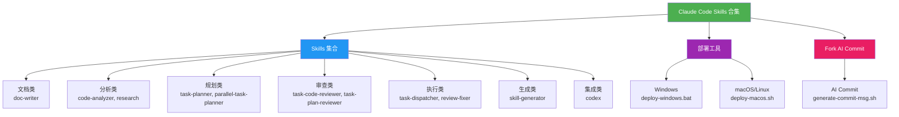
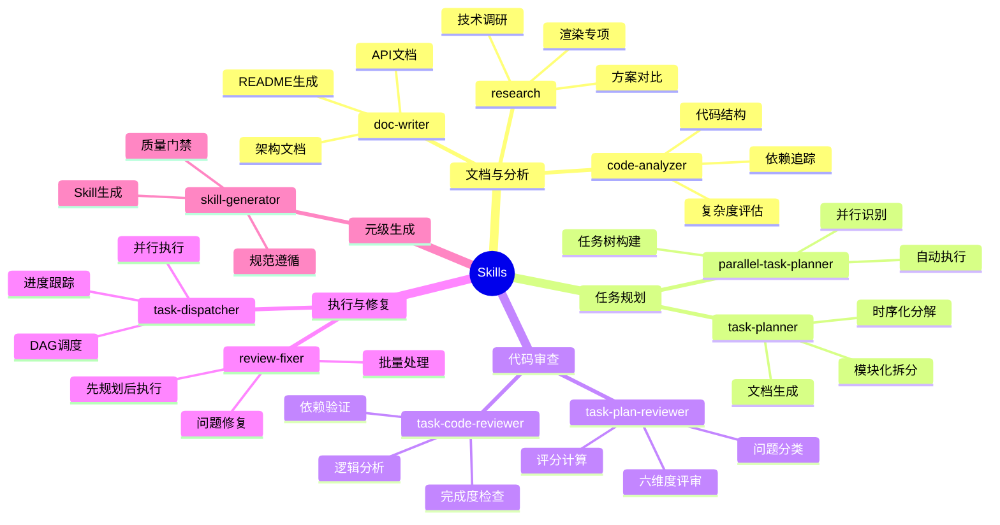
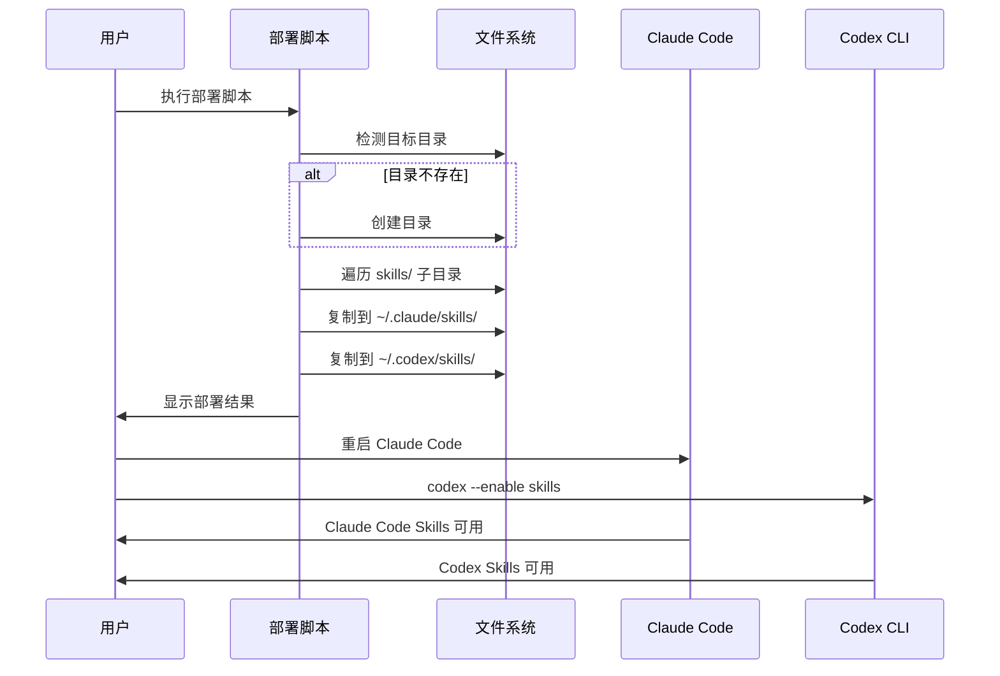

# Claude Code Skills 合集

## 概述

**Claude Code Skills 合集**是一个精选的 AI skill 描述文件库，为 Claude Code 提供专业化的工作助手。通过精准的关键词触发机制和标准化的规范体系，确保每个 skill 都能在合适的场景自动激活，提供高质量、一致的输出。

**核心价值**：
- **精准触发**：基于关键词自动激活对应 skill
- **标准化**：统一的输出格式和质量规范
- **开箱即用**：一键部署到本地 Claude Code 环境
- **可扩展**：遵循规范即可快速添加新 skill

## 项目架构



---

## 快速开始

### 1. 克隆项目

```bash
git clone https://github.com/JIA-ss/agents.git
cd agents
```

### 2. 部署到本地

#### Windows

```bash
devops\deploy-windows.bat
```

#### macOS/Linux

```bash
chmod +x devops/deploy-macos.sh
./devops/deploy-macos.sh
```

### 3. 重启 Claude Code

重启 Claude Code 以加载新的 skill 配置。

### 4. 使用 Skill

Skills 会根据对话内容中的关键词自动触发。例如：
- 提到"写文档"、"生成 README" → 自动激活 doc-writer
- 提到"任务规划"、"拆分任务" → 自动激活 task-planner
- 提到"分析代码"、"追踪依赖" → 自动激活 code-analyzer

---

## SKILL.md 文件格式

### 标准格式

每个 skill 以独立目录存放，包含 `SKILL.md` 文件：

```
skills/
└── skill-name/
    └── SKILL.md
```

### Frontmatter 格式

```markdown
---
name: skill-name
description: Use when the user asks to "keyword1", "keyword2", mentions "keyword3", or needs help with specific-task. Also responds to "中文关键词1", "中文关键词2".
---

# Skill Name Guide

## Overview
...
```

### 必需字段

| 字段 | 说明 | 示例 |
|------|------|------|
| `name` | Skill 名称（对应目录名） | `doc-writer` |
| `description` | 触发关键词描述（中英文） | `Use when the user asks to "write documentation"... Also responds to "写文档"` |

**注意**: Skills 不需要 `model` 字段，Claude Code 会自动选择合适的模型。

---

## Skill 集合

### 概览



### 详细说明

| Skill | 目录 | 核心功能 | 触发关键词 |
|-------|------|----------|------------|
| **doc-writer** | `skills/doc-writer/` | 技术文档编写、README 生成 | write documentation, 写文档, 生成 README |
| **code-analyzer** | `skills/code-analyzer/` | 代码结构分析、依赖追踪、可视化 | analyze code, 分析代码, 梳理逻辑 |
| **research** | `skills/research/` | 技术调研、方案对比、渲染专项 | research technology, 技术调研, 技术选型 |
| **task-planner** | `skills/task-planner/` | 大型任务规划、模块化拆分 | plan a task, 任务规划, 拆分任务 |
| **parallel-task-planner** | `skills/parallel-task-planner/` | 并行任务识别、任务树构建 | plan parallel tasks, 并行任务规划 |
| **task-code-reviewer** | `skills/task-code-reviewer/` | 基于规划的代码审查 | review code against plan, 代码审查 |
| **task-plan-reviewer** | `skills/task-plan-reviewer/` | 任务规划文档评审 | review task plan, 评审任务计划 |
| **task-dispatcher** | `skills/task-dispatcher/` | DAG 调度、并行执行 | execute task plan, 执行任务, 任务调度 |
| **review-fixer** | `skills/review-fixer/` | 审查问题自动修复 | fix review issues, 修复审查问题 |
| **skill-generator** | `skills/skill-generator/` | 元级 Skill 生成 | create a skill, 创建 skill |
| **codex** | `skills/codex/` | Codex CLI 集成 | run Codex CLI, codex exec |

---

## 部署工具

### 部署流程



### 目标路径

部署脚本会同时部署到 Claude Code 和 Codex CLI 两个环境：

| 操作系统 | Claude Code | Codex CLI |
|---------|-------------|-----------|
| **Windows** | `%USERPROFILE%\.claude\skills\` | `%USERPROFILE%\.codex\skills\` |
| **macOS** | `~/.claude/skills/` | `~/.codex/skills/` |
| **Linux** | `~/.claude/skills/` | `~/.codex/skills/` |

> **提示**: Codex CLI 需要启用 skills 功能: `codex --enable skills`

---

## 目录结构

```
agents/
├── README.md                    # 本文档
├── skills/                      # Skill 文件目录
│   ├── doc-writer/
│   │   └── SKILL.md
│   ├── code-analyzer/
│   │   └── SKILL.md
│   ├── research/
│   │   └── SKILL.md
│   ├── task-planner/
│   │   └── SKILL.md
│   ├── parallel-task-planner/
│   │   └── SKILL.md
│   ├── task-code-reviewer/
│   │   └── SKILL.md
│   ├── task-plan-reviewer/
│   │   └── SKILL.md
│   ├── task-dispatcher/
│   │   └── SKILL.md
│   ├── review-fixer/
│   │   └── SKILL.md
│   ├── skill-generator/
│   │   └── SKILL.md
│   └── codex/
│       └── SKILL.md
├── devops/                      # DevOps 工具目录
│   ├── deploy-windows.bat       # Windows 部署脚本
│   └── deploy-macos.sh          # macOS/Linux 部署脚本
├── .fork/                       # Fork AI Commit 插件
│   ├── custom-commands.json
│   ├── generate-commit-msg.sh
│   └── AI-Commit.md
└── .claude/                     # Claude Code 配置
    └── settings.local.json
```

---

## 如何添加新 Skill

### 步骤

1. **创建目录**：在 `skills/` 下创建新的子目录
2. **创建文件**：在子目录中创建 `SKILL.md` 文件
3. **编写 Frontmatter**：
   - `name`: 与目录名一致
   - `description`: 包含中英文触发关键词
4. **编写内容**：
   - Overview（概述）
   - Workflow（工作流程）
   - Core Rules（核心规则，可选）
   - Output Requirements（输出要求，可选）
   - Best Practices（最佳实践）
5. **部署测试**：执行部署脚本
6. **验证触发**：在 Claude Code 中测试关键词触发

---

## 常见问题

### Q1: Skill 部署后没有生效？

**A**:
1. 确认部署脚本执行成功
2. 重启 Claude Code
3. 检查 `~/.claude/skills/` 目录下是否有对应的 SKILL.md 文件

### Q2: 如何知道某个 skill 是否已部署？

**A**: 执行部署脚本后会显示已部署的 skills 列表。也可以检查：

**Claude Code**:
- **Windows**: `%USERPROFILE%\.claude\skills\`
- **macOS/Linux**: `~/.claude/skills/`

**Codex CLI**:
- **Windows**: `%USERPROFILE%\.codex\skills\`
- **macOS/Linux**: `~/.codex/skills/`

### Q3: 修改 skill 文件后需要重新部署吗？

**A**: 是的。修改后重新执行部署脚本，覆盖旧文件。

### Q4: 如何添加中文触发关键词？

**A**: 在 `description` 字段末尾添加：`Also responds to "中文关键词1", "中文关键词2".`

---

## 相关资源

- **Claude Code 官方文档**: [https://docs.anthropic.com/claude/docs](https://docs.anthropic.com/claude/docs)
- **Mermaid 文档**: [https://mermaid.js.org/](https://mermaid.js.org/)
- **GitHub Flavored Markdown**: [https://github.github.com/gfm/](https://github.github.com/gfm/)

---

## 许可证

本项目采用 [MIT License](LICENSE)。

---

**最后更新**: 2025-12-20
**版本**: v2.1.0
