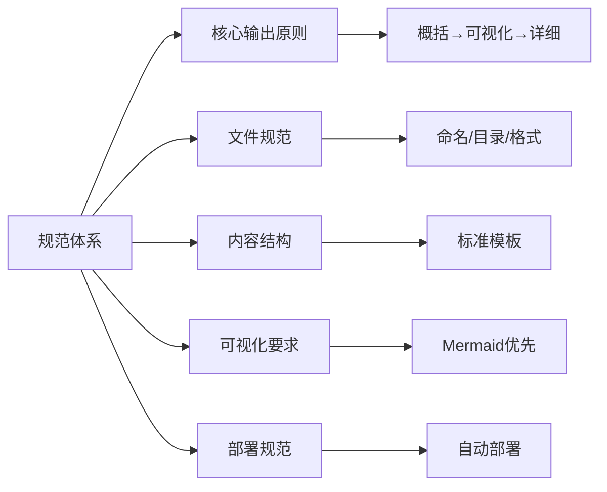
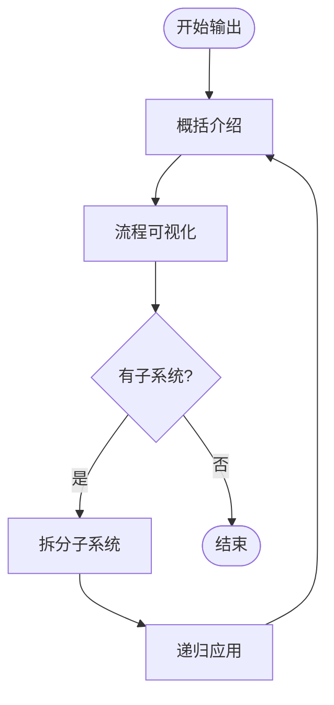
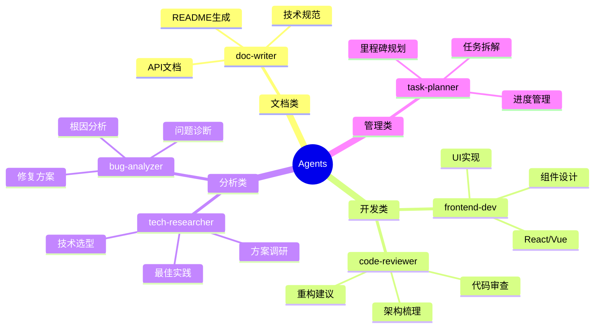
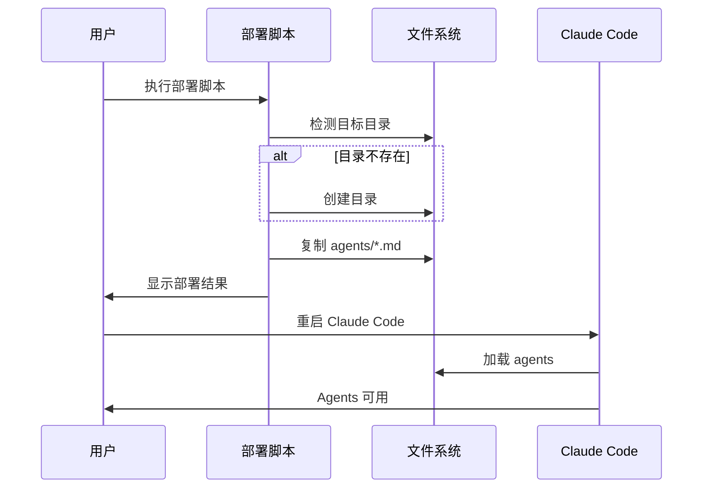
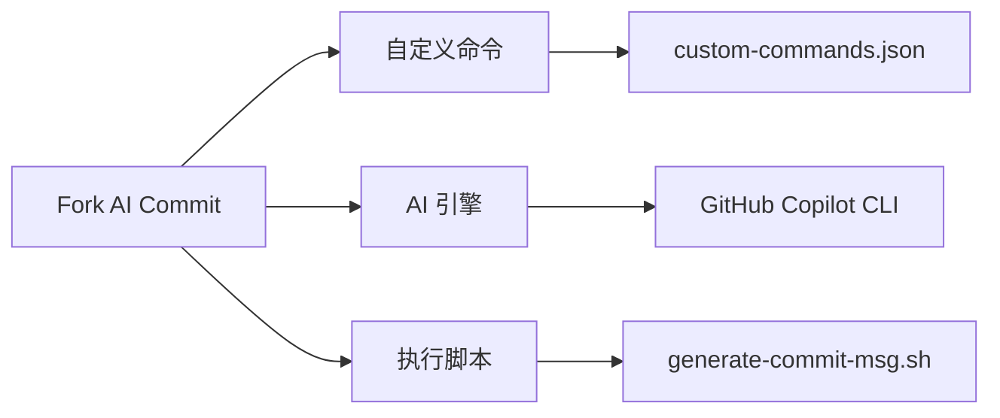
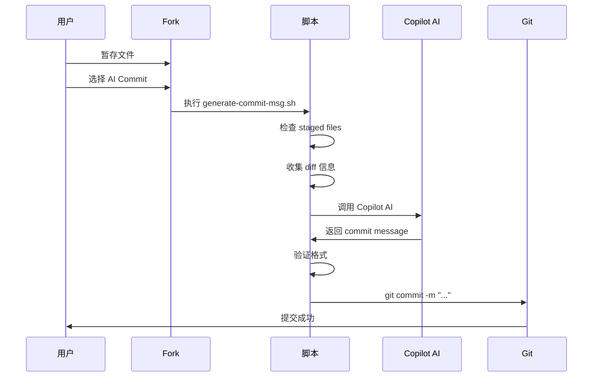
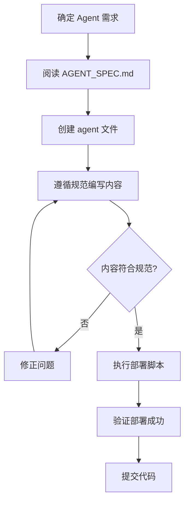

# Claude Code Agents 合集

## 概述

**Claude Code Agents 合集**是一个精选的 AI agent 描述文件库，为 Claude Code 提供专业化的工作助手。通过标准化的规范体系，确保每个 agent 都能提供高质量、一致的输出，解决日常开发工作中的重复性任务、文档编写、技术调研、代码分析等问题。

**核心价值**：
- 🎯 **专业化**：每个 agent 专注特定领域，深度优化
- 📐 **标准化**：统一的输出格式和质量规范
- 🚀 **开箱即用**：一键部署到本地 Claude Code 环境
- 🔄 **可扩展**：遵循规范即可快速添加新 agent

## 项目架构

```mermaid
graph TB
    A[Claude Code Agents 合集] --> B[规范体系]
    A --> C[Agent 集合]
    A --> D[部署工具]
    A --> E[Fork AI Commit]

    B --> B1[AGENT_SPEC.md<br/>开发规范]
    B --> B2[输出原则<br/>层次化/可视化]
    B --> B3[质量标准<br/>一致性保障]

    C --> C1[文档助手<br/>doc-writer.md]
    C --> C2[前端开发<br/>frontend-dev.md]
    C --> C3[技术调研<br/>tech-researcher.md]
    C --> C4[任务规划<br/>task-planner.md]
    C --> C5[代码梳理<br/>code-reviewer.md]
    C --> C6[Bug分析<br/>bug-analyzer.md]

    D --> D1[Windows<br/>devops/deploy-windows.bat]
    D --> D2[macOS<br/>devops/deploy-macos.sh]
    D --> D3[自动化<br/>验证机制]

    E --> E1[AI Commit<br/>generate-commit-msg.sh]
    E --> E2[Fork 插件<br/>custom-commands.json]
    E --> E3[GitHub Copilot<br/>AI 引擎]

    style A fill:#4CAF50,color:#fff
    style B fill:#2196F3,color:#fff
    style C fill:#FF9800,color:#fff
    style D fill:#9C27B0,color:#fff
    style E fill:#E91E63,color:#fff
```



---

## 快速开始

### 1. 克隆项目

```bash
git clone https://github.com/JIA-ss/agents.git
cd agents
```

### 2. 部署到本地

#### Windows

```bash
devops\deploy-windows.bat
```

#### macOS/Linux

```bash
chmod +x devops/deploy-macos.sh
./devops/deploy-macos.sh
```

### 3. 重启 Claude Code

重启 Claude Code 以加载新的 agent 配置。

### 4. 使用 Agent

在 Claude Code 中，通过指定 agent 名称来调用相应的助手（具体使用方式参考 Claude Code 官方文档）。

---

## Agent 文件格式要求

### ⚠️ 重要：Frontmatter 强制要求

**所有 agent 文件必须在顶部包含 YAML frontmatter，否则 Claude Code 将无法识别。**

#### 标准格式

```markdown
---
name: agent-name
description: Agent 的简短描述（1-2 句话）
model: sonnet
---

# Agent 名称

## 概述
...
```

#### 必需字段说明

| 字段 | 说明 | 示例值 |
|------|------|--------|
| `name` | Agent 名称（对应文件名，不含 .md 后缀） | `doc-writer` |
| `description` | 简短描述（说明核心功能） | `专注于技术文档编写的 AI agent` |
| `model` | Claude 模型名称 | `sonnet`, `opus`, `haiku` |

#### 命名规范

- **文件名**：全小写，单词用连字符 `-` 分隔，`.md` 后缀
- **name 字段**：与文件名一致（不含 `.md`）
- **示例**：文件名 `doc-writer.md` → name: `doc-writer`

#### 自动化工具

如果你的 agent 文件缺少 frontmatter，可以使用自动化工具添加：

**Windows**:
```bash
devops\add-frontmatter.bat
```

**macOS/Linux**:
```bash
chmod +x devops/add-frontmatter.sh
./devops/add-frontmatter.sh
```

#### 验证工具

部署前验证所有 agent 文件是否符合规范：

**Windows**:
```bash
devops\validate-agents.bat
```

**macOS/Linux**:
```bash
chmod +x devops/validate-agents.sh
./devops/validate-agents.sh
```

更多详细规范请参考 [AGENT_SPEC.md](AGENT_SPEC.md) § 2.4 章节。

---

## 子系统详解

### 📐 规范体系

#### 概述
规范体系是本项目的核心基础，定义了所有 agent 的创建、编写和部署标准，确保输出质量和一致性。

#### 架构



#### 核心原则

**输出方法论**（详见 `AGENT_SPEC.md`）：

1. **概括性介绍**：先说明"是什么、做什么、为什么"
2. **流程框架可视化**：优先绘制 Mermaid 图表，再文字描述
3. **拆分子系统**：识别核心组成部分
4. **递归展开**：对每个子系统重复以上步骤

**示例流程**：


#### 规范文档

| 文档 | 说明 |
|------|------|
| **AGENT_SPEC.md** | 完整的开发规范，包含命名、结构、可视化、部署等所有标准 |

---

### 🤖 Agent 集合

#### 概述
Agent 集合包含多个专业领域的 AI 助手，每个 agent 都遵循统一规范，提供高质量的专业化服务。

#### Agent 列表



#### 详细说明

| Agent     | 文件名                  | 核心功能                    | 适用场景           |
| --------- | -------------------- | ----------------------- | -------------- |
| **文档助手**  | `doc-writer.md`      | 技术文档编写、README 生成、注释补充   | 项目文档缺失、需要规范化文档 |
| **前端开发**  | `frontend-dev.md`    | React/Vue 开发、UI 实现、组件设计 | 前端功能开发、组件封装    |
| **技术调研**  | `tech-researcher.md` | 技术选型、方案调研、最佳实践研究        | 新技术评估、架构设计前期   |
| **任务规划**  | `task-planner.md`    | 需求拆解、里程碑规划、进度管理         | 项目启动、复杂任务分解    |
| **代码梳理**  | `code-reviewer.md`   | 代码审查、架构分析、重构建议          | 代码质量提升、技术债务清理  |
| **Bug分析** | `bug-analyzer.md`    | 问题诊断、根因分析、修复方案          | 故障排查、性能问题定位    |

#### 使用示例

**场景 1：新项目启动**
1. 使用 **任务规划 agent** 拆解需求
2. 使用 **技术调研 agent** 选型技术栈
3. 使用 **前端开发 agent** 实现功能
4. 使用 **文档助手 agent** 生成 README

**场景 2：代码质量提升**
1. 使用 **代码梳理 agent** 审查现有代码
2. 使用 **Bug分析 agent** 定位已知问题
3. 使用 **前端开发 agent** 实施重构

---

### 🚀 部署工具

#### 概述
部署工具提供一键式自动化部署，将 agent 文件复制到 Claude Code 本地配置目录，无需手动操作。

#### 部署流程



#### 部署脚本

##### Windows (`devops/deploy-windows.bat`)

**功能**：
- 检测 `%USERPROFILE%\.claude\agents\` 目录
- 自动创建目录（如不存在）
- 复制所有 `agents/*.md` 文件
- 显示部署结果和文件列表

**使用**：
```batch
devops\deploy-windows.bat
```

##### macOS/Linux (`devops/deploy-macos.sh`)

**功能**：
- 检测 `~/.claude/agents/` 目录
- 自动创建目录（如不存在）
- 复制所有 `agents/*.md` 文件
- 添加执行权限
- 显示部署结果和文件列表

**使用**：
```bash
chmod +x devops/deploy-macos.sh
./devops/deploy-macos.sh
```

#### 目标路径

| 操作系统 | 部署路径 |
|---------|---------|
| **Windows** | `%USERPROFILE%\.claude\agents\` |
| **macOS** | `~/.claude/agents/` |
| **Linux** | `~/.claude/agents/` |

---

### 🤖 Fork AI Commit

#### 概述
Fork AI Commit 是集成在 Fork Git Client 中的 AI commit message 生成工具，通过 GitHub Copilot 智能分析代码变更，自动生成规范的 commit message 并完成提交。

#### 架构



#### 核心功能

**AI 智能生成**：
- 分析 staged 文件的代码变更
- 自动生成符合规范的 commit message
- 格式：`<type>: <summary>\n\nwhat: ...\n\nwhy: ...`

**一键提交**：
- 自动执行 `git commit`
- 无需手动编写 commit message
- 支持跨平台（Windows/macOS/Linux）

**Commit 格式规范**：
```
<type>: <summary>

what: <what was changed>

why: <why it was changed>
```

**Type 类型**：`feat`、`fix`、`refactor`、`chore`、`perf`、`style`、`docs`、`test`

#### 使用方法

**前置要求**：
1. 安装 GitHub Copilot CLI：
   ```bash
   npm install -g @githubnext/github-copilot-cli
   ```
2. GitHub Copilot 订阅（约 $10/月）

**在 Fork Git Client 中**：
1. 暂存要提交的文件（勾选）
2. 右键点击仓库
3. 选择 "🤖 AI Commit Message (Copilot)"
4. 点击"生成"
5. AI 自动分析并创建 commit

**在命令行中**：
```bash
git add .
bash .fork/generate-commit-msg.sh
```

#### 工作原理



#### 文件说明

| 文件 | 说明 |
|------|------|
| `.fork/custom-commands.json` | Fork 自定义命令配置 |
| `.fork/generate-commit-msg.sh` | AI Commit 核心脚本 |
| `.fork/AI-Commit.md` | 详细使用文档 |
| `.fork/.gitattributes` | 确保脚本使用 LF 行尾 |

#### 详细文档

完整的使用指南、示例、故障排除和最佳实践，请参考：
- `.fork/README.md` - 快速入门指南
- `.fork/AI-Commit.md` - 详细使用文档

---

## 目录结构

```
agents/
├── README.md                    # 本文档（项目描述）
├── AGENT_SPEC.md               # Agent 开发规范
├── agents/                     # Agent 文件目录
│   ├── README.md               # 目录说明
│   ├── doc-writer.md           # 文档助手
│   ├── frontend-dev.md         # 前端开发助手
│   ├── tech-researcher.md      # 技术调研助手
│   ├── task-planner.md         # 任务规划助手
│   ├── code-reviewer.md        # 代码梳理助手
│   └── bug-analyzer.md         # Bug 分析助手
├── devops/                     # DevOps 工具目录
│   ├── deploy-windows.bat      # Windows 部署脚本
│   └── deploy-macos.sh         # macOS/Linux 部署脚本
├── .fork/                      # Fork AI Commit 插件
│   ├── custom-commands.json    # Fork 自定义命令配置
│   ├── generate-commit-msg.sh  # AI Commit 核心脚本
│   ├── AI-Commit.md            # 详细使用文档
│   ├── README.md               # 快速入门指南
│   └── .gitattributes          # 行尾配置
└── .claude/                    # Claude Code 配置
    └── settings.local.json     # 本地设置
```

---

## 如何添加新 Agent

### 流程



### 步骤

1. **阅读规范**：仔细阅读 `AGENT_SPEC.md`，理解核心输出原则
2. **创建文件**：在 `agents/` 目录下创建新的 `.md` 文件（遵循命名规范）
3. **编写内容**：
   - 使用标准模板（参考 `AGENT_SPEC.md` 第 3 节）
   - 遵循"概括→可视化→详细"的输出原则
   - 绘制必要的 Mermaid 图表
4. **质量检查**：
   - 检查是否包含所有必需章节
   - 确认 Mermaid 图表可正常渲染
   - 验证文件命名和格式
5. **部署测试**：执行部署脚本，确认文件正确复制
6. **提交代码**：Git commit 并 push

---

## 常见问题

### Q1: 如何知道某个 agent 是否已部署？

**A**: 执行部署脚本后，会显示部署的文件列表。也可以手动检查：
- **Windows**: 打开 `%USERPROFILE%\.claude\agents\` 目录
- **macOS**: 执行 `ls ~/.claude/agents/`

### Q2: 修改 agent 文件后需要重新部署吗？

**A**: 是的。修改后重新执行部署脚本，覆盖旧文件。

### Q3: 可以自定义部署路径吗？

**A**: 部署脚本默认使用 Claude Code 的标准路径。如需自定义，可修改脚本中的路径变量。

### Q4: 如何删除某个 agent？

**A**:
1. 从 `agents/` 目录删除对应的 `.md` 文件
2. 从 `~/.claude/agents/` 或 `%USERPROFILE%\.claude\agents\` 手动删除对应文件
3. 重启 Claude Code

### Q5: Agent 文件支持哪些格式？

**A**: 仅支持 Markdown (`.md`) 格式，使用 GitHub Flavored Markdown (GFM) 规范。

---

## 贡献指南

欢迎贡献新的 agent 或改进现有 agent！

### 贡献流程

1. Fork 本项目
2. 创建特性分支 (`git checkout -b feature/new-agent`)
3. 按照 `AGENT_SPEC.md` 编写 agent
4. 提交更改 (`git commit -m 'Add new agent: xxx'`)
5. 推送到分支 (`git push origin feature/new-agent`)
6. 创建 Pull Request

### 代码审查标准

所有 PR 需满足：
- ✅ 遵循 `AGENT_SPEC.md` 规范
- ✅ 包含必需章节和 Mermaid 图表
- ✅ 文件命名符合规范
- ✅ Markdown 语法正确
- ✅ 部署脚本测试通过

---

## 相关资源

- **Claude Code 官方文档**: [https://docs.anthropic.com/claude/docs](https://docs.anthropic.com/claude/docs)
- **Mermaid 文档**: [https://mermaid.js.org/](https://mermaid.js.org/)
- **Mermaid 在线编辑器**: [https://mermaid.live/](https://mermaid.live/)
- **GitHub Flavored Markdown**: [https://github.github.com/gfm/](https://github.github.com/gfm/)

---

## 许可证

本项目采用 [MIT License](LICENSE)。

---

## 联系方式

- **项目维护**: Claude Code Agents Project
- **GitHub**: [https://github.com/JIA-ss/agents](https://github.com/JIA-ss/agents)
- **问题反馈**: [Issues](https://github.com/JIA-ss/agents/issues)

---

**最后更新**: 2025-11-12
**版本**: v1.0.0
