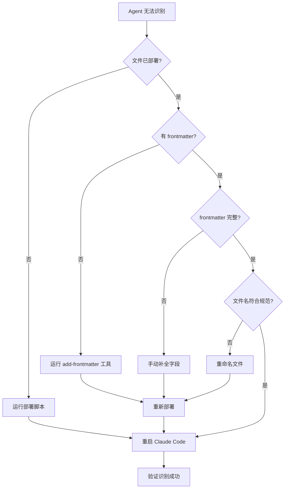
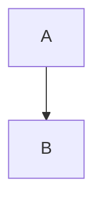

# Claude Code Agents - 故障排查文档

## 概述

本文档提供 Claude Code Agents 项目的常见问题诊断和解决方案，帮助快速定位和修复部署、识别、使用过程中的问题。

---

## 📋 目录

- [Agent 无法被 Claude Code 识别](#agent-无法被-claude-code-识别)
- [部署脚本执行失败](#部署脚本执行失败)
- [Mermaid 图表无法渲染](#mermaid-图表无法渲染)
- [文件编码问题](#文件编码问题)
- [Agent 文件格式验证失败](#agent-文件格式验证失败)

---

## Agent 无法被 Claude Code 识别

### 问题描述

部署后重启 Claude Code，但无法找到或使用新部署的 agent。

### 诊断步骤

#### 步骤 1：检查文件是否已部署

**Windows**:
```batch
dir "%USERPROFILE%\.claude\agents\*.md"
```

**macOS/Linux**:
```bash
ls -la ~/.claude/agents/*.md
```

**预期结果**：应该能看到部署的 agent 文件列表。

如果文件不存在，请重新执行部署脚本。

---

#### 步骤 2：检查 Frontmatter 是否存在

Agent 文件**必须**包含 YAML frontmatter，否则 Claude Code 无法识别。

**检查命令** (Windows):
```batch
type "%USERPROFILE%\.claude\agents\[agent-name].md" | more
```

**检查命令** (macOS/Linux):
```bash
head -10 ~/.claude/agents/[agent-name].md
```

**正确格式**（文件前5行）:
```markdown
---
name: agent-name
description: Agent 简短描述
model: sonnet
---
```

**常见错误**：

❌ **错误 1：缺少 frontmatter**
```markdown
# Agent 名称

## 概述
...
```

❌ **错误 2：frontmatter 不在文件第一行**
```markdown

---
name: agent-name
...
```

❌ **错误 3：frontmatter 格式错误**
```markdown
---
name agent-name  # 缺少冒号
description: ...
```

**解决方案**：使用自动化工具添加 frontmatter

**Windows**:
```batch
cd path\to\agents\project
devops\add-frontmatter.bat
devops\deploy-windows.bat
```

**macOS/Linux**:
```bash
cd /path/to/agents/project
chmod +x devops/add-frontmatter.sh
./devops/add-frontmatter.sh
./devops/deploy-macos.sh
```

---

#### 步骤 3：验证 Frontmatter 字段完整性

使用验证工具检查所有字段是否存在：

**Windows**:
```batch
cd path\to\agents\project
devops\validate-agents.bat
```

**macOS/Linux**:
```bash
cd /path/to/agents/project
chmod +x devops/validate-agents.sh
./devops/validate-agents.sh
```

**必需字段**：
- `name`: Agent 名称
- `description`: 描述
- `model`: 模型名称（sonnet/opus/haiku）

---

#### 步骤 4：检查文件名格式

文件名必须符合规范：**全小写-连字符.md**

✅ 正确示例：
- `doc-writer.md`
- `agent-generator.md`
- `code-reviewer.md`

❌ 错误示例：
- `Doc-Writer.md` (包含大写)
- `doc_writer.md` (使用下划线)
- `doc writer.md` (包含空格)
- `DocWriter.md` (驼峰命名)

**解决方案**：重命名文件并更新 frontmatter 中的 `name` 字段。

---

#### 步骤 5：重启 Claude Code

确保部署后**完全重启** Claude Code：

1. 完全退出 Claude Code（关闭所有窗口）
2. 重新启动 Claude Code
3. 等待初始化完成
4. 尝试使用 agent

---

### 完整修复流程



---

## 部署脚本执行失败

### 问题描述

运行 `deploy-windows.bat` 或 `deploy-macos.sh` 时出错。

### 常见错误

#### 错误 1：找不到源文件目录

**错误信息**:
```
[ERROR] 源文件目录不存在: .../devops/agents
```

**原因**：部署脚本路径配置错误（已在本次修复中解决）。

**解决方案**：
1. 确保在项目根目录执行脚本：
   ```bash
   cd /path/to/agents/project
   devops/deploy-macos.sh  # macOS
   devops\deploy-windows.bat  # Windows
   ```

2. 或者直接在 devops 目录执行：
   ```bash
   cd devops
   ./deploy-macos.sh  # macOS
   deploy-windows.bat  # Windows
   ```

---

#### 错误 2：权限不足 (macOS/Linux)

**错误信息**:
```
Permission denied: ./deploy-macos.sh
```

**解决方案**：
```bash
chmod +x devops/deploy-macos.sh
./devops/deploy-macos.sh
```

---

#### 错误 3：目标目录创建失败 (Windows)

**错误信息**:
```
[ERROR] 创建目录失败
```

**解决方案**：以管理员身份运行命令提示符，或手动创建目录：
```batch
mkdir "%USERPROFILE%\.claude\agents"
```

---

## Mermaid 图表无法渲染

### 问题描述

在 GitHub、VS Code 或其他 Markdown 查看器中，Mermaid 图表显示为纯文本或报错。

### 常见原因和解决方案

#### 原因 1：语法错误

**检查要点**：
- 图表类型关键字拼写正确（`flowchart`, `sequenceDiagram`, `mindmap`, `graph`）
- 节点 ID 不包含特殊字符（避免使用 `#`, `@`, `:` 等）
- 箭头语法正确（`-->`, `->>`, `---`）

**在线验证**：使用 [Mermaid Live Editor](https://mermaid.live/) 测试语法。

---

#### 原因 2：缺少代码块标识

❌ **错误**:
````
```
graph TD
    A --> B
```
````

✅ **正确**:
````

````

---

#### 原因 3：查看器不支持 Mermaid

**解决方案**：
- **VS Code**: 安装 "Markdown Preview Mermaid Support" 插件
- **GitHub**: 原生支持，无需配置
- **其他编辑器**: 搜索相应的 Mermaid 插件

---

## 文件编码问题

### 问题描述

Agent 文件包含乱码或无法正常显示中文。

### 解决方案

Agent 文件必须使用 **UTF-8 (无 BOM)** 编码。

#### 检查和修复编码 (VS Code)

1. 打开文件
2. 查看右下角状态栏的编码显示
3. 如果不是 "UTF-8"，点击编码名称
4. 选择 "Save with Encoding" → "UTF-8"

#### 检查和修复编码 (Notepad++)

1. 打开文件
2. 菜单: Encoding → Encode in UTF-8 (without BOM)
3. 保存文件

---

## Agent 文件格式验证失败

### 问题描述

运行 `validate-agents` 工具时报错。

### 验证清单

运行验证工具查看具体问题：

**Windows**:
```batch
devops\validate-agents.bat
```

**macOS/Linux**:
```bash
chmod +x devops/validate-agents.sh
./devops/validate-agents.sh
```

### 常见验证失败原因

#### 失败 1：缺少必需章节

**错误**:
```
⚠ 缺少 '## 概述' 章节（推荐）
⚠ 缺少 '## 核心能力架构' 章节（推荐）
```

**解决方案**：参考 [AGENT_SPEC.md](AGENT_SPEC.md) § 3.2，补全必需章节。

---

#### 失败 2：缺少 Mermaid 图表

**错误**:
```
⚠ 未找到 Mermaid 图表（推荐至少包含 2 个）
```

**解决方案**：根据 [AGENT_SPEC.md](AGENT_SPEC.md) § 4.2，添加流程图或架构图。

---

#### 失败 3：文件名不符合规范

**错误**:
```
✗ 文件名不符合规范（应为小写-连字符.md）
```

**解决方案**：重命名文件为 `小写-连字符.md` 格式，并更新 frontmatter 中的 `name` 字段。

---

## 联系支持

如果以上方法无法解决问题，请：

1. **查阅完整规范**：[AGENT_SPEC.md](AGENT_SPEC.md)
2. **查看项目 README**：[README.md](README.md)
3. **提交 Issue**：[GitHub Issues](https://github.com/JIA-ss/agents/issues)

---

**最后更新**: 2025-11-12
**文档版本**: v1.0.0
