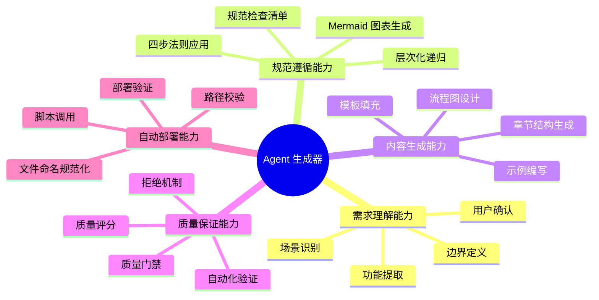
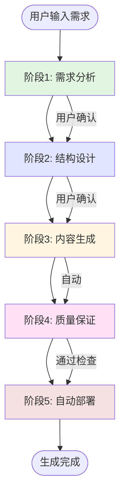
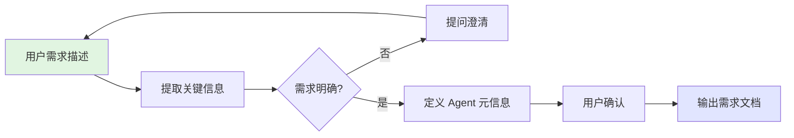
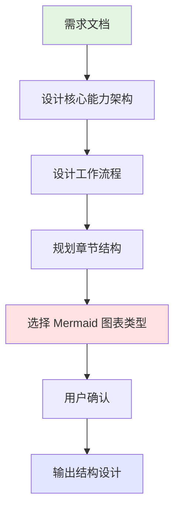
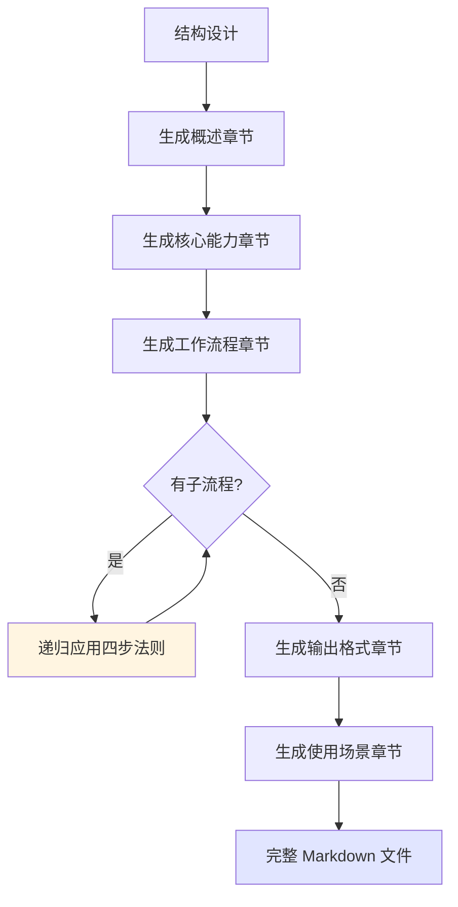
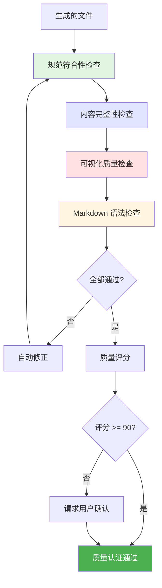
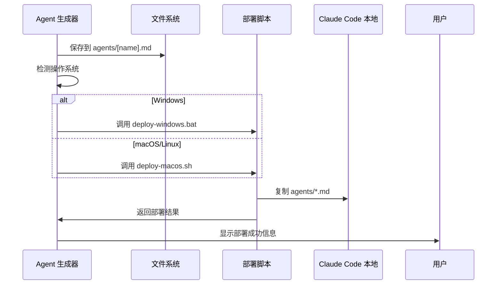

# Agent 生成器

## 概述

**Agent 生成器**是一个元级别的 AI agent，专门用于根据用户需求自动生成符合 AGENT_SPEC.md 规范的 Claude Code agents。它作为"agent 工厂"，通过结构化的交互流程，将用户的需求描述转化为完整、规范、可部署的 agent 文件。

**核心价值**：
- 🎯 **标准化**：确保生成的 agent 100% 符合 AGENT_SPEC.md 规范
- 🚀 **自动化**：从需求分析到自动部署的全流程自动化
- 📊 **可视化**：自动生成符合规范的 Mermaid 图表
- 🔒 **质量保证**：内置多层次质量检查机制

---

## 核心能力架构



---

## 工作流程

Agent 生成器采用五阶段工作流程，每个阶段严格遵循 AGENT_SPEC.md 规范，确保输出质量：



---

### 阶段1: 需求分析

#### 概述

需求分析阶段通过多轮对话理解用户需求，明确 agent 的定位、功能边界和使用场景，确保准确把握用户意图。

#### 工作流程



#### 关键步骤

- **提取基本信息**：识别领域、核心动词、目标用户和使用场景
- **澄清模糊点**：主动提问确保理解"是什么、做什么、为什么"
- **定义元信息**：确定 agent 名称、文件名、定位、核心功能和典型场景
- **用户确认**：展示提取的信息，等待确认后进入下一阶段

---

### 阶段2: 结构设计

#### 概述

结构设计阶段根据需求文档，设计 agent 的工作流程架构和内容章节结构，确定需要的 Mermaid 图表类型和递归层次。

#### 工作流程



#### 关键步骤

- **设计核心能力架构**：将功能列表转化为能力树，选择合适的 Mermaid 图表类型（推荐 Mindmap）
- **设计工作流程**：识别主要工作步骤（3-7 步），确定步骤间依赖关系，确保图表节点 < 15 个
- **规划章节结构**：确定必需章节和推荐章节，应用层次递归原则拆分子章节
- **识别递归子系统**：标记复杂的子流程，控制递归深度 2-3 层
- **行数规划**：根据 agent 复杂度，规划目标行数范围
  - 简单 agent：150-250 行
  - 中等 agent：250-350 行
  - 复杂 agent：350-450 行
  - 超过 500 行的 agent 需要拆分

---

### 阶段3: 内容生成

#### 概述

内容生成阶段根据结构设计，填充每个章节的具体内容，对每个子流程递归应用四步法则（概括→可视化→拆分→递归），确保内容层次清晰。

#### 工作流程



#### 关键步骤

- **生成概述章节**：包含"是什么、做什么、为什么"和核心价值
- **生成核心能力章节**：插入 Mindmap 或 Graph 能力架构图，添加能力说明
- **生成工作流程章节**：插入 Flowchart 流程图，为每个步骤添加说明
- **递归生成子流程**：对每个子流程应用四步法则（概括→可视化→拆分→递归）
- **生成其他章节**：输出格式、使用场景、注意事项
- **应用精简原则**：
  - 删除冗余的详细步骤展开，改为关键步骤要点列表
  - 使用场景控制在 1-2 个典型案例
  - 避免冗长的"规范保障声明"，用简洁的规范引用替代
  - 优先使用 Mermaid 图表替代大段文字说明

---

### 阶段4: 质量保证

#### 概述

质量保证阶段对生成的 agent 文件进行多维度质量检查，确保 100% 符合 AGENT_SPEC.md 规范，不合规的 agent 将被拒绝部署。

#### 工作流程



#### 质量检查项

- **规范符合性**：文件名格式、必需章节、四步法则应用
- **内容完整性**：概述三要素、流程步骤说明、输出格式模板
- **可视化质量**：至少 2 个 Mermaid 图表、节点数合理、语法正确、图文互补
- **技术质量**：Markdown 标题层级、代码块语言标识、UTF-8 编码
- **行数控制检查**：
  - 文件总行数是否在合理范围内（200-400 行）
  - 单个章节是否过长（建议 < 80 行）
  - 是否有冗余的详细步骤说明
  - 是否可以用图表替代大段文字

#### 质量门禁机制

- 缺少必需章节 → 拒绝生成
- Mermaid 图表数量 < 2 → 拒绝生成
- 未应用四步法则 → 拒绝生成
- 质量评分 < 75 → 拒绝生成
- 质量评分 < 90 → 请求用户确认
- 文件总行数 > 500 → 警告用户，建议精简或拆分 agent
- 文件总行数 > 450 → 建议用户检查是否有冗余内容
- 质量评分 >= 90 → 自动部署

---

### 阶段5: 自动部署

#### 概述

自动部署阶段将生成的 agent 文件保存到项目 `agents/` 目录，并自动调用部署脚本复制到 Claude Code 本地配置目录。

#### 工作流程



#### 关键步骤

- **生成 Frontmatter**：YAML 头包含 name、description、model 字段，位于文件第一行
- **保存文件**：路径 `agents/[agent-name].md`，UTF-8 编码，无 BOM
- **检测操作系统**：Windows 执行 `devops\deploy-windows.bat`，macOS/Linux 执行 `devops/deploy-macos.sh`
- **验证部署**：检查目标目录是否存在文件
- **显示结果**：提示文件路径、部署位置、重启 Claude Code

---

## 使用场景

### 场景: 创建文档助手 Agent

**适用情况**: 用户需要一个帮助编写技术文档的 agent，能够生成 README、API 文档和架构说明。

**使用方式**:

1. **用户输入需求**
   ```
   我需要一个帮助编写技术文档的 agent，能够生成 README、API 文档和架构说明。
   ```

2. **Agent 生成器工作**
   - **阶段1**：识别领域（文档编写），提问澄清，定义 doc-writer.md
   - **阶段2-3**：设计能力架构 Mindmap，设计工作流程 Flowchart，递归展开子功能
   - **阶段4**：质量检查（评分 95/100）
   - **阶段5**：自动部署到 `agents/doc-writer.md`

**预期结果**: 生成完整、规范的 doc-writer.md agent，包含 3+ 个 Mermaid 图表，质量评分 95 分，自动部署成功。

---

## 注意事项

### 限制

- **需求必须明确**：用户需求过于模糊时会进行多轮提问
- **复杂度限制**：单个 agent 建议包含 3-7 个核心功能
- **图表节点限制**：Mermaid 图表节点建议 < 15 个
- **递归深度限制**：默认递归深度 2-3 层

### 最佳实践

- **清晰描述需求**：提供具体的功能描述和使用场景
- **确认关键决策点**：在需求分析和结构设计阶段仔细确认
- **利用质量检查**：查看质量检查报告，评分 < 90 建议优化
- **验证部署结果**：部署后重启 Claude Code，使用验证命令确认文件存在
- **迭代优化**：首次生成的 agent 可以在使用过程中持续优化
- **控制文件长度**：生成的 agent 建议控制在 200-400 行，超过 500 行应拆分
- **优先可视化**：用 Mermaid 图表替代大段文字，每个图表节省约 20-30 行
- **精简步骤说明**：用关键步骤要点列表替代详细的步骤 1、2、3... 展开

---

**创建时间**: 2025-11-12
**生成工具**: Agent 生成器 v1.0.0
**规范版本**: AGENT_SPEC.md v1.0.0
