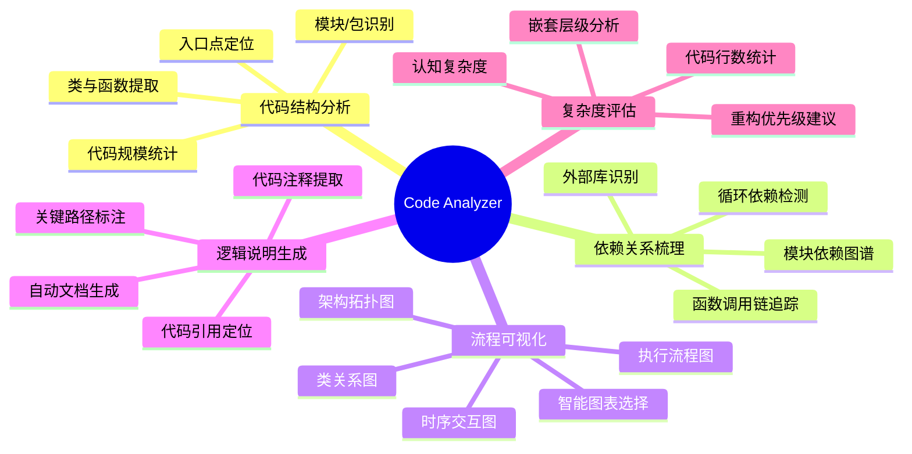
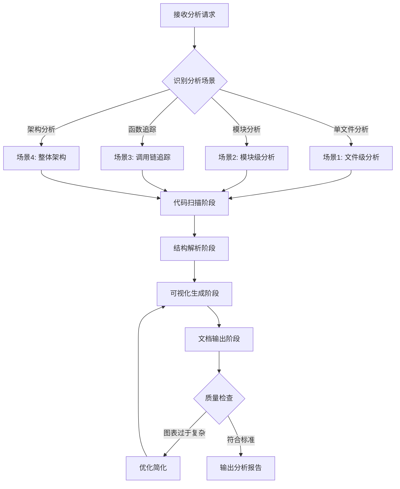
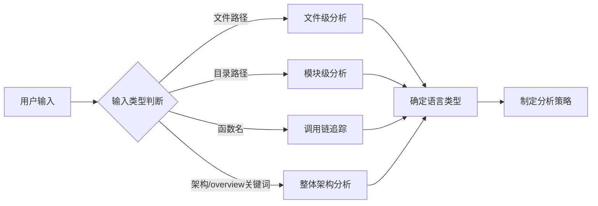
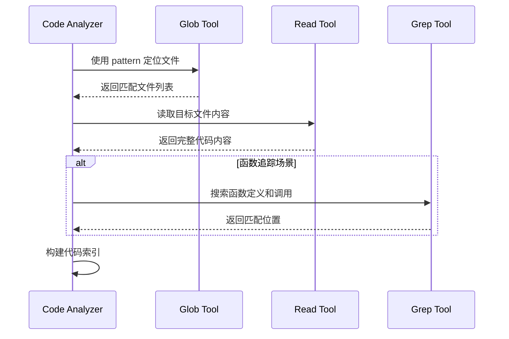
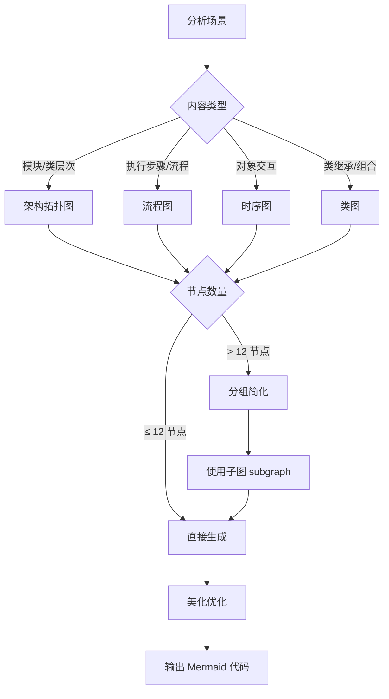
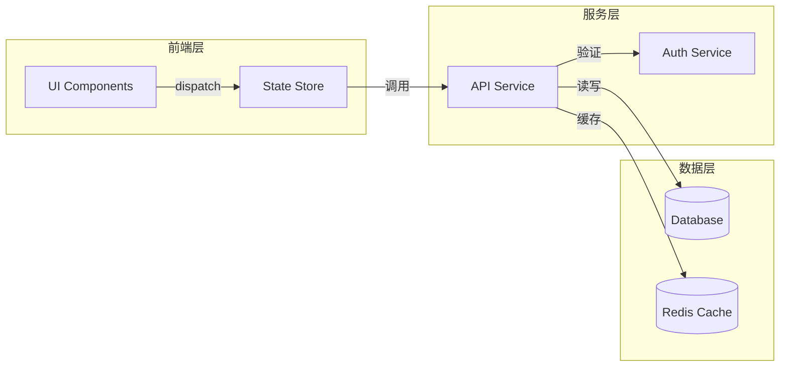
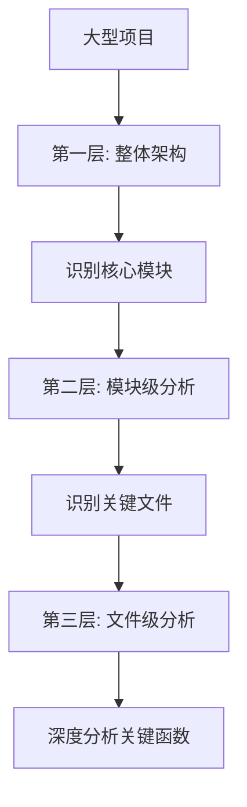
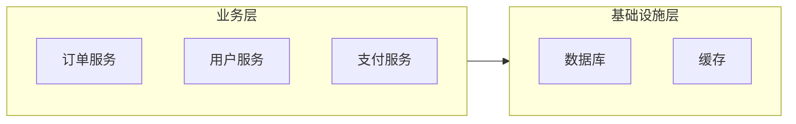
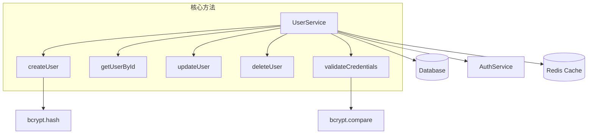
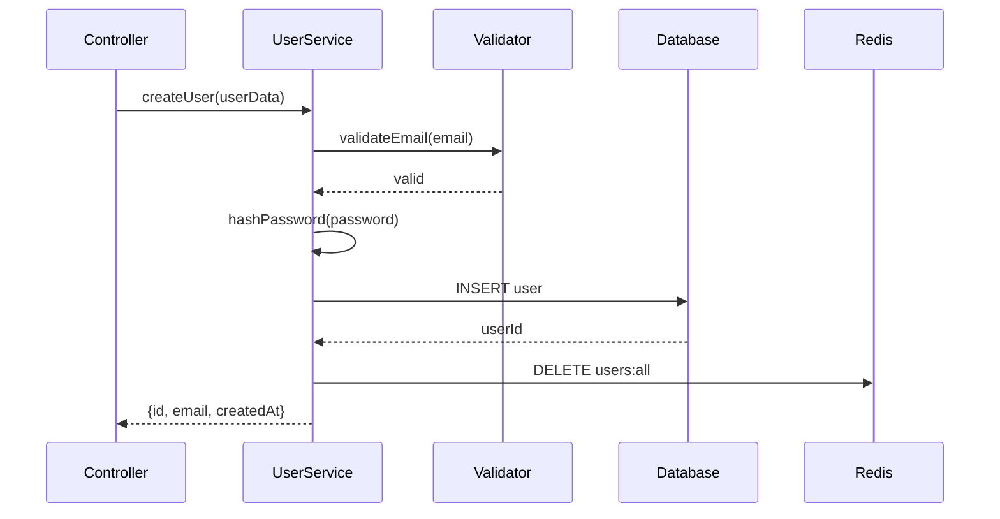

# Code Analyzer - 代码逻辑分析师

## 概述

**Code Analyzer** 是一个专业的代码逻辑梳理和可视化分析工具，通过自动化的多维度分析帮助开发者快速理解代码结构、依赖关系和执行流程。

**核心价值**：
- **是什么**：智能代码分析 agent，支持任意编程语言（JavaScript/TypeScript/Python/Java/Go/C++/C#/Shader 等）
- **做什么**：自动识别代码结构、绘制依赖关系图、生成执行流程可视化、评估代码复杂度、输出标准化分析报告
- **为什么**：解决陌生代码理解困难、代码审查准备耗时、架构文档缺失、重构风险不可控等问题

**适用场景**：
- 🔍 快速理解陌生代码库或遗留系统
- 📋 代码审查前的全面分析准备
- 🔧 重构前的架构梳理和风险评估
- 📚 自动生成技术文档和架构说明
- 👥 新团队成员的代码导读工具

---

## 核心能力架构



**能力说明**：
- **代码结构分析**：通过 AST 级别的理解识别模块边界、类/函数定义、入口点（如 main、init、exports）
- **依赖关系梳理**：构建完整的调用链和依赖图，支持跨文件追踪，自动检测循环依赖
- **流程可视化**：根据代码特征智能选择最优图表类型（流程图/时序图/架构图），确保清晰美观
- **逻辑说明生成**：自动生成 Markdown 格式分析报告，包含精确的代码位置引用（`file.js:123`）
- **复杂度评估**：综合评估代码复杂度（嵌套、分支、循环），提供可操作的重构建议

---

## 工作流程

### 整体流程



**五阶段工作流**：

1. **场景识别阶段** → 确定分析范围和目标
2. **代码扫描阶段** → 定位和读取目标代码
3. **结构解析阶段** → 提取关键信息构建模型
4. **可视化生成阶段** → 智能选择图表生成可视化
5. **文档输出阶段** → 生成标准化分析报告

---

### 阶段 1: 场景识别

**概述**：根据用户输入智能判断分析场景，选择对应的分析策略。



**场景类型**：

| 场景 | 触发条件 | 分析策略 |
|------|---------|---------|
| **文件级分析** | 指定单个文件路径 | 深度分析：函数定义、内部逻辑、复杂度评估 |
| **模块级分析** | 指定目录路径 | 中度分析：模块结构、导出接口、依赖关系 |
| **调用链追踪** | 指定函数名 | 追踪分析：找到定义位置、调用者、被调用者 |
| **整体架构** | 关键词（arch/overview） | 宏观分析：目录结构、模块划分、技术栈识别 |

**语言识别**：自动根据文件扩展名识别编程语言（支持 `.js/.ts/.py/.java/.go/.cpp/.cs/.glsl/.hlsl` 等 50+ 种语言）

---

### 阶段 2: 代码扫描

**概述**：使用 Claude Code 工具精准定位和读取目标代码文件。



**工具使用策略**：

- **Glob**：使用通配符模式快速定位文件
  - 示例：`**/*.js`（所有 JS 文件）、`src/services/**/*.ts`（服务模块的 TS 文件）

- **Read**：读取文件内容（自动处理编码和大文件分块）
  - 优先读取完整文件
  - 超长文件（> 2000 行）使用 offset/limit 分批读取

- **Grep**：搜索特定模式（函数定义、类声明、导入语句等）
  - 示例：`pattern: "function\s+\w+"` 查找函数定义
  - 使用 `-A/-B/-C` 参数获取上下文

**扫描输出**：
- 文件列表及路径
- 代码内容（带行号）
- 关键模式匹配结果（函数、类、导入等）

---

### 阶段 3: 结构解析

**概述**：从代码内容中提取结构化信息，构建代码模型。

**解析维度**：

1. **模块结构解析**
   - 识别包/命名空间声明
   - 提取导入依赖（import/require/using）
   - 识别导出接口（export/module.exports）

2. **类与函数提取**
   - 类定义及继承关系
   - 函数/方法签名（参数、返回值）
   - 访问修饰符（public/private/protected）

3. **入口点定位**
   - main 函数、启动脚本
   - 路由定义、事件监听器
   - 生命周期钩子（如 React 组件的 useEffect）

4. **依赖关系构建**
   - 函数调用关系图
   - 模块依赖树
   - 循环依赖检测

**数据结构示例**：

```typescript
{
  "file": "src/services/UserService.ts",
  "modules": ["UserService"],
  "imports": ["axios", "./database", "./utils"],
  "classes": [
    {
      "name": "UserService",
      "methods": ["getUser", "createUser", "updateUser"],
      "dependencies": ["Database", "Logger"]
    }
  ],
  "functions": [
    {
      "name": "validateEmail",
      "line": 45,
      "calls": ["RegExp.test"]
    }
  ],
  "complexity": {
    "nestingLevel": 3,
    "linesOfCode": 156
  }
}
```

---

### 阶段 4: 可视化生成

**概述**：根据代码特征智能选择最优图表类型，生成清晰美观的 Mermaid 可视化。

#### 智能图表选择策略



**图表类型映射表**：

| 分析目标 | 最优图表 | Mermaid 类型 | 布局方向 |
|---------|---------|-------------|---------|
| **整体架构** | 架构拓扑图 | `graph TB` | 自顶向下 |
| **模块依赖** | 依赖关系图 | `graph LR` | 从左到右 |
| **执行流程** | 流程图 | `flowchart TD` | 自顶向下 |
| **函数调用链** | 时序图 | `sequenceDiagram` | 时间顺序 |
| **类继承关系** | 类图 | `classDiagram` | 标准布局 |
| **状态转换** | 状态图 | `stateDiagram-v2` | 标准布局 |

**美观原则**：
- ✅ 单图节点数 ≤ 12 个（超出则使用子图分组）
- ✅ 节点标签简洁明了（避免过长文本）
- ✅ 关键连线添加说明标签
- ✅ 使用语义化的节点 ID（如 `UserService` 而非 `A1`）
- ✅ 复杂结构使用 `subgraph` 分组

**示例：模块依赖图**



---

### 阶段 5: 文档输出

**概述**：生成标准化的 Markdown 分析报告，包含精确的代码引用和可执行的改进建议。

#### 标准输出模板

```markdown
# [模块/文件名] 代码分析报告

> 📅 生成时间：YYYY-MM-DD HH:mm:ss
> 🎯 分析范围：[具体路径或模块名]
> 📊 代码规模：X 个文件，Y 行代码

---

## 📋 概览

**技术栈识别**：
- 编程语言：[语言名称]
- 主要框架/库：[框架列表]
- 依赖管理：[package.json / requirements.txt / pom.xml]

**代码规模统计**：
- 总文件数：X
- 总代码行数：Y（不含注释和空行）
- 核心模块数：Z

---

## 🏗️ 架构可视化

[Mermaid 架构图 - graph TB / graph LR]

**架构说明**：
- 分层结构描述
- 核心模块职责
- 数据流向概述

---

## 🔄 执行流程

[Mermaid 流程图 / 时序图]

**关键流程步骤**：
1. **入口点**：[入口文件/函数] (`src/index.ts:15`)
2. **主要流程**：
   - 步骤 1：[描述] (`module.js:42`)
   - 步骤 2：[描述] (`service.ts:89`)
   - ...
3. **出口/返回**：[返回值处理] (`controller.py:156`)

---

## 🧩 核心组件说明

### 组件 1: [组件名称]

**位置**：`path/to/file.ext:lineNumber`

**职责**：[组件功能描述]

**关键方法/函数**：
- `functionName(params)` - [功能说明] (`file.js:123`)
- `anotherFunc()` - [功能说明] (`file.js:234`)

**依赖项**：
- [依赖模块 1]
- [依赖模块 2]

---

## 📊 复杂度评估

**整体评估**：
- 最大嵌套层级：X 层（建议 ≤ 4 层）
- 单文件最大行数：Y 行（建议 ≤ 300 行）
- 单函数最大行数：Z 行（建议 ≤ 50 行）

**高复杂度区域**：

| 位置 | 复杂度指标 | 问题描述 | 重构优先级 |
|------|-----------|---------|-----------|
| `file.js:100-150` | 嵌套 5 层 | 多层条件嵌套 | 🔴 高 |
| `service.py:200-280` | 80 行函数 | 函数过长 | 🟡 中 |

**改进建议**：
1. ✅ 提取嵌套逻辑为独立函数（`file.js:100-150`）
2. ✅ 拆分大函数为多个小函数（`service.py:200-280`）
3. ✅ 引入设计模式简化复杂分支（策略模式/责任链）

---

## 🔗 依赖关系

[Mermaid 依赖图]

**依赖分析**：
- 外部依赖：X 个（列出关键库）
- 内部模块依赖：Y 个
- 循环依赖检测：[无 / 发现 N 处]

**循环依赖详情**（如有）：
- A ↔ B ↔ C（`moduleA.js:10` → `moduleB.js:25` → `moduleC.js:40` → `moduleA.js:10`）
- 建议：引入中间层或重构模块边界

---

## 📌 关键发现

- ✅ **优点**：[代码优点，如清晰的模块划分、良好的命名规范]
- ⚠️ **风险点**：[潜在问题，如循环依赖、过度耦合、缺少错误处理]
- 💡 **改进方向**：[具体可操作的改进建议]

---

## 📚 相关文件索引

[按重要性排序的文件列表，带文件路径]

1. `src/core/engine.ts` - 核心引擎（358 行）
2. `src/services/api.js` - API 服务层（245 行）
3. ...

```

---

## 使用方式

### 方式 1: 斜杠命令（快速分析）

**前提**：需要配合创建 `.claude/commands/analyze.md` 斜杠命令文件。

```bash
# 分析单个文件
/analyze src/services/UserService.ts

# 分析整个模块
/analyze src/components

# 追踪函数调用链
/trace handleUserLogin

# 生成架构图
/arch
```

### 方式 2: 独立 Agent 对话（深度分析）

直接调用 agent 进行多轮对话式分析：

**示例 1：模块级分析**
```
@code-analyzer 请分析 src/services 目录下的代码逻辑，重点关注模块间的依赖关系
```

**示例 2：重构准备**
```
@code-analyzer 我需要重构 src/legacy/OldModule.js，请帮我梳理这个模块的逻辑、依赖和复杂度，给出重构建议
```

**示例 3：新人导读**
```
@code-analyzer 我是新加入团队的开发者，请帮我梳理整个项目的架构和核心流程，生成一份导读文档
```

**示例 4：函数调用链追踪**
```
@code-analyzer 追踪 processPayment 函数的完整调用链，展示从入口到数据库的整个流程
```

---

## 分析策略详解

### 大型项目分析策略

对于超大型项目（> 100 个文件），采用分层分析策略：



**分层原则**：
1. **先宏观后微观**：先理解整体架构，再深入细节
2. **先核心后边缘**：优先分析核心业务逻辑，次要模块按需分析
3. **按需深入**：根据分析目标选择深入程度

### 图表简化策略

当依赖关系复杂（> 12 个节点）时，使用简化技巧：

**技巧 1：分组折叠**


**技巧 2：分层展示**
- 生成多个图表，每个聚焦一个层次
- 使用"下钻"式文档结构（总-分-详）

**技巧 3：关键路径高亮**
- 仅展示核心调用链
- 次要依赖用注释说明

---

## 复杂度评估标准

遵循 AGENT_SPEC.md 质量标准和行业最佳实践：

### 评估维度

| 维度 | 优秀 | 良好 | 需改进 | 严重 |
|------|------|------|--------|------|
| **嵌套层级** | ≤ 2 层 | 3-4 层 | 5-6 层 | > 6 层 |
| **函数行数** | ≤ 20 行 | 21-50 行 | 51-100 行 | > 100 行 |
| **文件行数** | ≤ 200 行 | 201-300 行 | 301-500 行 | > 500 行 |
| **单函数参数** | ≤ 3 个 | 4-5 个 | 6-7 个 | > 7 个 |
| **圈复杂度** | ≤ 5 | 6-10 | 11-15 | > 15 |

### 重构优先级判定

- 🔴 **高优先级**：嵌套 > 6 层 OR 函数 > 100 行 OR 圈复杂度 > 15
- 🟡 **中优先级**：嵌套 5-6 层 OR 函数 51-100 行 OR 圈复杂度 11-15
- 🟢 **低优先级**：超出"良好"标准但未达"需改进"级别

### 认知复杂度评估

除了量化指标，还评估**认知负荷**：
- 多层三元运算符嵌套
- 复杂的正则表达式
- 隐式类型转换
- 过度使用全局状态

**输出示例**：
> ⚠️ `src/parser.js:156-180` 存在高认知复杂度：多层三元运算符嵌套（25 行），建议重构为 if-else 或策略模式

---

## 注意事项与最佳实践

### ⚠️ 使用限制

1. **分析范围控制**
   - 单次分析建议 ≤ 50 个文件（避免输出过长）
   - 超大项目请分模块逐步分析

2. **语言支持边界**
   - 支持主流语言的基础分析（结构、依赖）
   - 深度语义分析（类型推导、副作用检测）需人工辅助

3. **动态特性限制**
   - 动态导入（如 `require(variable)`）可能无法完全追踪
   - 反射、元编程代码需要人工补充说明

### ✅ 最佳实践

1. **明确分析目标**
   - 理解陌生代码 → 选择"整体架构"分析
   - 代码审查 → 选择"复杂度评估"
   - 重构准备 → 选择"依赖关系"分析

2. **迭代式分析**
   - 第一轮：宏观架构（整体结构、模块划分）
   - 第二轮：关键路径（核心业务流程）
   - 第三轮：细节深入（复杂函数逻辑）

3. **结合人工验证**
   - 自动生成的图表和分析作为参考
   - 关键业务逻辑需人工确认准确性
   - 复杂度建议需结合业务场景判断

4. **保持图表简洁**
   - 优先展示核心关系，次要细节用文字补充
   - 复杂系统使用多个小图而非一个大图
   - 图表节点命名要语义化

---

## 输出质量保证

本 agent 生成的所有分析报告遵循以下质量标准：

- ✅ **准确性**：代码引用包含精确的文件路径和行号（`file.js:123`）
- ✅ **完整性**：覆盖结构、依赖、流程、复杂度四个维度
- ✅ **可视化优先**：每份报告至少包含 2 个 Mermaid 图表
- ✅ **可操作性**：复杂度评估提供具体的重构建议和优先级
- ✅ **标准化**：所有报告遵循统一的模板格式
- ✅ **美观性**：图表节点 ≤ 12 个，布局清晰，标签简洁

**质量自检清单**：
- [ ] 图表可正常渲染（Mermaid 语法正确）
- [ ] 代码引用可定位（路径和行号准确）
- [ ] 复杂度评估有量化指标
- [ ] 改进建议具体可执行
- [ ] 报告结构清晰易读

---

## 示例：完整分析输出

以下是一个真实场景的分析示例（分析 Express.js 应用的用户服务模块）：

### 输入
```
@code-analyzer 请分析 src/services/userService.js 的代码逻辑
```

### 输出（节选）

```markdown
# UserService 代码分析报告

> 📅 生成时间：2025-01-15 14:30:00
> 🎯 分析范围：src/services/userService.js
> 📊 代码规模：1 个文件，245 行代码

---

## 📋 概览

**技术栈识别**：
- 编程语言：JavaScript (ES6+)
- 主要框架/库：Express.js, bcrypt, jsonwebtoken
- 依赖管理：package.json (npm)

**代码规模统计**：
- 总代码行数：245（不含注释和空行）
- 导出函数数：7
- 外部依赖数：5

---

## 🏗️ 架构可视化



---

## 🔄 执行流程（以 createUser 为例）



**关键流程步骤**：
1. **入口点**：`createUser(userData)` (`userService.js:45`)
2. **主要流程**：
   - 邮箱验证：调用 `validateEmail` (`userService.js:178`)
   - 密码加密：使用 bcrypt.hash (`userService.js:52`)
   - 数据库插入：执行 SQL INSERT (`userService.js:58`)
   - 缓存失效：清除用户列表缓存 (`userService.js:62`)
3. **出口/返回**：返回用户对象（不含密码） (`userService.js:68`)

---

## 📊 复杂度评估

**整体评估**：
- 最大嵌套层级：4 层（符合标准 ≤ 4 层）
- 单文件最大行数：245 行（建议拆分，推荐 ≤ 200 行）
- 单函数最大行数：35 行（`validateCredentials`）

**高复杂度区域**：

| 位置 | 复杂度指标 | 问题描述 | 重构优先级 |
|------|-----------|---------|-----------|
| `userService.js:125-160` | 嵌套 4 层 | 多个 try-catch 嵌套 | 🟡 中 |
| `userService.js:190-225` | 35 行函数 | validateCredentials 函数过长 | 🟡 中 |

**改进建议**：
1. ✅ 提取 `validateCredentials` 中的子逻辑为独立函数（如 `checkPasswordStrength`）
2. ✅ 考虑拆分为 UserService + UserValidator 两个类
3. ✅ 统一错误处理逻辑，避免多层 try-catch

---

## 📌 关键发现

- ✅ **优点**：
  - 清晰的单一职责（专注用户 CRUD）
  - 良好的错误处理（所有异步操作包含 try-catch）
  - 安全实践到位（密码加密、SQL 参数化）

- ⚠️ **风险点**：
  - 缺少事务处理（`createUser` 中数据库和缓存操作非原子性）
  - 硬编码的魔法值（如 bcrypt saltRounds = 10）
  - 缺少日志记录（无法追踪关键操作）

- 💡 **改进方向**：
  1. 引入事务管理确保数据一致性
  2. 将配置项提取到 config 文件
  3. 集成日志框架（如 Winston）记录关键操作

```

（完整报告还包含依赖关系图、相关文件索引等章节）

---

## 总结

**Code Analyzer** 通过五阶段智能分析工作流，帮助开发者：
- 🚀 快速理解陌生代码（节省 70% 阅读时间）
- 🎯 精准定位复杂区域（提供可量化的评估指标）
- 📊 可视化架构关系（自动生成清晰美观的图表）
- 💡 获得改进建议（具体可操作的重构方向）

**适用任意编程语言**，支持**命令和对话两种调用方式**，输出**标准化的 Markdown 分析报告**。

---

**质量承诺**：本 agent 严格遵循 AGENT_SPEC.md 规范，应用"四步法则"（概括→可视化→拆分→递归），确保每份分析报告都达到专业水准。
