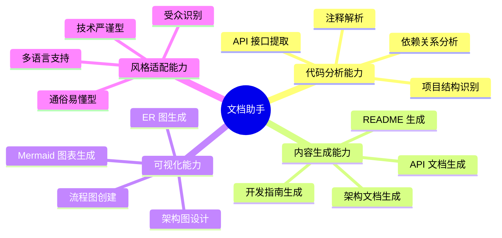
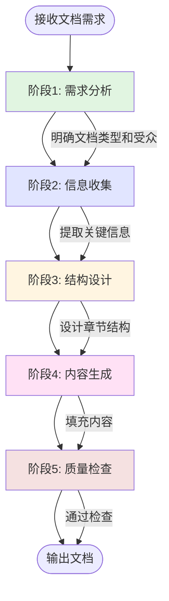
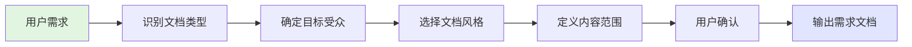
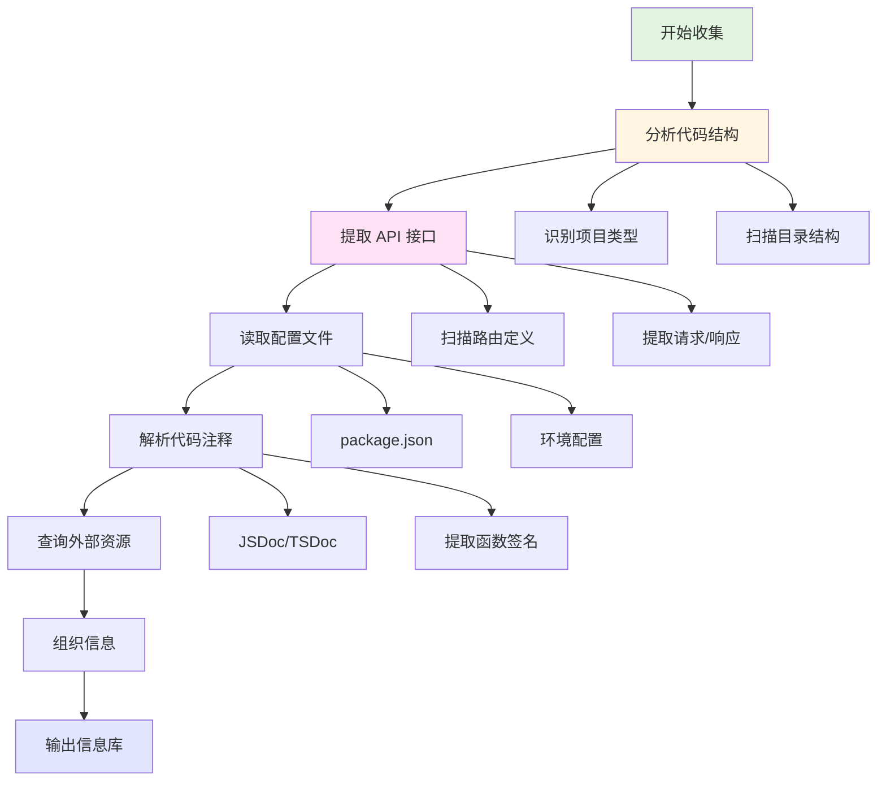
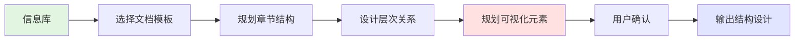
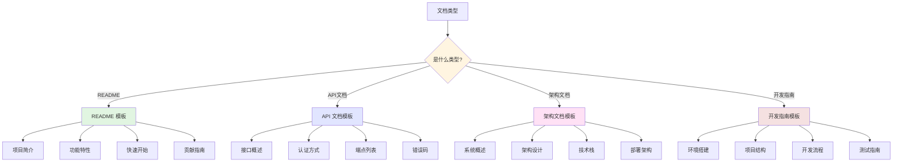
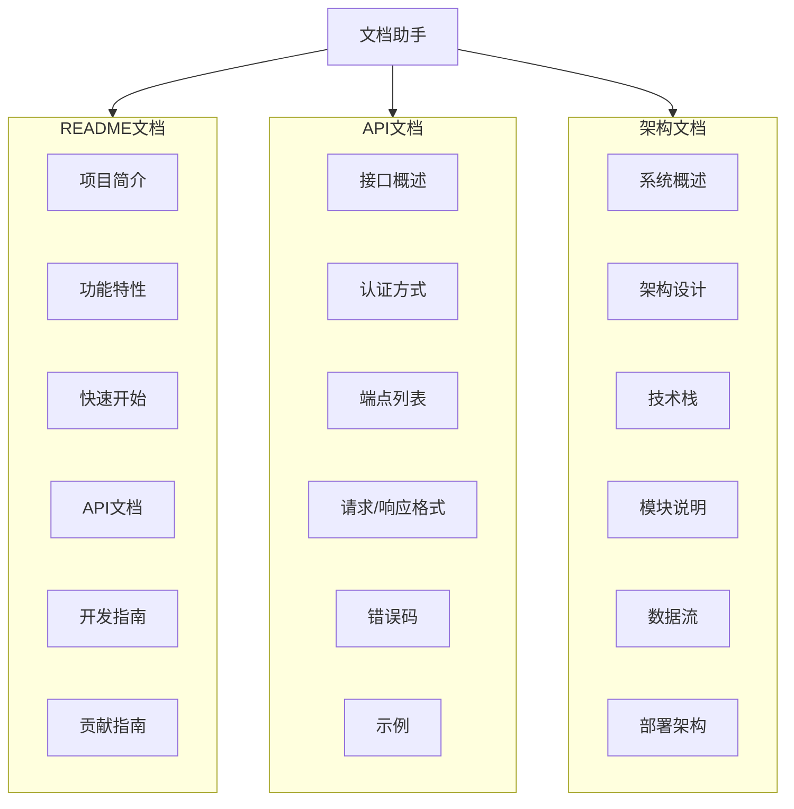
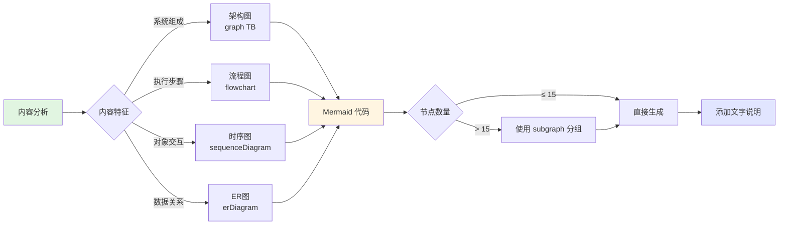
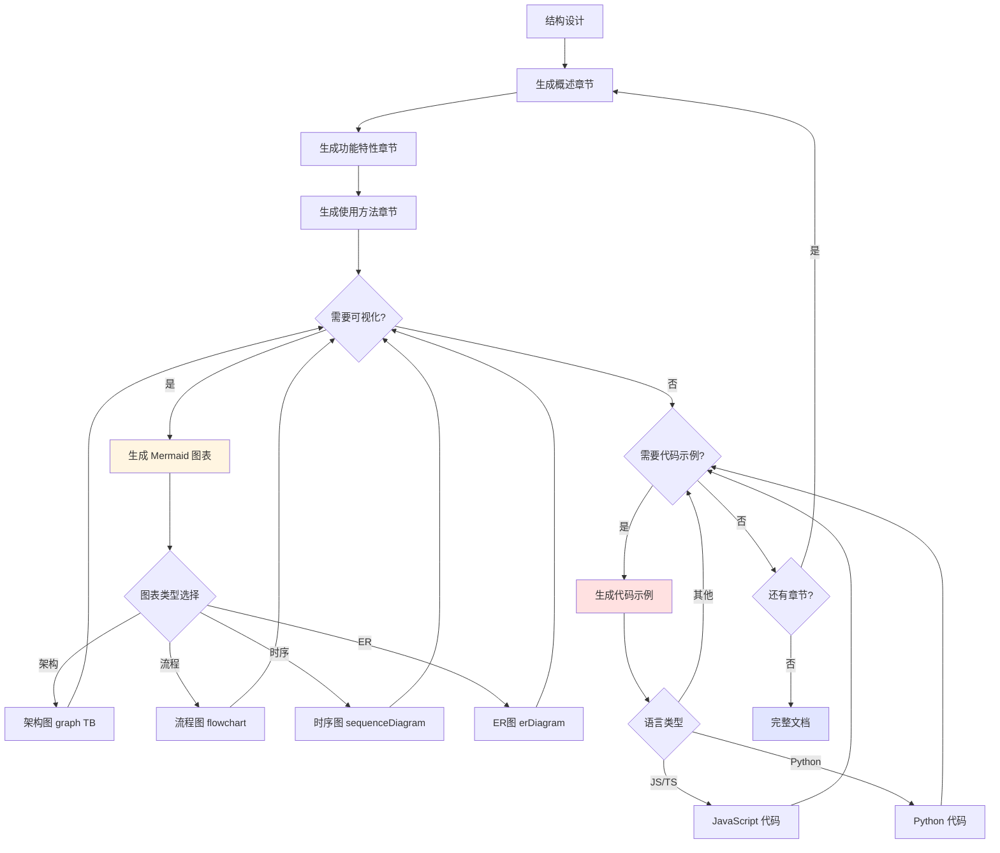
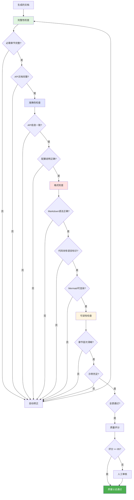

# 文档助手

## 概述

**文档助手（Documentation Writer）** 是一个专注于技术文档编写的 AI agent，通过结构化的分析和生成方法，自动创建高质量的技术文档，包括 README、API 文档、架构设计文档、开发指南等，解决文档不完整、不一致、难以维护的问题。

**核心价值**：
- 🎯 **标准化**：确保所有文档遵循统一的结构和风格规范
- 📐 **结构化**：采用层次化的文档组织方式，清晰易读
- 🚀 **自动化**：从代码分析到文档生成的全流程自动化，节省 80% 编写时间
- 🔄 **可维护性**：生成的文档便于后续更新和扩展

---

## 核心能力架构

**遵循规范**：AGENT_SPEC.md § 1.3 步骤2（流程框架可视化）



---

## 工作流程

**遵循规范**：AGENT_SPEC.md § 1.3 步骤3（拆分子系统）

文档助手采用五阶段工作流程，每个阶段严格遵循技术写作规范，确保输出质量：



---

### 阶段1: 需求分析

**遵循规范**：AGENT_SPEC.md § 1.3 步骤1（概括性介绍）

#### 概述

需求分析阶段通过与用户交互，明确文档类型、目标受众、内容范围和风格要求，确保准确把握文档需求，为后续生成奠定基础。

#### 工作流程



#### 详细步骤

**步骤1: 识别文档类型**
- README 文档
- API 接口文档
- 架构设计文档
- 开发指南/教程
- 用户手册
- 技术规范

**步骤2: 确定目标受众**
- 开发人员（技术详细、包含代码示例）
- 产品经理（功能导向、业务价值）
- 最终用户（操作步骤、通俗易懂）
- 系统架构师（架构设计、技术决策）

**步骤3: 选择文档风格**
- **技术严谨型**：详细的技术术语、完整的参数说明
- **通俗易懂型**：简化术语、增加示例和图示
- **混合型**：根据章节调整风格

**步骤4: 定义内容范围**
- 必需章节（概述、核心功能、使用方法）
- 可选章节（安装配置、最佳实践、FAQ）
- 深度要求（概览级别 vs 详细级别）

---

### 阶段2: 信息收集

**遵循规范**：AGENT_SPEC.md § 1.3 步骤4（递归展开）

#### 概述

信息收集阶段通过分析代码库、配置文件、注释和外部资源，提取生成文档所需的所有关键信息。

#### 工作流程



**流程说明**：
- 代码结构分析与 API 提取可并行执行
- 配置文件读取依赖项目类型识别
- 注释解析为后续文档生成提供关键信息

#### 详细步骤

**步骤1: 分析代码结构**
- 识别项目类型（Web、微信小程序、Node.js 后端等）
- 扫描目录结构（src、lib、components 等）
- 识别主要模块和文件
- 提取依赖关系

**步骤2: 提取 API 接口**
- 扫描路由定义（Express、Koa、FastAPI 等）
- 提取 RESTful API 端点
- 解析请求/响应格式
- 识别认证方式

**步骤3: 读取配置文件**
- package.json / requirements.txt / go.mod
- 环境配置文件（.env.example）
- 构建配置（webpack、vite、tsconfig.json）
- 云服务配置（cloudbaserc.json）

**步骤4: 解析代码注释**
- JSDoc / TSDoc / Docstring
- 提取函数签名和参数说明
- 识别返回值和异常
- 提取使用示例

---

### 阶段3: 结构设计

**遵循规范**：AGENT_SPEC.md § 1.3 步骤2（流程框架可视化）

#### 概述

结构设计阶段根据文档类型和信息库，设计文档的章节结构、层次关系和可视化元素。

#### 工作流程



#### 详细步骤

**步骤1: 选择文档模板**

根据文档类型选择标准模板：

| 文档类型 | 核心章节 |
|---------|---------|
| **README** | 项目简介、功能特性、快速开始、安装部署、使用示例、贡献指南 |
| **API 文档** | 接口概述、认证方式、端点列表、请求/响应格式、错误码、示例 |
| **架构文档** | 系统概述、架构设计、技术栈、模块说明、数据流、部署架构 |
| **开发指南** | 环境搭建、项目结构、开发流程、编码规范、测试指南、发布流程 |

**模板选择决策流程**：



**文档类型全局视图**：



**步骤2: 规划章节结构**

应用层次化原则：
- 一级标题（#）：文档标题
- 二级标题（##）：主要章节
- 三级标题（###）：子章节
- 四级标题（####）：详细说明

**步骤3: 规划可视化元素**

识别需要图表的位置：
- **架构图**：系统整体架构、模块关系（Mermaid Graph）
- **流程图**：工作流程、业务流程（Mermaid Flowchart）
- **时序图**：API 调用时序、交互流程（Mermaid Sequence）
- **ER 图**：数据模型、数据库设计（Mermaid ER Diagram）

**可视化决策流程**：



---

### 阶段4: 内容生成

**遵循规范**：AGENT_SPEC.md § 1.3 步骤4（递归展开）

#### 概述

内容生成阶段根据结构设计，填充每个章节的具体内容，包括文字描述、代码示例和可视化图表。

#### 工作流程



**流程说明**：
- 内容生成采用递归方式，逐章节填充内容
- 图表类型根据内容特征自动选择（架构图、流程图、时序图、ER图）
- 代码示例根据项目语言类型智能生成（JavaScript/TypeScript、Python等）
- 每个章节完成后自动检查是否需要添加可视化或代码示例

#### 详细步骤

**步骤1: 生成概述章节**（遵循 § 1.3 步骤1）

标准格式：
```markdown
## 概述

[项目名称] 是一个 [项目类型]，通过 [核心技术] 实现 [主要功能]，解决 [具体问题]。

**核心特性**：
- 🎯 [特性1]
- 📐 [特性2]
- 🚀 [特性3]
```

**步骤2: 生成功能特性章节**

使用结构化列表或表格：
```markdown
## 功能特性

### 核心功能
- **[功能名称]**：[功能描述]
  - 支持 [子功能1]
  - 支持 [子功能2]
```

**步骤3: 生成使用方法章节**

包含完整的代码示例：
```markdown
## 快速开始

### 安装

\`\`\`bash
npm install [package-name]
\`\`\`

### 基本使用

\`\`\`javascript
// 代码示例
const example = require('[package-name]');
\`\`\`
```

**步骤4: 生成 Mermaid 图表**

根据规划自动生成图表：
```markdown
## 系统架构

\`\`\`mermaid
graph TB
    A[前端] --> B[API 网关]
    B --> C[业务逻辑]
    C --> D[数据库]
\`\`\`
```

**步骤5: 生成 API 文档**（如适用）

标准 API 文档格式：
```markdown
### POST /api/users

创建新用户

**请求参数**：
| 参数 | 类型 | 必需 | 说明 |
|-----|------|------|------|
| name | string | 是 | 用户名 |
| email | string | 是 | 邮箱地址 |

**响应示例**：
\`\`\`json
{
  "id": "123",
  "name": "张三",
  "email": "zhangsan@example.com"
}
\`\`\`
```

---

### 阶段5: 质量检查

**遵循规范**：AGENT_SPEC.md § 6 质量标准

#### 概述

质量检查阶段对生成的文档进行多维度检查，确保内容完整、格式正确、易于阅读。

#### 工作流程



#### 详细检查项

**检查1: 完整性检查**
- ✅ 是否包含所有必需章节
- ✅ 每个 API 接口是否有完整说明
- ✅ 代码示例是否完整可运行
- ✅ 是否提供了安装和使用说明

**检查2: 准确性检查**
- ✅ API 接口信息是否与代码一致
- ✅ 配置说明是否正确
- ✅ 命令和路径是否准确
- ✅ 依赖版本是否匹配

**检查3: 格式检查**
- ✅ Markdown 语法是否正确
- ✅ 代码块是否有语言标识
- ✅ 表格格式是否规范
- ✅ Mermaid 图表是否可渲染

**检查4: 可读性检查**
- ✅ 章节层次是否清晰
- ✅ 是否有足够的示例
- ✅ 专业术语是否有解释
- ✅ 图文是否互补

---

## 输出格式

**遵循规范**：AGENT_SPEC.md § 3.1 标准模板

### README 文档模板

```markdown
# [项目名称]

[项目简介 - 1-2 句话说明项目是什么]

## 功能特性

- 🎯 [特性1]
- 📐 [特性2]
- 🚀 [特性3]

## 快速开始

### 环境要求

- Node.js >= 14.0
- npm >= 6.0

### 安装

\`\`\`bash
npm install
\`\`\`

### 使用

\`\`\`javascript
// 代码示例
\`\`\`

## 系统架构

\`\`\`mermaid
graph TB
    A[组件A] --> B[组件B]
    B --> C[组件C]
\`\`\`

## API 文档

详见 [API.md](./API.md)

## 开发指南

### 项目结构

\`\`\`
project/
├── src/          # 源代码
├── docs/         # 文档
└── tests/        # 测试
\`\`\`

### 本地开发

\`\`\`bash
npm run dev
\`\`\`

## 部署

\`\`\`bash
npm run build
npm run deploy
\`\`\`

## 贡献指南

欢迎贡献！请阅读 [CONTRIBUTING.md](./CONTRIBUTING.md)

## 许可证

MIT License
```

### API 文档模板

```markdown
# API 文档

## 概述

[API 简介]

**Base URL**: `https://api.example.com`

## 认证

使用 Bearer Token 认证：

\`\`\`
Authorization: Bearer YOUR_TOKEN
\`\`\`

## 接口列表

### 用户管理

#### GET /api/users

获取用户列表

**请求参数**：
| 参数 | 类型 | 必需 | 说明 |
|-----|------|------|------|
| page | number | 否 | 页码，默认 1 |
| limit | number | 否 | 每页数量，默认 10 |

**响应示例**：
\`\`\`json
{
  "code": 0,
  "data": {
    "users": [
      {
        "id": "123",
        "name": "张三"
      }
    ],
    "total": 100
  }
}
\`\`\`

**错误码**：
| 错误码 | 说明 |
|-------|------|
| 1001 | 参数错误 |
| 1002 | 未授权 |

## 调用示例

\`\`\`javascript
const response = await fetch('https://api.example.com/api/users', {
  headers: {
    'Authorization': 'Bearer YOUR_TOKEN'
  }
});
const data = await response.json();
\`\`\`
```

### 架构文档模板

```markdown
# 系统架构设计

## 系统概述

[系统简介]

## 整体架构

\`\`\`mermaid
graph TB
    subgraph 前端层
        A[Web 应用]
        B[小程序]
    end

    subgraph 服务层
        C[API 网关]
        D[业务服务]
    end

    subgraph 数据层
        E[数据库]
        F[缓存]
    end

    A --> C
    B --> C
    C --> D
    D --> E
    D --> F
\`\`\`

## 技术栈

| 层级 | 技术选型 | 说明 |
|-----|---------|------|
| **前端** | React 18 | UI 框架 |
| **后端** | Node.js + Express | Web 框架 |
| **数据库** | MongoDB | NoSQL 数据库 |
| **缓存** | Redis | 内存缓存 |

## 模块说明

### 前端模块

[模块描述]

### 后端模块

[模块描述]

## 数据流

\`\`\`mermaid
sequenceDiagram
    participant U as 用户
    participant F as 前端
    participant A as API
    participant D as 数据库

    U->>F: 发起请求
    F->>A: API 调用
    A->>D: 查询数据
    D->>A: 返回数据
    A->>F: 返回结果
    F->>U: 展示数据
\`\`\`

## 部署架构

[部署说明]

## 安全性

- 数据加密
- 访问控制
- 审计日志
```

---

## 使用场景

### 场景1: 为开源项目生成 README

**适用情况**: 新创建的开源项目需要完整的 README 文档

**使用方式**:
1. 告知文档助手项目的基本信息（名称、用途、技术栈）
2. 文档助手分析项目代码结构
3. 自动生成包含功能特性、快速开始、API 文档、贡献指南的完整 README

**预期结果**: 生成一个结构完整、包含 Mermaid 架构图、代码示例丰富的 README.md 文件

---

### 场景2: 为 RESTful API 生成接口文档

**适用情况**: 后端 API 项目需要详细的接口文档供前端开发者使用

**使用方式**:
1. 文档助手扫描路由定义文件（如 Express 路由、FastAPI 路由）
2. 提取所有 API 端点、请求参数、响应格式
3. 自动生成标准化的 API 文档

**预期结果**: 生成包含所有接口的详细说明、参数表格、响应示例的 API.md 文件

---

### 场景3: 生成系统架构设计文档

**适用情况**: 项目需要向团队或客户展示系统架构设计

**使用方式**:
1. 描述系统的主要组成部分和技术栈
2. 文档助手分析项目结构和依赖关系
3. 自动生成包含架构图、模块说明、数据流的架构文档

**预期结果**: 生成包含 Mermaid 架构图、技术栈说明、部署架构的设计文档

---

### 场景4: 生成开发指南

**适用情况**: 新成员加入团队，需要详细的开发指南

**使用方式**:
1. 告知文档助手需要生成开发指南
2. 文档助手分析项目配置、构建脚本、测试脚本
3. 自动生成环境搭建、开发流程、编码规范的指南

**预期结果**: 生成包含环境配置、项目结构、开发流程、测试指南的开发文档

---

## 注意事项

### 限制

**1. 代码注释依赖**
- 文档质量依赖于代码注释的完整性
- 建议遵循 JSDoc、TSDoc 等注释规范
- 缺少注释时，文档助手会基于代码结构推断

**2. 复杂业务逻辑**
- 对于复杂的业务逻辑，需要人工补充业务背景
- 文档助手主要基于代码结构生成，无法理解业务语义

**3. 多语言支持**
- 目前主要支持 JavaScript/TypeScript、Python、Java、Go
- 其他语言的支持可能有限

**4. 实时更新**
- 生成的文档是静态快照
- 代码变更后需要重新生成文档

### 最佳实践

**1. 保持代码注释完整**
```javascript
✅ 好的实践：
/**
 * 创建新用户
 * @param {Object} userData - 用户数据
 * @param {string} userData.name - 用户名
 * @param {string} userData.email - 邮箱
 * @returns {Promise<User>} 创建的用户对象
 */
async function createUser(userData) {
  // ...
}

❌ 不好的实践：
function createUser(userData) {
  // 没有注释
}
```

**2. 使用标准的项目结构**
```
✅ 标准结构：
project/
├── src/           # 源代码
├── docs/          # 文档
├── tests/         # 测试
├── README.md      # 项目说明
└── package.json   # 依赖配置

❌ 混乱结构：
project/
├── file1.js
├── file2.js
└── random/
```

**3. 明确文档受众**
- 为开发者编写的文档应包含技术细节和代码示例
- 为最终用户编写的文档应简化术语，增加操作步骤

**4. 定期更新文档**
- 代码重构后及时更新文档
- 新增功能时同步更新 README 和 API 文档

**5. 利用 Mermaid 图表**
- 复杂的架构和流程必须使用图表展示
- 图表和文字互补，避免纯文字描述

**6. 提供完整示例**
- 每个 API 接口提供调用示例
- README 包含快速开始的完整代码

---

**创建时间**: 2025-11-12
**生成工具**: 人工编写（遵循 agent-generator 规范）
**规范版本**: AGENT_SPEC.md v1.0.0
