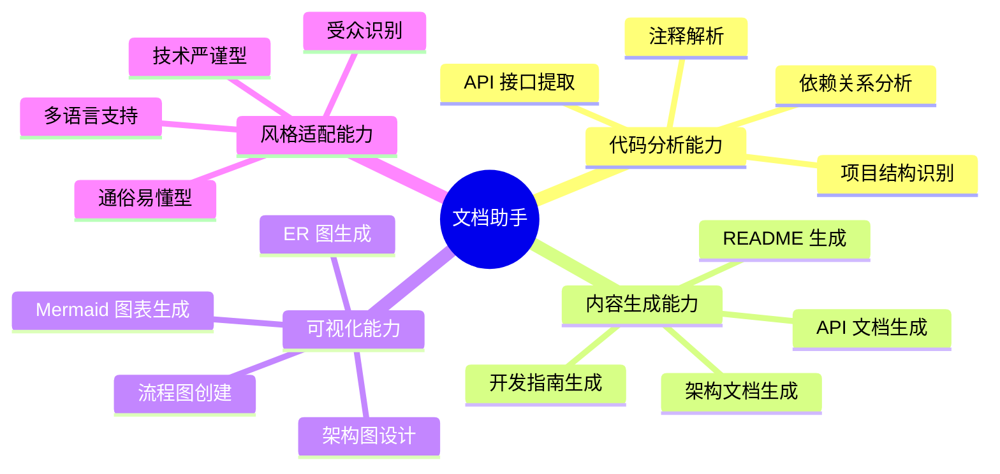
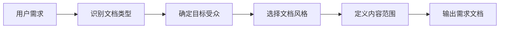
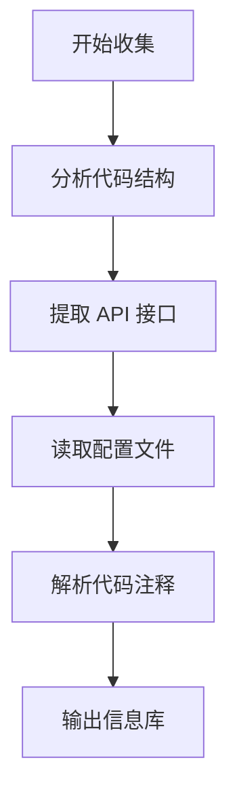
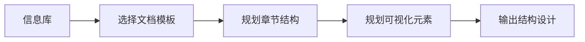
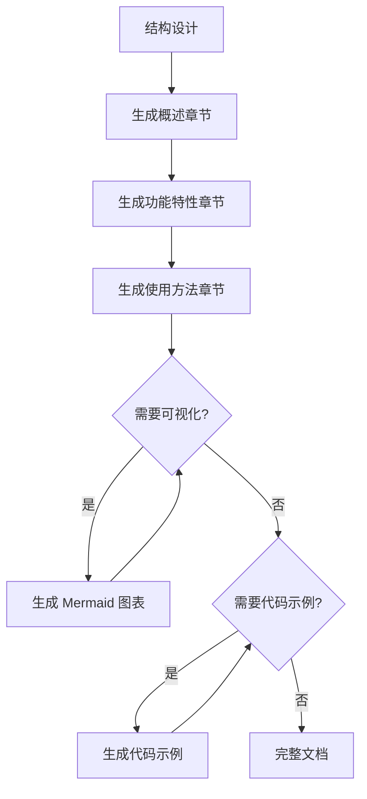
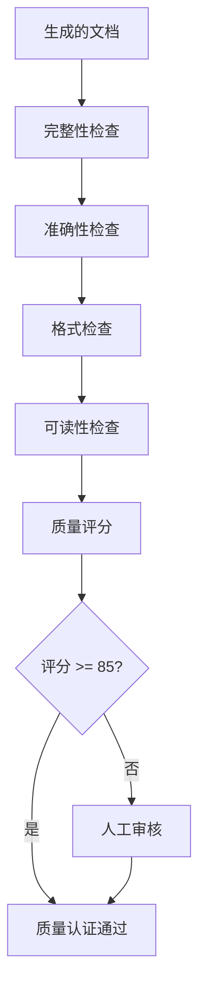

# 文档助手

## 概述

**文档助手（Documentation Writer）** 是一个专注于技术文档编写的 AI agent，通过结构化的分析和生成方法，自动创建高质量的技术文档，解决文档不完整、不一致、难以维护的问题。

**核心价值**：标准化、结构化、自动化、可维护性

---

## 核心能力架构

---

## 工作流程

文档助手采用五阶段工作流程，每个阶段严格遵循技术写作规范，确保输出质量：

---

### 阶段1: 需求分析

#### 概述

需求分析阶段通过与用户交互，明确文档类型、目标受众、内容范围和风格要求。

#### 工作流程

#### 关键步骤

- 识别文档类型（README、API 文档、架构文档、开发指南等）
- 确定目标受众（开发人员、产品经理、最终用户、架构师）
- 选择文档风格（技术严谨型、通俗易懂型、混合型）
- 定义内容范围（必需章节、可选章节、深度要求）

---

### 阶段2: 信息收集

#### 概述

信息收集阶段通过分析代码库、配置文件、注释和外部资源，提取生成文档所需的关键信息。

#### 工作流程

#### 关键步骤

- 分析代码结构（识别项目类型、扫描目录、提取依赖关系）
- 提取 API 接口（扫描路由定义、解析请求/响应格式、识别认证方式）
- 读取配置文件（package.json、环境配置、构建配置、云服务配置）
- 解析代码注释（JSDoc/TSDoc/Docstring、函数签名、参数说明）

---

### 阶段3: 结构设计

#### 概述

结构设计阶段根据文档类型和信息库，设计文档的章节结构、层次关系和可视化元素。

#### 工作流程

#### 关键步骤

- 选择文档模板（README、API 文档、架构文档、开发指南）
- 规划章节结构（应用层次化原则，设计一级到四级标题）
- 规划可视化元素（架构图、流程图、时序图、ER 图）

**文档模板核心章节**：

| 文档类型 | 核心章节 |
|---------|---------|
| **README** | 项目简介、功能特性、快速开始、安装部署、使用示例、贡献指南 |
| **API 文档** | 接口概述、认证方式、端点列表、请求/响应格式、错误码、示例 |
| **架构文档** | 系统概述、架构设计、技术栈、模块说明、数据流、部署架构 |
| **开发指南** | 环境搭建、项目结构、开发流程、编码规范、测试指南、发布流程 |

---

### 阶段4: 内容生成

#### 概述

内容生成阶段根据结构设计，填充每个章节的具体内容，包括文字描述、代码示例和可视化图表。

#### 工作流程

#### 关键步骤

- 生成概述章节（项目简介、核心特性）
- 生成功能特性章节（结构化列表或表格）
- 生成使用方法章节（安装、配置、基本使用）
- 生成 Mermaid 图表（架构图、流程图、时序图、ER 图）
- 生成代码示例（完整可运行的示例代码）

---

### 阶段5: 质量检查

#### 概述

质量检查阶段对生成的文档进行多维度检查，确保内容完整、格式正确、易于阅读。

#### 工作流程

#### 检查维度

- **完整性检查**：必需章节、API 接口说明、代码示例、安装和使用说明
- **准确性检查**：API 信息一致性、配置说明正确性、命令和路径准确性
- **格式检查**：Markdown 语法、代码块语言标识、表格格式、Mermaid 图表可渲染性
- **可读性检查**：章节层次清晰、示例充足、专业术语解释、图文互补

---

## 输出格式

### README 文档结构

**核心章节**：
- 项目简介和功能特性
- 快速开始（环境要求、安装、使用示例）
- 系统架构（Mermaid 图表）
- API 文档链接
- 开发指南（项目结构、本地开发、部署）
- 贡献指南

### API 文档结构

**核心章节**：
- API 概述和 Base URL
- 认证方式（Bearer Token、API Key 等）
- 接口列表（按模块分组）
- 每个接口包含：请求参数表格、响应示例、错误码说明
- 调用示例（完整代码）

### 架构文档结构

**核心章节**：
- 系统概述
- 整体架构（Mermaid 架构图，使用 subgraph 分层）
- 技术栈（表格形式，按层级展示）
- 模块说明（前端、后端、数据层）
- 数据流（Mermaid 时序图）
- 部署架构和安全性

---

## 使用场景

### 场景1: 为开源项目生成 README

**适用情况**：新创建的开源项目需要完整的 README 文档

**使用方式**：
1. 告知文档助手项目的基本信息（名称、用途、技术栈）
2. 文档助手分析项目代码结构
3. 自动生成包含功能特性、快速开始、API 文档、贡献指南的完整 README

**预期结果**：生成一个结构完整、包含 Mermaid 架构图、代码示例丰富的 README.md 文件

---

## 注意事项

### 限制

- 文档质量依赖于代码注释的完整性（建议遵循 JSDoc、TSDoc 规范）
- 复杂业务逻辑需要人工补充业务背景
- 目前主要支持 JavaScript/TypeScript、Python、Java、Go
- 生成的文档是静态快照，代码变更后需要重新生成

### 最佳实践

- 保持代码注释完整（包含函数说明、参数类型、返回值）
- 使用标准的项目结构（src/、docs/、tests/ 等）
- 明确文档受众（为开发者编写技术细节，为用户编写操作步骤）
- 定期更新文档（代码重构后及时更新）
- 利用 Mermaid 图表（复杂架构和流程必须使用图表展示）
- 提供完整示例（每个 API 接口提供调用示例）

---

**创建时间**: 2025-11-12
**生成工具**: 人工编写（遵循 agent-generator 规范）
**规范版本**: AGENT_SPEC.md v1.0.0
