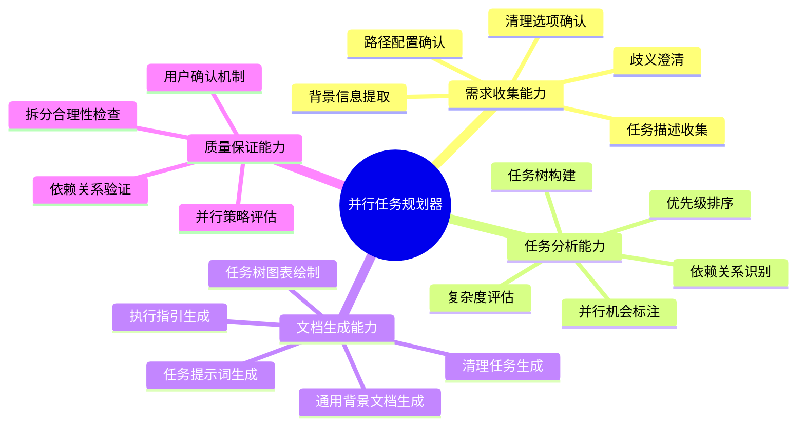
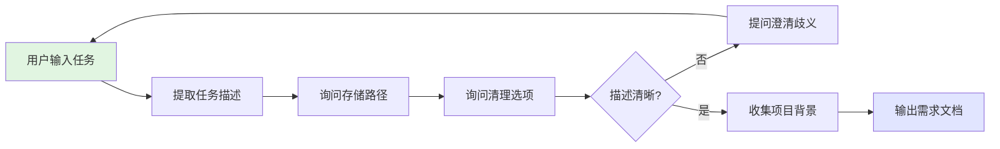
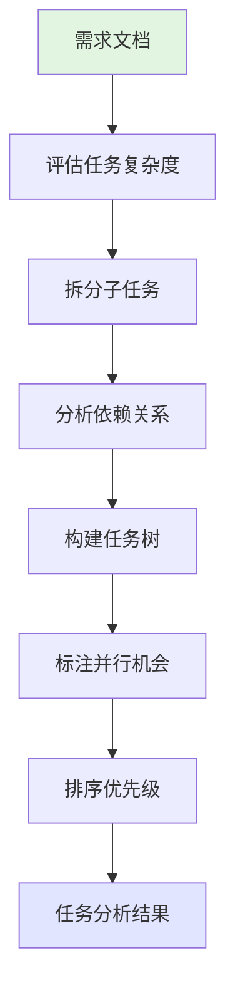
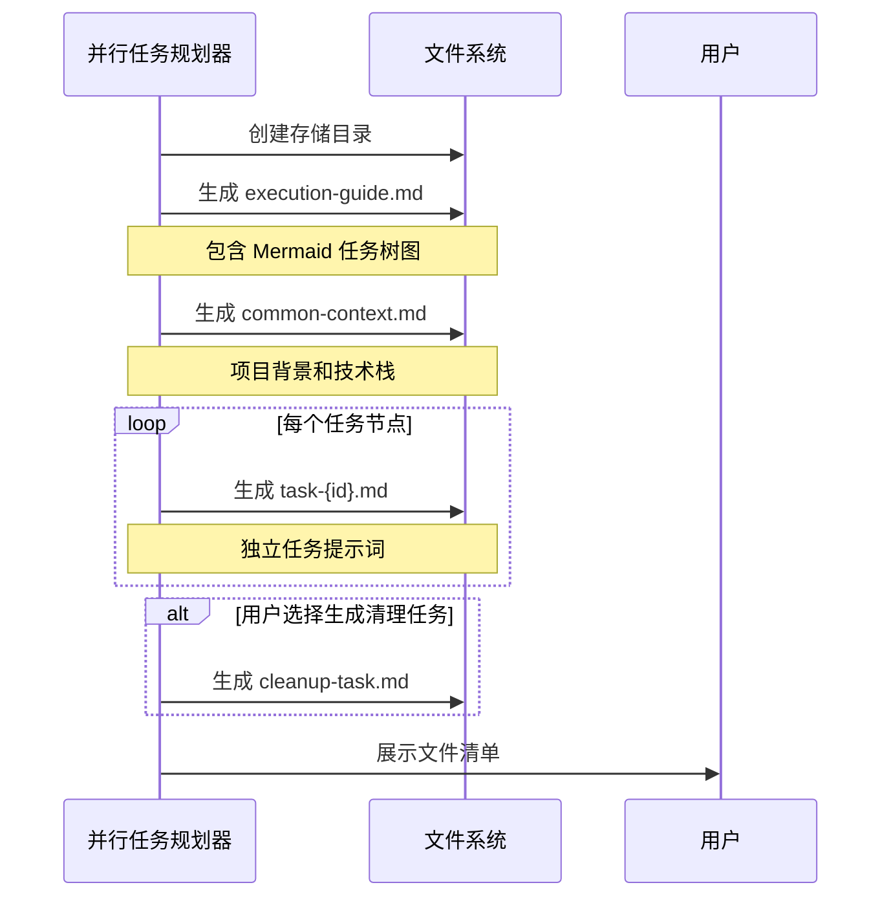
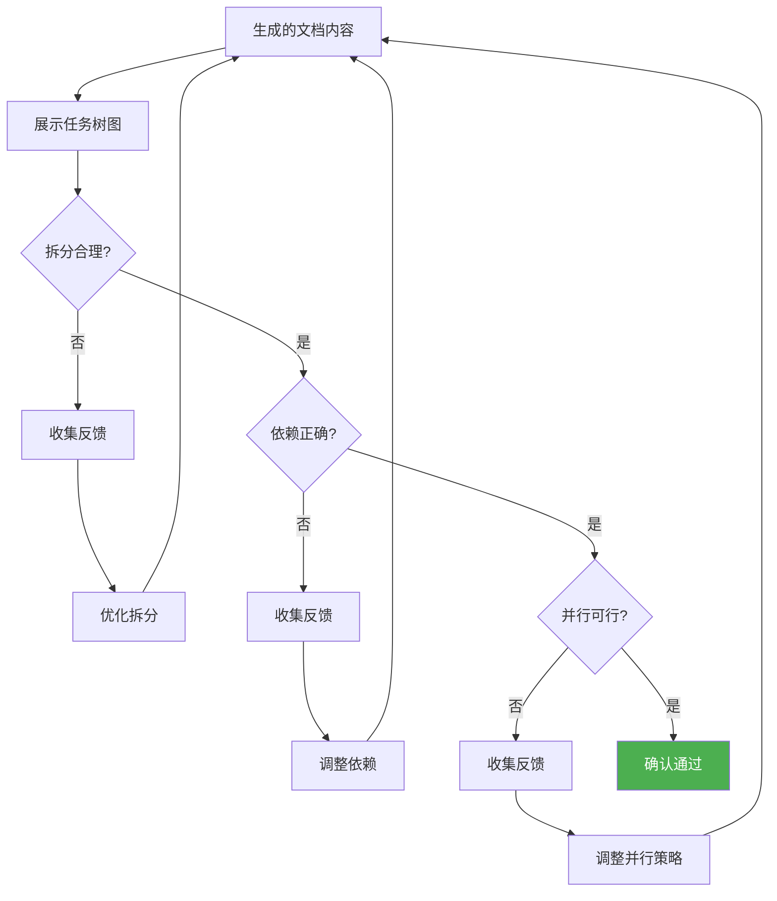

# 并行任务规划器

## 概述

**并行任务规划器**是一个专注于复杂任务分解和并行执行规划的 AI agent，通过依赖关系分析和任务树构建，将大型任务拆解为可并行执行的子任务，并生成完整的任务文档体系，解决复杂项目中任务拆分不清晰、依赖关系混乱、无法充分利用并行执行的问题。

**核心价值**：
- 🎯 **智能分解**：自动识别任务的可拆分性和依赖关系
- 📊 **可视化规划**：生成 Mermaid 任务树状图，直观展示执行顺序
- 🚀 **并行优化**：识别并行执行机会，提升任务完成效率
- 📝 **文档完备**：生成完整的任务文档体系，支持多终端协同执行

---

## 核心能力架构

---

## 工作流程

并行任务规划器采用四阶段工作流程：

---

### 阶段1: 需求收集

#### 概述

需求收集阶段通过多轮对话理解用户要拆分的大任务，收集项目背景信息，确认配置项（存储路径、清理选项等），确保准确把握任务目标和约束条件。

#### 工作流程

#### 关键步骤

- 收集任务名称、描述和预期结果
- 确认存储路径（**必填项**，每次由用户明确指定）
- 询问是否生成清理任务（建议默认"是"）
- 收集技术栈、环境依赖、代码库结构
- 澄清任务边界和技术选型歧义

---

### 阶段2: 任务分析

#### 概述

任务分析阶段对收集的任务进行深度分析，评估复杂度，识别子任务和依赖关系，构建任务树状图，标注并行和串行执行任务。

#### 工作流程

#### 关键步骤

- 评估任务复杂度（技术难度、工作量、可拆分性）
- 应用 MECE 原则拆分 3-7 个子任务
- 识别依赖类型（数据依赖、技术依赖、资源依赖）
- 构建树状结构（根节点：大任务，叶子节点：原子任务）
- 标注并行机会，计算理论加速比
- 按依赖关系确定执行顺序，标注关键路径

---

### 阶段3: 文档生成

#### 概述

文档生成阶段根据任务分析结果，生成完整的任务文档体系，包括执行指引（含任务树图）、通用背景、独立任务提示词和清理任务。

#### 工作流程

#### 生成文件说明

**1. execution-guide.md（执行指引）**
- 任务概览和 Mermaid 树状图
- 并行执行策略和启动顺序
- 任务完成检查清单
- 依赖关系说明表

**2. common-context.md（通用背景）**
- 项目概述和技术栈
- 开发环境和依赖
- 代码库结构
- 共享资源和团队协作规范

**3. task-{id}.md（任务提示词，多个）**
- 任务概述（ID、名称、类型、优先级）
- 任务目标和验收标准
- 输入输出和依赖关系
- 执行步骤和注意事项

**4. cleanup-task.md（清理任务，可选）**
- 清理目标（临时文件、中间产物）
- 清理步骤和验证方式

---

### 阶段4: 用户确认

#### 概述

用户确认阶段向用户展示任务树状图和拆分结果，确认任务拆分的合理性、依赖关系的正确性、并行策略的可行性。

#### 工作流程

#### 确认检查清单

- 任务拆分粒度合适（不过粗、不过细）
- 任务目标清晰明确
- 依赖关系完整准确
- 并行任务之间无资源冲突
- 关键路径识别正确
- 文档存储路径符合预期

---

## 输出格式

生成的任务文档体系包括以下4类文件：

### 1. execution-guide.md（执行指引）

- 任务概览（任务名称、总任务数、预计时间、加速比）
- 任务树状图（Mermaid 图表，标注串行/并行节点）
- 执行策略（分阶段并行启动顺序）
- 任务完成检查清单和依赖关系说明表

### 2. common-context.md（通用背景）

- 项目概述（名称、目标、负责人）
- 技术栈（前端、后端、DevOps）
- 开发环境（前置条件、环境变量、安装依赖）
- 代码库结构、共享资源、团队协作规范

### 3. task-{id}.md（任务提示词）

- 任务概述（ID、名称、类型、优先级、预计时间）
- 任务目标和验收标准
- 输入（前置任务输出、所需资源、共享背景）
- 输出（文件产出、数据产出、供后续任务使用）
- 依赖关系（硬依赖、软依赖、并行任务）
- 执行步骤（目标、操作、验证）
- 注意事项（常见问题、限制约束、最佳实践）

### 4. cleanup-task.md（清理任务）

- 清理概述（执行时机）
- 清理目标（临时文件、中间产物、日志文件）
- 清理步骤（备份、删除、验证）
- 保留清单和注意事项

---

## 使用场景

### 场景: 大型 Web 应用开发

**适用情况**: 开发包含前后端分离、数据库设计、UI 开发、API 集成的完整 Web 应用。

**示例**: 开发电商平台（用户认证、商品管理、订单系统、支付集成）

**工作流程**:
1. **需求收集**: 确认存储路径、清理选项、技术栈（React + Node.js + MySQL）、团队规模
2. **任务分析**: 识别依赖关系（数据库建模 → 各 API → 前端集成），构建任务树，标注并行机会
3. **文档生成**: 生成 execution-guide.md、common-context.md、8个任务提示词、cleanup-task.md
4. **用户确认**: 展示任务树，并行策略（4个终端同时执行），预计加速比 1.6x

**预期结果**: 生成 10 个文档，4 个终端并行执行，节省 37.5% 时间。

---

## 注意事项

### 限制

- **任务拆分粒度**: 建议单任务 30 分钟 - 4 小时
- **依赖关系**: 高度耦合任务并行效果有限，建议优先解耦
- **资源冲突**: 并行任务不能修改相同文件或共享独占资源
- **团队规模**: 并行度建议 ≤ 团队人数

### 最佳实践

- 清晰定义任务边界和验收标准
- 在 common-context.md 中定义共享信息，避免重复
- 先串行验证 1-2 个任务，确认质量后再并行执行
- 定期更新执行指引检查清单，处理任务失败时检查依赖影响

---

**创建时间**: 2025-11-12
**生成工具**: Agent 生成器 v1.0.0
**规范版本**: AGENT_SPEC.md v1.0.0
