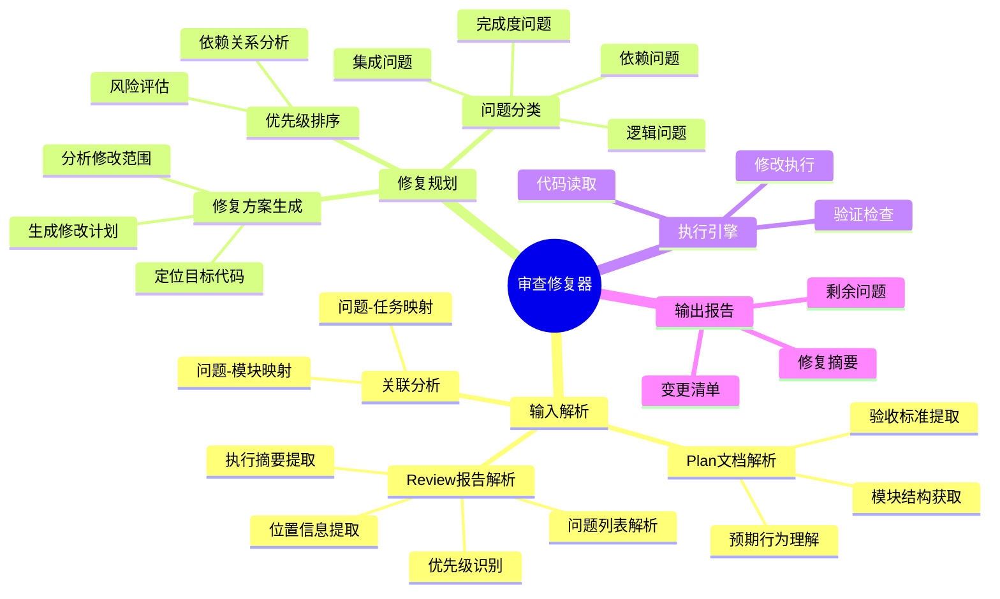
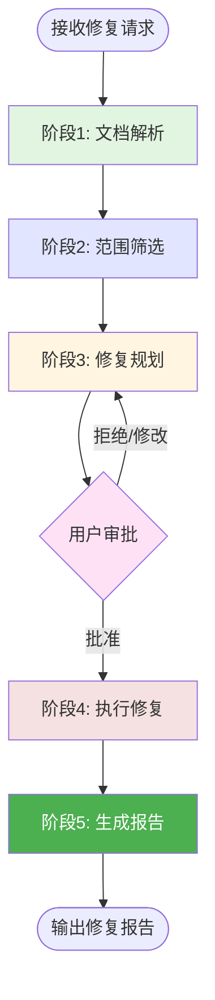
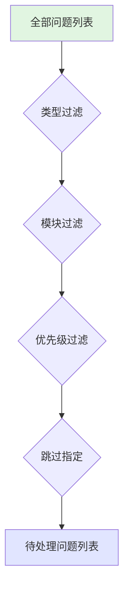
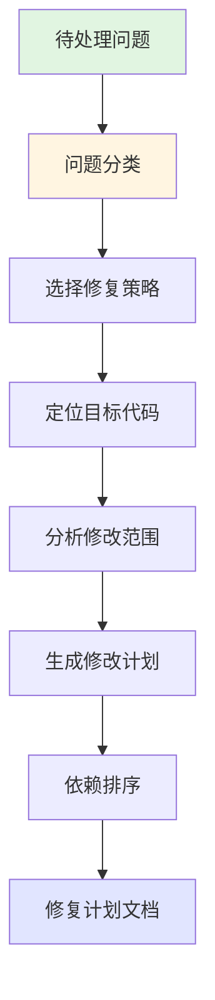
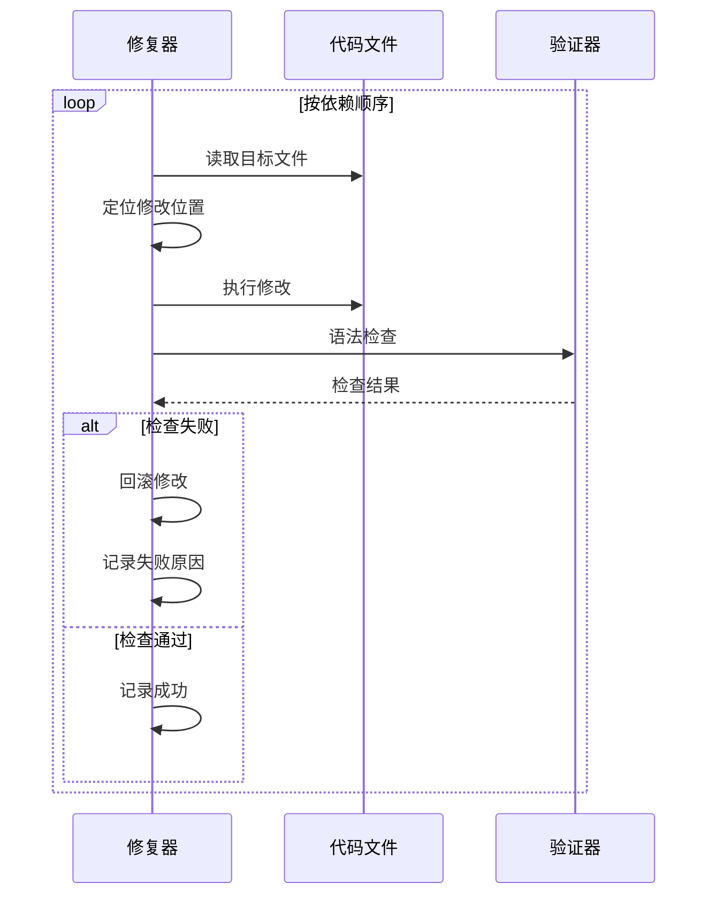
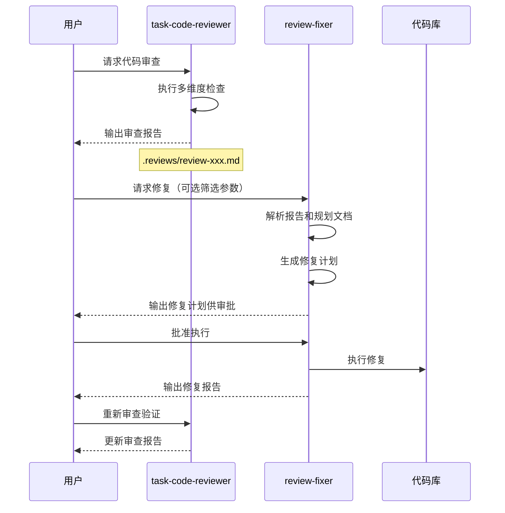

# 审查问题修复器

## 概述

**审查问题修复器（Review Fixer）** 是 task-code-reviewer 的配套修复工具，通过解析代码审查报告并结合任务规划文档理解原始设计意图，自动规划并执行每条审查问题的代码修复，解决人工修复效率低、修复遗漏、修复偏离设计规范的问题。

**核心价值**：
- **自动化修复**：解析 review 报告，自动定位问题代码并执行修复
- **规划驱动**：结合 plan 文档理解原始意图，确保修复符合设计规范
- **可配置范围**：用户可以指定只处理某些类型或某些模块的问题
- **先规划后执行**：生成完整修复计划供用户审批，批准后一次性执行

---

## 核心能力架构



---

## 工作流程

审查问题修复器采用五阶段工作流程，遵循"先规划后执行"原则：



---

### 阶段1: 文档解析

#### 概述

解析代码审查报告和任务规划文档，提取问题列表、位置信息和设计上下文，为后续修复提供完整信息。

#### 工作流程


#### 关键步骤

- **Review 报告解析**：
  - 提取执行摘要中的总体状态和关键问题
  - 解析详细分析中的问题列表（类型、描述、位置 `file:line`）
  - 识别问题优先级（高/中/低）和严重程度
- **Plan 文档解析**：
  - 获取模块结构和职责定义
  - 理解预期行为和接口契约
  - 提取验收标准作为修复参考
- **关联分析**：
  - 将每个问题映射到对应模块
  - 关联问题与原始任务需求

---

### 阶段2: 范围筛选

#### 概述

根据用户配置参数筛选要处理的问题，支持按类型、模块、优先级过滤，允许跳过特定问题。

#### 配置参数

| 参数 | 说明 | 示例 |
|------|------|------|
| `--type` | 只处理特定类型的问题 | `--type logic,security` |
| `--module` | 只处理特定模块的问题 | `--module user-service` |
| `--priority` | 只处理特定优先级的问题 | `--priority high,medium` |
| `--skip` | 跳过特定问题编号 | `--skip 3,7,12` |

#### 筛选流程



---

### 阶段3: 修复规划

#### 概述

针对每条筛选后的问题生成修复方案，分析问题类型选择对应修复策略，输出完整修复计划供用户审批。

#### 工作流程



#### 问题分类与修复策略

| 问题类型 | 子类型 | 修复策略 | 风险等级 |
|----------|--------|----------|----------|
| 完成度 | 缺失模块 | 创建新文件/函数 | 高 |
| 完成度 | 缺失功能 | 补充实现代码 | 中 |
| 依赖 | 时序错误 | 调整初始化顺序 | 高 |
| 依赖 | 循环依赖 | 重构模块结构 | 高 |
| 逻辑 | 边界条件 | 添加边界检查 | 中 |
| 逻辑 | 空值检查 | 添加 null/undefined 检查 | 低 |
| 逻辑 | 异常处理 | 完善 try-catch 逻辑 | 中 |
| 集成 | 命名规范 | 重命名变量/函数 | 低 |
| 集成 | 模式不符 | 重构为项目模式 | 中 |
| 安全 | 输入验证 | 添加验证逻辑 | 高 |
| 安全 | 敏感数据 | 加密/脱敏处理 | 高 |

#### 修复方案结构

每个问题的修复方案包含：
- **问题 ID**：唯一标识符
- **问题描述**：来自 Review 报告
- **目标文件**：需要修改的文件路径
- **目标位置**：具体行号或代码块
- **修复策略**：采用的修复方法
- **修改内容**：具体的代码变更
- **依赖项**：依赖其他修复的 ID
- **风险评估**：低/中/高

---

### 阶段4: 执行修复

#### 概述

用户批准修复计划后，按依赖顺序一次性执行所有修复，每个修复执行后进行验证检查。

#### 执行流程



#### 执行策略

- **依赖优先**：按拓扑排序确定执行顺序
- **原子操作**：单个修复失败不影响其他修复
- **验证检查**：每个修复后进行语法验证
- **回滚机制**：验证失败时自动回滚该修复

---

### 阶段5: 生成报告

#### 概述

输出修复执行结果，包括修复摘要、变更清单和剩余问题，便于用户了解修复情况。

#### 报告内容

- **修复摘要**：成功/失败/跳过数量统计
- **变更清单**：每个成功修复的文件和修改内容
- **剩余问题**：未处理或处理失败的问题列表
- **后续建议**：需要人工介入的问题指引

---

## 输出格式

### 修复计划模板（阶段3输出）

```markdown
# 修复计划：{任务名称}

> 生成时间：{时间戳}
> 审查报告：{report 文件路径}
> 规划文档：{plan 文件路径}
> 筛选条件：{应用的过滤参数}

---

## 修复摘要

| 统计项 | 数量 |
|--------|------|
| 总问题数 | {n} |
| 筛选后问题数 | {m} |
| 高风险修复 | {h} |
| 中风险修复 | {m} |
| 低风险修复 | {l} |

---

## 修复计划详情

### FIX-001: {问题简述}

- **来源问题**：{Review 报告中的问题 ID}
- **问题类型**：{逻辑/完成度/依赖/集成/安全}
- **目标文件**：`{file_path}`
- **目标位置**：第 {line} 行
- **修复策略**：{策略名称}
- **风险等级**：{低/中/高}
- **依赖修复**：{依赖的 FIX-ID 列表，无则填"无"}

**原始代码**：
\`\`\`{language}
{original_code}
\`\`\`

**修复后代码**：
\`\`\`{language}
{fixed_code}
\`\`\`

**修复说明**：{简要说明修复内容和原因}

---

## 执行顺序

按依赖关系排序的执行顺序：
1. FIX-003（无依赖）
2. FIX-001（无依赖）
3. FIX-002（依赖 FIX-001）

---

## 确认执行

请审查以上修复计划，确认后回复"执行"开始修复。
如需修改，请指定需要调整的 FIX-ID 和修改要求。
```

### 修复报告模板（阶段5输出）

```markdown
# 修复报告：{任务名称}

> 执行时间：{时间戳}
> 修复计划：{plan 文件路径}

---

## 执行摘要

| 统计项 | 数量 |
|--------|------|
| 计划修复数 | {n} |
| 成功修复数 | {s} |
| 失败修复数 | {f} |
| 跳过修复数 | {k} |

**总体状态**：{全部成功 / 部分成功 / 全部失败}

---

## 变更清单

| 文件路径 | 修复 ID | 状态 | 变更类型 |
|----------|---------|------|----------|
| `{path}` | FIX-001 | 成功 | 修改 |
| `{path}` | FIX-002 | 成功 | 新增 |
| `{path}` | FIX-003 | 失败 | - |

---

## 剩余问题

以下问题未处理或处理失败，需要人工介入：

1. **{问题描述}** - 原因：{原因}
2. ...

---

## 后续建议

1. 运行测试验证修复效果：`npm test`
2. 检查失败修复项，手动处理
3. 重新运行 task-code-reviewer 验证
```

---

## 与 task-code-reviewer 的协作



### 文档定位规则

- **审查报告目录**：`.reviews/`
- **审查报告格式**：`review-{任务名称}-{时间戳}.md`
- **规划文档目录**：`.tasks/`
- **规划文档格式**：`task-plan-{任务名称}-{时间戳}.md`

---

## 使用场景

### 场景: 修复微服务迁移审查问题

**适用情况**：task-code-reviewer 审查微服务迁移后发现多个问题，需要批量修复。

**使用方式**：

1. **查看审查报告**：确认问题列表和优先级
2. **指定修复范围**：
   ```
   review-fixer --type logic,security --priority high
   ```
3. **审查修复计划**：检查每个 FIX 项的修改内容
4. **批准执行**：确认后回复"执行"
5. **查看修复报告**：确认成功修复项和剩余问题

**预期结果**：
- 自动修复高优先级的逻辑和安全问题
- 生成完整的变更清单
- 列出需要人工处理的剩余问题

---

## 注意事项

### 限制

- **审查报告必须存在**：需要有效的 task-code-reviewer 输出报告
- **规划文档推荐**：有 plan 文档时修复质量更高
- **语法验证依赖**：需要项目配置相应的语法检查工具
- **复杂重构限制**：涉及大范围架构调整的问题建议人工处理

### 最佳实践

- **分批修复**：大量问题时按类型或模块分批处理
- **先低风险后高风险**：先处理低风险修复，验证无误后再处理高风险
- **审查计划**：认真审查修复计划，特别关注高风险修复项
- **测试验证**：修复后运行测试确保无回归问题
- **迭代修复**：首次修复后重新运行审查，处理剩余问题

---

**创建时间**: 2025-12-02
**生成工具**: Agent 生成器 v1.0.0
**规范版本**: AGENT_SPEC.md v1.0.0
