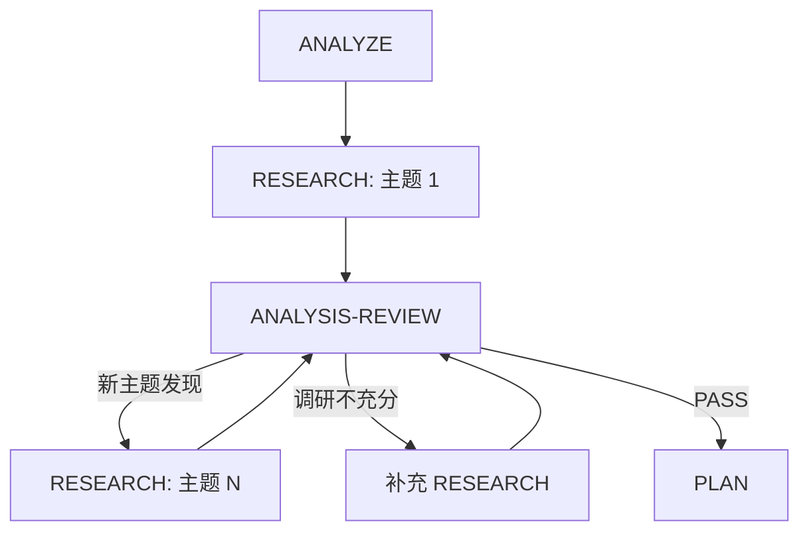

# Workflow Plan

将需求规范转化为技术计划：ANALYZE → RESEARCH ⟷ ANALYSIS-REVIEW（迭代循环）→ PLAN → REVIEW → VALIDATE

---

## 🚀 执行流程

**当此 skill 被触发时，你必须按以下流程执行：**

### 立即行动

1. 验证 `.workflow/{feature}/specify/spec.md` 存在且 status: approved
2. **询问用户审查方式**：使用 AskUserQuestion 让用户选择:
   - **选项 1: Codex 审查**（推荐）- 使用 /codex skill 进行高质量审查
   - **选项 2: 独立 Agent 审查** - 使用 Task 工具启动独立审查 Agent
3. 记录审查方式到 `.state.yaml`
4. 创建目录: `.workflow/{feature}/plan/`
5. 开始 Phase 1: ANALYZE

### 📋 进度追踪 Checklist

**复制此清单并逐项完成：**

```
- [ ] Phase 1: ANALYZE → 输出: analyze/analysis.md（识别调研主题）
- [ ] Phase 2: RESEARCH → 输出: research/{topic}/research.md（独立调研文档）
- [ ] Phase 3: ANALYSIS-REVIEW → 判定: 是否需要继续调研
      ↳ 循环: RESEARCH ⟷ ANALYSIS-REVIEW 直到所有调研完成
- [ ] Phase 4: PLAN → 输出: plan.md（草稿）
- [ ] Phase 5: REVIEW → 判定: PASS 进入下一阶段
- [ ] Phase 6: VALIDATE → 输出: plan.md（status: approved）
```

### ✅ 阶段完成验证

| 阶段 | 完成条件 | 下一步 |
|------|----------|--------|
| ANALYZE | `analyze/analysis.md` 存在，调研主题已识别 | → RESEARCH |
| RESEARCH | 当前主题的 `research/{topic}/research.md` 存在，evidence 完整 | → ANALYSIS-REVIEW |
| ANALYSIS-REVIEW | 判定调研充分性 | 充分 → PLAN / 不充分 → RESEARCH（新主题或补充） |
| PLAN | `plan.md` 草稿存在 | → REVIEW |
| REVIEW | 判定 PASS | → VALIDATE |
| VALIDATE | 用户批准，status: approved | → 结束 |

---

## ⚠️ 职责边界

**你必须做**:
- ✅ 设计系统架构和模块划分
- ✅ 确定技术选型和理由
- ✅ 评估技术风险
- ✅ 记录架构决策 (ADR)
- ✅ 分析技术依赖关系
- ✅ 定义架构层面的安全和可观测性策略

**你严禁做**:
- ❌ 拆解具体实施任务和步骤（由 `/workflow-task` 负责）
- ❌ 定义详细的测试用例和验收标准（由 `/workflow-task` 负责）
- ❌ 制定上线、迁移、回滚的具体操作步骤（由 `/workflow-task` 负责）
- ❌ 编写具体的性能测试计划（由 `/workflow-task` 负责）
- ❌ 规划项目进度和资源分配（由 `/workflow-task` 负责）

**边界原则**: 只做架构设计和技术决策（HOW架构），不做任务拆解和实施计划（HOW实施）。实施细节由 `/workflow-task` 负责。

---

## Phase 详情

### Phase 1: ANALYZE（需求分析）

**你必须：**
1. 读取 spec.md，解析功能需求 (FR) 和非功能需求 (NFR)
2. 识别技术约束和依赖
3. 标记需要架构决策的点
4. **识别需要调研的技术主题**（每个主题将生成独立的调研文档）
5. 使用 [assets/analysis-template.md](assets/analysis-template.md) 创建 `analyze/analysis.md`

**调研主题识别原则**:
- 每个主题应该是独立的、可单独调研的
- 主题粒度适中：不要太大（无法在一次调研中完成），不要太小（没有调研价值）
- 明确每个主题的核心问题和评估维度

**完成标志**: `analyze/analysis.md` 存在，且包含明确的调研主题列表

---

### Phase 2: RESEARCH（独立技术调研）

> **核心原则**: 遵循 `/research` skill 标准，每个调研主题生成**完整独立**的调研文档

**你必须：**
1. **单一职责**: 每个调研只关注一个主题，不考虑与当前项目背景的整合
2. **独立目录**: 为每个调研主题创建独立目录 `research/{topic-slug}/`
3. **完整流程**: 按 `/research` skill 的 5 阶段执行:
   - SCOPE → GATHER → ANALYZE → COMPARE → RECOMMEND
4. **必须有 evidence**: 每次搜索/分析**必须**记录证据到 `research/{topic}/evidence/evidence-{N}.md`
5. **输出**: 生成完整的 `research/{topic}/research.md`

**调研目录结构**:
```
research/
├── {topic-1}/
│   ├── evidence/
│   │   ├── evidence-1.md    # 必须有内容
│   │   ├── evidence-2.md    # 必须有内容
│   │   └── ...
│   └── research.md          # 完整调研报告
├── {topic-2}/
│   ├── evidence/
│   │   └── ...
│   └── research.md
└── summary.md               # 所有调研的汇总索引
```

**调研文档标准**（参照 `/research` skill）:

| 阶段 | 目标 | 必须输出 |
|------|------|----------|
| SCOPE | 明确调研范围和评估维度 | 范围说明、评估维度列表 |
| GATHER | 收集技术资料和证据 | evidence 文件（≥2 个） |
| ANALYZE | 分析各方案优缺点 | 方案分析表 |
| COMPARE | 生成对比表和可视化 | 对比表、Mermaid 图 |
| RECOMMEND | 输出结论和建议 | 推荐结论、Sources 列表 |

**Evidence 强制要求**:
- 每个调研主题**至少 2 个** evidence 文件
- 每个 evidence 必须包含: 搜索关键词/URL、关键发现、来源、证据等级
- 调研报告中的每个结论都必须引用对应的 evidence（如 `[E-1][E-2]`）

**完成标志**: `research/{topic}/research.md` 存在，evidence 目录非空且每个调研结论有对应证据

---

### Phase 3: ANALYSIS-REVIEW（调研分析审查）

> **核心目的**: 评估当前调研是否充分，决定是否需要继续调研

**你必须：**
1. **分析调研结果**: 读取已完成的调研报告
2. **评估充分性**: 检查以下维度:
   - 所有 ANALYZE 阶段识别的调研主题是否都已完成
   - 每个调研是否有足够的 evidence 支撑
   - 每个调研结论是否有对应的证据引用
   - 是否发现了新的需要调研的主题
3. **判定下一步**:

**判定规则**:

| 判定 | 条件 | 下一步 |
|------|------|--------|
| **CONTINUE_RESEARCH** | 发现新的调研主题 或 现有调研不充分 | → 回到 RESEARCH（处理新主题或补充现有调研） |
| **PASS** | 所有调研主题完成，evidence 充分，结论有据可依 | → PLAN |

**审查清单**:
- [ ] 所有 P0/P1 调研主题都已完成
- [ ] 每个调研报告的 evidence 目录有内容（≥2 个文件）
- [ ] 每个调研结论都引用了 evidence
- [ ] 没有遗漏的关键调研点
- [ ] 没有发现新的需要调研的主题

**迭代循环流程图**:



**完成标志**: 判定为 PASS，所有调研充分且 evidence 完整

---

### Phase 4: PLAN（架构设计）

**你必须：**
1. **整合调研结果**: 读取 `research/summary.md` 和各主题调研报告
2. 设计系统整体架构，生成 Mermaid 架构图
3. 确定技术选型（基于调研结论，引用具体调研报告）
4. 评估技术风险（3-5 个关键风险）
5. 记录架构决策（ADR）
6. 定义架构层面的安全和可观测性策略
7. 使用 [assets/plan-template.md](assets/plan-template.md) 创建 `plan.md`

**严禁行为**:
- ❌ 拆解具体的开发任务和实施步骤
- ❌ 编写详细的测试计划和测试用例
- ❌ 制定上线/迁移/回滚的操作清单
- ❌ 规划项目时间线和里程碑
- ❌ 定义具体的性能测试指标和方法

**完成标志**: `plan.md` 草稿存在且包含架构图，技术选型引用了调研结论

---

### Phase 5: REVIEW（设计审查）

**你必须：**
1. 根据用户在"立即行动"阶段选择的审查方式执行:
   - **Codex 审查**: 使用 Skill 工具调用 `/codex` skill，传递 plan.md 路径
   - **独立 Agent 审查**: 使用 Task 工具启动独立审查 Agent
2. 审查内容:
   - 架构覆盖度充分
   - 技术选型一致性（与调研结论一致）
   - 风险评估合理性
   - ADR 完整性
   - **调研证据支撑**（检查技术选型是否有对应的调研和 evidence 支持）
   - **无实施细节越界**（检查是否出现任务拆解、测试计划、上线步骤等内容）
3. 创建 `reviews/round-{N}/review-response.md`

**判定规则**:
- **PASS**: 覆盖度 ≥ 95% → VALIDATE
- **NEEDS_PLAN**: 设计需修改 → 回退 PLAN
- **NEEDS_RESEARCH**: 需更多调研 → 回退 ANALYSIS-REVIEW → 可能触发新的 RESEARCH

**CRITICAL 级别问题包括**:
- 出现具体的实施任务拆解（如"第一步做X，第二步做Y"）
- 包含详细的测试用例或验收标准
- 制定了上线/迁移/回滚的操作步骤
- 技术选型没有对应的调研报告或 evidence 支持

**完成标志**: 判定为 PASS

---

### Phase 6: VALIDATE（用户批准）

**你必须：**
1. 生成输出概要（关键信息摘要，≤200 字）
2. 输出文档链接：
   - 使用 Markdown 链接格式：`[plan.md](.workflow/{feature}/plan/plan.md)`
   - 用户可点击跳转到完整文档
3. 通过 AskUserQuestion 请求用户批准
4. 更新 plan.md frontmatter: `status: approved`
5. 更新 `.state.yaml`

**概要格式**:
```
## 📄 技术计划已完成

**核心内容**:
- 架构模式: {架构类型}
- 技术栈: {主要技术选型}
- 关键风险: {风险数量} 个
- ADR 记录: {决策数量} 个
- 调研主题: {调研数量} 个（含 {evidence 总数} 个证据）

**详细文档**: [plan.md](.workflow/{feature}/plan/plan.md)
**调研报告**: [research/](.workflow/{feature}/plan/research/)
```

**完成标志**: plan.md 状态为 approved

---

## 目录结构

```
.workflow/{feature}/plan/
├── analyze/
│   └── analysis.md              # 需求分析（含调研主题）
├── research/
│   ├── {topic-1}/               # 调研主题 1（独立目录）
│   │   ├── evidence/
│   │   │   ├── evidence-1.md    # 必须有内容
│   │   │   ├── evidence-2.md    # 必须有内容
│   │   │   └── ...
│   │   └── research.md          # 完整调研报告
│   ├── {topic-2}/               # 调研主题 2
│   │   ├── evidence/
│   │   │   └── ...
│   │   └── research.md
│   └── summary.md               # 所有调研的汇总索引
├── reviews/
│   └── round-{N}/
│       └── review-response.md
├── plan.md
└── .state.yaml
```

---

## Evidence 规范

### 强制要求

| 要求 | 说明 |
|------|------|
| 每个调研 ≥2 个 evidence | 确保结论有充分证据支撑 |
| evidence 必须有内容 | 禁止空文件或占位符 |
| 结论必须引用 evidence | 格式: `[E-1]`、`[E-1][E-2]` |
| 来源可追溯 | 包含 URL、搜索关键词、访问时间 |

### Evidence 模板

使用 [assets/research/evidence-template.md](assets/research/evidence-template.md) 创建 evidence 文件。

### 证据等级

| 等级 | 来源类型 | 可信度 |
|------|----------|--------|
| A | 官方文档/标准规范 | 高 |
| B | 维护者文档/权威博客 | 中高 |
| C | 社区实践/技术博客 | 中 |
| D | 论坛讨论/个人观点 | 低 |

---

## 资源

| 资源 | 路径 | 用途 |
|------|------|------|
| 分析模板 | [assets/analysis-template.md](assets/analysis-template.md) | ANALYZE 阶段 |
| 调研模板 | [assets/research-template.md](assets/research-template.md) | RESEARCH 阶段 |
| 证据模板 | [assets/research/evidence-template.md](assets/research/evidence-template.md) | Evidence 记录 |
| 计划模板 | [assets/plan-template.md](assets/plan-template.md) | PLAN 阶段 |
| 阶段详情 | [references/phase-details.md](references/phase-details.md) | 详细子任务 |
| 审查清单 | [references/review-checklist.md](references/review-checklist.md) | REVIEW 阶段 |

---

## 集成

**输入**: `/workflow-specify` 生成的 `spec.md`（已批准）
**输出**: 供 `/workflow-task` 使用的 `plan.md`（已批准）
