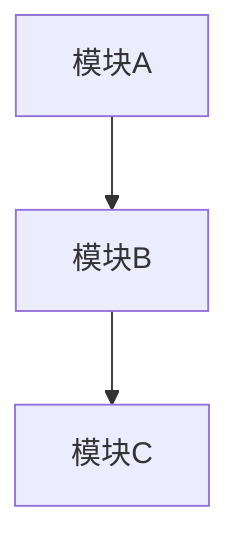

# Plan Skill 指南

## 概述

基于已批准的需求规范（spec.md）生成详细的技术计划，定义"怎么做"。

**核心价值**：将需求转化为可执行的技术方案，确保架构决策清晰、风险可控。

---

## 工作流程

```
读取 spec.md → 分析需求 → 设计架构 → 评估风险 → 生成 plan.md
```

### 阶段 1: 需求分析

**动作**:
1. 读取 `.workflow/{feature}/specify/spec.md`
2. 提取功能需求和非功能需求
3. 识别技术约束和依赖

### 阶段 2: 架构设计

**动作**:
1. 设计系统架构
2. 选择技术栈
3. 定义模块边界
4. 使用 Mermaid 生成架构图

### 阶段 3: 风险评估

**动作**:
1. 识别技术风险
2. 评估依赖风险
3. 制定缓解策略

### 阶段 4: 输出生成

**输出**: `.workflow/{feature}/plan/plan.md`

---

## 命令

```bash
# 基本用法
/workflow-plan {feature}

# 验证输入
/workflow:plan --validate {feature}

# 恢复执行
/workflow:plan --resume {feature}
```

---

## 输出结构

```
.workflow/{feature}/plan/
├── plan.md              # 技术计划文档
└── diagrams/            # 架构图（可选）
```

## plan.md 模板

```markdown
# 技术计划: {feature}

## 1. 概述
{项目背景和目标}

## 2. 架构设计

### 2.1 系统架构图


### 2.2 模块说明
| 模块 | 职责 | 依赖 |
|------|------|------|

## 3. 技术选型

| 领域 | 选型 | 理由 |
|------|------|------|

## 4. 依赖分析

### 4.1 内部依赖
### 4.2 外部依赖

## 5. 风险评估

| 风险 | 可能性 | 影响 | 缓解策略 |
|------|--------|------|----------|

## 6. 架构决策记录 (ADR)

### ADR-001: {决策标题}
- **状态**: 已采纳
- **上下文**: {背景}
- **决策**: {决策内容}
- **后果**: {影响}
```

---

## 集成

- **输入**: `/workflow-specify` 生成的 `spec.md`
- **输出**: 供 `/workflow-task` 使用的 `plan.md`

---

*待完整实现*
