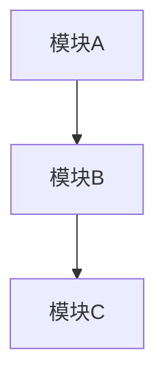

# 技术计划: {feature}

> **状态**: draft | reviewed | approved
> **Spec 版本**: {spec-version}
> **创建日期**: {date}

> **职责说明**: 本文档专注于架构设计和技术决策，不包含具体的实施步骤、测试计划或上线流程。这些内容由 workflow-task 阶段负责。

---

## 1. 概述

{项目背景和技术目标}

---

## 2. 架构设计

### 2.1 架构视角说明

- 上下文（Context）: {系统边界与外部系统}
- 容器（Container）: {主要运行单元与职责}
- 组件（Component）: {关键组件划分}
- 部署（Deployment）: {部署拓扑与环境}

### 2.2 系统架构图

### 2.3 模块说明

| 模块 | 职责 | 依赖 | 关联需求 |
|------|------|------|----------|
| A | {职责描述，不超过50字} | - | FR-01 |
| B | {职责描述，不超过50字} | A | FR-02 |

---

## 3. 技术选型

| 领域 | 选型 | 理由 | 备选方案 |
|------|------|------|----------|
| 语言 | {选型} | {至少1个技术论据} | {备选} |
| 框架 | {选型} | {至少1个技术论据} | {备选} |

---

## 4. 依赖分析

### 4.1 内部依赖

- 模块 A → 模块 B
- 模块 B → 模块 C

### 4.2 外部依赖

| 包名 | 版本 | 用途 | 维护状态 |
|------|------|------|----------|
| {包名} | {版本} | {用途} | 活跃/稳定/警告 |

---

## 5. 风险评估

| 风险 | 可能性 | 影响 | 缓解策略 |
|------|--------|------|----------|
| R1 | 低/中/高 | 低/中/高 | {策略} |
| R2 | 低/中/高 | 低/中/高 | {策略} |

---

## 6. 安全与合规考虑

- 身份与访问控制: {认证/授权/审计}
- 数据保护: {加密/脱敏/备份}
- 合规要求: {合规标准/数据驻留}

---

## 7. 可观测性策略

> **注意**: 此章节仅定义架构层面的可观测性策略，具体的实施步骤和工具配置由 workflow-task 负责。

- **指标设计**: {核心业务指标与系统健康指标}
- **日志策略**: {日志级别规划与关键事件定义}
- **链路追踪**: {需要追踪的关键业务流程}
- **告警原则**: {告警维度与严重程度分级}

---

## 8. 架构决策记录 (ADR)

### ADR-001: {决策标题}

- **状态**: 已采纳 | 待定 | 已废弃
- **上下文**: {背景描述}
- **决策**: {决策内容}
- **后果**: {影响和代价}
- **关联需求**: FR-XX, NFR-XX

### ADR-002: {决策标题}

...

---

*Generated by workflow-plan | {date}*