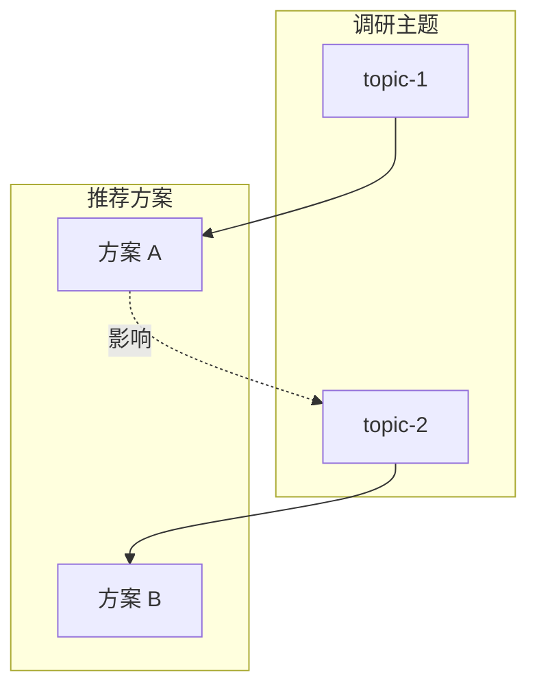

# 调研汇总: {feature}

> **生成日期**: {date}
> **调研主题数**: {count}
> **Evidence 总数**: {evidence_count}

---

## 调研主题索引

| 主题 | 优先级 | 状态 | Evidence 数 | 推荐结论 |
|------|--------|------|-------------|----------|
| [{topic-1}]({topic-1}/research.md) | P0 | 已完成 | {N} | {简要结论} |
| [{topic-2}]({topic-2}/research.md) | P1 | 已完成 | {N} | {简要结论} |

---

## 关键结论摘要

### 主题 1: {topic-1}

**核心问题**: {问题}

**推荐**: {推荐选项}

**关键理由**: {简要理由} [E-x]

**详细调研**: [{topic-1}/research.md]({topic-1}/research.md)

---

### 主题 2: {topic-2}

**核心问题**: {问题}

**推荐**: {推荐选项}

**关键理由**: {简要理由} [E-x]

**详细调研**: [{topic-2}/research.md]({topic-2}/research.md)

---

## Evidence 汇总

| 主题 | Evidence ID | 来源 | 等级 | 关键发现 |
|------|-------------|------|------|----------|
| {topic-1} | [E-1]({topic-1}/evidence/evidence-1.md) | {来源} | {等级} | {发现} |
| {topic-1} | [E-2]({topic-1}/evidence/evidence-2.md) | {来源} | {等级} | {发现} |
| {topic-2} | [E-1]({topic-2}/evidence/evidence-1.md) | {来源} | {等级} | {发现} |
| {topic-2} | [E-2]({topic-2}/evidence/evidence-2.md) | {来源} | {等级} | {发现} |

---

## 调研间关联

---

## 统计

| 指标 | 值 |
|------|-----|
| 调研主题总数 | {N} |
| P0 主题数 | {N} |
| P1 主题数 | {N} |
| Evidence 总数 | {N} |
| 等级 A/B Evidence | {N} |
| 等级 C/D Evidence | {N} |

---

*Generated by workflow-plan (RESEARCH Summary) | {date}*
