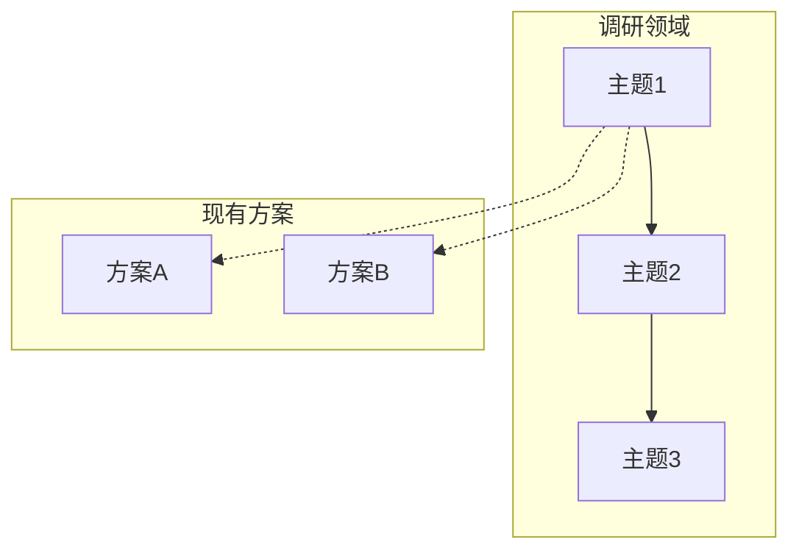
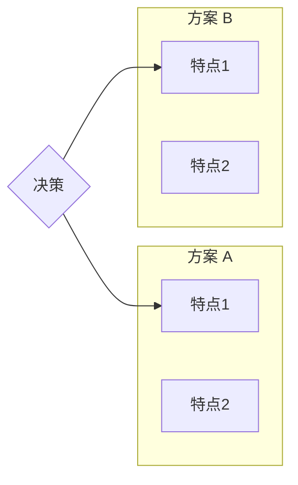

# 技术调研: {feature}

> **调研日期**: {date}
> **超时设置**: 5 分钟
> **方法论**: 自顶向下、层次递归、可视化优先

---

## 证据等级说明

| 等级 | 来源类型 | 说明 |
|------|----------|------|
| A | 标准/官方规范 | 可信度高，优先采用 |
| B | 维护者文档 | 可信度中高 |
| C | 社区实践/博客 | 需交叉验证 |
| D | 论坛观点 | 仅作参考 |

---

## 1. 整体概览

### 1.1 调研背景

{项目/技术背景概述，为什么需要调研}

### 1.2 调研范围

| 调研维度 | 涵盖内容 | 优先级 |
|----------|----------|--------|
| {维度1} | {内容} | P0/P1/P2 |
| {维度2} | {内容} | P0/P1/P2 |

### 1.3 技术全景图

---

## 2. 调研主题详情

### 主题 1: {topic}

**问题**: {具体问题}

**评价准则**: {性能/成本/维护/安全等}

**调研方法**: WebSearch / 代码分析 / 文档阅读

**调研过程**:
1. 搜索关键词: {keywords}
2. 分析来源: {sources}

**证据等级**: A/B/C/D

**置信度**: High/Med/Low

**结论**: {结论}

**建议**: {推荐方案}

**适用范围**: {适用场景/限制条件}

**参考来源**:
- [来源1](url)
- [来源2](url)

---

### 主题 2: {topic}

**问题**: {具体问题}

**评价准则**: {性能/成本/维护/安全等}

**调研方法**: WebSearch / 代码分析 / 文档阅读

**证据等级**: A/B/C/D

**置信度**: High/Med/Low

**结论**: {结论}

**建议**: {推荐方案}

**适用范围**: {适用场景/限制条件}

**参考来源**:
- [来源1](url)

---

## 3. 技术方案对比

### 3.1 方案概览

### 3.2 方案对比表

| 方案 | 优点 | 缺点 | 适用场景 | 推荐度 |
|------|------|------|----------|--------|
| 方案 A | {优点} | {缺点} | {场景} | ⭐⭐⭐ |
| 方案 B | {优点} | {缺点} | {场景} | ⭐⭐ |
| 方案 C | {优点} | {缺点} | {场景} | ⭐ |

---

## 4. 权衡决策矩阵

| 准则 | 权重 | 方案 A | 方案 B | 说明 |
|------|------|--------|--------|------|
| 性能 | 0.4 | 4 | 3 | {说明} |
| 维护成本 | 0.3 | 3 | 4 | {说明} |
| 生态成熟度 | 0.3 | 4 | 2 | {说明} |
| **加权总分** | - | **X.X** | **X.X** | {选择依据} |

---

## 5. 依赖评估

| 依赖 | 版本 | 维护状态 | 最近更新 | 风险 |
|------|------|----------|----------|------|
| {dep1} | {ver} | 活跃 | {date} | 低 |
| {dep2} | {ver} | 稳定 | {date} | 中 |

---

## 6. 实验/POC 结果（可选）

- **目标**: {验证关键假设}
- **方法**: {基准测试/原型验证}
- **结果**: {结论/数据}
- **风险**: {是否需要进一步验证}

---

## 7. 最佳实践

- **实践 1**: {描述}
- **实践 2**: {描述}
- **实践 3**: {描述}

---

## 8. 调研结论

### 8.1 决策点状态

| 决策点 | 状态 | 结论 | 置信度 |
|--------|------|------|--------|
| 决策点 1 | 已解决 | {结论} | High |
| 决策点 2 | 已解决 | {结论} | Med |
| 决策点 3 | 待讨论 | {问题} | - |

### 8.2 推荐的技术选型

| 领域 | 推荐 | 理由 | 关联决策点 |
|------|------|------|------------|
| {领域} | {选型} | {基于调研的理由} | 决策点 X |

---

## 9. 总结与展望

### 9.1 核心发现

{3-5 条核心调研发现的总结}

1. **发现 1**: {描述}
2. **发现 2**: {描述}
3. **发现 3**: {描述}

### 9.2 风险与不确定性

| 风险项 | 影响 | 缓解建议 |
|--------|------|----------|
| {风险1} | 低/中/高 | {建议} |
| {风险2} | 低/中/高 | {建议} |

### 9.3 后续建议

- [ ] {后续行动 1}
- [ ] {后续行动 2}
- [ ] {后续行动 3}

---

## 附录 A：调研过程摘要

### 子阶段执行状态

| 子阶段 | 状态 | 完成时间 | 输出文件 |
|--------|------|----------|----------|
| 1-Overview | completed/skipped | {time} | overview.md |
| 2-Current State | completed/skipped | {time} | current-state.md |
| 3-Analysis | completed/skipped | {time} | analysis.md |
| 4-Deep Dive | completed/skipped/未执行 | {time} | deep-dive.md |
| 5-Implementation | completed/skipped/未执行 | {time} | implementation.md |

### 执行模式

- **模式**: standard / quick
- **可选阶段**: 执行 / 跳过
- **跳过原因**: {如果跳过，说明原因}

---

## 附录 B：证据索引

| ID | 时间 | 阶段 | 类型 | 状态 | 关键发现 | 来源 |
|----|------|------|------|------|----------|------|
| E-1 | {time} | 1-overview | web-search | success | {发现} | {来源} |
| E-2 | {time} | 2-current-state | code-analysis | success | {发现} | {路径} |
| E-3 | {time} | 3-analysis | web-search | success | {发现} | {来源} |

> **注**: 证据详情参见 `research/evidence/evidence-{N}.md`

---

## 附录 C：参考来源汇总

### 官方来源（等级 A/B）

1. [{来源名称}]({url}) - {简要说明}
2. [{来源名称}]({url}) - {简要说明}

### 社区来源（等级 C/D）

1. [{来源名称}]({url}) - {简要说明}
2. [{来源名称}]({url}) - {简要说明}

### 代码库分析

1. `{path}` - {分析说明}

---

*Generated by workflow-plan (RESEARCH) | {date}*
