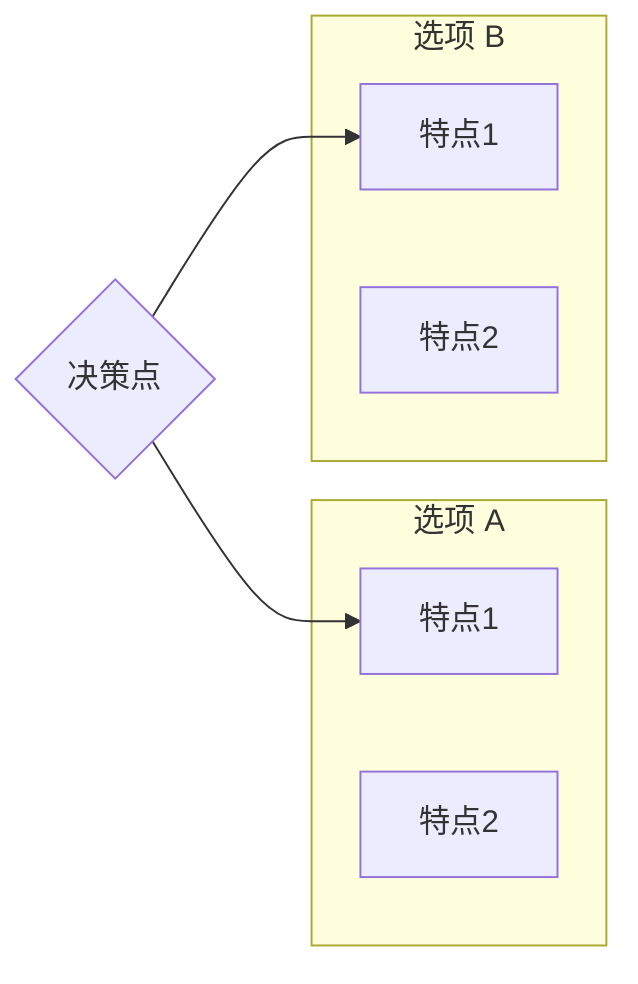

# 技术调研: {topic}

> **调研日期**: {date}
> **调研主题**: {topic}
> **方法论**: SCOPE → GATHER → ANALYZE → COMPARE → RECOMMEND

---

## 1. SCOPE（调研范围）

### 1.1 调研主题

**核心问题**: {具体问题}

### 1.2 评估维度

| 维度 | 说明 | 权重 |
|------|------|------|
| {维度1} | {说明} | {0.x} |
| {维度2} | {说明} | {0.x} |
| {维度3} | {说明} | {0.x} |

> 评估维度至少 3 个

### 1.3 约束条件

- 约束 1: {描述}
- 约束 2: {描述}

### 1.4 待比较选项

- 选项 A: {名称}
- 选项 B: {名称}
- 选项 C: {名称}（可选）

> 对比选项至少 2 个

---

## 2. GATHER（资料收集）

### 2.1 证据等级说明

| 等级 | 来源类型 | 可信度 |
|------|----------|--------|
| A | 官方文档/标准规范 | 高 |
| B | 维护者文档/权威博客 | 中高 |
| C | 社区实践/技术博客 | 中 |
| D | 论坛讨论/个人观点 | 低 |

### 2.2 收集的资料

| Evidence ID | 来源 | 类型 | 等级 | 关键发现 |
|-------------|------|------|------|----------|
| [E-1] | {来源名称} | {web-search/web-fetch/...} | {A/B/C/D} | {简要发现} |
| [E-2] | {来源名称} | {类型} | {等级} | {简要发现} |

> **重要**: 每个调研必须至少有 2 个 evidence，详见 `evidence/` 目录

---

## 3. ANALYZE（方案分析）

### 3.1 选项 A: {名称}

**概述**: {简要描述}

**优点**:
- {优点 1} [E-x]
- {优点 2} [E-x]

**缺点**:
- {缺点 1} [E-x]
- {缺点 2} [E-x]

**适用场景**: {场景描述}

**技术成熟度**: {描述}

**社区活跃度**: {描述}

### 3.2 选项 B: {名称}

**概述**: {简要描述}

**优点**:
- {优点 1} [E-x]
- {优点 2} [E-x]

**缺点**:
- {缺点 1} [E-x]
- {缺点 2} [E-x]

**适用场景**: {场景描述}

**技术成熟度**: {描述}

**社区活跃度**: {描述}

---

## 4. COMPARE（对比可视化）

### 4.1 多维度对比表

| 维度 | 选项 A | 选项 B | 说明 |
|------|--------|--------|------|
| {维度1} | ⭐⭐⭐⭐ | ⭐⭐⭐ | {说明} [E-x] |
| {维度2} | ⭐⭐⭐ | ⭐⭐⭐⭐ | {说明} [E-x] |
| {维度3} | ⭐⭐⭐⭐ | ⭐⭐ | {说明} [E-x] |

### 4.2 权衡决策矩阵

| 维度 | 权重 | 选项 A | 选项 B | 说明 |
|------|------|--------|--------|------|
| {维度1} | 0.4 | 4 | 3 | {说明} |
| {维度2} | 0.3 | 3 | 4 | {说明} |
| {维度3} | 0.3 | 4 | 2 | {说明} |
| **加权总分** | - | **X.X** | **X.X** | - |

### 4.3 关键差异可视化

---

## 5. RECOMMEND（推荐结论）

### 5.1 推荐

**推荐选项**: {选项名称}

**推荐理由**:
1. {理由 1} [E-x]
2. {理由 2} [E-x]
3. {理由 3} [E-x]

### 5.2 潜在风险

| 风险 | 可能性 | 影响 | 缓解建议 |
|------|--------|------|----------|
| {风险1} | 低/中/高 | 低/中/高 | {建议} |
| {风险2} | 低/中/高 | 低/中/高 | {建议} |

### 5.3 备选方案

**备选**: {选项名称}

**适用条件**: {在什么情况下应该考虑备选}

---

## 6. Sources

### 官方来源（等级 A/B）

1. [{来源名称}]({url}) - {简要说明}
2. [{来源名称}]({url}) - {简要说明}

### 社区来源（等级 C/D）

1. [{来源名称}]({url}) - {简要说明}
2. [{来源名称}]({url}) - {简要说明}

---

## Evidence 索引

| ID | 文件 | 类型 | 等级 | 关键发现 |
|----|------|------|------|----------|
| E-1 | [evidence-1.md](evidence/evidence-1.md) | {类型} | {等级} | {发现} |
| E-2 | [evidence-2.md](evidence/evidence-2.md) | {类型} | {等级} | {发现} |

> **注意**: 所有 evidence 详情请参见 `evidence/` 目录

---

*Generated by workflow-plan (RESEARCH) | {date}*
