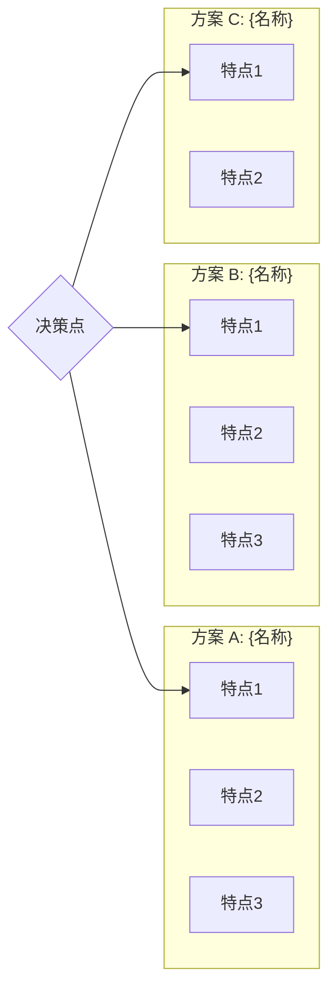

# 3-Analysis: 方案分析

> **阶段**: 3-Analysis（必选）
> **目标**: 对比方案、建立权衡矩阵、形成推荐

---

## 3.1 方案概览图



---

## 3.2 方案对比表

| 维度 | 方案 A | 方案 B | 方案 C |
|------|--------|--------|--------|
| **核心优势** | {优势} | {优势} | {优势} |
| **主要劣势** | {劣势} | {劣势} | {劣势} |
| **性能** | {评价} | {评价} | {评价} |
| **学习曲线** | {评价} | {评价} | {评价} |
| **社区活跃度** | {评价} | {评价} | {评价} |
| **维护成本** | {评价} | {评价} | {评价} |
| **适用场景** | {场景} | {场景} | {场景} |
| **推荐度** | ⭐⭐⭐ | ⭐⭐ | ⭐ |

---

## 3.3 权衡决策矩阵

### 评价准则定义

| 准则 | 权重 | 定义 | 评分说明 |
|------|------|------|----------|
| 性能 | 0.25 | {定义} | 5=优秀, 4=良好, 3=一般, 2=较差, 1=差 |
| 维护成本 | 0.20 | {定义} | 5=最低, 4=低, 3=中等, 2=高, 1=最高 |
| 扩展性 | 0.20 | {定义} | 5=优秀, ... |
| 生态成熟度 | 0.15 | {定义} | 5=非常成熟, ... |
| 学习成本 | 0.10 | {定义} | 5=最低, ... |
| 风险 | 0.10 | {定义} | 5=最低风险, ... |

### 评分矩阵

| 准则 | 权重 | 方案 A | 方案 B | 方案 C | 说明 |
|------|------|--------|--------|--------|------|
| 性能 | 0.25 | 4 | 3 | 5 | {说明} |
| 维护成本 | 0.20 | 3 | 4 | 2 | {说明} |
| 扩展性 | 0.20 | 5 | 3 | 4 | {说明} |
| 生态成熟度 | 0.15 | 4 | 5 | 3 | {说明} |
| 学习成本 | 0.10 | 3 | 4 | 2 | {说明} |
| 风险 | 0.10 | 4 | 3 | 3 | {说明} |
| **加权总分** | 1.00 | **X.XX** | **X.XX** | **X.XX** | - |

### 计算过程

```
方案 A 总分 = 0.25×4 + 0.20×3 + 0.20×5 + 0.15×4 + 0.10×3 + 0.10×4 = X.XX
方案 B 总分 = ...
方案 C 总分 = ...
```

---

## 3.4 风险对比

| 风险类型 | 方案 A | 方案 B | 方案 C |
|----------|--------|--------|--------|
| 技术风险 | {描述} | {描述} | {描述} |
| 维护风险 | {描述} | {描述} | {描述} |
| 锁定风险 | {描述} | {描述} | {描述} |
| 安全风险 | {描述} | {描述} | {描述} |

---

## 3.5 推荐方案

### 推荐: 方案 {X}

**推荐理由**:
1. {理由1}
2. {理由2}
3. {理由3}

**适用条件**:
- {条件1}
- {条件2}

**注意事项**:
- {注意1}
- {注意2}

### 备选: 方案 {Y}

**适用场景**: {当推荐方案不适用时的替代选择}

---

## 3.6 证据引用汇总

本章节分析基于以下证据：

| 证据 ID | 阶段 | 类型 | 关键发现 |
|---------|------|------|----------|
| [E-1] | 2-current-state | web-search | {发现} |
| [E-2] | 2-current-state | code-analysis | {发现} |
| [E-3] | 3-analysis | web-search | {发现} |

---

## 输出检查清单

- [ ] 方案概览图已绘制
- [ ] 方案对比表已填写（至少 2 个方案）
- [ ] 权衡矩阵准则已定义（含权重）
- [ ] 加权总分已计算
- [ ] 推荐方案已明确
- [ ] 证据引用已汇总

---

*Template for RESEARCH Phase 3-Analysis | workflow-plan*
