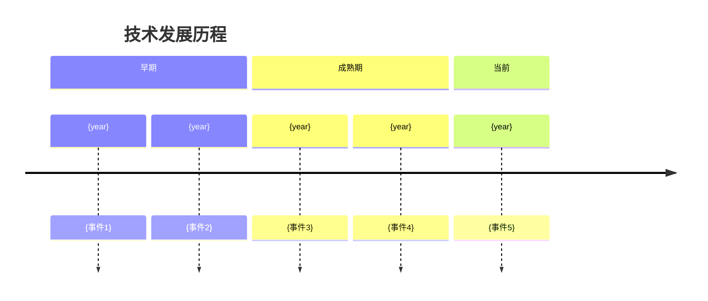
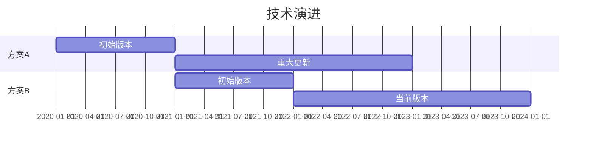

# 2-Current State: 现状分析

> **阶段**: 2-Current State（必选）
> **目标**: 收集现有方案和资源清单，建立调研基线

---

## 2.1 现有方案列表

### 方案概览

| 方案 | 类型 | 来源 | 状态 | 适用场景 |
|------|------|------|------|----------|
| {方案A} | 开源/商业/自研 | {来源} | 活跃/稳定/过时 | {场景} |
| {方案B} | 开源/商业/自研 | {来源} | 活跃/稳定/过时 | {场景} |

### 方案详情

#### 方案 A: {名称}

- **官网**: {url}
- **仓库**: {repo url}
- **文档**: {docs url}
- **Stars/版本**: {stats}
- **核心特性**:
  - {特性1}
  - {特性2}
- **已知限制**:
  - {限制1}

#### 方案 B: {名称}

- **官网**: {url}
- **仓库**: {repo url}
- **文档**: {docs url}
- **Stars/版本**: {stats}
- **核心特性**:
  - {特性1}
  - {特性2}
- **已知限制**:
  - {限制1}

---

## 2.2 资源清单

### 官方资源

| 资源 | 类型 | URL | 证据等级 | 备注 |
|------|------|-----|----------|------|
| {资源1} | 文档/API/示例 | {url} | A/B | {备注} |
| {资源2} | 文档/API/示例 | {url} | A/B | {备注} |

### 社区资源

| 资源 | 类型 | URL | 证据等级 | 备注 |
|------|------|-----|----------|------|
| {资源1} | 博客/教程/视频 | {url} | C/D | {备注} |
| {资源2} | 博客/教程/视频 | {url} | C/D | {备注} |

### 代码库参考

| 仓库 | 描述 | 星标 | 最近更新 | 备注 |
|------|------|------|----------|------|
| {repo1} | {描述} | {stars} | {date} | {备注} |

---

## 2.3 技术发展时间线



或使用甘特图：



---

## 2.4 现有实现分析（如适用）

### 代码库现状

```
{项目路径}/
├── {module1}/     # {模块1描述}
├── {module2}/     # {模块2描述}
└── {module3}/     # {模块3描述}
```

### 可复用组件

| 组件 | 路径 | 功能 | 复用可行性 |
|------|------|------|------------|
| {组件1} | {path} | {功能} | 高/中/低 |

### 需要修改的文件

| 文件 | 修改类型 | 影响范围 |
|------|----------|----------|
| {file1} | 新增/修改/删除 | {范围} |

---

## 输出检查清单

- [ ] 现有方案列表已完整
- [ ] 每个方案有基本信息（官网、仓库、特性）
- [ ] 资源清单已分类整理
- [ ] 证据等级已标注
- [ ] 技术时间线已绘制（可选）

---

*Template for RESEARCH Phase 2-Current State | workflow-plan*
