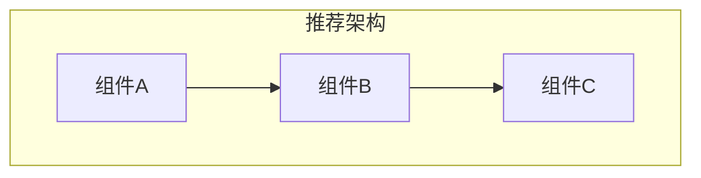

# 5-Implementation: 实现指南

> **阶段**: 5-Implementation（可选）
> **触发条件**: 复杂调研 或 标准模式（非 --quick）
> **目标**: 收集最佳实践和实现细节指南

---

## 5.1 最佳实践

### 实践 1: {实践名称}

**来源**: {官方文档/社区经验/行业标准}
**证据**: [E-{N}]

**描述**:
{详细描述这个最佳实践}

**示例**:
```{language}
// 示例代码或配置
```

**适用场景**:
- {场景1}
- {场景2}

**注意事项**:
- {注意1}

---

### 实践 2: {实践名称}

**来源**: {来源}
**证据**: [E-{N}]

**描述**:
{详细描述}

**示例**:
```{language}
// 示例代码或配置
```

---

### 实践 3: {实践名称}

**来源**: {来源}
**证据**: [E-{N}]

**描述**:
{详细描述}

---

## 5.2 实现模式

### 推荐架构模式



**说明**: {架构模式说明}

### 代码组织建议

```
{推荐的目录结构}
├── {dir1}/
│   ├── {file1}
│   └── {file2}
├── {dir2}/
│   └── {file3}
└── {config}
```

---

## 5.3 配置指南

### 基础配置

```yaml
# 推荐的基础配置
{config_key}: {value}
{config_key2}: {value2}
```

### 生产环境配置

```yaml
# 生产环境建议配置
{config_key}: {production_value}
```

### 配置说明

| 配置项 | 默认值 | 推荐值 | 说明 |
|--------|--------|--------|------|
| {key1} | {default} | {recommended} | {说明} |
| {key2} | {default} | {recommended} | {说明} |

---

## 5.4 常见问题与解决方案

### 问题 1: {问题描述}

**症状**: {症状描述}

**原因**: {原因分析}

**解决方案**:
```{language}
// 解决方案代码或步骤
```

---

### 问题 2: {问题描述}

**症状**: {症状描述}

**原因**: {原因分析}

**解决方案**: {解决步骤}

---

## 5.5 性能优化建议

| 优化点 | 优化前 | 优化后 | 收益 | 实施成本 |
|--------|--------|--------|------|----------|
| {点1} | {状态} | {状态} | {收益} | 低/中/高 |
| {点2} | {状态} | {状态} | {收益} | 低/中/高 |

---

## 5.6 监控与可观测性

### 关键指标

| 指标 | 类型 | 采集方式 | 告警阈值 |
|------|------|----------|----------|
| {metric1} | Counter/Gauge/Histogram | {方式} | {阈值} |
| {metric2} | {类型} | {方式} | {阈值} |

### 日志规范

| 场景 | 日志级别 | 格式 |
|------|----------|------|
| {场景1} | INFO/WARN/ERROR | {格式} |
| {场景2} | {级别} | {格式} |

---

## 5.7 安全考虑

| 安全点 | 风险 | 建议措施 |
|--------|------|----------|
| {点1} | {风险描述} | {措施} |
| {点2} | {风险描述} | {措施} |

---

## 输出检查清单

- [ ] 最佳实践已收集（至少 3 条）
- [ ] 实现模式已说明
- [ ] 配置指南已提供
- [ ] 常见问题已记录
- [ ] 性能优化建议已列出（可选）
- [ ] 监控建议已提供（可选）

---

*Template for RESEARCH Phase 5-Implementation (Optional) | workflow-plan*
