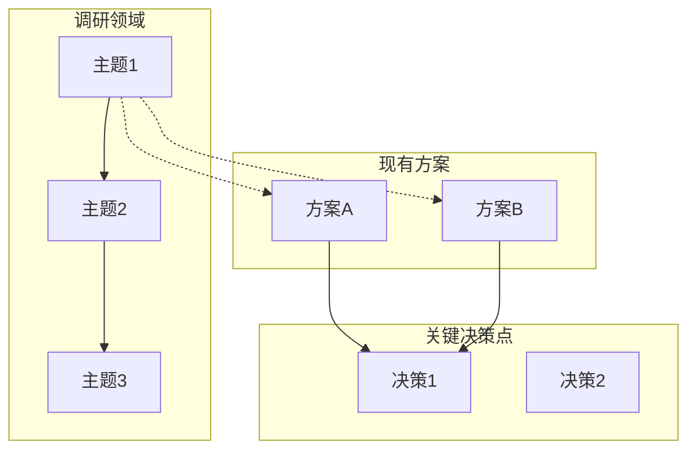

# 1-Overview: 整体概览

> **阶段**: 1-Overview（必选）
> **目标**: 建立调研的整体概览，明确背景、范围和技术全景

---

## 1.1 调研背景

{描述为什么需要进行本次调研，包括：}
- 业务/技术驱动因素
- 当前问题或机会
- 预期收益

---

## 1.2 调研范围

| 调研维度 | 涵盖内容 | 优先级 | 预期输出 |
|----------|----------|--------|----------|
| {维度1} | {具体内容} | P0 | {输出类型} |
| {维度2} | {具体内容} | P1 | {输出类型} |
| {维度3} | {具体内容} | P2 | {输出类型} |

### 调研边界

**包含**:
- {明确包含的内容}

**不包含**:
- {明确排除的内容}

---

## 1.3 技术全景图

---

## 1.4 证据等级说明

本次调研采用以下证据等级标准：

| 等级 | 来源类型 | 可信度 | 说明 |
|------|----------|--------|------|
| A | 标准/官方规范 | 最高 | 直接采用，无需验证 |
| B | 维护者文档/源码 | 高 | 优先参考 |
| C | 社区实践/博客 | 中 | 需交叉验证 |
| D | 论坛观点/个人经验 | 低 | 仅作参考 |

---

## 1.5 调研主题列表

| 主题 | 描述 | 优先级 | 预期输出 |
|------|------|--------|----------|
| {主题1} | {简要描述} | P0 | 方案推荐 |
| {主题2} | {简要描述} | P0 | 技术选型 |
| {主题3} | {简要描述} | P1 | 最佳实践 |

---

## 输出检查清单

- [ ] 调研背景已说明
- [ ] 调研范围表格已填写
- [ ] 技术全景图已绘制
- [ ] 证据等级已定义
- [ ] 调研主题列表已确定

---

*Template for RESEARCH Phase 1-Overview | workflow-plan*
