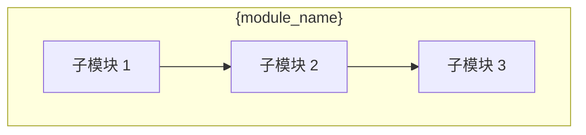

# 子模块计划: {module_name}

## 1. 概述

### 1.1 背景

本文档是 `{feature}` 项目中 `{parent_module_id}` 模块的子模块详细设计。

**触发原因**: {trigger_reason}

**父计划**: [{parent_feature}/plan.md](../../plan.md)

### 1.2 模块信息

| 字段 | 值 |
|------|-----|
| 模块 ID | {module_id} |
| 模块名称 | {module_name} |
| 父模块 | {parent_module_id} |
| 递归深度 | {depth} |
| 复杂度 | {complexity} |

### 1.3 范围

**包含**:
- {scope_in_1}
- {scope_in_2}

**不包含**:
- {scope_out_1}
- {scope_out_2}

---

## 2. 技术方案

### 2.1 架构设计



### 2.2 子模块说明

| ID | 名称 | 职责 | 技术栈 |
|----|------|------|--------|
| {sub_1_id} | {sub_1_name} | {sub_1_responsibility} | {sub_1_tech} |
| {sub_2_id} | {sub_2_name} | {sub_2_responsibility} | {sub_2_tech} |
| {sub_3_id} | {sub_3_name} | {sub_3_responsibility} | {sub_3_tech} |

### 2.3 接口定义

#### 输入接口

| 接口名 | 类型 | 描述 | 来源 |
|--------|------|------|------|
| {input_1_name} | {input_1_type} | {input_1_desc} | {input_1_source} |

#### 输出接口

| 接口名 | 类型 | 描述 | 消费者 |
|--------|------|------|--------|
| {output_1_name} | {output_1_type} | {output_1_desc} | {output_1_consumer} |

### 2.4 技术选型

| 领域 | 技术 | 理由 |
|------|------|------|
| {domain_1} | {tech_1} | {reason_1} |
| {domain_2} | {tech_2} | {reason_2} |

---

## 3. 实现细节

### 3.1 {sub_1_name}

**职责**: {sub_1_responsibility}

**实现要点**:
1. {impl_point_1}
2. {impl_point_2}

**代码示例**:

```{language}
// 示例代码
{code_example}
```

### 3.2 {sub_2_name}

**职责**: {sub_2_responsibility}

**实现要点**:
1. {impl_point_1}
2. {impl_point_2}

---

## 4. 依赖关系

### 4.1 内部依赖

```mermaid
graph LR
    {sub_1_id} --> {sub_2_id}
    {sub_2_id} --> {sub_3_id}
```

### 4.2 外部依赖

| 依赖 | 类型 | 说明 |
|------|------|------|
| {ext_dep_1} | {ext_dep_1_type} | {ext_dep_1_desc} |

---

## 5. 风险评估

| 风险 | 等级 | 影响 | 缓解措施 |
|------|------|------|----------|
| {risk_1} | {level_1} | {impact_1} | {mitigation_1} |

---

## 6. 合并指南

### 6.1 合并策略

推荐策略: **{merge_strategy}** (reference / inline / summary)

### 6.2 合并到父计划

本子计划应合并到父计划的以下位置:

- **位置**: `{parent_feature}/plan.md` § {section_number}
- **方式**: {merge_method}

### 6.3 合并后更新

合并后需要更新:
1. 父计划模块表
2. 架构图
3. 依赖关系

---

## 7. 验收标准

1. {acceptance_1}
2. {acceptance_2}
3. {acceptance_3}

---

## 审批信息

| 字段 | 值 |
|------|-----|
| 状态 | {status} |
| 审批人 | {approver} |
| 审批日期 | {approval_date} |

---

*Generated by workflow-plan (sub-module) | {date}*
