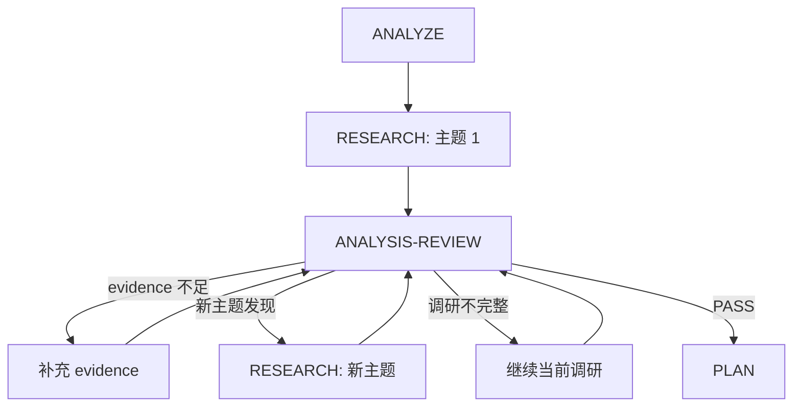

# 阶段详细文档

## 阶段概览

| 阶段 | 名称 | 目标 | 输出 |
|------|------|------|------|
| 1 | ANALYZE | 解析 spec.md，识别调研主题 | analysis.md |
| 2 | RESEARCH | 独立调研每个技术主题 | research/{topic}/research.md |
| 3 | ANALYSIS-REVIEW | 评估调研充分性，决定是否继续 | 判定结果 |
| 4 | PLAN | 生成技术计划 plan.md | plan.md (draft) |
| 5 | REVIEW | 审查设计质量和完整性 | review-response.md |
| 6 | VALIDATE | 获取用户最终批准 | plan.md (approved) |

---

## 标准映射与检查点

| 标准/方法 | 适用阶段 | 检查点 |
|-----------|----------|--------|
| ISO/IEC/IEEE 29148 | ANALYZE | 需求完整、无歧义、可验证、可追溯 |
| ISO/IEC 25010 | ANALYZE / PLAN | NFR 分类与量化指标清晰 |
| ISO/IEC/IEEE 42010 | PLAN | 视角/关注点/利益相关方描述完整 |
| ATAM | RESEARCH / PLAN | 权衡准则与决策矩阵明确 |
| ADR | PLAN | 关键决策记录完整，关联 FR/NFR |
| C4 / 4+1 | PLAN | 多视角架构图完整（上下文/容器/组件/部署） |
| NIST SSDF / OWASP ASVS | PLAN | 安全与合规考虑明确 |

---

## ANALYZE 阶段详细

### 输入

- `.workflow/{feature}/specify/spec.md`（状态必须为 approved）
- 项目上下文文件（CLAUDE.md, constitution.md，如果存在）

### 子任务

1. **读取 spec.md**
   - 解析 frontmatter（状态、版本）
   - 提取各章节内容

2. **提取功能需求 (FR)**
   - 列出所有 FR ID 和描述
   - 记录来源、验收方式、优先级
   - 识别技术影响（影响哪些模块）
   - 标记是否需要调研

3. **提取非功能需求 (NFR)**
   - 列出所有 NFR ID 和描述
   - 按 ISO/IEC 25010 分类质量属性
   - 记录量化指标、验收方式、优先级

4. **识别技术约束**
   - 从 spec.md 约束章节提取
   - 从 constitution.md 提取（如存在）
   - 识别隐含约束

5. **定义范围与非目标**
   - 明确包含范围与不做的内容

6. **标记待决策点**
   - 技术选型决策
   - 架构模式决策
   - 依赖选择决策

7. **识别调研主题**（关键步骤）
   - 根据待决策点生成调研主题
   - 每个主题是独立的、可单独调研的
   - 设置优先级（P0/P1/P2）
   - 定义每个主题的核心问题和评估维度

8. **记录假设与风险**
   - 记录关键假设
   - 标注潜在风险与缓解方向

9. **分析现有代码库**（如适用）
   - 识别相关模块
   - 发现可复用组件
   - 列出需要修改的文件

### 输出格式

参见 [assets/analysis-template.md](../assets/analysis-template.md)

---

## RESEARCH 阶段详细

### 核心原则

> **单一职责**: 每个调研只关注一个主题，生成独立完整的调研文档，不考虑与当前项目背景的整合

### 方法论

遵循 `/research` skill 的 5 阶段流程：


### 输入

- `analyze/analysis.md` 中的调研主题列表
- 每个主题的核心问题和评估维度

### 5 阶段详细

#### 阶段 1: SCOPE（确定范围）

**目标**: 明确调研边界和评估标准

**输出**: 范围说明（在 research.md 开头）

**必须包含**:
- 调研主题和具体问题
- 评估维度列表（≥3 个）
- 约束条件
- 待比较的技术选项

#### 阶段 2: GATHER（收集资料）

**目标**: 系统收集技术资料

**输出**: `evidence/evidence-{N}.md` 文件（≥2 个）

**必须做**:
1. 使用 WebSearch 搜索最新技术资料
2. 收集官方文档、性能基准、社区反馈
3. 记录每条信息的来源（URL）
4. 标记信息的时效性（发布日期）
5. **每次搜索/分析立即记录 evidence**

**资料来源优先级**:
1. 官方文档（等级 A）
2. 权威技术博客（等级 B）
3. 性能基准测试报告（等级 B）
4. GitHub Stars/Issues 趋势（等级 C）
5. Stack Overflow 讨论（等级 C）

#### 阶段 3: ANALYZE（分析方案）

**目标**: 深入分析每个技术选项

**输出**: 方案分析表

**分析框架**:
- 技术成熟度
- 社区活跃度
- 学习成本
- 迁移成本
- 长期维护风险

#### 阶段 4: COMPARE（对比可视化）

**目标**: 生成对比表和可视化

**输出**: 对比表、Mermaid 图

**必须包含**:
- 多维度对比表
- 关键差异点高亮
- 决策流程图（如适用）

#### 阶段 5: RECOMMEND（输出建议）

**目标**: 给出明确结论

**输出**: 推荐结论和 Sources 列表

**必须包含**:
- 明确的推荐结论
- 推荐理由（引用 evidence）
- 潜在风险
- 备选方案
- Sources 列表

### Evidence 管理

**文件位置**: `research/{topic}/evidence/evidence-{N}.md`

**强制要求**:
- 每个调研主题 ≥2 个 evidence 文件
- 每个 evidence 必须有实际内容（禁止空文件）
- 每个调研结论必须引用对应的 evidence

**Evidence 格式**:
```markdown
## 证据记录 #{N}

| 字段 | 值 |
|------|-----|
| **ID** | E-{N} |
| **时间** | {ISO 8601} |
| **类型** | web-search / web-fetch / code-analysis |
| **状态** | success / failed |

### 搜索/分析内容

**查询**: {搜索关键词 / URL}
**工具**: WebSearch / WebFetch / Task (Explore)

### 关键发现

1. {发现 1}
2. {发现 2}

### 来源

| 来源 | URL | 可信度 |
|------|-----|--------|
| {名称} | {url} | A/B/C/D |

### 证据等级

| 等级 | 理由 |
|------|------|
| {A/B/C/D} | {为什么给这个等级} |
```

**引用格式**: 在结论中使用 `[E-{N}]` 引用证据

### 输出结构

```
research/
├── {topic-1}/
│   ├── evidence/
│   │   ├── evidence-1.md
│   │   ├── evidence-2.md
│   │   └── ...
│   └── research.md
├── {topic-2}/
│   ├── evidence/
│   │   └── ...
│   └── research.md
└── summary.md
```

### 调研报告模板

参见 [assets/research-template.md](../assets/research-template.md)

---

## ANALYSIS-REVIEW 阶段详细

### 目的

评估当前调研是否充分，决定是否需要继续调研，形成迭代反馈循环。

### 输入

- 已完成的 `research/{topic}/research.md` 文件
- `analyze/analysis.md` 中的调研主题列表

### 审查内容

1. **调研完成度**
   - 所有 P0/P1 调研主题是否都已完成
   - 每个调研报告是否遵循 5 阶段结构

2. **Evidence 完整性**（关键检查点）
   - 每个调研的 evidence 目录是否有内容（≥2 个文件）
   - evidence 文件是否有实际内容（非空）
   - 每个调研结论是否引用了 evidence

3. **结论质量**
   - 每个调研是否有明确结论
   - 结论是否有 evidence 支撑
   - 是否有 Sources 列表

4. **新主题发现**
   - 调研过程中是否发现了新的需要调研的主题
   - 现有调研是否引发了新的问题

### 判定逻辑

```python
def analysis_review_verdict(researches, analysis):
    # 检查调研完成度
    topics_needed = analysis.research_topics
    topics_completed = [r.topic for r in researches]

    if not all(t in topics_completed for t in topics_needed if t.priority in ['P0', 'P1']):
        return "CONTINUE_RESEARCH", "未完成所有 P0/P1 调研主题"

    # 检查 evidence 完整性
    for research in researches:
        evidence_count = len(research.evidence_files)
        if evidence_count < 2:
            return "CONTINUE_RESEARCH", f"{research.topic}: evidence 不足（当前 {evidence_count}，需要 ≥2）"

        # 检查 evidence 是否为空
        for evidence in research.evidence_files:
            if evidence.is_empty():
                return "CONTINUE_RESEARCH", f"{research.topic}: evidence-{evidence.id} 为空"

        # 检查结论是否引用 evidence
        if not research.has_evidence_references():
            return "CONTINUE_RESEARCH", f"{research.topic}: 结论未引用 evidence"

    # 检查是否发现新主题
    new_topics = find_new_topics(researches)
    if new_topics:
        return "CONTINUE_RESEARCH", f"发现新调研主题: {new_topics}"

    return "PASS", None
```

### 迭代循环



### 输出

无独立输出文件，但需要更新 `.state.yaml` 中的状态：

```yaml
analysis_review:
  round: {N}
  verdict: PASS | CONTINUE_RESEARCH
  reason: {原因}
  new_topics: []  # 新发现的主题
  evidence_issues: []  # evidence 问题列表
```

---

## PLAN 阶段详细

### 输入

- `analyze/analysis.md`
- `research/summary.md` 和各主题调研报告
- 项目上下文

### 子任务

1. **整合调研结果**
   - 读取 `research/summary.md`
   - 提取各调研的推荐结论

2. **设计系统架构**
   - 定义主要模块
   - 确定模块间关系
   - 绘制 Mermaid 架构图
   - 补充多视角说明（上下文/容器/组件/部署）

3. **确定技术选型**
   - 基于调研结论选择
   - **引用具体调研报告**（如 "基于 [cache-strategy 调研]..."）
   - 记录选型理由
   - 提供备选方案

4. **分析依赖**
   - 内部模块依赖
   - 外部包依赖（含版本）

5. **评估风险**
   - 识别 3-5 个关键风险
   - 评估可能性和影响
   - 制定缓解策略

6. **安全与合规设计**
   - 身份与访问控制
   - 数据保护与审计要求

7. **可观测性与运维设计**
   - 指标/日志/追踪/告警

8. **记录架构决策**
   - 为关键决策创建 ADR
   - 关联到相关需求
   - **引用支撑的调研报告**

9. **建立追溯性映射**
   - 模块 → FR 映射
   - ADR → FR/NFR 映射
   - 技术选型 → 调研报告映射

### 输出格式

参见 [assets/plan-template.md](../assets/plan-template.md)

---

## REVIEW 阶段详细

### 输入

- `plan.md`（草稿）
- `research/summary.md` 和各主题调研报告
- `../specify/spec.md`

### 审查方法

1. 使用 Task 工具启动独立审查 Agent 或 Codex
2. 传入审查清单和待审查文件
3. 收集审查结果

### 审查清单

参见 [review-checklist.md](review-checklist.md) 的 REVIEW 部分

### 判定逻辑

```python
def review_verdict(plan, researches, spec):
    # 检查架构完整性
    modules_complete = all(
        module.has_responsibility and len(module.responsibility) <= 50
        for module in plan.modules
    )

    # 检查技术选型与调研一致性
    selections_consistent = all(
        selection.choice in researches.recommendations
        and selection.has_research_reference()
        for selection in plan.tech_selections
    )

    # 检查 evidence 支撑
    evidence_supported = all(
        selection.has_evidence_support()
        for selection in plan.tech_selections
    )

    # 计算覆盖度
    coverage = len(plan.covered_frs) / len(spec.frs)

    if not selections_consistent or not evidence_supported:
        return "NEEDS_RESEARCH", "技术选型缺少调研或 evidence 支撑"
    if coverage < 0.95:
        return "NEEDS_PLAN", "需求覆盖度不足"
    if not modules_complete:
        return "NEEDS_PLAN", "模块职责描述不完整"

    return "PASS", None
```

---

## VALIDATE 阶段详细

### 输入

- `plan.md`（已审查）
- 审查报告

### 子任务

1. **完整性检查**
   - 所有必填章节已填写
   - 格式符合模板要求

2. **覆盖度检查**
   - 验证 FR 覆盖度
   - 验证 NFR 覆盖度

3. **展示摘要**
   - 架构设计摘要
   - 技术选型摘要
   - 风险评估摘要
   - 调研统计（主题数、evidence 数）

4. **请求批准**
   - 使用 AskUserQuestion 工具
   - 提供批准/修改选项

5. **更新状态**
   - 将 plan.md 状态更新为 approved
   - 更新 .state.yaml

---

## 回退规则详细

### ANALYSIS-REVIEW 回退

| 判定 | 回退到 | 后续路径 |
|------|--------|----------|
| CONTINUE_RESEARCH (新主题) | RESEARCH (新主题) | RESEARCH → ANALYSIS-REVIEW |
| CONTINUE_RESEARCH (evidence 不足) | RESEARCH (补充) | RESEARCH → ANALYSIS-REVIEW |

### REVIEW 回退

| 判定 | 回退到 | 后续路径 |
|------|--------|----------|
| NEEDS_PLAN | PLAN | PLAN → REVIEW |
| NEEDS_RESEARCH | ANALYSIS-REVIEW | ANALYSIS-REVIEW → (可能) RESEARCH → ... → PLAN → REVIEW |

---

## 状态文件格式

```yaml
feature: {feature-id}
version: 3.0.0
phase: analyze | research | analysis-review | plan | review | validate
status: in_progress | completed | failed

completed_phases:
  analyze:
    completed_at: "2026-01-14T10:00:00Z"
    output: analyze/analysis.md
    research_topics:
      - topic: cache-strategy
        priority: P0
      - topic: auth-mechanism
        priority: P1

research:
  topics:
    cache-strategy:
      status: completed
      completed_at: "2026-01-14T11:00:00Z"
      output: research/cache-strategy/research.md
      evidence_count: 3
    auth-mechanism:
      status: in_progress
      evidence_count: 1

analysis_review:
  rounds:
    - round: 1
      verdict: CONTINUE_RESEARCH
      reason: "evidence 不足"
      timestamp: "2026-01-14T11:30:00Z"
    - round: 2
      verdict: PASS
      timestamp: "2026-01-14T12:00:00Z"

reviews:
  current_round: 1
  max_rounds: 3
  history:
    - round: 1
      verdict: PASS
      confidence: 0.95

rollbacks:
  - from: analysis-review
    to: research
    reason: "cache-strategy 调研 evidence 不足"
    timestamp: "2026-01-14T11:30:00Z"
```

---

*Reference for workflow-plan phases v3.0*
