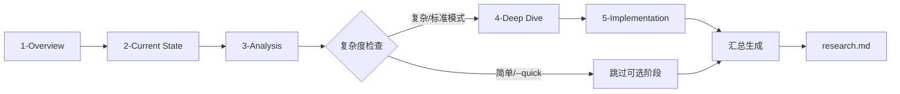

# 阶段详细文档

## 阶段概览

| 阶段 | 名称 | 目标 | 输出 |
|------|------|------|------|
| 1 | ANALYZE | 解析 spec.md，提取技术决策点 | analysis.md |
| 2 | RESEARCH | 调研技术方案、最佳实践 | research.md |
| 3 | REVIEW-1 | 审查分析和调研是否充分 | review-response.md |
| 4 | PLAN | 生成技术计划 plan.md | plan.md (draft) |
| 5 | REVIEW-2 | 审查设计质量和完整性 | review-response.md |
| 6 | VALIDATE | 获取用户最终批准 | plan.md (approved) |

---

## 标准映射与检查点

| 标准/方法 | 适用阶段 | 检查点 |
|-----------|----------|--------|
| ISO/IEC/IEEE 29148 | ANALYZE | 需求完整、无歧义、可验证、可追溯 |
| ISO/IEC 25010 | ANALYZE / PLAN | NFR 分类与量化指标清晰 |
| ISO/IEC/IEEE 42010 | PLAN | 视角/关注点/利益相关方描述完整 |
| ATAM | RESEARCH / PLAN | 权衡准则与决策矩阵明确 |
| ADR | PLAN | 关键决策记录完整，关联 FR/NFR |
| C4 / 4+1 | PLAN | 多视角架构图完整（上下文/容器/组件/部署） |
| NIST SSDF / OWASP ASVS | PLAN | 安全与合规考虑明确 |

---

## ANALYZE 阶段详细

### 输入

- `.workflow/{feature}/specify/spec.md`（状态必须为 approved）
- 项目上下文文件（CLAUDE.md, constitution.md，如果存在）

### 子任务

1. **读取 spec.md**
   - 解析 frontmatter（状态、版本）
   - 提取各章节内容

2. **提取功能需求 (FR)**
   - 列出所有 FR ID 和描述
   - 记录来源、验收方式、优先级
   - 识别技术影响（影响哪些模块）
   - 标记是否需要调研

3. **提取非功能需求 (NFR)**
   - 列出所有 NFR ID 和描述
   - 按 ISO/IEC 25010 分类质量属性
   - 记录量化指标、验收方式、优先级

4. **识别技术约束**
   - 从 spec.md 约束章节提取
   - 从 constitution.md 提取（如存在）
   - 识别隐含约束

5. **定义范围与非目标**
   - 明确包含范围与不做的内容

6. **标记待决策点**
   - 技术选型决策
   - 架构模式决策
   - 依赖选择决策

7. **识别调研主题**
   - 根据待决策点生成调研主题
   - 设置优先级（P0/P1/P2）

8. **记录假设与风险**
   - 记录关键假设
   - 标注潜在风险与缓解方向

9. **分析现有代码库**（如适用）
   - 识别相关模块
   - 发现可复用组件
   - 列出需要修改的文件

### 输出格式

参见 [assets/analysis-template.md](../assets/analysis-template.md)

---

## RESEARCH 阶段详细

### 方法论

**自顶向下、层次递归、可视化优先**

1. 先建立整体概览和技术全景图
2. 再深入各个调研主题
3. 优先使用可视化（Mermaid 图）表达关系和对比
4. 最后形成结论和展望

### 输入

- `analyze/analysis.md`
- 调研主题列表

### 5 阶段子流程

RESEARCH 阶段采用 5 个子阶段的结构化流程：



#### 子阶段 1: Overview（必选）

**目标**: 建立整体概览，明确调研背景和范围

**输入**: analysis.md 中的调研主题
**输出**: `research/1-overview/overview.md`

**动作**:
1. 撰写调研背景
2. 定义调研范围表格
3. 绘制技术全景图（Mermaid）
4. 定义证据等级标准
5. 列出调研主题

**模板**: [assets/research/overview-template.md](../assets/research/overview-template.md)

#### 子阶段 2: Current State（必选）

**目标**: 收集现有方案和资源清单

**输入**: overview.md
**输出**: `research/2-current-state/current-state.md`

**动作**:
1. 搜索现有方案（WebSearch）
2. 获取文档内容（WebFetch）
3. 分析代码库（Task Explore）
4. 整理资源清单
5. 绘制技术发展时间线

**模板**: [assets/research/current-state-template.md](../assets/research/current-state-template.md)

#### 子阶段 3: Analysis（必选）

**目标**: 方案对比、建立权衡矩阵、形成推荐

**输入**: current-state.md
**输出**: `research/3-analysis/analysis.md`

**动作**:
1. 绘制方案概览图
2. 填写方案对比表
3. 定义评价准则和权重
4. 计算权衡决策矩阵
5. 确定推荐方案

**模板**: [assets/research/analysis-template.md](../assets/research/analysis-template.md)

#### 子阶段 4: Deep Dive（可选）

**目标**: 对推荐方案进行深入分析和验证

**触发条件**:
- 调研主题 > 2 个
- 非 `--quick` 模式
- 存在高风险技术选型

**输入**: analysis.md
**输出**: `research/4-deep-dive/deep-dive.md`

**动作**:
1. 深入技术细节分析
2. 依赖评估（版本、许可证、维护状态）
3. 执行 POC/实验（可选）
4. 边界情况分析
5. 集成考虑

**模板**: [assets/research/deep-dive-template.md](../assets/research/deep-dive-template.md)

#### 子阶段 5: Implementation（可选）

**目标**: 收集最佳实践和实现指南

**触发条件**: 同 Deep Dive

**输入**: deep-dive.md（或 analysis.md 如果跳过 Deep Dive）
**输出**: `research/5-implementation/implementation.md`

**动作**:
1. 收集最佳实践
2. 整理实现模式
3. 编写配置指南
4. 记录常见问题
5. 提供监控建议

**模板**: [assets/research/implementation-template.md](../assets/research/implementation-template.md)

### 证据管理

每次搜索/分析都需要记录证据：

**证据文件**: `research/evidence/evidence-{N}.md`

**证据格式**:
```markdown
## 证据记录 #{N}

| 字段 | 值 |
|------|-----|
| **ID** | E-{N} |
| **时间** | {ISO 8601} |
| **阶段** | 1-overview / 2-current-state / ... |
| **类型** | web-search / code-analysis / ... |
| **状态** | success / failed |

### 关键发现
- {发现1}
- {发现2}

### 来源
- [来源名称](url)

### 证据等级
A/B/C/D
```

**引用格式**: 在结论中使用 `[E-{N}]` 引用证据

**模板**: [assets/research/evidence-template.md](../assets/research/evidence-template.md)

### 子阶段状态文件格式

```yaml
completed_phases:
  research:
    status: in_progress
    sub_phases:
      overview:
        status: completed
        completed_at: "2026-01-16T10:00:00Z"
        output: "research/1-overview/overview.md"
      current_state:
        status: completed
        completed_at: "2026-01-16T10:05:00Z"
        output: "research/2-current-state/current-state.md"
      analysis:
        status: in_progress
        output: null
      deep_dive:
        status: pending
        skipped: false
      implementation:
        status: pending
        skipped: false
    evidence_count: 3
    current_sub_phase: analysis
```

### 断点恢复

使用 `--resume` 选项时：

1. 读取 .state.yaml 中的 `sub_phases` 状态
2. 跳过已完成的子阶段
3. 从 `current_sub_phase` 继续执行
4. 保留已生成的证据文件

### 汇总生成

所有子阶段完成后，汇总生成最终的 `research.md`：

| 子阶段 | 映射到 research.md 章节 |
|--------|-------------------------|
| 1-Overview | § 1 整体概览 |
| 2-Current State | § 2 调研主题详情（部分） |
| 3-Analysis | § 3-4 方案对比 + 权衡矩阵 |
| 4-Deep Dive | § 5-6 依赖评估 + POC |
| 5-Implementation | § 7 最佳实践 |
| 汇总 | § 8-9 结论 + 展望 |

**跳过处理**: 未执行的子阶段在对应章节标注 "未执行"

### 超时配置

```yaml
research:
  stage_timeout: 300  # 5 分钟
  single_search_timeout: 30  # 单次搜索 30 秒
  max_sources: 10  # 最多引用 10 个来源
  sub_phase_timeout: 60  # 单子阶段 1 分钟
```

### 输出结构

```
research/
├── 1-overview/
│   └── overview.md
├── 2-current-state/
│   └── current-state.md
├── 3-analysis/
│   └── analysis.md
├── 4-deep-dive/           # 可选
│   └── deep-dive.md
├── 5-implementation/      # 可选
│   └── implementation.md
├── evidence/
│   ├── evidence-1.md
│   ├── evidence-2.md
│   └── ...
└── research.md            # 汇总报告
```

### 输出格式

参见 [assets/research-template.md](../assets/research-template.md)

---

## REVIEW-1 阶段详细

### 输入

- `analyze/analysis.md`
- `research/research.md`
- `../specify/spec.md`（用于验证覆盖度）

### 审查方法

1. 使用 Task 工具启动独立审查 Agent
2. 传入审查清单和待审查文件
3. 收集审查结果

### 审查清单

参见 [review-checklist.md](review-checklist.md) 的 REVIEW-1 部分

### 判定逻辑

```python
def review_1_verdict(analysis, research, spec):
    # 计算覆盖度
    fr_coverage = len(analyzed_frs) / len(spec_frs)
    nfr_coverage = len(analyzed_nfrs) / len(spec_nfrs)

    # 检查调研完整性
    research_complete = all(
        topic.has_conclusion and len(topic.sources) >= 1
        for topic in research.topics
    )

    if fr_coverage < 0.95:
        return "NEEDS_ANALYZE", "FR 覆盖度不足"
    if nfr_coverage < 0.95:
        return "NEEDS_ANALYZE", "NFR 覆盖度不足"
    if not research_complete:
        return "NEEDS_RESEARCH", "调研不完整"

    return "PASS", None
```

---

## PLAN 阶段详细

### 输入

- `analyze/analysis.md`
- `research/research.md`
- 项目上下文

### 子任务

1. **设计系统架构**
   - 定义主要模块
   - 确定模块间关系
   - 绘制 Mermaid 架构图
   - 补充多视角说明（上下文/容器/组件/部署）

2. **确定技术选型**
   - 基于调研结论选择
   - 记录选型理由
   - 提供备选方案

3. **分析依赖**
   - 内部模块依赖
   - 外部包依赖（含版本）

4. **评估风险**
   - 识别 3-5 个关键风险
   - 评估可能性和影响
   - 制定缓解策略

5. **安全与合规设计**
   - 身份与访问控制
   - 数据保护与审计要求

6. **可观测性与运维设计**
   - 指标/日志/追踪/告警

7. **上线/迁移/回滚策略**
   - 发布流程
   - 迁移步骤
   - 回滚条件

8. **记录架构决策**
   - 为关键决策创建 ADR
   - 关联到相关需求

9. **建立追溯性映射**
   - 模块 → FR 映射
   - ADR → FR/NFR 映射

### 输出格式

参见 [assets/plan-template.md](../assets/plan-template.md)

---

## REVIEW-2 阶段详细

### 输入

- `plan.md`（草稿）
- `research/research.md`
- `../specify/spec.md`

### 审查方法

1. 使用 Task 工具启动独立审查 Agent
2. 传入审查清单和待审查文件
3. 收集审查结果

### 审查清单

参见 [review-checklist.md](review-checklist.md) 的 REVIEW-2 部分

### 判定逻辑

```python
def review_2_verdict(plan, research, spec):
    # 检查架构完整性
    modules_complete = all(
        module.has_responsibility and len(module.responsibility) <= 50
        for module in plan.modules
    )

    # 检查技术选型与调研一致性
    selections_consistent = all(
        selection.choice in research.recommendations
        for selection in plan.tech_selections
    )

    # 计算覆盖度
    coverage = len(plan.covered_frs) / len(spec.frs)

    if not selections_consistent:
        return "NEEDS_RESEARCH", "技术选型与调研结论不一致"
    if coverage < 0.95:
        return "NEEDS_PLAN", "需求覆盖度不足"
    if not modules_complete:
        return "NEEDS_PLAN", "模块职责描述不完整"

    return "PASS", None
```

---

## VALIDATE 阶段详细

### 输入

- `plan.md`（已审查）
- 审查报告

### 子任务

1. **完整性检查**
   - 所有必填章节已填写
   - 格式符合模板要求

2. **覆盖度检查**
   - 验证 FR 覆盖度
   - 验证 NFR 覆盖度

3. **展示摘要**
   - 架构设计摘要
   - 技术选型摘要
   - 风险评估摘要

4. **请求批准**
   - 使用 AskUserQuestion 工具
   - 提供批准/修改选项

5. **更新状态**
   - 将 plan.md 状态更新为 approved
   - 更新 .state.yaml

---

## 回退规则详细

### REVIEW-1 回退

| 判定 | 回退到 | 后续路径 |
|------|--------|----------|
| NEEDS_ANALYZE | ANALYZE | ANALYZE → RESEARCH → REVIEW-1 |
| NEEDS_RESEARCH | RESEARCH | RESEARCH → REVIEW-1 |

### REVIEW-2 回退

| 判定 | 回退到 | 后续路径 |
|------|--------|----------|
| NEEDS_PLAN | PLAN | PLAN → REVIEW-2 |
| NEEDS_RESEARCH | RESEARCH | RESEARCH → REVIEW-1 → PLAN → REVIEW-2 |

---

## 状态文件格式

```yaml
feature: {feature-id}
version: 2.0.0
phase: analyze | research | review-1 | plan | review-2 | validate
status: in_progress | completed | failed

completed_phases:
  analyze:
    completed_at: "2026-01-14T10:00:00Z"
    output: analyze/analysis.md
  research:
    completed_at: "2026-01-14T11:00:00Z"
    output: research/research.md

reviews:
  review-1:
    current_round: 1
    max_rounds: 3
    history:
      - round: 1
        verdict: PASS
        confidence: 0.92
  review-2:
    current_round: 1
    max_rounds: 3
    history: []

rollbacks:
  - from: review-1
    to: research
    reason: "技术选型调研不足"
    timestamp: "2026-01-14T12:00:00Z"
```

---

*Reference for workflow-plan phases*
