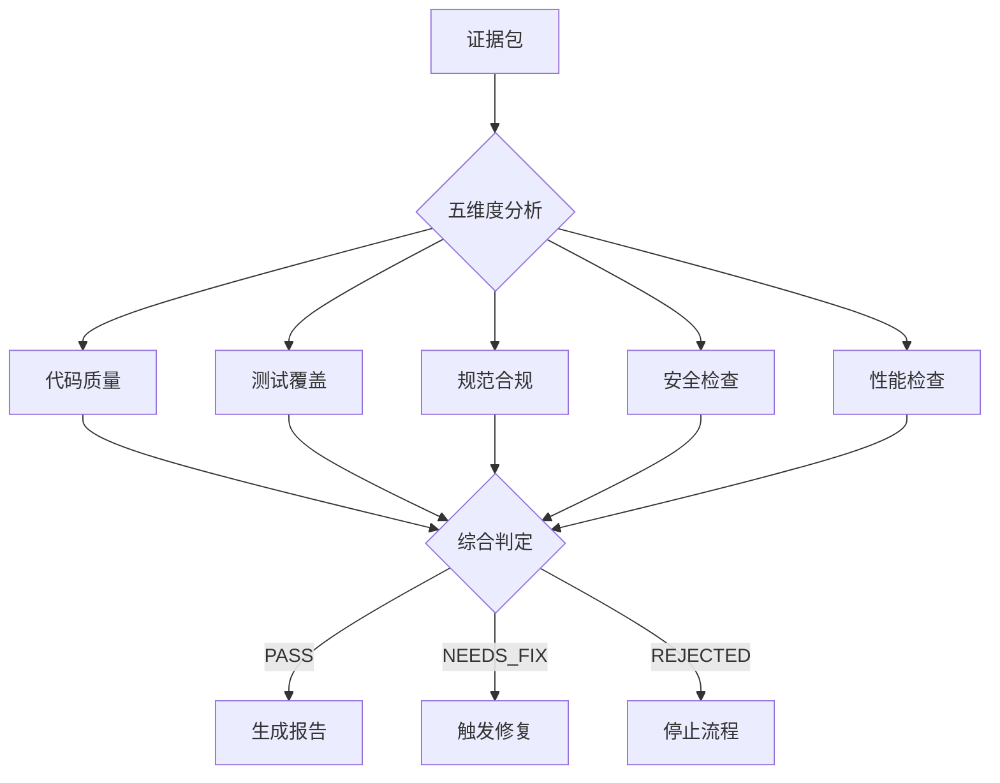

# 审查清单

> 本文档定义 workflow-review 五维度审查的详细检查项、阈值和判定算法。

---

## 1. 概述

workflow-review 使用五维度审查框架，确保代码实现的全面质量。



---

## 2. 维度一：代码质量

**目标**: 确保代码符合规范、无明显异味

### 2.1 检查项

| 检查项 | 标准 | 严重程度 |
|--------|------|----------|
| Lint 错误 | 0 个错误 | CRITICAL |
| Lint 警告 | ≤ 10 个警告 | MINOR |
| 圈复杂度 | ≤ 15 | MAJOR |
| 函数长度 | ≤ 100 行 | MAJOR |
| 文件长度 | ≤ 500 行 | MINOR |
| 命名规范 | 符合项目规范 | MINOR |
| 重复代码 | 无明显重复 | MAJOR |

### 2.2 检查算法

```python
def check_code_quality(evidence_dir):
    """
    检查代码质量
    """
    issues = []

    # 1. 解析 lint 结果
    lint_result = parse_lint_results(f"{evidence_dir}/lint-results.txt")

    if lint_result.errors > 0:
        issues.append({
            "severity": "CRITICAL",
            "type": "lint_error",
            "message": f"存在 {lint_result.errors} 个 lint 错误",
            "count": lint_result.errors
        })

    if lint_result.warnings > 10:
        issues.append({
            "severity": "MINOR",
            "type": "lint_warning",
            "message": f"存在 {lint_result.warnings} 个 lint 警告",
            "count": lint_result.warnings
        })

    # 2. 检查复杂度
    diff = read(f"{evidence_dir}/changes.diff")
    for func in extract_functions(diff):
        complexity = calculate_cyclomatic_complexity(func)
        if complexity > 15:
            issues.append({
                "severity": "MAJOR",
                "type": "high_complexity",
                "message": f"函数 {func.name} 圈复杂度 {complexity} 超过阈值 15",
                "file": func.file,
                "line": func.line
            })

    # 3. 检查函数长度
    for func in extract_functions(diff):
        if func.lines > 100:
            issues.append({
                "severity": "MAJOR",
                "type": "long_function",
                "message": f"函数 {func.name} 长度 {func.lines} 行超过阈值 100",
                "file": func.file,
                "line": func.line
            })

    # 计算得分
    critical_count = len([i for i in issues if i["severity"] == "CRITICAL"])
    major_count = len([i for i in issues if i["severity"] == "MAJOR"])

    score = 1.0 - (critical_count * 0.3 + major_count * 0.1)
    score = max(0, score)

    return {
        "dimension": "code_quality",
        "score": score,
        "passed": critical_count == 0,
        "issues": issues
    }
```

---

## 3. 维度二：测试覆盖

**目标**: 确保测试通过且覆盖率达标

### 3.1 检查项

| 检查项 | 标准 | 严重程度 |
|--------|------|----------|
| 测试通过率 | 100% | BLOCKER (如失败) |
| 代码覆盖率 | ≥ 80% | MAJOR |
| 新代码覆盖 | ≥ 90% | MAJOR |
| 边界测试 | 有覆盖 | MINOR |

### 3.2 检查算法

```python
def check_test_coverage(evidence_dir):
    """
    检查测试覆盖
    """
    issues = []

    # 1. 解析测试结果
    test_result = parse_test_results(f"{evidence_dir}/test-results.txt")

    if test_result.failed > 0:
        issues.append({
            "severity": "BLOCKER",
            "type": "test_failure",
            "message": f"测试失败: {test_result.failed}/{test_result.total}",
            "details": test_result.failed_tests
        })

    # 2. 检查覆盖率
    if exists(f"{evidence_dir}/coverage-report.txt"):
        coverage = parse_coverage(f"{evidence_dir}/coverage-report.txt")

        if coverage.percentage < 80:
            issues.append({
                "severity": "MAJOR",
                "type": "low_coverage",
                "message": f"覆盖率 {coverage.percentage}% 低于阈值 80%",
                "current": coverage.percentage,
                "threshold": 80
            })

    # 计算得分
    tests_passed = test_result.failed == 0
    coverage_ok = coverage.percentage >= 80 if coverage else True

    score = 1.0
    if not tests_passed:
        score = 0
    elif not coverage_ok:
        score = coverage.percentage / 100

    return {
        "dimension": "test_coverage",
        "score": score,
        "passed": tests_passed and coverage_ok,
        "issues": issues,
        "tests_passed": tests_passed
    }
```

---

## 4. 维度三：规范合规

**目标**: 确保实现符合 spec.md 验收标准

### 4.1 检查项

| 检查项 | 标准 | 严重程度 |
|--------|------|----------|
| 验收标准覆盖 | 100% | CRITICAL |
| 功能完整性 | 所有 US 实现 | CRITICAL |
| 接口合规 | 符合设计 | MAJOR |

### 4.2 检查算法

```python
def check_spec_compliance(evidence_dir, spec_path):
    """
    检查规范合规
    """
    issues = []

    # 读取 spec.md
    spec = parse_spec(spec_path)

    # 提取验收标准
    acceptance_criteria = spec.get_acceptance_criteria()

    # 检查每个验收标准
    for ac in acceptance_criteria:
        status = verify_acceptance_criterion(ac, evidence_dir)

        if status == "NOT_MET":
            issues.append({
                "severity": "CRITICAL",
                "type": "acceptance_not_met",
                "message": f"验收标准未满足: {ac.id} - {ac.description}",
                "criterion": ac.id
            })
        elif status == "PARTIAL":
            issues.append({
                "severity": "MAJOR",
                "type": "acceptance_partial",
                "message": f"验收标准部分满足: {ac.id}",
                "criterion": ac.id
            })

    # 计算得分
    total = len(acceptance_criteria)
    met = total - len(issues)
    score = met / total if total > 0 else 1.0

    return {
        "dimension": "spec_compliance",
        "score": score,
        "passed": len([i for i in issues if i["severity"] == "CRITICAL"]) == 0,
        "issues": issues
    }
```

---

## 5. 维度四：安全检查

**目标**: 确保无明显安全漏洞

### 5.1 检查项

| 检查项 | 标准 | 严重程度 |
|--------|------|----------|
| 硬编码密钥 | 无 | BLOCKER |
| SQL 注入 | 无 | BLOCKER |
| XSS | 无 | BLOCKER |
| 敏感信息泄露 | 无 | CRITICAL |
| 不安全依赖 | 无已知漏洞 | MAJOR |

### 5.2 检查算法

```python
def check_security(evidence_dir):
    """
    安全检查
    """
    issues = []
    diff = read(f"{evidence_dir}/changes.diff")

    # 1. 硬编码密钥检测
    secret_patterns = [
        (r'password\s*[=:]\s*["\'][^"\']+["\']', "硬编码密码"),
        (r'api[_-]?key\s*[=:]\s*["\'][^"\']+["\']', "硬编码 API 密钥"),
        (r'secret\s*[=:]\s*["\'][^"\']+["\']', "硬编码密钥"),
        (r'token\s*[=:]\s*["\'][A-Za-z0-9]{20,}["\']', "硬编码 Token"),
    ]

    for pattern, desc in secret_patterns:
        matches = regex_findall(diff, pattern, ignore_case=True)
        for match in matches:
            issues.append({
                "severity": "BLOCKER",
                "type": "hardcoded_secret",
                "message": f"检测到{desc}",
                "line": match.line,
                "snippet": mask_secret(match.text)
            })

    # 2. SQL 注入检测
    sql_patterns = [
        (r'execute\s*\([^)]*\+[^)]*\)', "字符串拼接 SQL"),
        (r'query\s*\([^)]*%s[^)]*%[^)]*\)', "不安全的参数化"),
        (r'f["\'].*SELECT.*{.*}', "f-string SQL"),
    ]

    for pattern, desc in sql_patterns:
        matches = regex_findall(diff, pattern)
        for match in matches:
            issues.append({
                "severity": "BLOCKER",
                "type": "sql_injection",
                "message": f"可能的 SQL 注入: {desc}",
                "line": match.line
            })

    # 3. XSS 检测
    xss_patterns = [
        (r'innerHTML\s*=', "直接设置 innerHTML"),
        (r'document\.write\s*\(', "使用 document.write"),
        (r'dangerouslySetInnerHTML', "React 危险设置"),
    ]

    for pattern, desc in xss_patterns:
        matches = regex_findall(diff, pattern)
        for match in matches:
            issues.append({
                "severity": "BLOCKER",
                "type": "xss",
                "message": f"可能的 XSS: {desc}",
                "line": match.line
            })

    # 计算得分
    blocker_count = len([i for i in issues if i["severity"] == "BLOCKER"])

    return {
        "dimension": "security",
        "score": 1.0 if blocker_count == 0 else 0,
        "passed": blocker_count == 0,
        "issues": issues
    }
```

---

## 6. 维度五：性能检查

**目标**: 确保无明显性能问题

### 6.1 检查项

| 检查项 | 标准 | 严重程度 |
|--------|------|----------|
| O(n²) 循环 | 需评估必要性 | MAJOR |
| 资源泄露 | 无 | MAJOR |
| 同步阻塞 | 无不必要阻塞 | MAJOR |
| 大对象复制 | 避免 | MINOR |
| N+1 查询 | 避免 | MAJOR |

### 6.2 检查算法

```python
def check_performance(evidence_dir):
    """
    性能检查
    """
    issues = []
    diff = read(f"{evidence_dir}/changes.diff")

    # 1. 检测嵌套循环 (O(n²))
    nested_loop_patterns = [
        r'for\s*\([^)]*\)[^{]*\{[^}]*for\s*\(',
        r'\.forEach\([^)]*\)[^}]*\.forEach\(',
        r'\.map\([^)]*\)[^}]*\.map\(',
    ]

    for pattern in nested_loop_patterns:
        matches = regex_findall(diff, pattern)
        for match in matches:
            issues.append({
                "severity": "MAJOR",
                "type": "nested_loop",
                "message": "检测到嵌套循环，可能存在 O(n²) 性能问题",
                "line": match.line
            })

    # 2. 检测资源泄露
    resource_patterns = [
        (r'open\s*\([^)]*\)', r'\.close\s*\(', "文件未关闭"),
        (r'connect\s*\([^)]*\)', r'\.disconnect\s*\(|\.close\s*\(', "连接未关闭"),
    ]

    # 简化检测：检查是否有 try-finally 或 with 语句
    for open_pattern, close_pattern, desc in resource_patterns:
        opens = regex_findall(diff, open_pattern)
        for match in opens:
            # 检查是否在 with 语句或 try-finally 中
            if not is_in_resource_management(diff, match):
                issues.append({
                    "severity": "MAJOR",
                    "type": "resource_leak",
                    "message": f"可能的资源泄露: {desc}",
                    "line": match.line
                })

    # 3. 检测同步阻塞
    blocking_patterns = [
        (r'time\.sleep\s*\(', "同步 sleep"),
        (r'\.wait\s*\(', "同步 wait"),
        (r'requests\.get\s*\(', "同步 HTTP 请求"),
    ]

    for pattern, desc in blocking_patterns:
        matches = regex_findall(diff, pattern)
        for match in matches:
            if is_in_async_context(diff, match):
                issues.append({
                    "severity": "MAJOR",
                    "type": "sync_blocking",
                    "message": f"异步上下文中的同步阻塞: {desc}",
                    "line": match.line
                })

    # 计算得分
    major_count = len([i for i in issues if i["severity"] == "MAJOR"])

    return {
        "dimension": "performance",
        "score": max(0, 1.0 - major_count * 0.15),
        "passed": major_count == 0,
        "issues": issues
    }
```

---

## 7. 综合判定算法

```python
def make_final_verdict(dimension_results, current_round, max_rounds=3):
    """
    综合五维度结果，计算最终判定
    """
    # 收集所有问题
    all_issues = []
    for dim in dimension_results.values():
        all_issues.extend(dim.get("issues", []))

    # 统计问题数量
    blocker_count = len([i for i in all_issues if i["severity"] == "BLOCKER"])
    critical_count = len([i for i in all_issues if i["severity"] == "CRITICAL"])
    major_count = len([i for i in all_issues if i["severity"] == "MAJOR"])

    # 检查测试是否通过
    tests_passed = dimension_results.get("test_coverage", {}).get("tests_passed", True)

    # 判定逻辑
    if blocker_count > 0:
        return {
            "verdict": "REJECTED",
            "reason": f"存在 {blocker_count} 个 BLOCKER 级别问题"
        }

    if not tests_passed:
        return {
            "verdict": "REJECTED",
            "reason": "测试未通过"
        }

    if critical_count > 2:
        return {
            "verdict": "REJECTED",
            "reason": f"存在 {critical_count} 个 CRITICAL 级别问题（超过 2 个）"
        }

    if current_round >= max_rounds:
        return {
            "verdict": "REJECTED",
            "reason": f"已达到最大审查轮次 {max_rounds}"
        }

    if critical_count > 0 or major_count > 5:
        return {
            "verdict": "NEEDS_FIX",
            "reason": f"存在 {critical_count} 个 CRITICAL 和 {major_count} 个 MAJOR 问题"
        }

    return {
        "verdict": "PASS",
        "reason": "所有检查通过"
    }
```

---

## 8. 配置项

```yaml
review_checklist:
  # 代码质量
  code_quality:
    lint_errors_threshold: 0
    lint_warnings_threshold: 10
    max_cyclomatic_complexity: 15
    max_function_length: 100
    max_file_length: 500

  # 测试覆盖
  test_coverage:
    require_all_pass: true
    min_coverage_percent: 80
    min_new_code_coverage: 90

  # 规范合规
  spec_compliance:
    require_all_criteria: true

  # 安全检查
  security:
    check_hardcoded_secrets: true
    check_sql_injection: true
    check_xss: true
    check_sensitive_data: true

  # 性能检查
  performance:
    check_nested_loops: true
    check_resource_leaks: true
    check_sync_blocking: true
    max_loop_complexity: "O(n)"

  # 判定阈值
  verdict:
    max_critical_for_pass: 0
    max_major_for_pass: 5
    max_rounds: 3
```

---

*Reference document for workflow-review checklist | v1.0.0*
