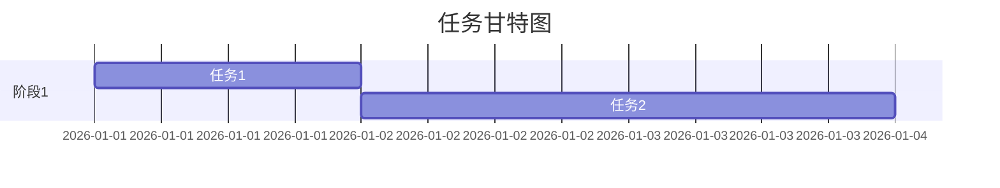
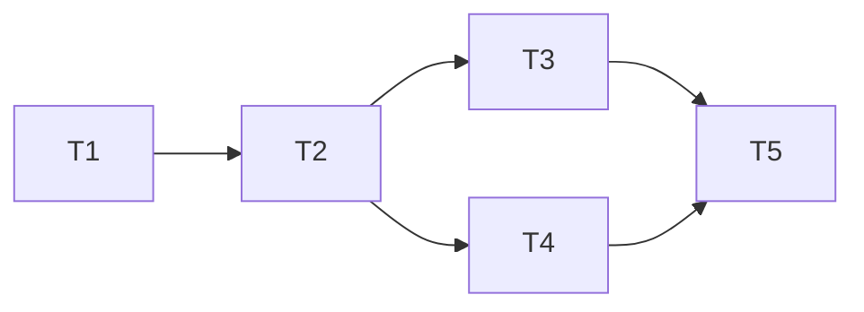

# Task Skill 指南

## 概述

将技术计划（plan.md）分解为可执行的任务列表，支持依赖管理和并行执行标记。

**核心价值**：将抽象计划转化为具体可执行的任务，支持 TDD 和并行执行。

---

## 工作流程

```
读取 plan.md → 识别模块 → 分解任务 → 分析依赖 → 生成 tasks.md
```

### 阶段 1: 计划分析

**动作**:
1. 读取 `.workflow/{feature}/plan/plan.md`
2. 提取模块和架构信息
3. 识别实现顺序

### 阶段 2: 任务分解

**动作**:
1. 为每个模块生成任务
2. 设置任务优先级
3. 标记测试先行任务 `[T]`
4. 标记可并行任务 `[P]`

### 阶段 3: 依赖分析

**动作**:
1. 分析任务间依赖
2. 使用 Mermaid 生成 DAG 图
3. 计算关键路径

### 阶段 4: 输出生成

**输出**: `.workflow/{feature}/task/tasks.md`

---

## 命令

```bash
# 基本用法
/workflow-task {feature}

# 验证输入
/workflow:task --validate {feature}

# 恢复执行
/workflow:task --resume {feature}
```

---

## 输出结构

```
.workflow/{feature}/task/
└── tasks.md             # 任务列表文档
```

## tasks.md 模板

```markdown
# 任务列表: {feature}

## 任务总览



## 任务清单

### 阶段 1: 基础设施

| ID | 任务 | 优先级 | 依赖 | 标记 | 状态 |
|----|------|--------|------|------|------|
| T1 | 配置开发环境 | P0 | - | [P] | [ ] |
| T2 | 编写单元测试框架 | P0 | T1 | [T] | [ ] |

### 阶段 2: 核心功能

| ID | 任务 | 优先级 | 依赖 | 标记 | 状态 |
|----|------|--------|------|------|------|
| T3 | 实现模块A | P0 | T2 | [T] | [ ] |
| T4 | 实现模块B | P0 | T2 | [T][P] | [ ] |

## 依赖关系图



## 关键路径

T1 → T2 → T3 → T5

## 任务标记说明

| 标记 | 含义 |
|------|------|
| `[T]` | 测试先行：先写测试再实现 |
| `[P]` | 可并行：可与其他 [P] 任务并行 |
| `[R]` | 需审查：完成后需要人工审查 |
```

---

## 任务粒度

- 最小粒度：30 分钟
- 最大粒度：8 小时
- 单任务代码修改：建议不超过 300 行

---

## 集成

- **输入**: `/workflow-plan` 生成的 `plan.md`
- **输出**: 供 `/workflow-implement` 使用的 `tasks.md`

---

*待完整实现*
