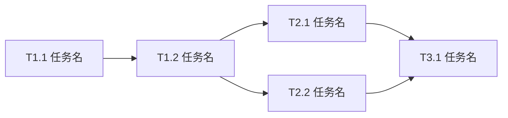

# 任务列表: {feature}

## 1. 任务总览

| 指标 | 值 |
|------|-----|
| 总任务数 | {total_count} |
| 关键路径长度 | {critical_path_length} |
| 可并行任务组数 | {parallel_groups} |
| 预估总时长 | {total_estimate} |

### 依赖关系图



---

## 2. 任务清单

### 阶段 1: {phase_1_name}

| ID | 任务 | 优先级 | 估时 | 依赖 | 标记 | 模块 | 状态 |
|----|------|--------|------|------|------|------|------|
| T1.1 | {task_title} | P0 | 1h | - | [P] | {module} | [ ] |
| T1.2 | {task_title} | P0 | 2h | T1.1 | [T][P] | {module} | [ ] |

### 阶段 2: {phase_2_name}

| ID | 任务 | 优先级 | 估时 | 依赖 | 标记 | 模块 | 状态 |
|----|------|--------|------|------|------|------|------|
| T2.1 | {task_title} | P0 | 4h | T1.2 | [T] | {module} | [ ] |
| T2.2 | {task_title} | P1 | 3h | T1.2 | [T][P] | {module} | [ ] |

### 阶段 3: {phase_3_name}

| ID | 任务 | 优先级 | 估时 | 依赖 | 标记 | 模块 | 状态 |
|----|------|--------|------|------|------|------|------|
| T3.1 | {task_title} | P1 | 2h | T2.1, T2.2 | [R] | {module} | [ ] |

---

## 3. 任务详情

### T1.1: {task_title}

- **模块**: {module_id}
- **优先级**: P0
- **估时**: 1h
- **依赖**: 无
- **标记**: [P]

**描述**:
{task_description}

**验收标准**:
1. {acceptance_criterion_1}
2. {acceptance_criterion_2}

**关联需求**: {related_requirements}

---

### T2.1: {task_title}

- **模块**: {module_id}
- **优先级**: P0
- **估时**: 4h
- **依赖**: T1.2
- **标记**: [T]

**描述**:
{task_description}

**验收标准**:
1. {acceptance_criterion_1}
2. {acceptance_criterion_2}
3. 单元测试覆盖率 > 80%

**关联需求**: {related_requirements}

---

## 4. 关键路径

```
{critical_path_tasks}
```

**关键路径说明**:
- 关键路径上的任务决定项目最短完成时间
- 任何关键路径任务延迟都会导致整体延迟
- 优先分配资源给关键路径任务

---

## 5. 并行任务组

| 组 ID | 任务 | 前置依赖 | 说明 |
|-------|------|----------|------|
| G1 | T1.1 | - | 初始化任务 |
| G2 | T2.1, T2.2 | T1.2 | 核心功能开发 |
| G3 | T3.1 | T2.1, T2.2 | 集成任务 |

---

## 6. 粒度警告

| 任务 | 问题 | 建议 |
|------|------|------|
| {task_id} | 估时 {estimate} 接近上限 | {suggestion} |

---

## 7. 任务标记说明

| 标记 | 含义 | 执行策略 |
|------|------|----------|
| `[T]` | 测试先行（TDD） | 先写测试用例，再实现功能 |
| `[P]` | 可并行 | 可与同组 [P] 任务并行执行 |
| `[R]` | 需审查 | 完成后需要人工代码审查 |

---

## 8. 优先级说明

| 优先级 | 含义 | 分配条件 |
|--------|------|----------|
| P0 | 最高优先级 | 关键路径上的阻塞任务 |
| P1 | 高优先级 | 核心业务逻辑任务 |
| P2 | 中优先级 | 辅助功能任务 |
| P3 | 低优先级 | 优化和文档任务 |

---

*Generated by workflow-task | {date}*
