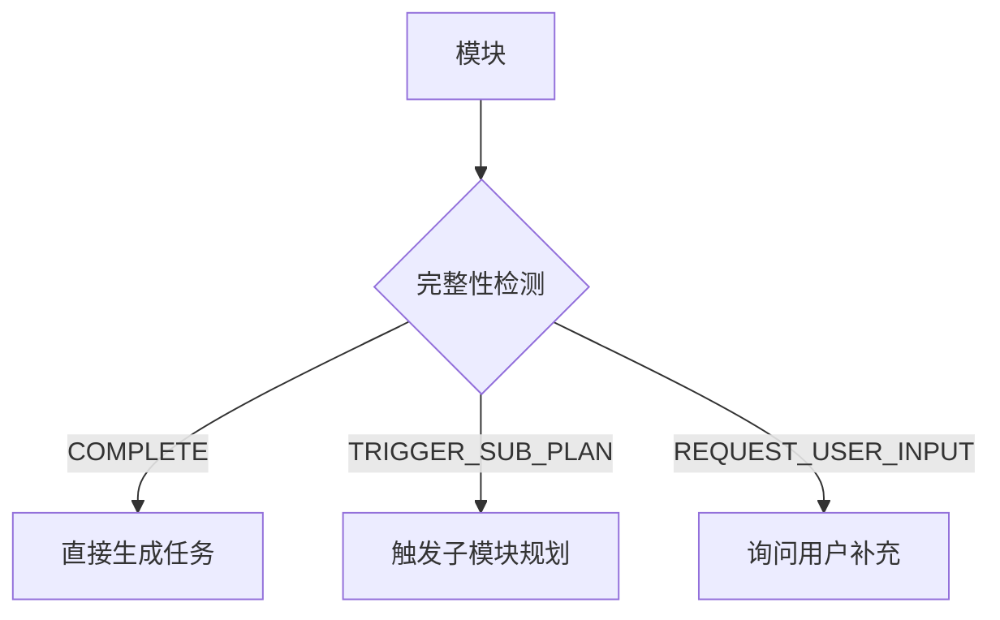

# 模块完整性检测指南

> 本文档详细描述 workflow-task DECOMPOSE 阶段的 5 维度模块完整性检测机制。

---

## 1. 概述

模块完整性检测用于评估 plan.md 中每个模块的设计是否足够详细，以便直接分解为可执行任务。



---

## 2. 检测维度

### 2.1 职责清晰度（Responsibility Clarity）

**检测项**: 模块职责描述

| 指标 | 阈值 | 状态 |
|------|------|------|
| 描述长度 | < 20 字 | 不合格 |
| 描述长度 | 20-200 字 | 合格 |
| 描述长度 | > 200 字 | 警告（可能需要拆分）|

**检测算法**:

```python
def check_responsibility(module):
    desc = module.responsibility

    if not desc or len(desc) < 20:
        return {
            "status": "FAILED",
            "action": "REQUEST_USER_INPUT",
            "message": "职责描述过于简短，请补充具体职责"
        }

    if len(desc) > 200:
        return {
            "status": "WARNING",
            "action": "TRIGGER_SUB_PLAN",
            "message": "职责描述过长，建议拆分为子模块"
        }

    return {"status": "PASS"}
```

**示例**:

| 描述 | 字数 | 判定 |
|------|------|------|
| "处理用户" | 4 | 不合格 - 需要补充 |
| "处理用户认证，包括登录、登出、token 刷新、密码重置" | 28 | 合格 |
| "处理用户认证模块，包括登录流程（支持用户名密码、OAuth、SSO三种方式）、登出流程、token 管理（生成、验证、刷新、撤销）、密码管理（重置、修改、强度校验）、会话管理（并发控制、超时处理）、审计日志..." | 150+ | 警告 - 建议拆分 |

---

### 2.2 接口定义（Interface Definition）

**检测项**: 输入输出是否定义

| 指标 | 条件 | 状态 |
|------|------|------|
| 输入接口 | 未定义 | 不合格 |
| 输出接口 | 未定义 | 不合格 |
| 输入+输出 | 均已定义 | 合格 |

**检测算法**:

```python
def check_interface(module):
    missing = []

    if not module.interfaces or not module.interfaces.get("inputs"):
        missing.append("inputs")

    if not module.interfaces or not module.interfaces.get("outputs"):
        missing.append("outputs")

    if missing:
        return {
            "status": "FAILED",
            "action": "REQUEST_USER_INPUT",
            "message": f"缺少接口定义: {', '.join(missing)}"
        }

    return {"status": "PASS"}
```

**接口定义示例**:

```yaml
interfaces:
  inputs:
    - name: "credentials"
      type: "LoginRequest"
      description: "用户凭证（用户名+密码）"
    - name: "oauth_token"
      type: "string"
      description: "OAuth 授权码"
  outputs:
    - name: "auth_result"
      type: "AuthResponse"
      description: "认证结果，包含 token 和用户信息"
    - name: "error"
      type: "AuthError"
      description: "认证错误信息"
```

---

### 2.3 技术选型（Technology Choice）

**检测项**: 是否有具体技术方案

| 指标 | 条件 | 状态 |
|------|------|------|
| 技术栈 | 未指定 | 不合格 |
| 技术栈 | 已指定具体技术 | 合格 |

**检测算法**:

```python
def check_tech_choice(module):
    if not module.tech_stack or len(module.tech_stack) == 0:
        return {
            "status": "FAILED",
            "action": "REQUEST_USER_INPUT",
            "message": "缺少技术选型，请指定具体技术方案"
        }

    # 检查是否过于模糊
    vague_terms = ["待定", "TBD", "未确定", "可选"]
    for tech in module.tech_stack:
        if any(term in tech for term in vague_terms):
            return {
                "status": "FAILED",
                "action": "REQUEST_USER_INPUT",
                "message": f"技术选型不明确: {tech}"
            }

    return {"status": "PASS"}
```

**示例**:

| 技术栈 | 判定 |
|--------|------|
| `["待定"]` | 不合格 |
| `["某种缓存方案"]` | 不合格 |
| `["Redis", "ioredis"]` | 合格 |

---

### 2.4 粒度（Granularity）

**检测项**: 任务估时是否在合理范围

| 指标 | 阈值 | 状态 |
|------|------|------|
| 估时 | < 30 分钟 | 警告（过小）|
| 估时 | 30 分钟 - 8 小时 | 合格 |
| 估时 | > 8 小时 | 触发拆分 |

**检测算法**:

```python
def check_granularity(module):
    estimate = estimate_module_effort(module)

    if estimate < timedelta(minutes=30):
        return {
            "status": "WARNING",
            "action": None,
            "message": "模块粒度过小，考虑合并"
        }

    if estimate > timedelta(hours=8):
        return {
            "status": "FAILED",
            "action": "TRIGGER_SUB_PLAN",
            "message": "模块粒度过大，需要进一步分解"
        }

    return {"status": "PASS"}

def estimate_module_effort(module):
    """
    基于多个因素估算模块工作量
    """
    base_effort = timedelta(hours=2)

    # 职责复杂度
    if len(module.responsibility) > 100:
        base_effort += timedelta(hours=2)

    # 依赖数量
    base_effort += timedelta(hours=len(module.dependencies) * 0.5)

    # 接口数量
    input_count = len(module.interfaces.get("inputs", []))
    output_count = len(module.interfaces.get("outputs", []))
    base_effort += timedelta(hours=(input_count + output_count) * 0.25)

    return base_effort
```

---

### 2.5 子模块详情（Submodule Details）

**检测项**: 复合模块的子模块是否有详细设计

| 指标 | 条件 | 状态 |
|------|------|------|
| 复合模块 | 子模块未详细定义 | 触发子模块规划 |
| 复合模块 | 子模块已详细定义 | 合格 |
| 原子模块 | 不适用 | 跳过 |

**复合模块识别规则**:

```python
def is_composite_module(module):
    """
    识别复合模块的标志
    """
    indicators = [
        # 职责中包含多个动作
        len(re.findall(r'[，,]', module.responsibility)) > 2,

        # 依赖多个其他模块
        len(module.dependencies) > 3,

        # 描述中包含"子模块"、"子系统"等词
        any(term in module.responsibility
            for term in ["子模块", "子系统", "包含", "组成"]),

        # 技术栈涉及多个领域
        len(set(categorize_tech(module.tech_stack))) > 2
    ]

    return sum(indicators) >= 2
```

**检测算法**:

```python
def check_submodule_details(module):
    if not is_composite_module(module):
        return {"status": "SKIP", "message": "非复合模块"}

    # 检查是否已有子模块定义
    if not module.submodules or len(module.submodules) == 0:
        return {
            "status": "FAILED",
            "action": "TRIGGER_SUB_PLAN",
            "message": "复合模块缺少子模块定义，需要进一步规划"
        }

    # 检查子模块完整性
    for sub in module.submodules:
        sub_result = check_module_completeness(sub)
        if sub_result["status"] == "FAILED":
            return {
                "status": "FAILED",
                "action": sub_result["action"],
                "message": f"子模块 {sub.id} 不完整: {sub_result['message']}"
            }

    return {"status": "PASS"}
```

---

## 3. 综合检测流程

```python
def check_module_completeness(module):
    """
    执行完整的 5 维度检测
    返回: (is_complete, missing_aspects, recommended_action)
    """
    checks = [
        ("responsibility", check_responsibility),
        ("interface", check_interface),
        ("tech_choice", check_tech_choice),
        ("granularity", check_granularity),
        ("submodule", check_submodule_details)
    ]

    results = {}
    failed = []
    action = None

    for name, check_fn in checks:
        result = check_fn(module)
        results[name] = result

        if result["status"] == "FAILED":
            failed.append(name)
            # 优先级: TRIGGER_SUB_PLAN > REQUEST_USER_INPUT
            if result["action"] == "TRIGGER_SUB_PLAN":
                action = "TRIGGER_SUB_PLAN"
            elif action != "TRIGGER_SUB_PLAN":
                action = result["action"]

    if not failed:
        return {
            "is_complete": True,
            "missing": [],
            "action": "COMPLETE",
            "details": results
        }

    return {
        "is_complete": False,
        "missing": failed,
        "action": action,
        "details": results
    }
```

---

## 4. 检测结果处理

### 4.1 COMPLETE - 直接生成任务

```python
if result["action"] == "COMPLETE":
    tasks = generate_tasks_from_module(module)
    add_to_task_list(tasks)
```

### 4.2 TRIGGER_SUB_PLAN - 触发子模块规划

```python
if result["action"] == "TRIGGER_SUB_PLAN":
    # 检查递归深度
    if current_depth >= MAX_DEPTH:
        log_warning(f"达到最大递归深度 {MAX_DEPTH}，强制生成任务")
        tasks = generate_tasks_from_module(module, force=True)
        add_to_task_list(tasks)
        return

    # 询问用户确认
    confirmed = ask_user_question(
        f"模块 '{module.id}' 设计不够完善，是否触发子模块规划？",
        options=["是，触发 workflow-plan", "否，强制生成任务"]
    )

    if confirmed == "是":
        # 触发 workflow-plan
        sub_plan = trigger_workflow_plan(module)
        # 合并子计划
        merge_sub_plan(sub_plan)
        # 重新检测
        check_module_completeness(module)
```

### 4.3 REQUEST_USER_INPUT - 询问用户补充

```python
if result["action"] == "REQUEST_USER_INPUT":
    missing_info = result["missing"]

    user_input = ask_user_question(
        f"模块 '{module.id}' 缺少以下信息: {missing_info}",
        options=["补充信息", "跳过此模块", "强制生成任务"]
    )

    if user_input == "补充信息":
        # 收集补充信息
        supplementary = collect_supplementary_info(missing_info)
        # 更新模块
        update_module(module, supplementary)
        # 重新检测
        check_module_completeness(module)
```

---

## 5. 状态记录

检测结果记录在 `.state.yaml`:

```yaml
module_status:
  auth:
    completeness: 0.8
    missing: ["submodule"]
    action: "TRIGGER_SUB_PLAN"
    check_time: "2026-01-15T10:00:00Z"
    refined: false

  database:
    completeness: 1.0
    missing: []
    action: "COMPLETE"
    check_time: "2026-01-15T10:01:00Z"
    refined: true
```

---

## 6. 配置项

```yaml
completeness_check:
  # 职责描述
  min_responsibility_length: 20
  max_responsibility_length: 200

  # 接口定义
  require_interface: true

  # 技术选型
  require_tech_choice: true
  vague_terms: ["待定", "TBD", "未确定", "可选"]

  # 粒度
  min_minutes: 30
  max_hours: 8

  # 复合模块检测
  composite_indicators_threshold: 2
```

---

*Reference document for workflow-task completeness check | v2.1.0*
