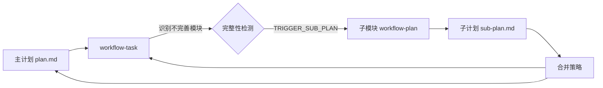
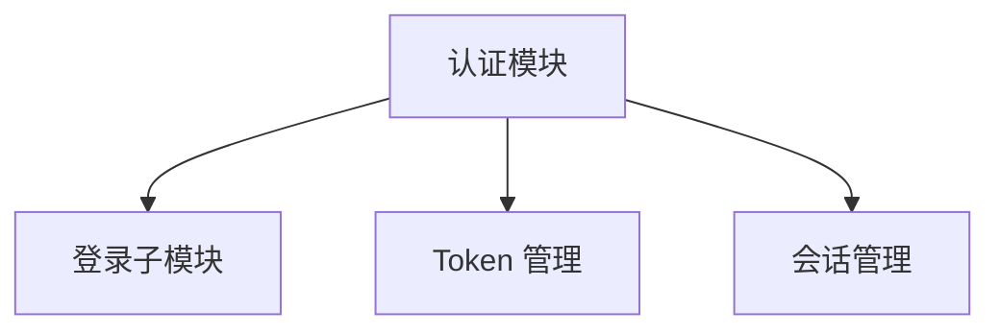

# 子计划合并策略

> 本文档描述 workflow-task 如何将子模块的 workflow-plan 输出合并到主计划中。

---

## 1. 概述

当 workflow-task 检测到模块设计不完善时，会触发针对该子模块的 workflow-plan。子计划生成后，需要合并回主计划，以便继续任务分解。



---

## 2. 子计划存储结构

子计划存储在 `plan/sub-plans/` 目录下：

```
.workflow/{feature}/
├── plan/
│   ├── plan.md                    # 主计划
│   └── sub-plans/                 # 子计划目录
│       ├── {module-A}/
│       │   ├── plan.md            # 模块 A 子计划
│       │   ├── research/          # 调研文档（如有）
│       │   └── .state.yaml        # 子计划状态
│       └── {module-B}/
│           ├── plan.md
│           └── .state.yaml
```

---

## 3. 合并策略类型

### 3.1 引用合并（Reference Merge）

**策略**: 主计划保持原样，通过引用链接子计划

**适用场景**: 子计划相对独立，与主计划耦合较低

**实现**:

```markdown
<!-- 在主计划 plan.md 中 -->

### 2.3.1 认证模块

> 详细设计参见: [认证模块子计划](sub-plans/auth/plan.md)

**概要**:
- 职责: 用户认证和授权
- 技术栈: JWT, bcrypt
- 子模块数: 3
```

**优点**:
- 主计划简洁
- 子计划可独立维护
- 版本控制清晰

**缺点**:
- 需要跳转查看完整信息
- 可能遗漏关键依赖

---

### 3.2 内联合并（Inline Merge）

**策略**: 将子计划核心内容内联到主计划

**适用场景**: 子计划较小，与主计划紧密相关

**实现**:

```markdown
<!-- 在主计划 plan.md 中 -->

### 2.3.1 认证模块

#### 子模块架构



#### 子模块说明

| 子模块 | 职责 | 技术栈 |
|--------|------|--------|
| login | 处理登录流程 | passport.js |
| token | JWT 生命周期管理 | jsonwebtoken |
| session | 会话状态维护 | express-session |

> 完整子计划: [auth/plan.md](sub-plans/auth/plan.md)
```

**优点**:
- 关键信息一目了然
- 便于审查完整架构

**缺点**:
- 主计划可能变长
- 信息可能重复

---

### 3.3 摘要合并（Summary Merge）

**策略**: 提取子计划关键决策和接口，合并到主计划

**适用场景**: 子计划复杂，但只需要关注边界

**实现**:

```markdown
<!-- 在主计划 plan.md 中 -->

### 2.3.1 认证模块

**子计划摘要** (来自 sub-plans/auth/plan.md):

- **架构决策**: 采用 JWT + Redis 方案
- **关键接口**:
  - `POST /auth/login` → `AuthResponse`
  - `POST /auth/refresh` → `TokenResponse`
  - `POST /auth/logout` → `void`
- **依赖服务**: Redis (会话存储), PostgreSQL (用户数据)
- **风险**: Token 泄露风险 (中等)，缓解措施: 短过期时间 + 刷新机制

> 完整子计划: [auth/plan.md](sub-plans/auth/plan.md)
```

**优点**:
- 主计划包含决策关键点
- 接口边界清晰

**缺点**:
- 需要手动提取摘要
- 摘要可能过时

---

## 4. 合并流程

### 4.1 标准合并流程

```python
def merge_sub_plan(module_id, sub_plan_path, main_plan_path, strategy="summary"):
    """
    合并子计划到主计划
    """
    # 1. 读取子计划
    sub_plan = read_plan(sub_plan_path)

    # 2. 验证子计划状态
    if sub_plan.status != "approved":
        raise ValueError("子计划未批准，无法合并")

    # 3. 读取主计划
    main_plan = read_plan(main_plan_path)

    # 4. 找到目标模块位置
    module_section = find_module_section(main_plan, module_id)

    # 5. 根据策略生成合并内容
    if strategy == "reference":
        merge_content = generate_reference_merge(sub_plan)
    elif strategy == "inline":
        merge_content = generate_inline_merge(sub_plan)
    elif strategy == "summary":
        merge_content = generate_summary_merge(sub_plan)

    # 6. 插入合并内容
    updated_plan = insert_merge_content(main_plan, module_section, merge_content)

    # 7. 更新依赖关系
    updated_plan = update_dependencies(updated_plan, sub_plan)

    # 8. 写回主计划
    write_plan(main_plan_path, updated_plan)

    # 9. 记录合并历史
    record_merge_history(module_id, sub_plan_path, strategy)

    return updated_plan
```

### 4.2 依赖关系更新

```python
def update_dependencies(main_plan, sub_plan):
    """
    将子计划的依赖关系传递到主计划
    """
    for sub_module in sub_plan.modules:
        # 外部依赖需要提升到主计划
        for dep in sub_module.external_dependencies:
            if dep not in main_plan.dependencies:
                main_plan.dependencies.append(dep)

        # 内部依赖保留在子计划内
        # 不需要特殊处理

    return main_plan
```

### 4.3 版本兼容性检查

```python
def check_version_compatibility(main_plan, sub_plan):
    """
    检查子计划与主计划版本兼容性
    """
    main_version = parse_version(main_plan.version)
    sub_version = parse_version(sub_plan.version)

    # 主版本必须匹配
    if main_version.major != sub_version.major:
        raise ValueError(
            f"版本不兼容: 主计划 v{main_plan.version}, "
            f"子计划 v{sub_plan.version}"
        )

    return True
```

---

## 5. 冲突处理

### 5.1 命名冲突

```python
def resolve_naming_conflict(main_plan, sub_plan, module_id):
    """
    处理子模块与主计划模块命名冲突
    """
    existing_ids = [m.id for m in main_plan.modules]

    for sub_module in sub_plan.modules:
        if sub_module.id in existing_ids:
            # 添加前缀避免冲突
            new_id = f"{module_id}.{sub_module.id}"
            sub_module.id = new_id

            # 更新所有引用
            update_references(sub_plan, sub_module.original_id, new_id)

    return sub_plan
```

### 5.2 技术选型冲突

```python
def resolve_tech_conflict(main_plan, sub_plan):
    """
    处理技术选型冲突
    """
    conflicts = []

    main_tech = set(main_plan.tech_stack)
    sub_tech = set(sub_plan.tech_stack)

    # 检测同类技术冲突
    # 例如: 主计划用 MySQL，子计划用 PostgreSQL
    for category in ["database", "cache", "queue"]:
        main_choice = get_tech_in_category(main_tech, category)
        sub_choice = get_tech_in_category(sub_tech, category)

        if main_choice and sub_choice and main_choice != sub_choice:
            conflicts.append({
                "category": category,
                "main": main_choice,
                "sub": sub_choice
            })

    if conflicts:
        # 询问用户解决冲突
        resolution = ask_user_to_resolve(conflicts)
        apply_resolution(main_plan, sub_plan, resolution)

    return main_plan, sub_plan
```

---

## 6. 合并后验证

```python
def validate_merged_plan(main_plan):
    """
    验证合并后的主计划完整性
    """
    checks = []

    # 1. 检查所有模块引用有效
    for module in main_plan.modules:
        for dep in module.dependencies:
            if not find_module(main_plan, dep):
                checks.append(f"无效依赖: {module.id} -> {dep}")

    # 2. 检查子计划链接有效
    for ref in main_plan.sub_plan_references:
        if not os.path.exists(ref.path):
            checks.append(f"子计划不存在: {ref.path}")

    # 3. 检查循环依赖
    if has_circular_dependency(main_plan):
        checks.append("检测到循环依赖")

    # 4. 检查版本一致性
    for ref in main_plan.sub_plan_references:
        sub_plan = read_plan(ref.path)
        if not check_version_compatibility(main_plan, sub_plan):
            checks.append(f"版本不兼容: {ref.path}")

    return {
        "valid": len(checks) == 0,
        "issues": checks
    }
```

---

## 7. 状态跟踪

合并状态记录在 `.state.yaml`:

```yaml
merge_history:
  - module_id: "auth"
    sub_plan_path: "sub-plans/auth/plan.md"
    strategy: "summary"
    merged_at: "2026-01-15T10:30:00Z"
    merged_by: "workflow-task"
    version: "1.0.0"

sub_plans:
  auth:
    path: "sub-plans/auth/plan.md"
    status: "merged"
    depth: 1
    parent: null

  auth.token:
    path: "sub-plans/auth/sub-plans/token/plan.md"
    status: "merged"
    depth: 2
    parent: "auth"
```

---

## 8. 配置选项

```yaml
merge_config:
  # 默认合并策略
  default_strategy: "summary"

  # 策略选择规则
  strategy_rules:
    - condition: "sub_plan.modules.length <= 2"
      strategy: "inline"
    - condition: "sub_plan.modules.length > 5"
      strategy: "reference"
    - condition: "default"
      strategy: "summary"

  # 冲突处理
  conflict_resolution:
    naming: "prefix"          # prefix | ask_user | fail
    tech: "ask_user"          # prefer_main | prefer_sub | ask_user
    version: "fail"           # upgrade | ignore | fail

  # 验证选项
  validation:
    check_references: true
    check_dependencies: true
    check_versions: true
```

---

## 9. 最佳实践

### 9.1 策略选择指南

| 子计划特征 | 推荐策略 | 原因 |
|------------|----------|------|
| ≤2 个子模块 | inline | 信息量小，内联更清晰 |
| 3-5 个子模块 | summary | 平衡可读性和完整性 |
| >5 个子模块 | reference | 避免主计划过于冗长 |
| 高度独立 | reference | 便于独立维护 |
| 紧密耦合 | inline | 便于理解整体架构 |

### 9.2 合并时机

1. **子计划批准后立即合并**: 保持主计划最新
2. **批量合并**: 多个子计划完成后一起合并
3. **延迟合并**: 等待所有子计划完成后再合并

推荐: 子计划批准后立即合并，保持一致性。

### 9.3 版本管理

- 每次合并后递增主计划版本号
- 在合并记录中保留子计划版本
- 定期清理过时的子计划

---

*Reference document for workflow-task merge strategy | v2.1.0*
