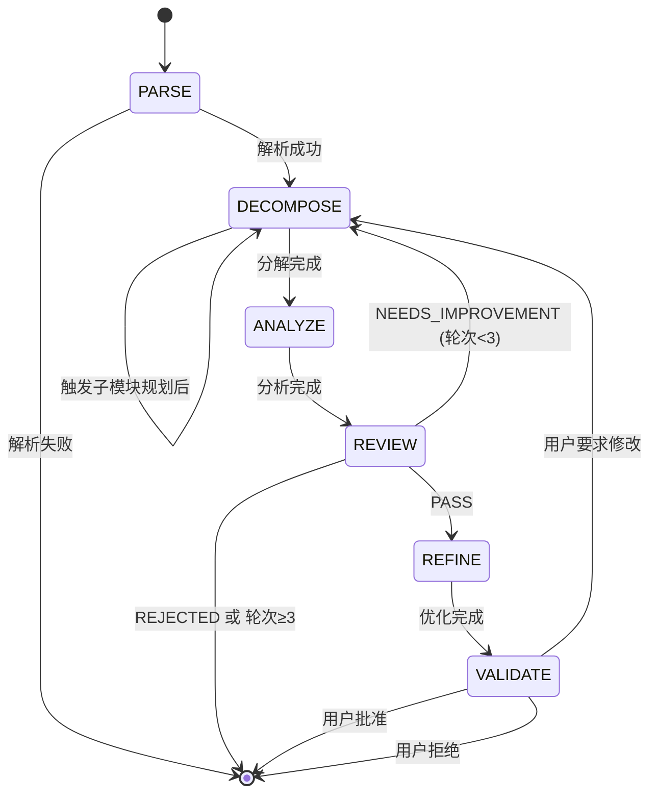

# 阶段详细说明

> 本文档详细描述 workflow-task 6 阶段流程的具体子任务、判定规则和示例。

---

## 阶段 1: PARSE（解析计划）

### 目标
解析已批准的 plan.md，提取模块信息、架构依赖和技术选型。

### 输入
- `.workflow/{feature}/plan/plan.md`（状态必须为 `approved`）
- 项目上下文

### 子任务

| 序号 | 子任务 | 说明 |
|------|--------|------|
| 1.1 | 验证 plan 状态 | 检查 frontmatter 中 `status: approved` |
| 1.2 | 解析 frontmatter | 提取版本、日期、关联 spec 等元数据 |
| 1.3 | 提取模块列表 | 从 § 2.3 模块说明表提取所有模块 |
| 1.4 | 解析架构依赖 | 从架构图和模块表提取依赖关系 |
| 1.5 | 提取技术选型 | 从 § 2.4 技术选型章节提取技术栈 |
| 1.6 | 标记风险点 | 从 § 3 风险评估提取高风险模块 |

### 输出
```yaml
parse_result:
  plan_version: "1.0.0"
  spec_version: "1.1.0"
  modules:
    - id: "auth"
      name: "认证模块"
      responsibility: "用户认证和授权管理"
      dependencies: ["config", "database"]
      tech_stack: ["JWT", "bcrypt"]
      risk_level: "medium"
  architecture_dependencies:
    - from: "api"
      to: "auth"
      type: "uses"
```

### 判定规则

| 条件 | 结果 | 动作 |
|------|------|------|
| plan.md 不存在 | FAILED | 提示用户先执行 workflow-plan |
| status != approved | FAILED | 提示用户先批准 plan.md |
| 模块列表为空 | FAILED | 提示 plan.md 格式不正确 |
| 解析成功 | SUCCESS | 进入 DECOMPOSE 阶段 |

---

## 阶段 2: DECOMPOSE（分解任务）

### 目标
将模块分解为可执行任务，支持递归子模块规划。

### 输入
- PARSE 阶段的解析结果
- 子计划（如果有）

### 子任务

| 序号 | 子任务 | 说明 |
|------|--------|------|
| 2.1 | 遍历模块 | 按依赖顺序遍历每个模块 |
| 2.2 | 完整性检测 | 对每个模块执行 5 维度检测 |
| 2.3 | 处理不完整模块 | 根据检测结果决定动作 |
| 2.4 | 触发子模块规划 | 如需要，调用 workflow-plan |
| 2.5 | 合并子计划 | 将子计划合并到主计划 |
| 2.6 | 生成任务 | 为每个模块生成任务条目 |
| 2.7 | 分配优先级 | 根据依赖关系分配 P0-P3 |
| 2.8 | 标记任务 | 添加 [T][P][R] 标记 |

### 完整性检测动作映射

| 检测结果 | 动作 | 说明 |
|----------|------|------|
| COMPLETE | 生成任务 | 模块设计完善，直接分解 |
| TRIGGER_SUB_PLAN | 触发子模块 plan | 需要更详细的设计 |
| REQUEST_USER_INPUT | 询问用户 | 缺少关键信息 |

### 任务生成规则

```markdown
任务 ID 格式: T{阶段}.{序号}
  - 阶段: 1-N，按执行顺序
  - 序号: 1-N，阶段内序号

示例:
  - T1.1: 第 1 阶段第 1 个任务
  - T2.3: 第 2 阶段第 3 个任务
```

### 优先级分配规则

| 优先级 | 条件 |
|--------|------|
| P0 | 在关键路径上且阻塞 ≥2 个其他任务 |
| P1 | 核心业务逻辑任务 |
| P2 | 辅助功能但必需 |
| P3 | 优化、文档、测试补充 |

### 标记分配规则

| 标记 | 条件 |
|------|------|
| [T] | 核心业务逻辑、复杂算法、接口实现 |
| [P] | 无依赖或依赖相同的任务 |
| [R] | 涉及安全、性能、架构的关键任务 |

---

## 阶段 3: ANALYZE（依赖分析）

### 目标
分析任务依赖，生成 DAG，检测粒度问题。

### 输入
- DECOMPOSE 阶段生成的 tasks.md 草稿

### 子任务

| 序号 | 子任务 | 说明 |
|------|--------|------|
| 3.1 | 构建依赖图 | 将任务依赖关系转为 DAG |
| 3.2 | 检测循环依赖 | 使用拓扑排序检测环 |
| 3.3 | 计算关键路径 | 找出最长依赖链 |
| 3.4 | 识别并行机会 | 找出可并行的任务组 |
| 3.5 | 检测粒度 | 检查任务估时是否在 30min-8h |
| 3.6 | 生成警告 | 记录粒度、依赖等问题 |

### DAG 构建算法

```python
def build_dag(tasks):
    """
    构建任务依赖 DAG
    """
    dag = DirectedGraph()

    for task in tasks:
        dag.add_node(task.id)
        for dep in task.depends_on:
            dag.add_edge(dep, task.id)

    return dag
```

### 循环依赖检测

```python
def detect_cycle(dag):
    """
    使用 DFS 检测循环依赖
    返回: (has_cycle, cycle_path)
    """
    visited = set()
    rec_stack = set()

    for node in dag.nodes:
        if detect_cycle_dfs(node, visited, rec_stack):
            return True, reconstruct_cycle(rec_stack)

    return False, None
```

### 关键路径计算

```python
def calculate_critical_path(dag, tasks):
    """
    计算关键路径（最长路径）
    """
    # 拓扑排序
    topo_order = topological_sort(dag)

    # 动态规划计算最长路径
    dist = {node: 0 for node in dag.nodes}
    parent = {}

    for node in topo_order:
        task = get_task(node)
        for neighbor in dag.neighbors(node):
            if dist[node] + task.estimate > dist[neighbor]:
                dist[neighbor] = dist[node] + task.estimate
                parent[neighbor] = node

    # 回溯找出路径
    end_node = max(dist, key=dist.get)
    path = reconstruct_path(parent, end_node)

    return path, dist[end_node]
```

### 粒度检测规则

| 估时 | 级别 | 动作 |
|------|------|------|
| < 30min | 警告 | 建议合并相关任务 |
| 30min - 8h | 正常 | 无需处理 |
| > 8h | 警告 | 建议拆分任务 |

---

## 阶段 4: REVIEW（独立审查）

### 目标
使用独立 Agent 审查任务分解质量。

### 输入
- tasks.md
- ANALYZE 阶段的分析结果

### 子任务

| 序号 | 子任务 | 说明 |
|------|--------|------|
| 4.1 | 启动独立 Agent | 创建新的审查上下文 |
| 4.2 | 执行完整性检查 | 检查是否覆盖所有模块 |
| 4.3 | 执行粒度检查 | 检查任务粒度合理性 |
| 4.4 | 执行依赖检查 | 检查依赖正确性 |
| 4.5 | 生成审查报告 | 输出结构化审查结果 |
| 4.6 | 判定结果 | PASS / NEEDS_IMPROVEMENT / REJECTED |

### 审查维度

详见 [review-checklist.md](review-checklist.md)

### 判定规则

| 判定 | 条件 | 动作 |
|------|------|------|
| PASS | 三维度均合格 | 进入 REFINE |
| NEEDS_IMPROVEMENT | 部分问题，可修复 | 回退到 DECOMPOSE（≤3 轮）|
| REJECTED | 严重问题 | 停止流程，提示用户 |

### 审查报告格式

```markdown
---
round: 1
verdict: PASS | NEEDS_IMPROVEMENT | REJECTED
confidence: 0.95
---

# 审查报告

## 完整性检查
- [x] 所有模块已覆盖
- [x] FR 覆盖率: 100%

## 粒度检查
- [x] 所有任务在 30min-8h 范围内
- [ ] 警告: T2.1 估时 7h，接近上限

## 依赖检查
- [x] 无循环依赖
- [x] 所有引用有效

## 改进建议
1. 建议将 T2.1 拆分为更小的子任务
```

---

## 阶段 5: REFINE（优化任务）

### 目标
根据审查反馈优化任务列表。

### 输入
- tasks.md
- 审查报告

### 子任务

| 序号 | 子任务 | 说明 |
|------|--------|------|
| 5.1 | 解析审查反馈 | 提取需要修改的项目 |
| 5.2 | 应用修改 | 调整任务结构 |
| 5.3 | 更新依赖 | 重新计算依赖关系 |
| 5.4 | 更新标记 | 根据变更更新标记 |
| 5.5 | 验证修改 | 确保修改正确应用 |

### 常见优化操作

| 问题类型 | 优化操作 |
|----------|----------|
| 任务过大 | 拆分为多个子任务 |
| 任务过小 | 合并相关任务 |
| 依赖错误 | 修正依赖关系 |
| 缺少标记 | 补充适当标记 |
| 优先级不当 | 重新分配优先级 |

---

## 阶段 6: VALIDATE（用户确认）

### 目标
最终验证，获取用户批准。

### 输入
- 优化后的 tasks.md
- 审查报告

### 子任务

| 序号 | 子任务 | 说明 |
|------|--------|------|
| 6.1 | 展示任务列表 | 格式化展示完整任务 |
| 6.2 | 展示依赖图 | 可视化依赖关系 |
| 6.3 | 汇总警告 | 列出所有警告信息 |
| 6.4 | 请求用户确认 | 通过 AskUserQuestion |
| 6.5 | 处理用户反馈 | 批准/拒绝/修改 |
| 6.6 | 更新状态 | 更新 frontmatter 和 .state.yaml |

### 用户确认选项

```markdown
请确认任务列表:

1. **批准** - 任务列表符合预期，开始执行
2. **修改** - 需要调整部分任务
3. **拒绝** - 重新规划任务

选择: [1/2/3]
```

### 批准后操作

1. 更新 tasks.md frontmatter: `status: approved`
2. 更新 .state.yaml: `phase: completed`, `status: approved`
3. 输出确认消息

---

## 阶段流转规则



---

*Reference document for workflow-task | v2.1.0*
