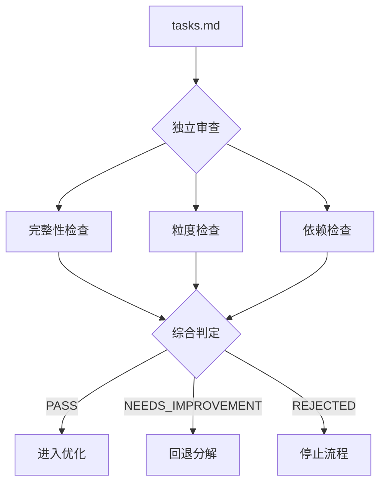

# 任务审查清单

> 本文档定义 workflow-task REVIEW 阶段的三维度审查标准。

---

## 1. 概述

REVIEW 阶段使用独立 Agent 对任务分解质量进行审查，确保任务列表可执行且符合最佳实践。



---

## 2. 审查维度

### 2.1 维度一：任务完整性

**目标**: 确保所有模块和需求都被任务覆盖

#### 检查项

| 检查项 | 标准 | 权重 |
|--------|------|------|
| 模块覆盖 | 每个 plan.md 模块至少有一个对应任务 | 30% |
| FR 覆盖 | 功能需求覆盖率 ≥ 95% | 40% |
| NFR 考虑 | 非功能需求有对应任务或说明 | 20% |
| 风险覆盖 | 高风险项有对应缓解任务 | 10% |

#### 检查算法

```python
def check_completeness(tasks, plan):
    """
    检查任务完整性
    """
    results = {
        "module_coverage": check_module_coverage(tasks, plan),
        "fr_coverage": check_fr_coverage(tasks, plan),
        "nfr_consideration": check_nfr_consideration(tasks, plan),
        "risk_coverage": check_risk_coverage(tasks, plan)
    }

    # 计算加权得分
    weights = {"module_coverage": 0.3, "fr_coverage": 0.4,
               "nfr_consideration": 0.2, "risk_coverage": 0.1}

    score = sum(results[k]["score"] * weights[k] for k in weights)

    return {
        "dimension": "completeness",
        "score": score,
        "passed": score >= 0.85,
        "details": results
    }
```

#### 模块覆盖检查

```python
def check_module_coverage(tasks, plan):
    """
    检查每个模块是否有对应任务
    """
    plan_modules = {m.id for m in plan.modules}
    task_modules = {t.module for t in tasks if t.module}

    covered = plan_modules & task_modules
    missing = plan_modules - task_modules

    return {
        "score": len(covered) / len(plan_modules) if plan_modules else 1.0,
        "covered": list(covered),
        "missing": list(missing),
        "message": f"模块覆盖: {len(covered)}/{len(plan_modules)}"
    }
```

#### FR 覆盖检查

```python
def check_fr_coverage(tasks, plan):
    """
    检查功能需求覆盖率
    """
    # 提取 plan 中的 FR
    plan_frs = extract_requirements(plan, type="FR")

    # 提取任务关联的 FR
    task_frs = set()
    for task in tasks:
        if task.related_requirements:
            task_frs.update(task.related_requirements)

    covered = plan_frs & task_frs
    missing = plan_frs - task_frs

    coverage = len(covered) / len(plan_frs) if plan_frs else 1.0

    return {
        "score": coverage,
        "covered": list(covered),
        "missing": list(missing),
        "message": f"FR 覆盖率: {coverage*100:.1f}%"
    }
```

---

### 2.2 维度二：粒度合理性

**目标**: 确保任务粒度在可执行范围内

#### 检查项

| 检查项 | 标准 | 权重 |
|--------|------|------|
| 估时范围 | 30min ≤ 估时 ≤ 8h | 50% |
| 代码行数 | 预估代码量 ≤ 300 行 | 20% |
| 复杂度 | 单一职责，复杂度可控 | 20% |
| 可测试性 | 任务可独立测试 | 10% |

#### 检查算法

```python
def check_granularity(tasks):
    """
    检查任务粒度合理性
    """
    results = {
        "estimate_range": check_estimate_range(tasks),
        "code_size": check_code_size(tasks),
        "complexity": check_complexity(tasks),
        "testability": check_testability(tasks)
    }

    weights = {"estimate_range": 0.5, "code_size": 0.2,
               "complexity": 0.2, "testability": 0.1}

    score = sum(results[k]["score"] * weights[k] for k in weights)

    return {
        "dimension": "granularity",
        "score": score,
        "passed": score >= 0.8,
        "details": results
    }
```

#### 估时范围检查

```python
def check_estimate_range(tasks):
    """
    检查任务估时是否在合理范围
    """
    MIN_ESTIMATE = timedelta(minutes=30)
    MAX_ESTIMATE = timedelta(hours=8)

    valid = []
    too_small = []
    too_large = []

    for task in tasks:
        estimate = parse_estimate(task.estimate)

        if estimate < MIN_ESTIMATE:
            too_small.append({
                "id": task.id,
                "estimate": task.estimate,
                "issue": "估时过小，考虑合并"
            })
        elif estimate > MAX_ESTIMATE:
            too_large.append({
                "id": task.id,
                "estimate": task.estimate,
                "issue": "估时过大，考虑拆分"
            })
        else:
            valid.append(task.id)

    score = len(valid) / len(tasks) if tasks else 1.0

    return {
        "score": score,
        "valid": valid,
        "too_small": too_small,
        "too_large": too_large,
        "message": f"估时合理: {len(valid)}/{len(tasks)}"
    }
```

#### 复杂度检查

```python
def check_complexity(tasks):
    """
    检查任务复杂度
    """
    results = []

    for task in tasks:
        # 职责数量（通过描述中的动词数量估算）
        actions = count_actions(task.description)

        # 依赖数量
        deps = len(task.depends_on) if task.depends_on else 0

        # 复杂度评分
        complexity = calculate_complexity(actions, deps)

        results.append({
            "id": task.id,
            "actions": actions,
            "dependencies": deps,
            "complexity": complexity,
            "passed": complexity <= 5  # 复杂度阈值
        })

    passed_count = sum(1 for r in results if r["passed"])
    score = passed_count / len(tasks) if tasks else 1.0

    return {
        "score": score,
        "details": results,
        "message": f"复杂度合理: {passed_count}/{len(tasks)}"
    }
```

---

### 2.3 维度三：依赖正确性

**目标**: 确保任务依赖关系正确、无循环

#### 检查项

| 检查项 | 标准 | 权重 |
|--------|------|------|
| 引用有效性 | 所有依赖引用存在 | 40% |
| 无循环依赖 | DAG 无环 | 40% |
| 关键路径 | 关键路径合理（≤ 任务数 50%）| 10% |
| 并行可行性 | 并行任务无隐式依赖 | 10% |

#### 检查算法

```python
def check_dependencies(tasks):
    """
    检查任务依赖正确性
    """
    results = {
        "reference_validity": check_reference_validity(tasks),
        "no_cycles": check_no_cycles(tasks),
        "critical_path": check_critical_path(tasks),
        "parallel_feasibility": check_parallel_feasibility(tasks)
    }

    weights = {"reference_validity": 0.4, "no_cycles": 0.4,
               "critical_path": 0.1, "parallel_feasibility": 0.1}

    score = sum(results[k]["score"] * weights[k] for k in weights)

    return {
        "dimension": "dependencies",
        "score": score,
        "passed": score >= 0.9,
        "details": results
    }
```

#### 循环依赖检查

```python
def check_no_cycles(tasks):
    """
    检查是否存在循环依赖
    """
    # 构建依赖图
    graph = build_dependency_graph(tasks)

    # 使用 DFS 检测环
    has_cycle, cycle_path = detect_cycle(graph)

    if has_cycle:
        return {
            "score": 0,
            "has_cycle": True,
            "cycle": cycle_path,
            "message": f"检测到循环依赖: {' -> '.join(cycle_path)}"
        }

    return {
        "score": 1.0,
        "has_cycle": False,
        "message": "无循环依赖"
    }
```

#### 关键路径检查

```python
def check_critical_path(tasks):
    """
    检查关键路径合理性
    """
    graph = build_dependency_graph(tasks)
    critical_path, path_length = calculate_critical_path(graph, tasks)

    # 关键路径不应超过任务总数的 50%
    ratio = len(critical_path) / len(tasks) if tasks else 0

    if ratio > 0.5:
        return {
            "score": 0.5,
            "path": critical_path,
            "length": path_length,
            "ratio": ratio,
            "message": f"关键路径过长: {len(critical_path)}/{len(tasks)} ({ratio*100:.0f}%)"
        }

    return {
        "score": 1.0,
        "path": critical_path,
        "length": path_length,
        "ratio": ratio,
        "message": f"关键路径合理: {len(critical_path)} 个任务"
    }
```

---

## 3. 综合判定

### 判定规则

```python
def make_verdict(completeness, granularity, dependencies):
    """
    综合判定审查结果
    """
    all_passed = all([
        completeness["passed"],
        granularity["passed"],
        dependencies["passed"]
    ])

    # 严重问题：循环依赖或 FR 覆盖率 < 80%
    has_critical = (
        dependencies["details"]["no_cycles"]["has_cycle"] or
        completeness["details"]["fr_coverage"]["score"] < 0.8
    )

    if has_critical:
        return "REJECTED"

    if all_passed:
        return "PASS"

    return "NEEDS_IMPROVEMENT"
```

### 判定结果说明

| 判定 | 条件 | 后续动作 |
|------|------|----------|
| **PASS** | 三维度全部通过 | 进入 REFINE 阶段 |
| **NEEDS_IMPROVEMENT** | 部分未通过，但无严重问题 | 回退 DECOMPOSE（≤3 轮）|
| **REJECTED** | 存在循环依赖或 FR 覆盖率 < 80% | 停止流程，提示用户 |

---

## 4. 审查报告格式

```markdown
---
round: 1
verdict: PASS | NEEDS_IMPROVEMENT | REJECTED
confidence: 0.95
reviewed_at: "2026-01-15T10:30:00Z"
---

# 任务审查报告

## 总体评估

| 维度 | 得分 | 状态 |
|------|------|------|
| 完整性 | 0.92 | ✅ PASS |
| 粒度 | 0.85 | ✅ PASS |
| 依赖 | 0.98 | ✅ PASS |

**综合判定**: PASS

---

## 详细审查

### 1. 完整性检查

#### 1.1 模块覆盖 ✅
- 覆盖: 5/5 (100%)
- 缺失: 无

#### 1.2 FR 覆盖 ✅
- 覆盖率: 95%
- 已覆盖: FR-1, FR-2, FR-3, ...
- 未覆盖: FR-10 (低优先级)

#### 1.3 NFR 考虑 ✅
- 性能需求: ✅ T2.5 包含性能测试
- 安全需求: ✅ T3.1 包含安全审计

#### 1.4 风险覆盖 ✅
- 高风险项: 2
- 已覆盖: 2

---

### 2. 粒度检查

#### 2.1 估时范围 ⚠️
- 合理: 10/12
- 警告:
  - T2.1: 7h (接近上限)
  - T3.2: 25min (接近下限)

#### 2.2 代码量估算 ✅
- 所有任务预估代码量 ≤ 300 行

#### 2.3 复杂度 ✅
- 平均复杂度: 3.2
- 最高复杂度: T2.1 (4.5)

---

### 3. 依赖检查

#### 3.1 引用有效性 ✅
- 所有 12 个依赖引用有效

#### 3.2 循环依赖 ✅
- 无循环依赖

#### 3.3 关键路径 ✅
- 路径: T1.1 → T1.2 → T2.1 → T3.1
- 长度: 4 (33%)

#### 3.4 并行可行性 ✅
- 3 个并行任务组
- 最大并行度: 3

---

## 改进建议

1. **T2.1**: 估时 7h 接近上限，建议拆分为：
   - T2.1a: 实现基础认证 (3h)
   - T2.1b: 实现 Token 管理 (4h)

2. **T3.2**: 估时 25min 较小，考虑合并到 T3.1

---

*Generated by workflow-task REVIEW phase | Round 1*
```

---

## 5. 配置项

```yaml
review_config:
  # 完整性阈值
  completeness:
    module_coverage_threshold: 1.0
    fr_coverage_threshold: 0.95
    nfr_required: true
    risk_coverage_required: true

  # 粒度阈值
  granularity:
    min_estimate_minutes: 30
    max_estimate_hours: 8
    max_code_lines: 300
    max_complexity: 5

  # 依赖阈值
  dependencies:
    allow_cycles: false
    max_critical_path_ratio: 0.5
    require_parallel_check: true

  # 判定阈值
  verdict:
    pass_threshold: 0.85
    critical_fr_threshold: 0.8

  # 循环控制
  loop:
    max_rounds: 3
    early_exit_confidence: 0.95
```

---

## 6. 独立 Agent 调用

```python
def invoke_review_agent(tasks_path, plan_path):
    """
    调用独立 Agent 执行审查
    """
    agent = create_agent(
        type="task-plan-reviewer",
        context={
            "tasks_path": tasks_path,
            "plan_path": plan_path,
            "checklist": load_review_checklist()
        }
    )

    result = agent.run(
        prompt="""
        请审查任务列表，执行以下检查：
        1. 完整性：模块覆盖、FR 覆盖、NFR 考虑、风险覆盖
        2. 粒度：估时范围、代码量、复杂度、可测试性
        3. 依赖：引用有效性、循环检测、关键路径、并行可行性

        输出结构化审查报告。
        """
    )

    return parse_review_result(result)
```

---

*Reference document for workflow-task review checklist | v2.1.0*
